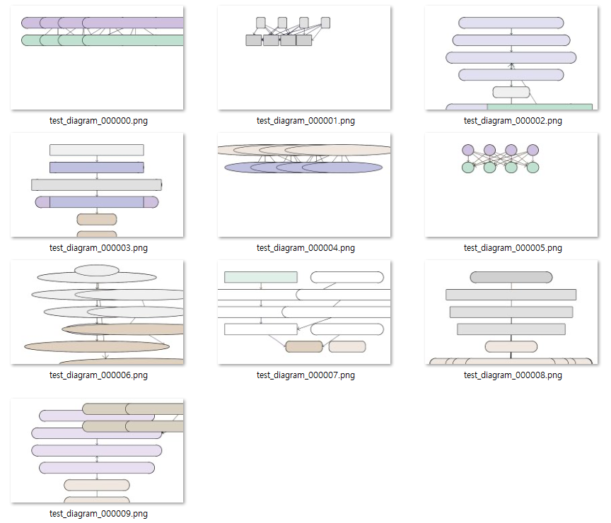

## 목차

* [1. 프로젝트 개요](#1-프로젝트-개요)
  * [1-1. 프로젝트 진행 배경](#1-1-프로젝트-진행-배경)
  * [1-2. 실제 생성된 다이어그램](#1-2-실제-생성된-다이어그램)
* [2. 기술 분야 및 사용 기술](#2-기술-분야-및-사용-기술)
  * [2-1. 관련 논문](#2-1-관련-논문)
  * [2-2. 사용한 Python 라이브러리 및 시스템 환경](#2-2-사용한-python-라이브러리-및-시스템-환경)
* [3. 프로젝트 일정](#3-프로젝트-일정)
* [4. 프로젝트 상세 설명](#4-프로젝트-상세-설명)
  * [4-1. 도식 생성을 위한 LLM 프롬프트](#4-1-도식-생성을-위한-llm-프롬프트)
  * [4-2. LLM Fine-Tuning](#4-2-llm-fine-tuning)
  * [4-3. LLM Fine-Tuning 용 데이터셋 생성](#4-3-llm-fine-tuning-용-데이터셋-생성)
  * [4-4. 생성된 이미지의 점수 및 순위 산출](#4-4-생성된-이미지의-점수-및-순위-산출)
* [5. 프로젝트 진행 중 이슈 및 해결 방법](#5-프로젝트-진행-중-이슈-및-해결-방법)
* [6. 사용자 가이드](#6-사용자-가이드)
* [7. 프로젝트 소감](#7-프로젝트-소감)

## 1. 프로젝트 개요

* DeepSeek LLM 을 이용하여 **사용자의 요구 사항에 맞는** 머신러닝 프로세스 또는 딥러닝 모델 등을 설명하기 위한 **Diagram 을 생성하기 위한 정형화된 포맷의 텍스트** 를 생성한다.
* 해당 텍스트를 이용하여 일반 알고리즘으로 Diagram 을 생성한다.
* 다음과 같은 방법을 이용하여 보다 가독성 좋은 Diagram 을 생성한다.
  * **[DPO 또는 ORPO](https://github.com/WannaBeSuperteur/AI-study/blob/main/AI%20Basics/LLM%20Basics/LLM_기초_Fine_Tuning_DPO_ORPO.md) 와 같은 기술로 LLM 을 Fine-Tuning** 하여, LLM 자체적으로 사용자 입장에서 가독성 높은 Diagram 생성
* 가독성이 더욱 향상된 **개별 사용자 맞춤형** Diagram 생성을 위해 다음을 적용한다.
  * 여러 개의 Diagram 을 생성한 후, **기본 가독성 점수 + 예상 사용자 평가 점수** 가 높은 순으로 정렬하여 상위권의 Diagram 들을 사용자에게 표시
  * [CNN (Conv. Neural Network)](https://github.com/WannaBeSuperteur/AI-study/blob/main/Image%20Processing/Basics_CNN.md) 을 이용하여 가독성 높은 Diagram 인지의 **기본 가독성 점수** 산출
  * 생성된 이미지를 [Auto-Encoder](https://github.com/WannaBeSuperteur/AI-study/blob/main/Generative%20AI/Basics_Auto%20Encoder.md) 로 저차원 벡터화하고, [k-Nearest Neighbor](https://github.com/WannaBeSuperteur/AI-study/blob/main/AI%20Basics/Machine%20Learning%20Models/%EB%A8%B8%EC%8B%A0%EB%9F%AC%EB%8B%9D_%EB%AA%A8%EB%8D%B8_KNN.md) 의 아이디어를 이용하여 **예상 사용자 평가 점수** 산출


### 1-1. 프로젝트 진행 배경

* [DS/ML/DL/LLM 기초 정리](https://github.com/WannaBeSuperteur/AI-study/tree/main/AI%20Basics) 중 모델 설명을 위한 다이어그램을 PowerPoint 등을 이용하여 그리는 데 오랜 시간 필요
  * 기초적인 부분은 AI에게 맡길 수 없을까?
* ChatGPT 에서 제공하는 DALL-E 등을 이용하여 생성할 시, 아래와 같이 **의도에 전혀 맞지 않고, 부자연스러운 부분이 있는 이미지** 가 생성됨
  * 따라서, 이 문제 해결에 **DALL-E 를 이용하기는 어려움**

| 사용자 쿼리                                                                                                                     |
|----------------------------------------------------------------------------------------------------------------------------|
| Draw a diagram of a deep learning model with 2 input nodes, 3 and 5 hidden nodes for each hidden layer, and 1 output node. |

| 결과물 (출처: ChatGPT DALL-E)         |
|----------------------------------|
|  |

* 최근 DeepSeek 등 오픈소스 LLM 확대로, 본 프로젝트 진행의 기술적 어려움이 크게 낮아짐

### 1-2. 실제 생성된 다이어그램

* LLM 입력 프롬프트

```
DL model with 4 input layer nodes, 6, 10 and 6 nodes in 3 hidden layers, and 1 output element
```

* 실제 생성된 다이어그램



## 2. 기술 분야 및 사용 기술

* 기술 분야
  * LLM (Large Language Model)
  * Computer Vision
* 사용 기술

| 사용 기술                                                                                                                                                     | 설명                                                                                         |
|-----------------------------------------------------------------------------------------------------------------------------------------------------------|--------------------------------------------------------------------------------------------|
| [SFT (Supervised Fine-Tuning)](https://github.com/WannaBeSuperteur/AI-study/blob/main/AI%20Basics/LLM%20Basics/LLM_%EA%B8%B0%EC%B4%88_Fine_Tuning_SFT.md) | Diagram 형식에 맞는 프롬프트를 생성하도록 하는 강력한 LLM Fine-tuning 방법                                       |
| CNN (Conv. NN)                                                                                                                                            | 생성된 다이어그램의 기본 가독성 점수 산출                                                                    |
| Auto-Encoder                                                                                                                                              | 생성된 이미지의 저차원 벡터화를 통해, k-NN 을 통한 사용자 평가 예상 점수 계산 시 **이웃한 이미지와의 거리 계산이 정확해지고, 연산량이 감소하는** 효과 |
| k-NN                                                                                                                                                      | 각 사용자별 생성한 Diagram 에 대한 평가 데이터에 기반한, **해당 사용자에 대한 맞춤형** 사용자 평가 예상 점수 계산 알고리즘               |

### 2-1. 관련 논문

본 프로젝트에서 사용할 LLM 인 DeepSeek LLM 에 대한 **탄탄한 기초가 중요하다** 는 판단 아래 작성한, 관련 논문에 관한 스터디 자료이다.

* [(논문 스터디 자료) LLaMA: Open and Efficient Foundation Language Models, 2023](https://github.com/WannaBeSuperteur/AI-study/blob/main/Paper%20Study/Large%20Language%20Model/%5B2025.03.12%5D%20LLaMA%20-%20Open%20and%20Efficient%20Foundation%20Language%20Models.md)
* [(논문 스터디 자료) DeepSeek LLM Scaling Open-Source Language Models with Longtermism, 2024](https://github.com/WannaBeSuperteur/AI-study/blob/main/Paper%20Study/Large%20Language%20Model/%5B2025.03.13%5D%20DeepSeek%20LLM%20Scaling%20Open-Source%20Language%20Models%20with%20Longtermism.md)
* [(논문 스터디 자료) DeepSeek-R1: Incentivizing Reasoning Capability in LLMs via Reinforcement Learning, 2025](https://github.com/WannaBeSuperteur/AI-study/blob/main/Paper%20Study/Large%20Language%20Model/%5B2025.03.13%5D%20DeepSeek-R1%20-%20Incentivizing%20Reasoning%20Capability%20in%20LLM%20via%20Reinforcement%20Learning.md)

### 2-2. 사용한 Python 라이브러리 및 시스템 환경

* 사용한 대표 Python 라이브러리
  * PyTorch
  * Numpy
  * Pandas
  * Plotly (데이터 분석용)
* [시스템 환경 및 사용한 Python 라이브러리 상세 정보](system_info_and_user_guide.md#1-시스템-환경)

## 3. 프로젝트 일정

* 전체 일정 : **2025.03.12 수 - 03.27 목 (16d)**
* 상태 : ⬜ (TODO), 💨 (ING), ✅ (DONE), ❌ (FAILED)

| 계획 내용                                        | 일정                     | branch                                                                                                                                  | 상태 |
|----------------------------------------------|------------------------|-----------------------------------------------------------------------------------------------------------------------------------------|----|
| 논문 스터디 (LLaMA + DeepSeek 총 3개)               | 03.12 수 - 03.13 목 (2d) |                                                                                                                                         | ✅  |
| 프로젝트 개요 작성                                   | 03.14 금 (1d)           |                                                                                                                                         | ✅  |
| DeepSeek LLM 모델 선택 (1차)                      | 03.14 금 - 03.15 토 (2d) | [```P001-001-SelectLLM```](https://github.com/WannaBeSuperteur/AI_Projects/tree/P001-001-SelectLLM/2025_03_12_DeepSeek_LLM)             | ✅  |
| LLM Fine-tuning 학습 데이터의 Diagram 생성 알고리즘 개발   | 03.15 토 - 03.17 월 (3d) | [```P001-002-DiagAlgo```](https://github.com/WannaBeSuperteur/AI_Projects/tree/P001-002-DiagAlgo/2025_03_12_DeepSeek_LLM)               | ✅  |
| DeepSeek LLM 모델 선택 (2차, **변경된 테스트 프롬프트 이용**) | 03.15 토 - 03.16 일 (2d) | [```P001-003-SelectLLM2```](https://github.com/WannaBeSuperteur/AI_Projects/tree/P001-003-SelectLLM2/2025_03_12_DeepSeek_LLM)           | ✅  |
| LLM Fine-tuning 학습 데이터 생성                    | 03.17 월 - 03.19 수 (3d) | [```P001-004-Data```](https://github.com/WannaBeSuperteur/AI_Projects/tree/P001-004-Data/2025_03_12_DeepSeek_LLM)                       | ✅  |
| **(FIX)** Diagram 생성 코드에 이미지 저장 경로 추가        | 03.17 월 (1d)           | [```P001-005-AddImgPath```](https://github.com/WannaBeSuperteur/AI_Projects/tree/P001-005-AddImgPath/2025_03_12_DeepSeek_LLM)           | ✅  |
| LLM Fine-tuning 실시 (SFT)                     | 03.19 수 - 03.21 금 (3d) | [```P001-006-FineTune```](https://github.com/WannaBeSuperteur/AI_Projects/tree/P001-006-FineTune/2025_03_12_DeepSeek_LLM)               | ✅  |
| LLM Fine-tuning 의 Flow-Chart 학습 데이터 다양화      | 03.20 목 (1d)           | [```P001-007-UpdateFlowchart```](https://github.com/WannaBeSuperteur/AI_Projects/tree/P001-007-UpdateFlowchart/2025_03_12_DeepSeek_LLM) | ✅  |
| LLM Fine-tuning 실시 (ORPO)                    | 03.22 토 - 03.23 일 (2d) | [```P001-006-FineTune```](https://github.com/WannaBeSuperteur/AI_Projects/tree/P001-006-FineTune/2025_03_12_DeepSeek_LLM)               | ❌  |
| CNN 개발 및 학습                                  | 03.23 일 - 03.24 월 (2d) | [```P001-008-CNN```](https://github.com/WannaBeSuperteur/AI_Projects/tree/P001-008-CNN/2025_03_12_DeepSeek_LLM)                         | ✅  |
| Auto-Encoder 개발 및 학습                         | 03.25 화 - 03.26 수 (2d) | [```P001-009-AE```](https://github.com/WannaBeSuperteur/AI_Projects/tree/P001-009-AE/2025_03_12_DeepSeek_LLM)                           | ✅  |
| k-NN 개발 및 학습                                 | 03.26 수 (1d)           | [```P001-010-kNN```](https://github.com/WannaBeSuperteur/AI_Projects/tree/P001-010-kNN/2025_03_12_DeepSeek_LLM)                         | ✅  |
| 기본 가독성 + 예상 사용자 평가 점수 처리 알고리즘 개발             | 03.26 수 (1d)           | [```P001-011-Score```](https://github.com/WannaBeSuperteur/AI_Projects/tree/P001-011-Score/2025_03_12_DeepSeek_LLM)                     | ✅  |
| 전체 기능 실행 코드 개발 (사용자 실행용)                     | 03.26 수 (1d)           | [```P001-012-ForUser```](https://github.com/WannaBeSuperteur/AI_Projects/tree/P001-012-ForUser/2025_03_12_DeepSeek_LLM)                 | ✅  |
| 프로젝트 상세 설명 정리 및 링크 추가                        | 03.26 수 - 03.27 목 (2d) |                                                                                                                                         | ✅  |
| 프로젝트 최종 테스트 (QA)                             | 03.27 목 (1d)           |                                                                                                                                         | ✅  |

## 4. 프로젝트 상세 설명

### 4-1. 도식 생성을 위한 LLM 프롬프트

LLM 테스트를 위한 [2차 프롬프트](test/README.md#3-1-코드-파일-설명-및-테스트-프롬프트) 에서 connection line shape 의 종류가 2가지에서 3가지로 확대된 것을 제외하고 완전히 동일하다.

```
Represent below as a Python list.

A deep learning model with 2 input nodes, 4 and 6 nodes in each of the 2 hidden layers,
and 1 node in the output layer in the following format.

At this time, each node is represented in the format of Python list "[node No.,
X position (px), Y position (px), shape (rectangle, round rectangle or circle),
width (px), height (px), connection line shape (solid arrow, solid line or dashed line),
background color, connection line color, list of node No. s of other nodes pointed to by the connection line]".

At this time, the color is represented in the format of tuple (R, G, B), between 0 and 255, and
X position range is 0-1000 and Y position range is 0-600.

It is important to draw a representation of high readability.
```

위 프롬프트에서 **5개 문단 중 2번째 문단인 다음 부분이 실제 User Prompt** 이고, 나머지는 Prompt Engineering 을 위해 추가된 Prefix / Suffix 이다.

```
A deep learning model with 2 input nodes, 4 and 6 nodes in each of the 2 hidden layers,
and 1 node in the output layer in the following format.
```

### 4-2. LLM Fine-Tuning

* **기본 사항**
  * 사용한 LLM : **deepseek-coder-1.3b-instruct**
  * 사용한 방법론 : [Supervised Fine-Tuning (SFT)](https://github.com/WannaBeSuperteur/AI-study/blob/main/AI%20Basics/LLM%20Basics/LLM_%EA%B8%B0%EC%B4%88_Fine_Tuning_SFT.md)
  * 시도한 방법론 : [Odd-Ratio Preference Optimization (ORPO)](https://github.com/WannaBeSuperteur/AI-study/blob/main/AI%20Basics/LLM%20Basics/LLM_%EA%B8%B0%EC%B4%88_Fine_Tuning_DPO_ORPO.md#3-orpo-odds-ratio-preference-optimization) - **GPU 메모리 부족으로 실패**

* 상세 설명
  * LLaMA 등 기존 LLM 보다는, **최신 트렌드인 DeepSeek 모델을 Fine-tuning** 하는 것을 본 프로젝트의 목표로 함.
  * DPO 는 참조 모델을 사용해야 한다는 부담이 있지만, ORPO 는 LLM 1개만 사용하면 되므로 메모리 사용 및 Out-of-memory 부담이 낮음

* 관련 자료
  * [LLM Fine-Tuning 상세 설명](fine_tuning/README.md)
  * [LLM 후보 선정 및 성능 테스트 결과 (모델 14개)](test_llm/README.md)

### 4-3. LLM Fine-Tuning 용 데이터셋 생성

* **기본 사항**
  * SFT 용 학습 데이터 700 개
  * ORPO 용 학습 데이터 200 개 **(ORPO 학습 실패)**

* 상세 설명
  * SFT 용 학습 데이터는 일정한 알고리즘을 이용하여 User Prompt 및 LLM 의 목표 Answer 를 생성
  * ORPO 용 학습 데이터는 다음과 같이 생성
    * Prompt + Accepted Answer 쌍 200 개
      * SFT 용 학습 데이터와 동일한 방법으로 생성 
    * Rejected Answer 199 개
      * 위 Prompt 200 개에 대해 SFT Fine-Tuning 된 LLM 을 이용하여 Answer 생성
      * 이것 중 평가 수식에 의한 점수가 만점이 아닌 것은 모두 Rejected Answer 로 간주 (만점인 것 1개 존재)

* 관련 자료
  * [LLM Fine-Tuning 데이터셋 생성 상세 설명](create_dataset/README.md) 

### 4-4. 생성된 이미지의 점수 및 순위 산출

* **기본 사항**
  * 최종 점수 = **기본 가독성 점수 (50%) + 예상 사용자 평가 점수 (50%)**
  * Conv. Neural Network (CNN) 을 이용하여 **기본 가독성 점수** 계산
  * Diagram 을 Auto-Encoder 로 인코딩한 latent vector 를 이용하여, 이웃한 Diagram 들에 대한 가중 평균 점수로 **예상 사용자 평가 점수** 계산

* 상세 설명
  * LLM 을 이용하여 생성한 Diagram 들에 대해, 위 최종 점수를 계산
  * 위 최종 점수가 일정 순위 이내인 Diagram 을 최종 추천

* 관련 자료
  * [최종 점수 계산법 상세 설명](final_recommend_score/README.md)

## 5. 프로젝트 진행 중 이슈 및 해결 방법

* [해당 문서](issues_reported.md) 참고.

## 6. 사용자 가이드

* [해당 문서](system_info_and_user_guide.md#2-사용자-가이드) 참고.

## 7. 프로젝트 소감

* 긍정적인 부분
  * 프로젝트를 진행하면서 LLM Fine-Tuning 의 기초 지식 및 다양한 이슈를 섭렵
  * 다음과 같이 AI 기술의 가능성 확인
    * LLM Fine-Tuning 을 다양한 분야에 응용할 수 있는 무한한 가능성
    * [차원의 저주](https://github.com/WannaBeSuperteur/AI-study/blob/main/AI%20Basics/Data%20Science%20Basics/%EB%8D%B0%EC%9D%B4%ED%84%B0_%EC%82%AC%EC%9D%B4%EC%96%B8%EC%8A%A4_%EA%B8%B0%EC%B4%88_%EC%B0%A8%EC%9B%90%EC%9D%98_%EC%A0%80%EC%A3%BC.md) 해결 방법들 ([Auto-Encoder](https://github.com/WannaBeSuperteur/AI-study/blob/main/Generative%20AI/Basics_Auto%20Encoder.md), [PCA](https://github.com/WannaBeSuperteur/AI-study/blob/main/AI%20Basics/Machine%20Learning%20Models/%EB%A8%B8%EC%8B%A0%EB%9F%AC%EB%8B%9D_%EB%AA%A8%EB%8D%B8_PCA.md), ...) + [k-NN](https://github.com/WannaBeSuperteur/AI-study/blob/main/AI%20Basics/Machine%20Learning%20Models/%EB%A8%B8%EC%8B%A0%EB%9F%AC%EB%8B%9D_%EB%AA%A8%EB%8D%B8_KNN.md) 의 아이디어의 **추천 시스템** 으로서의 가능성

* 아쉬운 부분
  * LLM Fine-Tuning 의 속도 및 메모리 이슈를 해결하는 **Unsloth** 를 **프로젝트 중반 이후에 알게 되어, 다음 프로젝트부터 사용해야 했던 점** 이 가장 아쉬움
    * 이로 인해 **LLM 이 Diagram 을 1개 생성하는 데 몇 분** 이 걸리는 등 사용자 경험이 저하됨
  * LLM 에 의해 생성된 다이어그램이 의도와 맞지 않는 경우가 있음
    * Prompt 의 의도에 맞는 다이어그램을 완벽히 생성하려면 **프롬프트에 대한 정확한 해석을 통해 Diagram Format Text 를 생성** 해야 하므로, [추론형 모델](https://github.com/WannaBeSuperteur/AI-study/blob/main/AI%20Basics/LLM%20Basics/LLM_%EA%B8%B0%EC%B4%88_%EC%B6%94%EB%A1%A0%ED%98%95_%EB%AA%A8%EB%8D%B8.md) 이 필요할 것으로 예상됨

* 다음 프로젝트 다짐
  * Unsloth 등을 사용할 수 있도록 Python version 을 3.9.0 이상으로 업그레이드한 환경을 미리 준비하자.
  * [모델 후보 최종 선정](test_llm/README.md) 시, 각 후보 모델에 대해 [SFT](https://github.com/WannaBeSuperteur/AI-study/blob/main/AI%20Basics/LLM%20Basics/LLM_%EA%B8%B0%EC%B4%88_Fine_Tuning_SFT.md), [ORPO](https://github.com/WannaBeSuperteur/AI-study/blob/main/AI%20Basics/LLM%20Basics/LLM_%EA%B8%B0%EC%B4%88_Fine_Tuning_DPO_ORPO.md#3-orpo-odds-ratio-preference-optimization) 등 계획했던 Fine-Tuning 방법론이 실행되는지 먼저 파악하고, 이를 모델 선정 기준으로 활용하면 좋을 듯함
    * 추가적으로, Unsloth 지원 여부도 모델 선정 기준에 포함하는 것이 좋을 듯함

* 기타
  * Diagram Format 텍스트 생성이 ```MAX_TOKENS``` (최대 token 개수) 에 이르기 전에 끝나지 않음
  * 이는 LLM 학습 데이터의 **목표 LLM output 이 완전히 끝나는 지점** 에서의 직전 token 들이, 보통 **1개의 도형 정보가 끝나는 시점** 의 직전 token 들의 배치와 사실상 같기 때문
    * 즉, 이 토큰이 나타날 때는 **LLM output 의 끝 시점** 도 있지만, 이보다는 **다음 도형으로 이어지는 시점** 이 더 많으므로,
    * LLM 이 **최종 토큰이 아닐 확률이 훨씬 높다** 고 판단했기 때문으로 추정
    * 참고 : [실제 LLM 학습 데이터셋](create_dataset/sft_dataset.csv)
      * 해당 파일의 ```output_data``` 컬럼이 목표 LLM output
  * 다음 프로젝트에서는 이를 고려하여 **LLM 이 답변의 끝을 예측할 수 있도록 프롬프트 설계를 하자!**

