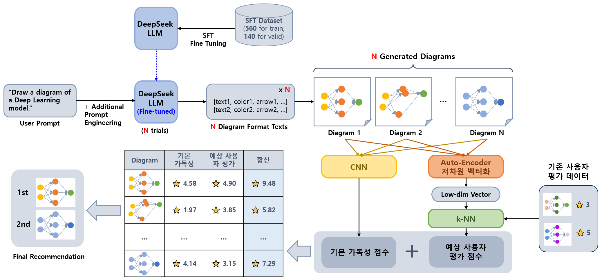

## 목차

* [1. 프로젝트 개요](#1-프로젝트-개요)
  * [1-1. 프로젝트 진행 배경](#1-1-프로젝트-진행-배경)
* [2. 기술 분야 및 사용 기술](#2-기술-분야-및-사용-기술)
  * [2-1. 관련 논문](#2-1-관련-논문)
  * [2-2. 사용한 Python 라이브러리](#2-2-사용한-python-라이브러리)
* [3. 프로젝트 일정](#3-프로젝트-일정)
* [4. 프로젝트 상세 설명](#4-프로젝트-상세-설명)
  * [4-1. 도식 생성을 위한 LLM 프롬프트](#4-1-도식-생성을-위한-llm-프롬프트)
  * [4-2. LLM Fine-Tuning](#4-2-llm-fine-tuning)
  * [4-3. 생성된 이미지의 저차원 벡터화](#4-3-생성된-이미지의-저차원-벡터화)
  * [4-4. 최종 이미지 생성 및 순위 산출](#4-4-최종-이미지-생성-및-순위-산출)
* [5. 프로젝트 진행 중 이슈 및 해결 방법](#5-프로젝트-진행-중-이슈-및-해결-방법)
  * [5-1. ```flash_attn``` 실행 불가 (해결 보류)](#5-1-flashattn-실행-불가-해결-보류)

## 1. 프로젝트 개요

* DeepSeek LLM 을 이용하여 **사용자의 요구 사항에 맞는** 머신러닝 프로세스 또는 딥러닝 모델 등을 설명하기 위한 **Diagram 을 생성하기 위한 정형화된 포맷의 텍스트** 를 생성한다.
* 해당 텍스트를 이용하여 일반 알고리즘으로 Diagram 을 생성한다.
* 다음과 같은 방법을 이용하여 보다 가독성 좋은 Diagram 을 생성한다.
  * **[DPO 또는 ORPO](https://github.com/WannaBeSuperteur/AI-study/blob/main/AI%20Basics/LLM%20Basics/LLM_기초_Fine_Tuning_DPO_ORPO.md) 와 같은 기술로 LLM 을 Fine-Tuning** 하여, LLM 자체적으로 사용자 입장에서 가독성 높은 Diagram 생성
* 가독성이 더욱 향상된 **개별 사용자 맞춤형** Diagram 생성을 위해 다음을 적용한다.
  * 여러 개의 Diagram 을 생성한 후, **기본 가독성 점수 + 예상 사용자 평가 점수** 가 높은 순으로 정렬하여 상위권의 Diagram 들을 사용자에게 표시
  * [CNN (Conv. Neural Network)](https://github.com/WannaBeSuperteur/AI-study/blob/main/Image%20Processing/Basics_CNN.md) 을 이용하여 가독성 높은 Diagram 인지의 **기본 가독성 점수** 산출
  * 생성된 이미지를 [Auto-Encoder](https://github.com/WannaBeSuperteur/AI-study/blob/main/Generative%20AI/Basics_Auto%20Encoder.md) 로 저차원 벡터화하고, [k-Nearest Neighbor](https://github.com/WannaBeSuperteur/AI-study/blob/main/AI%20Basics/Machine%20Learning%20Models/%EB%A8%B8%EC%8B%A0%EB%9F%AC%EB%8B%9D_%EB%AA%A8%EB%8D%B8_KNN.md) 의 아이디어를 이용하여 **예상 사용자 평가 점수** 산출



### 1-1. 프로젝트 진행 배경

* [DS/ML/DL 기초 정리](https://github.com/WannaBeSuperteur/AI-study/tree/main/AI%20Basics) 중 모델 설명을 위한 다이어그램을 PowerPoint 등을 이용하여 그리는 데 오랜 시간 필요
  * 기초적인 부분은 AI에게 맡길 수 없을까?
* ChatGPT 에서 제공하는 DALL-E 등을 이용하여 생성할 시, 아래와 같이 **의도에 전혀 맞지 않고, 부자연스러운 부분이 있는 이미지** 가 생성됨
  * 따라서, 이 문제 해결에 **DALL-E 를 이용하기는 어려움**

| 사용자 쿼리                                                                                                                     |
|----------------------------------------------------------------------------------------------------------------------------|
| Draw a diagram of a deep learning model with 2 input nodes, 3 and 5 hidden nodes for each hidden layer, and 1 output node. |

| 결과물 (출처: ChatGPT DALL-E)         |
|----------------------------------|
|  |

* 최근 DeepSeek 등 오픈소스 LLM 확대로, 본 프로젝트 진행의 기술적 어려움이 크게 낮아짐

## 2. 기술 분야 및 사용 기술

* 기술 분야
  * LLM (Large Language Model)
  * Computer Vision
* 사용 기술

| 사용 기술                                                                                                                                         | 설명                                                                                         |
|-----------------------------------------------------------------------------------------------------------------------------------------------|--------------------------------------------------------------------------------------------|
| [DPO 또는 ORPO](https://github.com/WannaBeSuperteur/AI-study/blob/main/AI%20Basics/LLM%20Basics/LLM_%EA%B8%B0%EC%B4%88_Fine_Tuning_DPO_ORPO.md) | 사용자 선호도가 높은 Diagram 을 생성할 확률을 높이기 위한 LLM Fine-tuning 방법                                    |
| CNN (Conv. NN)                                                                                                                                | 생성된 다이어그램의 기본 가독성 점수 산출                                                                    |
| Auto-Encoder                                                                                                                                  | 생성된 이미지의 저차원 벡터화를 통해, k-NN 을 통한 사용자 평가 예상 점수 계산 시 **이웃한 이미지와의 거리 계산이 정확해지고, 연산량이 감소하는** 효과 |
| k-NN                                                                                                                                          | 각 사용자별 생성한 Diagram 에 대한 평가 데이터에 기반한, **해당 사용자에 대한 맞춤형** 사용자 평가 예상 점수 계산 알고리즘               |

### 2-1. 관련 논문

본 프로젝트에서 사용할 LLM 인 DeepSeek LLM 에 대한 **탄탄한 기초가 중요하다** 는 판단 아래 작성한, 관련 논문에 관한 스터디 자료이다.

* [(논문 스터디 자료) LLaMA: Open and Efficient Foundation Language Models, 2023](https://github.com/WannaBeSuperteur/AI-study/blob/main/Paper%20Study/Large%20Language%20Model/%5B2025.03.12%5D%20LLaMA%20-%20Open%20and%20Efficient%20Foundation%20Language%20Models.md)
* [(논문 스터디 자료) DeepSeek LLM Scaling Open-Source Language Models with Longtermism, 2024](https://github.com/WannaBeSuperteur/AI-study/blob/main/Paper%20Study/Large%20Language%20Model/%5B2025.03.13%5D%20DeepSeek%20LLM%20Scaling%20Open-Source%20Language%20Models%20with%20Longtermism.md)
* [(논문 스터디 자료) DeepSeek-R1: Incentivizing Reasoning Capability in LLMs via Reinforcement Learning, 2025](https://github.com/WannaBeSuperteur/AI-study/blob/main/Paper%20Study/Large%20Language%20Model/%5B2025.03.13%5D%20DeepSeek-R1%20-%20Incentivizing%20Reasoning%20Capability%20in%20LLM%20via%20Reinforcement%20Learning.md)

### 2-2. 사용한 Python 라이브러리

* PyTorch
* Numpy
* Pandas
* Plotly (데이터 분석용)
* 프로젝트 진행하면서 추가 예정

## 3. 프로젝트 일정

* 전체 일정 : **2025.03.12 수 - 03.17 월 (6d)**
* 상태 : ⬜ (TODO), 💨 (ING), ✅ (DONE)

| 계획 내용                                      | 일정                     | branch                   | 상태 |
|--------------------------------------------|------------------------|--------------------------|----|
| 논문 스터디 (LLaMA + DeepSeek 총 3개)             | 03.12 수 - 03.13 목 (2d) |                          | ✅  |
| 프로젝트 개요 작성                                 | 03.14 금 (1d)           |                          | ✅  |
| DeepSeek LLM 모델 선택                         | 03.14 금 (1d)           | ```P001-001-SelectLLM``` | 💨 |
| LLM Fine-tuning 학습 데이터의 Diagram 생성 알고리즘 개발 | 03.14 금 (1d)           | ```P001-002-DiagAlgo```  | ⬜  |
| LLM Fine-tuning 학습 데이터 생성                  | 03.14 금 (1d)           | ```P001-003-FineTune```  | ⬜  |
| LLM Fine-tuning 실시                         | 03.15 토 (1d)           | ```P001-004-FineTune```  | ⬜  |
| CNN 개발 및 학습                                | 03.15 토 (1d)           | ```P001-005-CNN```       | ⬜  |
| Auto-Encoder 개발 및 학습                       | 03.16 일 (1d)           | ```P001-006-AE```        | ⬜  |
| k-NN 개발 및 학습                               | 03.16 일 (1d)           | ```P001-007-kNN```       | ⬜  |
| 기본 가독성 + 예상 사용자 평가 점수 처리 알고리즘 개발           | 03.16 일 - 03.17 월 (2d) | ```P001-008-Score```     | ⬜  |
| 프로젝트 상세 설명 정리 및 링크 추가                      | 03.17 월 (1d)           |                          | ⬜  |

## 4. 프로젝트 상세 설명

### 4-1. 도식 생성을 위한 LLM 프롬프트

### 4-2. LLM Fine-Tuning

* LLaMA 등 기존 LLM 보다는, **최신 트렌드인 DeepSeek 모델을 Fine-tuning** 하는 것을 본 프로젝트의 목표로 함.
* DPO 는 참조 모델을 사용해야 한다는 부담이 있지만, ORPO 는 LLM 1개만 사용하면 되므로 메모리 사용 및 Out-of-memory 부담이 낮음

### 4-3. 생성된 이미지의 저차원 벡터화

### 4-4. 최종 이미지 생성 및 순위 산출

## 5. 프로젝트 진행 중 이슈 및 해결 방법

**이슈 요약**

| 이슈                     | 날짜         | 심각성 | 상태 | 원인                           | 해결 방법                                                                                                    |
|------------------------|------------|-----|----|------------------------------|----------------------------------------------------------------------------------------------------------|
| ```flash_attn``` 사용 불가 | 2025.03.14 | 낮음  | 보류 | ```nvcc -V``` 기준의 CUDA 버전 이슈 | - Windows 환경 변수 편집 **(실패)**<br>- flash_attn 라이브러리의 이전 버전 설치 **(실패)**<br>- Visual C++ 14.0 설치 **(해결 안됨)** |

### 5-1. ```flash_attn``` 실행 불가 (해결 보류)

**문제 상황**

* [LLM 후보 모델](test/README.md#2-2-후보-모델-선정) 중 일부를 양자화하지 않고 실행 시, ```flash_attn``` (Flash Attention) 라이브러리를 필요로 함
* 해당 라이브러리가 CUDA 버전 이슈 (```nvcc -V``` 로 확인되는 버전 기준 CUDA 11.7 이상에서만 설치 가능) 로 인해 설치 안됨

**해결 보류 사유**

* ```flash_attn``` 오류는 Local 환경이 아닌 Google Colab 환경에서 실행 시 발생하지 않음
* Flash Attention 을 요구하는 LLM (DeepSeek-V2 등) 은 모두 Auto-[GPTQ](https://github.com/WannaBeSuperteur/AI-study/blob/main/AI%20Basics/LLM%20Basics/LLM_%EA%B8%B0%EC%B4%88_Quantization.md#2-4-gptq-post-training-quantization-for-gpt-models) (양자화 방법) Not Supported 인 큰 모델임
  * 이는 Local 환경에서는 GPTQ를 이용한 양자화 자체가 어려우며, 따라서 **큰 규모로 인한 OOM을 해결하기 어렵기 때문에, ```flash_attn``` 문제가 발생하는 로컬 환경에서는 사용 자체가 어려운 모델**임을 의미함.  
  * 오류 메시지 : ```deepseek_v2 isn't supported yet.``` 
* 해당 문제 해결 없이도 [Supervised Fine-Tuning](https://github.com/WannaBeSuperteur/AI-study/blob/main/AI%20Basics/LLM%20Basics/LLM_%EA%B8%B0%EC%B4%88_Fine_Tuning_SFT.md) 의 선 진행을 통해 충분한 성능을 보일 것으로 기대되는 모델 존재

**해결 시도 (모두 실패, 해결 보류 중)**

* **1. Windows 환경 변수 편집**
  * ```CUDA_PATH``` 환경 변수를 현재 설치된 11.7 이상의 CUDA 버전으로 갱신
  * ```PATH``` 의 ```CUDA\bin``` 부분을 현재 설치된 11.7 이상의 CUDA 버전으로 갱신
  * 결과
    * ```nvcc -V``` 로 확인되는 버전은 CUDA 11.7 이상으로 올라감
    * ```pip install flash_attn``` 설치 시도 시 다음과 같은 오류 발생
      * ```ERROR: Failed to build installable wheels for some pyproject.toml based projects (flash_attn)``` 

* **2. flash_attn 라이브러리의 이전 버전 설치**
  * ```pip install flash_attn==2.5.7``` 시도 [(참고)](https://github.com/Dao-AILab/flash-attention/issues/224)
  * 결과
    * ```error: Microsoft Visual C++ 14.0 is required. Get it with "Microsoft Visual C++ Build Tools": https://visualstudio.microsoft.com/downloads/``` 오류 발생

* **3. Visual C++ 14.0 설치**
  * [설치 링크](https://visualstudio.microsoft.com/ko/downloads/) 에서 설치 프로그램 다운로드
  * 설치 프로그램에서 "C++를 사용한 데스크톱 개발" 체크 후 설치
  * ```pip install flash_attn``` 실행 시도 결과
    * ```C:\Program Files\NVIDIA GPU Computing Toolkit\CUDA\v12.2\include\crt/host_config.h(157): fatal error C1189: #error:  -- unsupported Microsoft Visual Studio version! Only the versions between 2017 and 2022 (inclusive) are supported! The nvcc flag '-allow-unsupported-compiler' can be used to override this version check; however, using an unsupported host compiler may cause compilation failure or incorrect run time execution. Use at your own risk. error: command 'C:\\Program Files\\NVIDIA GPU Computing Toolkit\\CUDA\\v12.2\\bin\\nvcc.exe' failed: Error``` 오류 발생
  * Visual Studio Build Tools 에서 동일하게 실행 시도 결과 
    * ```pip install flash_attn==2.5.7```
      * 실패
      * ```urllib.error.HTTPError: HTTP Error 404: Not Found```
    * ```pip install flash_attn==2.3.3```
      * 실패
      * ```urllib.error.HTTPError: HTTP Error 404: Not Found```
    * ```pip install flash_attn==2.3.6```
      * 실패
      * ```urllib.error.HTTPError: HTTP Error 404: Not Found```
    * ```pip install https://github.com/oobabooga/flash-attention/releases/download/v2.6.3/flash_attn-2.6.3+cu122torch2.4.0cxx11abiFALSE-cp311-cp311-win_amd64.whl```
      * 실패
      * ```ERROR: flash_attn-2.6.3+cu122torch2.4.0cxx11abiFALSE-cp311-cp311-win_amd64.whl is not a supported wheel on this platform.```