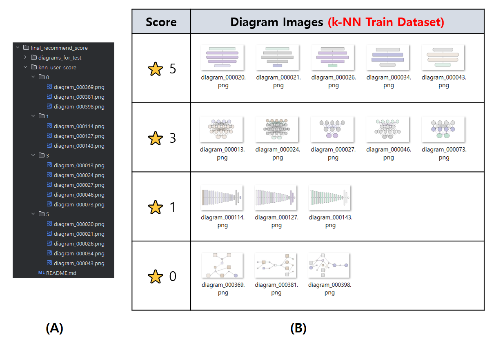

## 목차

* [1. 시스템 환경](#1-시스템-환경)
  * [1-1. 주요 Python 라이브러리](#1-1-주요-python-라이브러리)
  * [1-2. 시스템에 설치된 전체 Python 라이브러리](#1-2-시스템에-설치된-전체-python-라이브러리)
* [2. 사용자 가이드](#2-사용자-가이드)
  * [2-1. Python 환경 설정](#2-1-python-환경-설정) 
  * [2-2. 모델 다운로드](#2-2-모델-다운로드)
  * [2-3. 모델 준비](#2-3-모델-준비)
  * [2-4. 데이터 및 프롬프트 준비](#2-4-데이터-및-프롬프트-준비)
  * [2-5. run.py 실행](#2-5-runpy-실행)

## 1. 시스템 환경

* OS & GPU
  * OS : Windows 10
  * GPU : 2 x Quadro M6000 (12 GB each)
* CUDA
  * CUDA 12.4 (NVIDIA-SMI 551.61)
  * ```nvcc -V``` 명령어 실행 시 다음과 같이 표시

```
nvcc: NVIDIA (R) Cuda compiler driver
Copyright (c) 2005-2024 NVIDIA Corporation
Built on Tue_Feb_27_16:28:36_Pacific_Standard_Time_2024
Cuda compilation tools, release 12.4, V12.4.99
Build cuda_12.4.r12.4/compiler.33961263_0
```

* Python
  * Python : Python 3.8.1
  * Dev Tool : PyCharm 2024.1 Community Edition

### 1-1. 주요 Python 라이브러리

```
auto_gptq==0.7.1
bitsandbytes==0.45.3
datasets==3.1.0
huggingface-hub==0.29.3
numpy==1.21.6
opencv-python==4.6.0.66
opencv-python-headless==4.11.0.86
pandas==1.3.0
peft==0.13.2
pillow==10.2.0
scikit-learn==1.3.2
tokenizers==0.20.3
torch==2.4.0+cu124
torchinfo==1.8.0
torchvision==0.19.0+cu124
transformers==4.45.0
trl==0.11.4
```

### 1-2. 시스템에 설치된 전체 Python 라이브러리

* 본 프로젝트 개발 환경에 설치된 전체 Python 라이브러리의 목록입니다.

<details><summary>전체 Python 라이브러리 목록 [ 펼치기 / 접기 ]</summary>

```
absl-py==2.1.0
accelerate==1.0.1
aiohappyeyeballs==2.4.4
aiohttp==3.10.11
aiosignal==1.3.1
astunparse==1.6.3
async-timeout==5.0.1
attrs==25.3.0
auto_gptq==0.7.1
bitsandbytes==0.45.3
cachetools==5.3.3
certifi==2024.2.2
charset-normalizer==3.3.2
colorama==0.4.6
coloredlogs==15.0.1
contourpy==1.1.1
cycler==0.12.1
Cython==3.0.12
datasets==3.1.0
Deprecated==1.2.18
dill==0.3.8
docstring_parser==0.16
eval_type_backport==0.2.2
filelock==3.13.4
flatbuffers==1.12
fonttools==4.51.0
frozenlist==1.5.0
fsspec==2024.3.1
gast==0.4.0
gekko==1.2.1
google-auth==2.28.1
google-auth-oauthlib==0.4.6
google-pasta==0.2.0
grpcio==1.62.0
h5py==3.10.0
huggingface-hub==0.29.3
humanfriendly==10.0
idna==3.6
importlib-metadata==7.0.1
importlib_resources==6.4.0
intel-extension-for-transformers==1.4.2
Jinja2==3.1.3
joblib==1.4.2
keras==2.8.0
Keras-Preprocessing==1.1.2
kiwisolver==1.4.5
libclang==16.0.6
Markdown==3.5.2
markdown-it-py==3.0.0
MarkupSafe==2.1.5
matplotlib==3.7.5
mdurl==0.1.2
mpmath==1.3.0
multidict==6.1.0
multiprocess==0.70.16
networkx==3.1
neural_compressor==3.3
numpy==1.21.6
oauthlib==3.2.2
opencv-python==4.6.0.66
opencv-python-headless==4.11.0.86
opt-einsum==3.3.0
optimum==1.23.3
packaging==23.2
pandas==1.3.0
peft==0.13.2
pillow==10.2.0
prettytable==3.11.0
propcache==0.2.0
protobuf==3.19.6
psutil==7.0.0
py-cpuinfo==9.0.0
pyarrow==17.0.0
pyasn1==0.5.1
pyasn1-modules==0.3.0
pycocotools-windows==2.0.0.2
pydot==2.0.0
Pygments==2.19.1
pyparsing==3.1.2
pyreadline3==3.5.4
python-dateutil==2.9.0.post0
python-version==0.0.2
pytz==2024.1
PyYAML==6.0.1
regex==2023.12.25
requests==2.32.3
requests-oauthlib==1.3.1
rich==13.9.4
rouge==1.0.1
rsa==4.9
safetensors==0.4.3
schema==0.7.7
scikit-learn==1.3.2
scipy==1.10.1
sentencepiece==0.2.0
shtab==1.7.1
six==1.16.0
sympy==1.12
tensorboard==2.8.0
tensorboard-data-server==0.6.1
tensorboard-plugin-wit==1.8.1
tensorflow-estimator==2.9.0
tensorflow-gpu==2.8.0
tensorflow-io-gcs-filesystem==0.31.0
termcolor==2.4.0
tf-estimator-nightly==2.8.0.dev2021122109
tfutil==0.8.1
threadpoolctl==3.5.0
tokenizers==0.20.3
torch==2.4.0+cu124
torchaudio==2.4.0+cu124
torchinfo==1.8.0
torchvision==0.19.0+cu124
tqdm==4.67.1
transformers==4.45.0
trl==0.11.4
typeguard==4.4.0
typing_extensions==4.10.0
tyro==0.9.17
urllib3==2.2.1
wcwidth==0.2.13
Werkzeug==3.0.1
wrapt==1.16.0
xxhash==3.5.0
yarl==1.15.2
zipp==3.17.0
```

</details>

## 2. 사용자 가이드

### 2-1. Python 환경 설정

* Mandatory
  * Python 3.8.1 을 설치합니다.
  * ```pip install -r requirements.txt``` 명령어를 통해 [주요 라이브러리](#1-1-주요-python-라이브러리) 를 설치합니다.
* Optional
  * 주요 라이브러리 설치 후에도 Python 라이브러리 이슈로 실행이 안 될 시, [전체 라이브러리 목록](#1-2-시스템에-설치된-전체-python-라이브러리) 을 참고하여 라이브러리를 추가 설치합니다.

### 2-2. 모델 다운로드

HuggingFace 에서 아래와 같이 모델을 다운로드합니다.

* LLM (deepseek-coder-1.3b-instruct 기반)
  * [Download from HuggingFace](https://huggingface.co/daebakgazua/deepseek-coder-1.3b-instruct-diagram-wannabesuperteur)
* CNN & AE Model
  * [Download from HuggingFace](https://huggingface.co/daebakgazua/project_20250312_diagram_cnn_and_ae) 
  * ```cnn_model_{0,1,2,3,4}.pt``` 5개 모델 및 ```ae_encoder.pt``` 필수 다운로드

### 2-3. 모델 준비

[다운로드 받은 모델들](#2-2-모델-다운로드) 을 다음과 같은 경로에 각각 배치합니다.

* ```sft_model``` 에 다음과 같이 LLM 관련 파일들을 배치합니다.

```
2025_03_12_DeepSeek_LLM
 - sft_model
   - adapter_config.json
   - adapter_model.safetensors
   - README.md
   - special_tokens_map.json
   - tokenizer.json
   - tokenizer_config.json
   - training_args.bin
```

* ```final_recommend_score/models``` 에 다음과 같이 Auto-Encoder 및 CNN 모델 파일들을 배치합니다.

```
2025_03_12_DeepSeek_LLM
 - final_recommend_score
   - models
     - ae_decoder.pt
     - ae_encoder.pt
     - ae_model.pt
     - cnn_model_0.pt
     - cnn_model_1.pt
     - cnn_model_2.pt
     - cnn_model_3.pt
     - cnn_model_4.pt
```

### 2-4. 데이터 및 프롬프트 준비

다음과 같이 데이터를 준비합니다.

* ```final_recommend_score/knn_user_score``` 에 **각 점수 별 다이어그램 이미지** 배치
  * 점수 범위 : 0 ~ 5 점 (5점 만점) 
  * 해당 폴더의 하위 폴더 ```0``` ```1``` ```2``` ```3``` ```4``` ```5``` 에 해당 점수를 주고 싶은 다이어그램을 배치합니다.
  * ```final_recommend_score/training_data.zip``` 의 압축을 풀어서 나온 다이어그램 이미지 중에서 선택하여 배치할 수 있습니다.
* 예시
  * git clone 이후 최초의 ```final_recommend_score/knn_user_score``` 를 참고하시면 됩니다.
  * 아래 그림에서 **(A)** 와 같은 이미지 배치는 **(B)** 와 같은 점수 배정을 나타냅니다.



다음과 같이 사용자 프롬프트를 준비합니다.

* ```user_prompt.txt``` 에 영어로 프롬프트 입력
* 프롬프트 예시
  * ```DL model consist of 6 input size, 3, 4 nodes in intermediate layers, and 2 output elements```
  * ```NN model consist of 32 * 32 input, 3 * 3 conv layer, and then conv layer (output is 28 x 28), and then 2 * 2 pooling layer, 3 x 3 convolutional layer, then 2x2 pooling layer, 256, 64 and 16 nodes in each of the 3 hidden layers, and 1 output layer nodes```
  * ```Langchain process that consists of first, outputs pytorch tensor and process it with function, and code file that process numeric values, and outputs database```

### 2-5. run.py 실행

이제 모든 준비가 끝났습니다. 프로젝트 메인 디렉토리인 ```2025_03_12_DeepSeek_LLM``` 디렉토리에서 ```run.py``` 파일을 실행합니다.

* 실행 방법
  * ```python run.py -length 1280 -count 5 -recommend 3```
* 인자 설명
  * ```-length``` : LLM 답변에 포함할 token 의 최대 개수입니다. **(default : 1280)**
    * 이 값이 클수록 다이어그램에 그려지는 도형이 많아집니다.
    * 도형 1 개당 약 60 token 이 필요합니다.
  * ```-count``` : LLM 답변을 생성할 개수 = 전체 생성할 다이어그램의 개수입니다. **(default : 5)**
  * ```-recommend``` : 생성된 다이어그램 중 AI가 최종 추천할 다이어그램의 개수입니다. **(default : 3)**
    * 이 값이 ```-count``` 에서 설정된 값보다 크면 안 됩니다. 
* 실행 결과 설명
  * ```I recommend generated diagrams below, and I will copy them to user_diagrams/recommended ! 😊```
  * 위 메시지가 나타나면, ```2025_03_12_DeepSeek_LLM/user_diagrams/recommended``` 디렉토리에서 추천된 다이어그램을 확인하시면 됩니다.