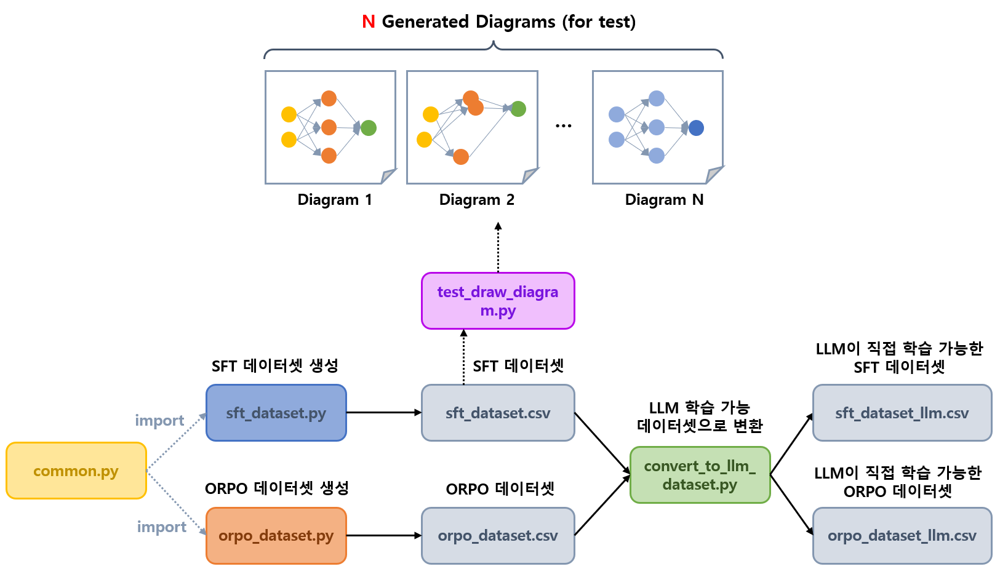

## 목차

* [1. ```sft_dataset.py``` 설명](#1-sftdatasetpy-설명)
* [2. ```orpo_dataset.py``` 설명](#2-orpodatasetpy-설명)
* [3. ```common.py``` 설명](#3-commonpy-설명)
* [4. ```convert_to_llm_dataset``` 설명](#4-converttollmdataset-설명)

## 개요



## 1. ```sft_dataset.py``` 설명

* [Supervised Fine-Tuning (SFT)](https://github.com/WannaBeSuperteur/AI-study/blob/main/AI%20Basics/LLM%20Basics/LLM_%EA%B8%B0%EC%B4%88_Fine_Tuning_SFT.md) 용 데이터셋 생성 코드
  * 생성된 데이터셋을 ```sft_dataset.csv``` 에 저장
* 총 300 개 규모 데이터셋
  * 딥러닝 모델 구조 관련 120 개
  * 기타 180 개

## 2. ```orpo_dataset.py``` 설명

* [ORPO (Odd-Ratio Preference Optimization)](https://github.com/WannaBeSuperteur/AI-study/blob/main/AI%20Basics/LLM%20Basics/LLM_%EA%B8%B0%EC%B4%88_Fine_Tuning_DPO_ORPO.md#3-orpo-odds-ratio-preference-optimization) 용 데이터셋 생성 코드
  * 생성된 데이터셋을 ```orpo_dataset.csv``` 에 저장
* 총 600 개 규모 데이터셋
  * 딥러닝 모델 구조 관련 240 개
  * 기타 360 개

## 3. ```common.py``` 설명

* SFT, ORPO 에 공통으로 사용되는 형태의 데이터셋 생성의 경우, 관련 함수를 common.py 에 정의

## 4. ```convert_to_llm_dataset``` 설명

* csv 형태의 데이터셋 파일을 실제 LLM 이 학습 가능한 형태의 데이터셋으로 변환
* csv 형태의 데이터셋 파일
  * ```sft_dataset.csv```
  * ```orpo_dataset.csv```