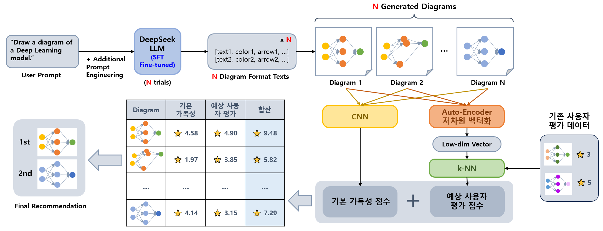
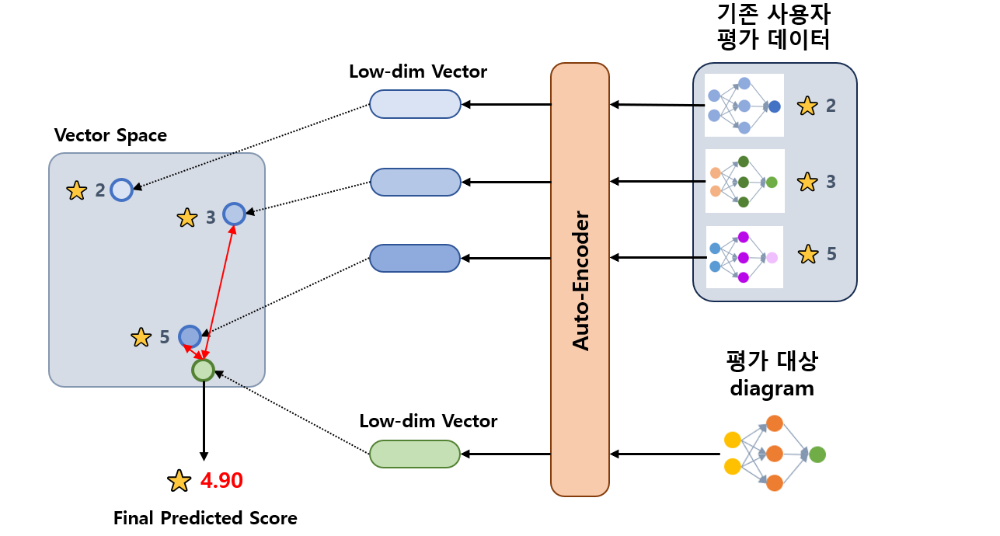

## 목차

* [1. 개요](#1-개요)
* [2. 점수 산출 알고리즘](#2-점수-산출-알고리즘)
  * [2-1. 기본 가독성 점수 (CNN)](#2-1-기본-가독성-점수-cnn)
  * [2-2. 예상 사용자 평가 점수 (Auto-Encoder)](#2-2-예상-사용자-평가-점수-auto-encoder)
* [3. 최종 평가](#3-최종-평가)

## 1. 개요

* Fine-Tuning 된 LLM 을 이용하여 여러 개의 Diagram 을 생성한다.
* 생성된 Diagram 들을 다음과 같이 평가한다.

| 평가 기준        | 평가 의도                           | 가중치 | 사용 알고리즘                |
|--------------|---------------------------------|-----|------------------------|
| 기본 가독성 점수    | 해당 다이어그램이 기본적인 가독성이 충분한가?       | 50% | Convolutional NN (CNN) |
| 예상 사용자 평가 점수 | 해당 다이어그램이 사용자가 선호하는 스타일로 예상되는가? | 50% | Auto-Encoder + k-NN    |

* 생성된 Diagram 들 중 평가 점수 합산이 상위권에 해당하는 일부분을 최종적으로 반환한다.



### 1-1. 파일 및 코드 설명

* ```training_data.zip``` : 학습 데이터 압축 파일 (Diagram 원본 이미지)
* ```scores.csv``` : 각 Diagram 에 대해 수기로 기재한 **기본 가독성 점수 (0 ~ 5)**
  * columns : ```[img_path, score]``` 

## 2. 점수 산출 알고리즘

* 기본 가독성 점수
  * [Convolutional Neural Network (CNN)](https://github.com/WannaBeSuperteur/AI-study/blob/main/Image%20Processing/Basics_CNN.md) 으로 산출
  * 사용자가 지정한 '선호 데이터셋'에 대한 정보와 무관
* 예상 사용자 평가 점수
  * 다이어그램을 [Auto-Encoder](https://github.com/WannaBeSuperteur/AI-study/blob/main/Generative%20AI/Basics_Auto%20Encoder.md) 를 이용하여, **[k-NN (k-Nearest Neighbors)](https://github.com/WannaBeSuperteur/AI-study/blob/main/AI%20Basics/Machine%20Learning%20Models/%EB%A8%B8%EC%8B%A0%EB%9F%AC%EB%8B%9D_%EB%AA%A8%EB%8D%B8_KNN.md) 을 통한 거리 계산이 가능한 저차원 벡터로 압축**
    * [PCA (Principal Component Analysis)](https://github.com/WannaBeSuperteur/AI-study/blob/main/AI%20Basics/Machine%20Learning%20Models/%EB%A8%B8%EC%8B%A0%EB%9F%AC%EB%8B%9D_%EB%AA%A8%EB%8D%B8_PCA.md) 등 방법은 이미지 데이터의 특징 (이웃 픽셀 간 값이 대체로 유사함) 을 반영하지 못함
  * 사용자가 지정한 '선호도 데이터셋'에 대한 정보를 학습 데이터로 하여, k-NN 으로 추천
    * 선호도 데이터셋에 있는 이웃한 Diagram 들에 대한, 선호도 점수의 가중 평균을 이용

### 2-1. 기본 가독성 점수 (CNN)

**1. CNN 모델 기본 사항**

* 학습 코드
  * ```cnn.py```
* 모델 학습 시 [Stratified K-fold Validation](https://github.com/WannaBeSuperteur/AI-study/blob/main/AI%20Basics/Machine%20Learning%20Models/%EB%A8%B8%EC%8B%A0%EB%9F%AC%EB%8B%9D_%EB%B0%A9%EB%B2%95%EB%A1%A0_Cross_Validation.md#4-stratified-k-fold-cross-validation) 이용
  * 이미지 데이터 수 자체가 900개로 부족
  * 품질이 비교적 떨어지는 데이터가 900개 중 약 200개로 [데이터 불균형](https://github.com/WannaBeSuperteur/AI-study/blob/main/AI%20Basics/Data%20Science%20Basics/%EB%8D%B0%EC%9D%B4%ED%84%B0_%EC%82%AC%EC%9D%B4%EC%96%B8%EC%8A%A4_%EA%B8%B0%EC%B4%88_%EB%8D%B0%EC%9D%B4%ED%84%B0_%EB%B6%88%EA%B7%A0%ED%98%95.md) 이 있음 
* Loss Function 은 [Binary Cross-Entropy](https://github.com/WannaBeSuperteur/AI-study/blob/main/AI%20Basics/Deep%20Learning%20Basics/%EB%94%A5%EB%9F%AC%EB%8B%9D_%EA%B8%B0%EC%B4%88_Loss_function.md#2-4-binary-cross-entropy-loss) 이용
  * 0 ~ 5 의 점수를 CNN 에 입력시킬 때는 5 로 나누어서 0 ~ 1 로 변환
  * [본 문제에서 MSE, MAE 등 Regression 용 Loss 를 적용하는 것은 논리적으로 부적절하다.](https://github.com/WannaBeSuperteur/AI-study/blob/main/AI%20Basics/Deep%20Learning%20Basics/%EB%94%A5%EB%9F%AC%EB%8B%9D_%EA%B8%B0%EC%B4%88_Loss_Function_Misuse.md#1-1-probability-prediction-0--1-%EB%B2%94%EC%9C%84-%EB%8B%A8%EC%9D%BC-output-%EC%97%90%EC%84%9C-mse-loss-%EB%93%B1%EC%9D%B4-%EB%B6%80%EC%A0%81%EC%A0%88%ED%95%9C-%EC%9D%B4%EC%9C%A0)
* 기본 가독성 점수 예측
  * [Ensemble](https://github.com/WannaBeSuperteur/AI-study/blob/main/AI%20Basics/Machine%20Learning%20Models/%EB%A8%B8%EC%8B%A0%EB%9F%AC%EB%8B%9D_%EB%AA%A8%EB%8D%B8_Ensemble.md) 방법 중 [Soft Voting](https://github.com/WannaBeSuperteur/AI-study/blob/main/AI%20Basics/Machine%20Learning%20Models/%EB%A8%B8%EC%8B%A0%EB%9F%AC%EB%8B%9D_%EB%AA%A8%EB%8D%B8_Ensemble.md#2-1-voting) 의 아이디어 
  * 최종 예측값은 Stratified K-fold Validation 으로 생성된 K 개의 모델의 예측값의 평균

**2. 모델 구조**

* TBU

**3. 학습 데이터**

* 학습 데이터 정보
  * 총 900 개의 Diagram 및 그 평가 점수 (0~5)
  * 90도/180도/270도 회전 및 상하 flip [Augmentation](https://github.com/WannaBeSuperteur/AI-study/blob/main/Image%20Processing/Basics_Image_Augmentation.md) 적용하여, 원본의 8 배 분량으로 이미지 데이터셋 증대
  * ```scores.csv```
* 학습 데이터 상세
  * ```training_data/base``` : [SFT Fine-tuning](https://github.com/WannaBeSuperteur/AI-study/blob/main/AI%20Basics/LLM%20Basics/LLM_%EA%B8%B0%EC%B4%88_Fine_Tuning_SFT.md) 을 위해 생성한 700 개의 Diagram
  * ```training_data/sft_generated_orpo_dataset``` : [ORPO Fine-tuning](https://github.com/WannaBeSuperteur/AI-study/blob/main/AI%20Basics/LLM%20Basics/LLM_%EA%B8%B0%EC%B4%88_Fine_Tuning_DPO_ORPO.md#3-orpo-odds-ratio-preference-optimization) 을 위해 생성한 200 개의 Diagram
    * ORPO 를 위한 rejected LLM answer 는 SFT Fine-tuning 된 LLM 을 이용하여 생성

### 2-2. 예상 사용자 평가 점수 (Auto-Encoder)

**1. 점수 산출 방법**

* 사용자가 생성한 다이어그램 선호도 데이터를 기반으로, k-NN 을 이용하여 추천
  * 선호도 데이터셋에 있는 이웃한 Diagram 들에 대한, **선호도 점수의 가중 평균** 을 이용 
* 이때, **Auto-Encoder 로 저차원 변환된 벡터** 를 이용



**2. Auto-Encoder 모델 구조**

TBU

**3. Auto-Encoder 학습 데이터**

* Auto-Encoder 학습 데이터 정보
  * 총 700 개의 Diagram 및 그 평가 점수 (0~5)
    * 위 **2-1.** 의 데이터 중 SFT Fine-tuning 을 위해 생성한 것만을 이용
  * 90도/180도/270도 회전 [Augmentation](https://github.com/WannaBeSuperteur/AI-study/blob/main/Image%20Processing/Basics_Image_Augmentation.md) 적용하여 원본의 4배 분량으로 이미지 데이터셋 증대
  * ```scores.csv``` 를 읽어서, ```img_path``` column 값을 이용하여 별도 추출
* Auto-Encoder 학습 데이터 상세
  * ```training_data/base``` : SFT Fine-tuning 을 위해 생성한 700 개의 Diagram 

## 3. 최종 평가

* LLM Answer 를 통해 생성된 N 개의 다이어그램 중, **총점이 높은 K 개를 최종 추천하여 반환**
* 총점 기준
  * 기본 가독성 점수 (50%) + 예상 사용자 평가 점수 (50%)