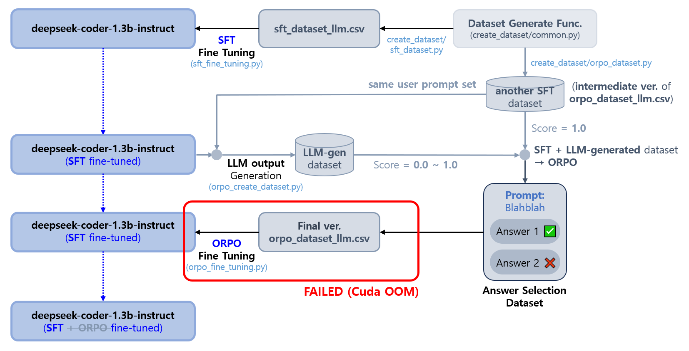

## 목차

* [1. LLM Fine-Tuning](#1-llm-fine-tuning)
* [2. Supervised Fine-Tuning (SFT)](#2-supervised-fine-tuning-sft)
* [3. Odd-Radio Preference Optimizaiton (ORPO)](#3-odd-radio-preference-optimizaiton-orpo)
* [4. 코드 실행 순서](#4-코드-실행-순서)

## 1. LLM Fine-Tuning

**1. LLM Fine-Tuning 방법 요약**

* LLM
  * **deepseek-coder-1.3b-instruct**
  * [14개 후보 LLM 대상 테스트 결과, 해당 LLM 이 성능 및 속도 측면에서 가장 우수](../test_llm/README.md#3-테스트-진행-및-결과)
* Fine-Tuning 방법
  * [Supervised Fine-Tuning (SFT)](https://github.com/WannaBeSuperteur/AI-study/blob/main/AI%20Basics/LLM%20Basics/LLM_%EA%B8%B0%EC%B4%88_Fine_Tuning_SFT.md)
    * 지도학습을 통해 모델이 diagram format 에 맞는 text 를 생성하도록 유도
    * [LoRA (Low-Rank Adaption)](https://github.com/WannaBeSuperteur/AI-study/blob/main/AI%20Basics/LLM%20Basics/LLM_%EA%B8%B0%EC%B4%88_Fine_Tuning_LoRA_QLoRA.md#2-lora-low-rank-adaptation) 를 선택
  * [Odd-Radio Preference Optimizaiton (ORPO)](https://github.com/WannaBeSuperteur/AI-study/blob/main/AI%20Basics/LLM%20Basics/LLM_%EA%B8%B0%EC%B4%88_Fine_Tuning_DPO_ORPO.md#3-orpo-odds-ratio-preference-optimization)
    * 유저가 선호하는 스타일의 diagram 이 생성되는 text 를 생성하도록 유도 



**2. Fine-Tuning 상세**

* SFT, ORPO 각각 데이터셋 중 **80% 를 train, 20% 를 validation** 에 사용 (test dataset 따로 없음)

| 방법                                       | 데이터셋                                                                                                                                              | 데이터셋 파일                                                        |
|------------------------------------------|---------------------------------------------------------------------------------------------------------------------------------------------------|----------------------------------------------------------------|
| Supervised Fine-Tuning (SFT)             | **총 700 개 규모** 데이터셋<br>- 딥러닝 모델 구조 관련 280 개<br>- 기타 420 개                                                                                         | [sft_dataset_llm.csv](../create_dataset/sft_dataset_llm.csv)   |
| Odd-Radio Preference Optimizaiton (ORPO) | **총 800 개 규모** 데이터셋<br>- 딥러닝 모델 구조 관련 320 개 (80 개는 SFT 이전 생성, 240 개는 SFT 된 LLM 에 의해 생성)<br>- 기타 480개 (120 개는 SFT 이전 생성, 360 개는 SFT 된 LLM 에 의해 생성) | [orpo_dataset_llm.csv](../create_dataset/orpo_dataset_llm.csv) |

## 2. Supervised Fine-Tuning (SFT)

**1. Fine-Tuning 방법**

* [Supervised Fine-Tuning (SFT)](https://github.com/WannaBeSuperteur/AI-study/blob/main/AI%20Basics/LLM%20Basics/LLM_%EA%B8%B0%EC%B4%88_Fine_Tuning_SFT.md)
  * 지도학습을 통해 모델이 diagram format 에 맞는 text 를 생성하도록 유도
  * [LoRA (Low-Rank Adaption)](https://github.com/WannaBeSuperteur/AI-study/blob/main/AI%20Basics/LLM%20Basics/LLM_%EA%B8%B0%EC%B4%88_Fine_Tuning_LoRA_QLoRA.md#2-lora-low-rank-adaptation) 를 선택
* [Odd-Radio Preference Optimizaiton (ORPO)](https://github.com/WannaBeSuperteur/AI-study/blob/main/AI%20Basics/LLM%20Basics/LLM_%EA%B8%B0%EC%B4%88_Fine_Tuning_DPO_ORPO.md#3-orpo-odds-ratio-preference-optimization)
  * 유저가 선호하는 스타일의 diagram 이 생성되는 text 를 생성하도록 유도 
* 각 방법의 선택 이유

| 방법         | 선택 이유                                                                                                                                                                                                                                                                                                                                                                                                                                                                                                                                                                                                                                                                                                                                                                                                                                                                            |
|------------|----------------------------------------------------------------------------------------------------------------------------------------------------------------------------------------------------------------------------------------------------------------------------------------------------------------------------------------------------------------------------------------------------------------------------------------------------------------------------------------------------------------------------------------------------------------------------------------------------------------------------------------------------------------------------------------------------------------------------------------------------------------------------------------------------------------------------------------------------------------------------------|
| SFT + LoRA | - 특정 포맷대로 생성하는 LLM에서 **해당 포맷과의 오차를 최대한 줄여서 일치시키는** 것이 중요하므로, SFT (지도 학습) 선택<br>- 빠른 학습을 위해 [PEFT](https://github.com/WannaBeSuperteur/AI-study/blob/main/AI%20Basics/LLM%20Basics/LLM_%EA%B8%B0%EC%B4%88_Fine_Tuning_PEFT.md) 방법 사용<br>- LoRA 는 LLM Fine-tuning 의 최신 트렌드인 만큼 장점이 많을 것으로 판단<br>- 다른 방법인 [Prefix Tuning](https://github.com/WannaBeSuperteur/AI-study/blob/main/AI%20Basics/LLM%20Basics/LLM_%EA%B8%B0%EC%B4%88_Fine_Tuning_PEFT.md#2-3-prefix-tuning) / [Prompt Tuning](https://github.com/WannaBeSuperteur/AI-study/blob/main/AI%20Basics/LLM%20Basics/LLM_%EA%B8%B0%EC%B4%88_Fine_Tuning_PEFT.md#2-4-prompt-tuning) / [Adapter Layer 추가](https://github.com/WannaBeSuperteur/AI-study/blob/main/AI%20Basics/LLM%20Basics/LLM_%EA%B8%B0%EC%B4%88_Fine_Tuning_PEFT.md#2-5-adapter-layer-%EC%B6%94%EA%B0%80) 는 **여러 task 를 처리하는 LLM** 에 보다 적합한데, 본 프로젝트는 단일 task 임 |
| ORPO       | - [RLHF](https://github.com/WannaBeSuperteur/AI-study/blob/main/AI%20Basics/LLM%20Basics/LLM_%EA%B8%B0%EC%B4%88_Fine_Tuning_DPO_ORPO.md#1-1-rlhf-reinforcement-learning-from-human-feedback) 와 같은 **강화학습을 사용하지 않고도 사용자가 선호하는 답변** 생성<br>- [DPO](https://github.com/WannaBeSuperteur/AI-study/blob/main/AI%20Basics/LLM%20Basics/LLM_%EA%B8%B0%EC%B4%88_Fine_Tuning_DPO_ORPO.md#2-dpo-direct-preference-optimization) 는 참조 모델이 있어야 하므로 GPU 메모리 측면에서 부담될 수 있음                                                                                                                                                                                                                                                                                                                                                                                                                      |

**2. 데이터셋**

* ```create_dataset/sft_dataset_llm.csv```
* 총 700 개 규모 데이터셋
  * 딥러닝 모델 구조 관련 280 개
  * 기타 420 개

**3. Fine-Tuning 코드**

* 학습 코드
  * ```fine_tuning/sft_fine_tuning.py```
* SFT 된 모델을 이용한 ORPO 용 데이터 생성 코드
  * ```fine_tuning/orpo_create_dataset.py```
  * 해당 코드 실행 시, ```create_dataset/orpo_dataset_llm.csv``` 에 ORPO 용 추가 데이터를 생성하여 추가

**4. Fine-Tuning 결과**

* 학습 설정
  * training batch size = 1
  * gradient checkpointing 적용
  * [학습 결과](log/log_train_final_sft.md) (학습 종료 시점에서 **평균 training loss 0.075** 내외)

## 3. Odd-Radio Preference Optimizaiton (ORPO)

**1. 데이터셋**

* ```create_dataset/orpo_dataset_llm.csv```
  * **SFT 된 모델로 ORPO 용 추가 데이터를 생성한 후** 의 csv 파일이어야 함
* 다음과 같이 총 800 개 규모 데이터셋을 바탕으로 ORPO 학습 데이터셋 생성
  * 딥러닝 모델 구조 관련 320 개
    * 80 개는 SFT 이전 생성 **(SFT 와 동일한 format 의 데이터셋)**
    * 240 개는 SFT 된 LLM 에 의해 생성
  * 기타 480 개
    * 120 개는 SFT 이전 생성 **(SFT 와 동일한 format 의 데이터셋)**
    * 360 개는 SFT 된 LLM 에 의해 생성

**2. Fine-Tuning 코드**

* 학습 코드
  * ```fine_tuning/orpo_fine_tuning.py```

**3. Fine-Tuning 결과**

TBU

## 4. 코드 실행 순서

* 준비 사항
  * ```create_dataset/sft_dataset_llm.csv```
  * ```create_dataset/orpo_dataset_llm.csv``` 의 중간 버전 (SFT format 의 score = 1.0 인 데이터만 존재)

* 실행 순서

```commandline
python sft_fine_tuning.py
python orpo_create_dataset.py
python orpo_fine_tuning.py
```