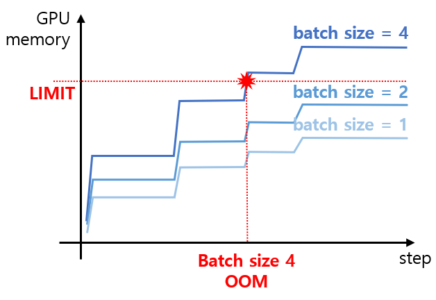

## 목차

* [1. 학습 설정](#1-학습-설정)
* [2. OOM 원인 분석](#2-oom-원인-분석)
* [3. Loss 추이](#3-loss-추이)

## 1. 학습 설정

* training batch size = 2
* gradient checkpointing 미사용

## 2. OOM 원인 분석

* 요약
  * 이 OOM 은 ```CUDA out of memory``` 가 아닌, ```CUBLAS_STATUS_EXECUTION_FAILED``` 또는 ```unknown error``` 의 형태로 발생

|               | gradient checkpointing 미 적용 | gradient checkpointing 적용      |
|---------------|-----------------------------|--------------------------------|
| batch size 작음 | 정상 작동 (추정)                  | 정상 작동 (GPU 메모리 사용량 계단식 증가)     |
| batch size 큼  | **OOM 발생, 학습 중지**           | 정상 작동하다가 **중간에 OOM 발생, 학습 중지** |

* 추가 추정
  * Gradient Checkpointing 사용 시, **해당 메커니즘으로 인해 미 적용 시보다 메모리 사용량 감소** 한다는 것은 기본 전제
  * 이때, 학습이 진행되면서 GPU 의 사용 메모리가 계단식으로 증가하며, **초반에는 빠르게 증가하다가 점차 속도가 느려지는** 것이 확인됨
  * 이는 **Gradient Checkpointing 시에는 각 데이터마다 메모리 사용량이 다르며**, 그 최고 기록만큼 GPU 메모리가 할당됨 (```nvidia-smi``` 기준)

* 대략적인 그래프

|     | gradient checkpointing 미 적용            | gradient checkpointing 적용              |
|-----|----------------------------------------|----------------------------------------|
| 그래프 |  |  |

## 3. Loss 추이

* [전체 학습 로그](log_train_batch_size_2.txt)
* ```grad_norm``` (Gradient Norm)
  * Loss Function 의 Gradient 의 크기로, **이 값이 크다는 것은 학습이 불안정함** 을 나타낸다.

