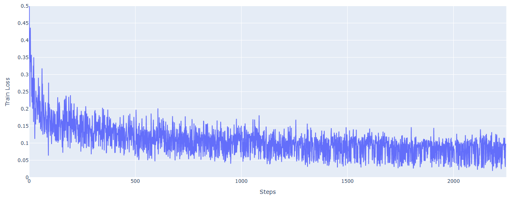
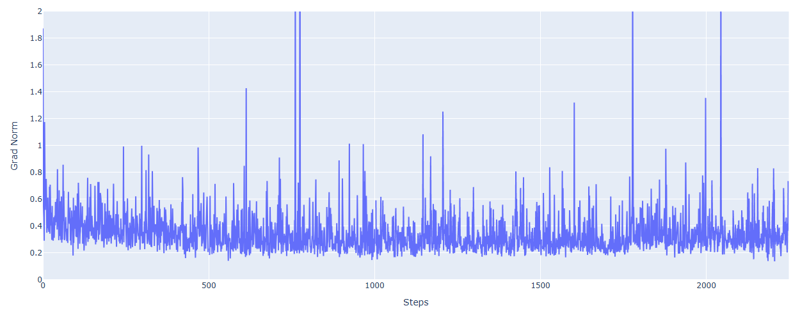

## 목차

* [1. 학습 설정](#1-학습-설정)
* [2. Loss 추이](#2-loss-추이)

## 1. 학습 설정

* training batch size = 1
* gradient checkpointing 적용

## 2. Loss 추이

* [전체 학습 로그](log_train_final_sft.txt)
* ```grad_norm``` (Gradient Norm)
  * Loss Function 의 Gradient 의 크기로, **이 값이 크다는 것은 학습이 불안정함** 을 나타낸다.

**Loss 추이**



**Gradient Norm 추이**

