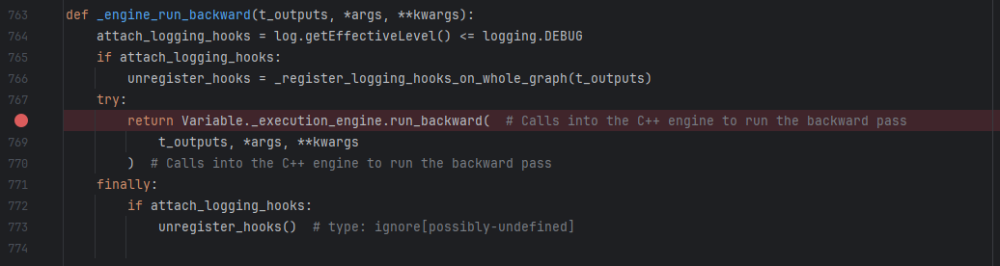
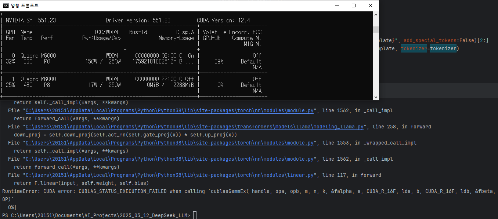

# 프로젝트 진행 중 이슈 및 해결 방법

## 목차

* [1. **```flash_attn``` 실행 불가 (해결 보류)**](#1-flashattn-실행-불가-해결-보류)
* [2. LLM 출력이 매번 동일함 (해결 완료)](#2-llm-출력이-매번-동일함-해결-완료)
* [3. 다이어그램 이미지 over-write (해결 완료)](#3-다이어그램-이미지-over-write-해결-완료)
* [4. CUBLAS_STATUS_NOT_SUPPORTED (해결 완료)](#4-cublas_status_not_supported-해결-완료)
* [5. SFT 중 CUDA error: unknown error (해결 완료)](#5-sft-중-cuda-error-unknown-error-해결-완료)
* [6. **Fine-Tuning 된 모델 추론 속도 저하 (해결 보류)**](#6-fine-tuning-된-모델-추론-속도-저하-해결-보류)
* [7. ORPO 학습 중 경고 메시지 및 오류 (해결 완료)](#7-orpo-학습-중-경고-메시지-및-오류-해결-완료)
* [8. **ORPO 학습 시 CUDA Out of memory (해결 실패)**](#8-orpo-학습-시-cuda-out-of-memory-해결-실패)
* [9. CNN 학습이 실질적으로 안 됨 (해결 완료)](#9-cnn-학습이-실질적으로-안-됨-해결-완료)
* [10. Auto-Encoder 학습이 실질적으로 안 됨 (해결 완료)](#10-auto-encoder-학습이-실질적으로-안-됨-해결-완료)

## 이슈 요약

**이슈 요약**

| 이슈 분류        | 이슈                                                                                                                                                    | 날짜         | 심각성    | 상태        | 원인 (및 해결 방법)                                              | 시도했으나 실패한 해결 방법                                                                                                                                                                                                                                                           |
|--------------|-------------------------------------------------------------------------------------------------------------------------------------------------------|------------|--------|-----------|-----------------------------------------------------------|---------------------------------------------------------------------------------------------------------------------------------------------------------------------------------------------------------------------------------------------------------------------------|
| LLM          | ```flash_attn``` 사용 불가                                                                                                                                | 2025.03.14 | 낮음     | 보류        | ```nvcc -V``` 기준의 CUDA 버전 이슈                              | - Windows 환경 변수 편집 **(해결 안됨)**<br>- flash_attn 라이브러리의 이전 버전 설치 **(실패)**<br>- Visual C++ 14.0 설치 **(실패)**                                                                                                                                                                  |
| LLM          | LLM 출력이 매번 동일함                                                                                                                                        | 2025.03.15 | 보통     | 해결 완료     | ```llm.generate()``` 함수의 랜덤 생성 인수 설정 누락                   | - ```torch.manual_seed()``` 설정 **(해결 안됨)**                                                                                                                                                                                                                                |
| 구현           | 다이어그램 이미지가 overwrite 됨                                                                                                                                | 2025.03.18 | 보통     | 해결 완료     | 텍스트 파싱 및 도형 그리기 알고리즘의 **구현상 이슈**                          | - 일정 시간 간격으로 다이어그램 생성 **(해결 안됨)**<br>- ```canvas.copy()``` 이용 **(해결 안됨)**<br>- garbage collection 이용 **(해결 안됨)**                                                                                                                                                          |
| LLM - SFT    | ```CUBLAS_STATUS_NOT_SUPPORTED``` (SFT 학습 중 오류)                                                                                                       | 2025.03.20 | **심각** | 해결 완료     | pre-trained LLM 을 가져올 때 자료형이 ```bfloat16``` 임             | - batch size 설정                                                                                                                                                                                                                                                           |
| LLM - SFT    | SFT 중 CUDA error: unknown error                                                                                                                       | 2025.03.20 | **심각** | 해결 완료     | 큰 batch size 에 따른 Out-of-memory                           | - ```CUDA_LAUNCH_BLOCKING=1``` 설정 **(해결 안됨)**<br> - ```TORCH_USE_CUDA_DSA=1``` 설정 **(해결 안됨)**                                                                                                                                                                             |           |
| LLM          | Fine-Tuning 된 모델 추론 속도 저하                                                                                                                             | 2025.03.22 | 보통     | 보류        | 환경 제약 & task 특성 (추정)                                      | - Auto-GPTQ 사용 **(해결 안됨)**<br>- 추가 라이브러리 사용 **(실패)**<br>- LLM 관련 설정값 변경 **(해결 안됨)**                                                                                                                                                                                       |
| LLM - ORPO   | ORPO 학습 중 경고 및 오류<br>- ```Trainer.tokenizer is now deprecated.``` 경고 메시지<br>- ```AttributeError: 'generator' object has no attribute 'generate'``` 오류 | 2025.03.23 | **심각** | 해결 완료     | transformers, trl 라이브러리 호환 안됨 → transformers 라이브러리 다운그레이드 | - trl 라이브러리 업그레이드 **(실패)**                                                                                                                                                                                                                                                |
| LLM - ORPO   | ORPO 학습 시 Out of memory                                                                                                                               | 2025.03.23 | **심각** | **해결 실패** | CUDA Out of memory                                        | - ```prepare_model_for_kbit_training``` 을 이용한 양자화 시도 **(해결 안됨)**<br> - 8bit의 메모리 효율적인 AdamW Optimizer 사용 **(해결 안됨)**<br>- Unsloth 설치 **(실패)**                                                                                                                             |
| CNN          | CNN 학습이 실질적으로 안 됨                                                                                                                                     | 2025.03.23 | 보통     | 해결 완료     | 이미지 가장자리 부분에 대한 중요하지 않은 정보가 오히려 학습을 방해 (추정)               | - 활성화 함수 수정 **(해결 안됨)**<br>- 이미지 크기 확대 **(해결 안됨)**<br>- 이미지 색상 변환 (전처리) **(해결 안됨)**                                                                                                                                                                                       |
| Auto-Encoder | Auto-Encoder 학습이 실질적으로 안 됨                                                                                                                            | 2025.03.25 | 보통     | 해결 완료     | 데이터셋 특성으로 추정하나, 명확하지 않음                                   | - Fully-Connected Layer 의 [Dropout](https://github.com/WannaBeSuperteur/AI-study/blob/main/AI%20Basics/Deep%20Learning%20Basics/%EB%94%A5%EB%9F%AC%EB%8B%9D_%EA%B8%B0%EC%B4%88_Overfitting_Dropout.md#3-dropout) 제거 **(해결 안됨)**<br>- Conv, DeConv 레이어 4개 → 3개 **(해결 안됨)** |

## 1. ```flash_attn``` 실행 불가 (해결 보류)

**문제 상황 및 원인 요약**

* [LLM 후보 모델](test/README.md#2-2-후보-모델-선정) 중 일부를 양자화하지 않고 실행 시, ```flash_attn``` (Flash Attention) 라이브러리를 필요로 함
* 해당 라이브러리가 CUDA 버전 이슈 (```nvcc -V``` 로 확인되는 버전 기준 CUDA 11.7 이상에서만 설치 가능) 로 인해 설치 안됨

**해결 보류 사유**

* ```flash_attn``` 오류는 Local 환경이 아닌 Google Colab 환경에서 실행 시 발생하지 않음
* Flash Attention 을 요구하는 LLM (DeepSeek-V2 등) 은 모두 Auto-[GPTQ](https://github.com/WannaBeSuperteur/AI-study/blob/main/AI%20Basics/LLM%20Basics/LLM_%EA%B8%B0%EC%B4%88_Quantization.md#2-4-gptq-post-training-quantization-for-gpt-models) (양자화 방법) Not Supported 인 큰 모델임
  * 이는 Local 환경에서는 GPTQ를 이용한 양자화 자체가 어려우며, 따라서 **큰 규모로 인한 OOM을 해결하기 어렵기 때문에, ```flash_attn``` 문제가 발생하는 로컬 환경에서는 사용 자체가 어려운 모델**임을 의미함.  
  * 오류 메시지 : ```deepseek_v2 isn't supported yet.``` 
* 해당 문제 해결 없이도 [Supervised Fine-Tuning](https://github.com/WannaBeSuperteur/AI-study/blob/main/AI%20Basics/LLM%20Basics/LLM_%EA%B8%B0%EC%B4%88_Fine_Tuning_SFT.md) 의 선 진행을 통해 충분한 성능을 보일 것으로 기대되는 모델 존재

**해결 시도 방법 (모두 실패, 해결 보류 중)**

* **1. Windows 환경 변수 편집**
  * ```CUDA_PATH``` 환경 변수를 현재 설치된 11.7 이상의 CUDA 버전으로 갱신
  * ```PATH``` 의 ```CUDA\bin``` 부분을 현재 설치된 11.7 이상의 CUDA 버전으로 갱신
  * 결과
    * ```nvcc -V``` 로 확인되는 버전은 CUDA 11.7 이상으로 올라감
    * ```pip install flash_attn``` 설치 시도 시 다음과 같은 오류 발생
      * ```ERROR: Failed to build installable wheels for some pyproject.toml based projects (flash_attn)``` 

* **2. flash_attn 라이브러리의 이전 버전 설치**
  * ```pip install flash_attn==2.5.7``` 시도 [(참고)](https://github.com/Dao-AILab/flash-attention/issues/224)
  * 결과
    * ```error: Microsoft Visual C++ 14.0 is required. Get it with "Microsoft Visual C++ Build Tools": https://visualstudio.microsoft.com/downloads/``` 오류 발생

* **3. Visual C++ 14.0 설치**
  * [설치 링크](https://visualstudio.microsoft.com/ko/downloads/) 에서 설치 프로그램 다운로드
  * 설치 프로그램에서 "C++를 사용한 데스크톱 개발" 체크 후 설치
  * ```pip install flash_attn``` 실행 시도 결과
    * ```C:\Program Files\NVIDIA GPU Computing Toolkit\CUDA\v12.2\include\crt/host_config.h(157): fatal error C1189: #error:  -- unsupported Microsoft Visual Studio version! Only the versions between 2017 and 2022 (inclusive) are supported! The nvcc flag '-allow-unsupported-compiler' can be used to override this version check; however, using an unsupported host compiler may cause compilation failure or incorrect run time execution. Use at your own risk. error: command 'C:\\Program Files\\NVIDIA GPU Computing Toolkit\\CUDA\\v12.2\\bin\\nvcc.exe' failed: Error``` 오류 발생
  * Visual Studio Build Tools 에서 동일하게 실행 시도 결과 
    * ```pip install flash_attn==2.5.7```
      * 실패
      * ```urllib.error.HTTPError: HTTP Error 404: Not Found```
    * ```pip install flash_attn==2.3.3```
      * 실패
      * ```urllib.error.HTTPError: HTTP Error 404: Not Found```
    * ```pip install flash_attn==2.3.6```
      * 실패
      * ```urllib.error.HTTPError: HTTP Error 404: Not Found```
    * ```pip install https://github.com/oobabooga/flash-attention/releases/download/v2.6.3/flash_attn-2.6.3+cu122torch2.4.0cxx11abiFALSE-cp311-cp311-win_amd64.whl```
      * 실패
      * ```ERROR: flash_attn-2.6.3+cu122torch2.4.0cxx11abiFALSE-cp311-cp311-win_amd64.whl is not a supported wheel on this platform.```

## 2. LLM 출력이 매번 동일함 (해결 완료)

**문제 상황 및 원인 요약**

* 테스트 프롬프트에 대해 LLM 이 생성하는 답변이 매번 동일함
* LLM 을 이용하여 답변을 생성하는 ```generate()``` 함수의 ```do_sample=True``` 누락이 원인

**해결 시도 방법**

* **1. torch.manual_seed() 설정 (실패)**
  * 매번 생성 시도할 때마다, ```seed``` 의 값을 1씩 증가시킨 후 ```torch.manual_seed(seed)``` 를 적용하여 seed 값 업데이트
  * 결과: 해결 안됨

* **2. LLM 을 이용하여 답변을 생성하는 ```generate()``` 함수 수정**
  * 해당 함수에 대해 랜덤하게 답변을 생성하도록 아래와 같이 ```do_sample=True``` 를 추가
  * 결과: 이 방법으로 해결 성공🎉

```python
with torch.no_grad():
    outputs = llm.generate(**inputs,
                           max_length=768,
                           do_sample=True)  # 랜덤 출력 (여기서부터 랜덤 출력 생성되게 하기 위함)
```

## 3. 다이어그램 이미지 over-write (해결 완료)

**문제 상황 및 원인 요약**

* [다이어그램 작성 코드인 draw_diagram.py](draw_diagram/draw_diagram.py) 의 ```generate_diagram_from_lines``` 함수를 통해 이미지 반복 생성 시,
* 다이어그램 이미지를 그리기 위한 **NumPy array (canvas) 를 매 생성 시마다 초기화함에도 불구하고 overwrite** 됨
* 도형 그리기 알고리즘 구현상의 오류가 원인

**해결 시도 방법**

* **1. 일정 시간 간격으로 다이어그램 생성 (해결 안됨)**
  * 다이어그램 생성 시마다 0.35 초의 간격을 두고 생성하도록 interval 지정
    * ```time.sleep(0.35)  # to prevent image overwriting``` 를 이용
  * 근본적인 해결 방법은 아니라고 판단됨

* **2. ```canvas.copy()``` 이용 (해결 안됨)**
  * canvas 를 초기화해도 OpenCV 에 이전의 메모리가 남아 있을 수 있음
  * 따라서, 이를 **원본이 아닌 복사된 canvas 에 도형을 그리는** 방식으로 해결 시도
  * 코드

```
canvas = np.ones((HEIGHT, WIDTH, 3), dtype=np.uint8) * 255
canvas = canvas.copy()
```

* **3. garbage collection (해결 안됨)**
  * OpenCV의 해당 메모리를 초기화하는 것도 가능한 방법으로 판단하여 garbage collection 실시 
  * 코드 

```
del canvas
gc.collect()
```

* **4. 구현상의 오류 해결**
  * 텍스트 파싱 및 도형 그리기 알고리즘의 **구현상 이슈** 로 판단하여 이를 해결
  * 결과: 이 방법으로 해결 성공🎉

## 4. CUBLAS_STATUS_NOT_SUPPORTED (해결 완료)

**문제 상황 및 원인 요약**

* LLM의 Supervised Fine-tuning (SFT) 학습 중 다음과 같은 오류 발생
  * ```RuntimeError: CUDA error: CUBLAS_STATUS_NOT_SUPPORTED when calling `cublasGemmStridedBatchedEx(handle, opa, opb, (int)m, (int)n, (int)k, (void*)&falpha, a, CUDA_R_16BF, (int)lda, stridea, b, CUDA_R_16BF, (int)ldb, strideb, (void*)&fbeta, c, CUDA_R_16BF, (int)ldc, stridec, (int)num_batches, compute_type, CUBLAS_GEMM_DEFAULT_TENSOR_OP)```
* 원인 : Pre-trained LLM 을 가져올 때, ```torch.dtype = bfloat16``` 으로 설정하여 해당 오류 발생

**해결 시도 방법**

* **1. batch size 변경 (해결 안됨)**
  * ```training_args``` 에 다음을 추가
    * ```per_device_train_batch_size=4,  # batch size per device during training```
    * ```per_device_eval_batch_size=4  # batch size per device during validation```
  * 결과: 이 방법으로 해결되지 않음

* **2. bfloat16 을 float16 으로 변경**
  * LLM 을 가져올 때 ```bfloat16``` 자료형을 사용했기 때문에 해당 오류 발생, ```float16``` 으로 수정
  * 결과: 이 방법으로 해결 성공🎉

```python
original_llm = AutoModelForCausalLM.from_pretrained(model_path,
                                                    torch_dtype=torch.float16).cuda()
```

## 5. SFT 중 CUDA error: unknown error (해결 완료)

**문제 상황**

* SFT 실행 중 약 30분 후 다음과 같은 오류 발생

```
    return Variable._execution_engine.run_backward(  # Calls into the C++ engine to run the backward pass
RuntimeError: CUDA error: the launch timed out and was terminated
CUDA kernel errors might be asynchronously reported at some other API call, so the stacktrace below might be incorrect.
For debugging consider passing CUDA_LAUNCH_BLOCKING=1
Compile with `TORCH_USE_CUDA_DSA` to enable device-side assertions.

 11%|████████████████████                                                                                                                                                                       | 30/280 [28:16<3:55:40, 56.56s/it]
```



* ```gradient_checkpointing``` (가중치를 메모리에 일부만 저장하는 방식) 을 하지 않을 때는 **학습 시작 직후** 다음과 같이 **CUBLAS_STATUS_EXECUTION_FAILED** 오류 발생

```
  File "C:\Users\20151\AppData\Local\Programs\Python\Python38\lib\site-packages\transformers\models\llama\modeling_llama.py", line 258, in forward
    down_proj = self.down_proj(self.act_fn(self.gate_proj(x)) * self.up_proj(x))
  File "C:\Users\20151\AppData\Local\Programs\Python\Python38\lib\site-packages\torch\nn\modules\module.py", line 1553, in _wrapped_call_impl
    return self._call_impl(*args, **kwargs)
  File "C:\Users\20151\AppData\Local\Programs\Python\Python38\lib\site-packages\torch\nn\modules\module.py", line 1562, in _call_impl
    return forward_call(*args, **kwargs)
  File "C:\Users\20151\AppData\Local\Programs\Python\Python38\lib\site-packages\torch\nn\modules\linear.py", line 117, in forward
    return F.linear(input, self.weight, self.bias)
RuntimeError: CUDA error: CUBLAS_STATUS_EXECUTION_FAILED when calling `cublasGemmEx( handle, opa, opb, m, n, k, &falpha, a, CUDA_R_16F, lda, b, CUDA_R_16F, ldb, &fbeta, c, CUDA_R_16F, ldc, CUDA_R_32F, CUBLAS_GEMM_DEFAULT_TENSOR_OP)`
  0%|                                                                                                                                                                                                      | 0/280 [00:09<?, ?it/s]
```

**문제 원인**

* **큰 batch size 로 인한 GPU 메모리 초과로 추정**
* Gradient Checkpointing 미 적용 시, **batch size 4 로도 GPU 메모리 (12GB) 를 초과** 하게 됨



* Out of memory 대신 ```CUBLAS_STATUS_EXECUTION_FAILED``` 가 발생하는 이유는 불명
* Gradient Checkpointing 과의 연관성 (추정)
  * **Gradient Checkpointing 을 하는 경우, 이로 인해 메모리가 절약됨**
  * 이로 인해 Gradient Checkpointing 없이 학습할 때 batch size 4 에서 바로 오류가 발생하는 것과 달리, batch size 4 로도 30분 동안은 학습 진행 가능
  * 그러다 30분 정도 시점에서 메모리 초과가 발생하여 학습이 강제 중지됨 

**해결 시도 방법**

* **1. ```CUDA_LAUNCH_BLOCKING=1``` 설정 (해결 안됨)**
  * ```fine_tuning/sft_fine_tuning.py``` 의 상단에 다음 설정 추가
    * ```os.environ['CUDA_LAUNCH_BLOCKING'] = "1"``` 
  * 결과: 해결 안됨

```
    return Variable._execution_engine.run_backward(  # Calls into the C++ engine to run the backward pass
RuntimeError: CUDA error: unknown error
Compile with `TORCH_USE_CUDA_DSA` to enable device-side assertions.

 12%|██████████████████████▋                                                                                                                                                                    | 34/280 [33:23<4:01:37, 58.93s/it]
```

* **2. ```TORCH_USE_CUDA_DSA=1``` 설정 (해결 안됨)**
  * ```fine_tuning/sft_fine_tuning.py``` 의 상단에 다음 설정 추가
    * ```os.environ["TORCH_USE_CUDA_DSA"] = '1'``` 
  * 결과: 해결 안됨

```
    return Variable._execution_engine.run_backward(  # Calls into the C++ engine to run the backward pass
RuntimeError: CUDA error: unknown error
Compile with `TORCH_USE_CUDA_DSA` to enable device-side assertions.

 12%|██████████████████████▋                                                                                                                                                                    | 34/280 [32:00<3:51:33, 56.48s/it]
```

* **3. LLM 학습 시, batch size 감소 (4 → 1 or 2)** 
  * 결과
    * Gradient Checkpointing 적용 시, batch size 2 에서 학습 정상 종료
    * [상세 학습 로그](fine_tuning/log/log_train_sft_batch_size_2)
  * 상세 코드

```python
    training_args = SFTConfig(
        learning_rate=0.0002,  # lower learning rate is recommended for fine tuning
        num_train_epochs=2,
        logging_steps=1,  # logging frequency
#        gradient_checkpointing=True,
        output_dir=output_dir,
        save_total_limit=3,  # max checkpoint count to save
        per_device_train_batch_size=1,  # batch size per device during training
        per_device_eval_batch_size=1  # batch size per device during validation
    )
```

## 6. Fine-Tuning 된 모델 추론 속도 저하 (해결 보류)

**문제 상황 및 원인 요약**

* LLM Fine Tuning 후, Diagram 1개를 생성하는 데 3분 이상 소요
* 본 프로젝트를 하나의 제품이라고 하면, 제품을 사용하는 유저 입장에서 좋은 사용자 경험을 제공하기 어려운 상황

**해결 보류 사유**

* GPU 성능 제약, Windows 10 OS 에서의 vLLM 등 라이브러리 사용 불가 등 환경적 제약을 프로젝트 일정 내에 극복하기 어렵다고 판단
* task 의 특성상 response 의 token 개수가 1000개 이상으로 많이 필요하고, 이로 인해 긴 시간이 소요됨. 즉 **긴 시간 소요는 task 의 특성이라는 근본적인 이유 때문임**

**해결 시도한 방법**

* Auto-GPTQ 사용 **(속도 향상 안됨)**
  * [기존 모델의 GPTQ 적용된 버전](https://huggingface.co/TheBloke/deepseek-coder-1.3b-instruct-GPTQ) 을 이용하는 방법으로 시도 자체는 성공했으나, **학습 및 추론 속도 향상이 체감되지 않음**
  * [기존 모델의 GPTQ 적용된 버전](https://huggingface.co/TheBloke/deepseek-coder-1.3b-instruct-GPTQ) 적용 시,
    * 적용 자체는 **성공**
    * GPU 메모리 사용량 감소는 체감되지만, **학습/추론 속도 개선은 체감 안됨**
    * 기존 모델 대비 파라미터 개수 감소로, 실제 유저 사용 시 성능 저하 우려
    * 추론 속도가 **기존 모델보다도 오히려 느린** 것으로 의심
  * [상세 시도 기록](fine_tuning/log/log_try_apply_GPTQ.md) 
* 모델 생성 과정에서의 num_return_sequences (생성하는 answer 의 개수) 수정 **(속도 향상 불가)**
  * 기본값이 '1'이기 때문 
* vLLM 사용 **(현재 Linux 에서만 지원, Windows 에서 지원 안됨)**
* LoRA Config 에서 ```inference mode = True``` 적용 **(속도 향상 안됨)**

```python
def load_sft_llm():
    print('loading LLM ...')

    try:
        model = AutoModelForCausalLM.from_pretrained("sft_model").cuda()

        lora_config = LoraConfig(
            r=16,  # Rank of LoRA
            lora_alpha=16,
            lora_dropout=0.05,  # Dropout for LoRA
            init_lora_weights="gaussian",  # LoRA weight initialization
            inference_mode=True,
            target_modules=['q_proj', 'v_proj', 'k_proj', 'o_proj']
        )
        model = get_peft_model(model, lora_config)
```

* 추가 라이브러리 사용 **(실패)**
  * [Intel Extension (streamer 도 같이 적용)](https://discuss.pytorch.kr/t/transformer-intel-extension/2997)

```
FAILED:  No module named 'neural_compressor.conf'
```

* 추가 라이브러리 없이 streamer 만 사용 **(속도 향상 안됨)**
  * 모델 출력이 실시간으로 표시되는 효과만 있음
* 기타 방법들 **(```model.eval()``` 에서 5% 정도 속도 향상 추정)**
  * ```model = torch.compile(model)``` : 속도 향상 없음
  * **```model.eval()``` : 5% 정도 향상 추정**
  * ```model.half()``` + ```float16``` 적용 : 오류 발생
    * ```inputs = tokenizer(prompt, return_tensors="pt").to("cuda", torch.float16)``` 형식
  * ```do_sample=False``` : 속도 향상 없음 + **동일 context 에 대해 다양한 문장 생성 안됨**

## 7. ORPO 학습 중 경고 메시지 및 오류 (해결 완료)

**문제 상황 및 원인 요약**

* ORPO 학습 초반 mapping 단계에서 아래와 같은 경고
  * ```Trainer.tokenizer is now deprecated. You should use Trainer.processing_class instead.```
* ORPO 학습 중 ```'generator' object has no attribute 'generate'``` 오류

```
  File "C:\Users\20151\AppData\Local\Programs\Python\Python38\lib\site-packages\trl\trainer\orpo_trainer.py", line 852, in get_batch_samples
    policy_output = model.generate(
AttributeError: 'generator' object has no attribute 'generate'
```

* 문제 원인
  * 라이브러리 호환 이슈 
  * 현재 설치된 ```transformers==4.46.3``` 과 ```trl==0.11.4``` 가 호환되지 않음 

**해결 시도한 방법**

* pip 을 이용하여 ```trl==0.12.0``` 설치 **(실패)**
  * 명령어 : ```pip install trl==0.12.0```
  * 실패 이유 : Python 3.8.1 기준 pip 에서 trl 의 최대 버전이 ```0.11.4``` 임
* GitHub release 된 링크를 통해 ```trl``` 라이브러리 최신 버전 설치 **(실패)**
  * 명령어 : ```pip wheel git+https://github.com/huggingface/trl.git```
  * 실패 이유 : Python 3.9.0 이상 필요
    * ```ERROR: Package 'trl' requires a different Python: 3.8.1 not in '>=3.9'``` 
* ```transformers==4.45.0``` 으로 다운그레이드
  * 의사결정 이유 
    * Python 을 3.8.1 에서 3.9.0 으로 업그레이드 시, 모든 코드에 대한 정상 작동 여부 재확인 필요
    * 그러나, 현실적으로 자원 소비가 크다고 판단
    * 본 프로젝트에서는 ```transformers==4.45.0``` 으로 다운그레이드, 다음 프로젝트부터 Python version up
  * 결과
    * 이 방법으로 **경고 메시지 및 오류 모두 해결 성공 🎉**
    * SFT Fine-Tuning 학습 및 테스트, SFT 된 모델을 이용한 다이어그램 생성 모두 정상 작동 확인

## 8. ORPO 학습 시 CUDA Out of memory (해결 실패)

**문제 상황 및 원인 요약**

* ORPO 학습 시 CUDA Out of memory 발생 (Quadro M6000, 12GB)

**해결 보류 사유**

* **OOM 의 근본적인 원인인, Windows 10 + Python 3.8.1 + 12GB GPU 라는 환경적 문제를 개발 일정 내에 극복하기 어렵다고 판단**
* 다음 프로젝트부터 Python 3.12 등 version-up 하여 개발 예정
* ORPO 학습 없이도 Supervised Fine-Tuning 만으로 본 프로젝트의 목적을 어느 정도 달성할 수 있음

**해결 시도한 방법**

* SFT 학습된 모델 양자화 **(해결 안됨)**
  * ```sft_llm = prepare_model_for_kbit_training(sft_llm)```
* 8bit 형태의 [AdamW Optimizer](https://github.com/WannaBeSuperteur/AI-study/blob/main/AI%20Basics/Deep%20Learning%20Basics/%EB%94%A5%EB%9F%AC%EB%8B%9D_%EA%B8%B0%EC%B4%88_Optimizer.md#2-3-adamw) 사용 **(해결 안됨)**
  * ```optim="adamw_8bit"``` 
* Unsloth 설치 **(실패)**
  * Unsloth 는 Python 3.9 이상에서만 설치 가능
  * Python 3.8.1 에서는 설치 불가

## 9. CNN 학습이 실질적으로 안 됨 (해결 완료)

**문제 상황 및 원인 요약**

* 기본 가독성 점수 계산을 위한 CNN 의 학습이 전혀 이루어지지 않음
  * valid output 을 출력한 결과, 값이 모두 동일하게 나옴
* 원인은 **이미지 가장자리 부분의, 거의 모든 이미지에서 공백인 사실상 의미 없는 부분에 대한 정보가, 오히려 학습에 지장** 을 주었기 때문으로 추정
  * 학습 데이터가 1,000 개 내외로 비교적 부족한 상황에서 이로 인해 학습이 전혀 안 되었음
  * [차원의 저주](https://github.com/WannaBeSuperteur/AI-study/blob/main/AI%20Basics/Data%20Science%20Basics/%EB%8D%B0%EC%9D%B4%ED%84%B0_%EC%82%AC%EC%9D%B4%EC%96%B8%EC%8A%A4_%EA%B8%B0%EC%B4%88_%EC%B0%A8%EC%9B%90%EC%9D%98_%EC%A0%80%EC%A3%BC.md) 와 관련 있을 것으로 추정

**해결 시도 방법**

* **문제 해결 부분적 성공 시까지 시도한 부분**
  * Conv. + Pool Layer 이후 첫번째 Fully-Connected Layer 의 [활성화 함수](https://github.com/WannaBeSuperteur/AI-study/blob/main/AI%20Basics/Deep%20Learning%20Basics/%EB%94%A5%EB%9F%AC%EB%8B%9D_%EA%B8%B0%EC%B4%88_%ED%99%9C%EC%84%B1%ED%99%94_%ED%95%A8%EC%88%98.md) 를 Tanh 로 수정
    * 결과 : **해결 안됨**
  * 이미지 크기를 64 x 64 -> 128 x 128 로 확대
    * 결과 : **해결 안됨**
  * 모든 학습 및 테스트 이미지의 밝기 조정 (기존보다 5배 어둡게)
    * 다이어그램 이미지가 배경색은 흰색, 도형 배경색 역시 밝은 색으로 전체적으로 흰색에 상당히 가까움
    * 흰색이 아닌 색의 모든 픽셀에 대해, 그 **흰색보다 어두운 정도를 5배** 로 하여 **이미지를 어둡게 조정**
      * 일종의 [입력 데이터 정규화](https://github.com/WannaBeSuperteur/AI-study/blob/main/AI%20Basics/Data%20Science%20Basics/%EB%8D%B0%EC%9D%B4%ED%84%B0_%EC%82%AC%EC%9D%B4%EC%96%B8%EC%8A%A4_%EA%B8%B0%EC%B4%88_Normalization.md) 목적
    * 결과 : **해결 안됨**
  * 이미지의 실제 학습 범위를 **전체 128 x 128 이 아닌, 가운데 64 x 64 만 학습에 사용**
    * 가장자리 부분은 대부분이 흰색의 배경색인, 사실상 무의미한 정보이므로 학습 대상에서 제외
    * 결과 : **문제 해결 부분적 성공 (약 40% 확률로 학습이 잘 이루어짐)** 🎉

* **부분적 해결 성공 이후, 추가적으로 시도한 부분**
  * Conv. Layer 추가
    * ❌ **미 적용**
    * 적용 결과, 학습이 잘 이루어질 확률 오히려 감소
  * 모델이 생성한 다이어그램 데이터 추가 생성
    * ✅ **적용됨**
    * 기존 200장 + 추가 200장 = 400장
  * Conv. Layer 의 필터 개수를 줄여서 모델 파라미터 개수 감소
    * ✅ **적용됨**
    * 학습이 잘 이루어질 확률 약 70% 로 증가 추정
  * [Weight initialization](https://github.com/WannaBeSuperteur/AI-study/blob/main/AI%20Basics/Deep%20Learning%20Basics/%EB%94%A5%EB%9F%AC%EB%8B%9D_%EA%B8%B0%EC%B4%88_Weight_initialization.md) 개선
    * ❌ **미 적용**
    * Conv. Layer -> [He init](https://github.com/WannaBeSuperteur/AI-study/blob/main/AI%20Basics/Deep%20Learning%20Basics/%EB%94%A5%EB%9F%AC%EB%8B%9D_%EA%B8%B0%EC%B4%88_Weight_initialization.md#5-he-initialization), Fully-Connected Layer -> [Xavier init](https://github.com/WannaBeSuperteur/AI-study/blob/main/AI%20Basics/Deep%20Learning%20Basics/%EB%94%A5%EB%9F%AC%EB%8B%9D_%EA%B8%B0%EC%B4%88_Weight_initialization.md#4-xavier-initialization)
    * 적용 결과, 학습 실패율 급증 & 약 50%의 확률로 모델의 output 값이 항상 1.0 이 됨

* **추가 아이디어**
  * Pre-train 된 ResNet 등을 이용하여 [Transfer Learning (전이학습)](https://github.com/WannaBeSuperteur/AI-study/blob/main/AI%20Basics/Deep%20Learning%20Basics/%EB%94%A5%EB%9F%AC%EB%8B%9D_%EA%B8%B0%EC%B4%88_Transfer_Learning.md) 을 할까도 생각해 봄
  * 모델 복잡도 및 필요 이상의 자원 소비가 우려되어, 일단 보류

## 10. Auto-Encoder 학습이 실질적으로 안 됨 (해결 완료)

**문제 상황 요약**

* 예상 사용자 평가 점수 계산을 위한 CNN 의 학습이 전혀 이루어지지 않음
  * latent vector 를 출력한 결과, 값이 모두 동일하게 나옴

**해결 시도 방법**

* **문제 해결 부분적 성공 시까지 시도한 부분**
  * Fully-Connected Layer 의 [Dropout](https://github.com/WannaBeSuperteur/AI-study/blob/main/AI%20Basics/Deep%20Learning%20Basics/%EB%94%A5%EB%9F%AC%EB%8B%9D_%EA%B8%B0%EC%B4%88_Overfitting_Dropout.md#3-dropout) 제거
    * 기본 아이디어 : [Conv Layer 에 Dropout 을 적용하면 Auto-Encoder 학습이 어려워질 수 있는데](final_recommend_score/README.md#4-참고--conv-layer-에-dropout-적용된-auto-encoder-학습이-어려운-이유), Fully-Connected 도 마찬가지일 수 있다 
    * 결과 : **해결 안됨**
  * Encoder 의 Conv. Layer 와 Decoder 의 DeConv. Layer 를 4 → 3 개로 조정
    * 결과 : **해결 안됨**
  * Encoder 입력 ~ Latent Vector 사이에, **기존 Conv. Layer 를 거치는 흐름 외에 Dense Layer 1개를 거치는 흐름을 추가**
    * Encoder 의 Conv. Layer 가 끝나고 Fully-Connected Layer 가 시작되는 시점에서, **이 2개의 흐름에 의해 생성된 feature 를 concatenate**
    * 결과
      * **문제 해결 부분적 성공 (약 40% 확률로 학습이 잘 이루어짐)** 🎉
      * **Minimum Train Loss = 약 1.7K** (학습 안될 때) **→ 632.68**

* **부분적 해결 성공 이후, 추가적으로 시도한 부분**
  * Learning Rate Scheduler 조정 (warm-up 추가)
    * ✅ **적용됨**
    * before : warm-up 없는 [Cosine-Annealing LR Scheduler](https://github.com/WannaBeSuperteur/AI-study/blob/main/AI%20Basics/Deep%20Learning%20Basics/%EB%94%A5%EB%9F%AC%EB%8B%9D_%EA%B8%B0%EC%B4%88_Learning_Rate_Scheduler.md#2-6-cosine-annealing-scheduler)
    * after : 5 epoch 의 warm-up + 이후에 learning rate 가 매 epoch 마다 1.0% or 1.5% 씩 지수적으로 감소
    * 결과 (133 epoch 동안 학습 시 기준)
      * **학습 성공률 향상 (약 40% → 약 80% 추정)** 🎉
      * L.R. **1.0%** 씩 감소 시 : **Minimum Train Loss = 632.68 → 433.28 (🔻 31.5 %)** 🎉
      * L.R. **1.5%** 씩 감소 시 : **Minimum Train Loss = 632.68 → 425.79 (🔻 32.7 %)** 🎉