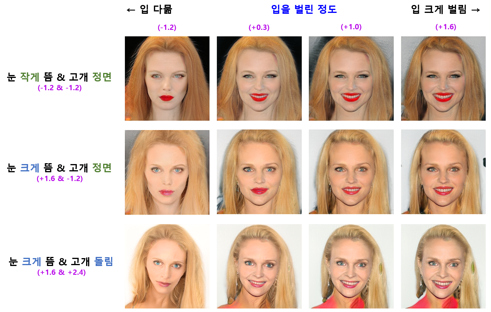
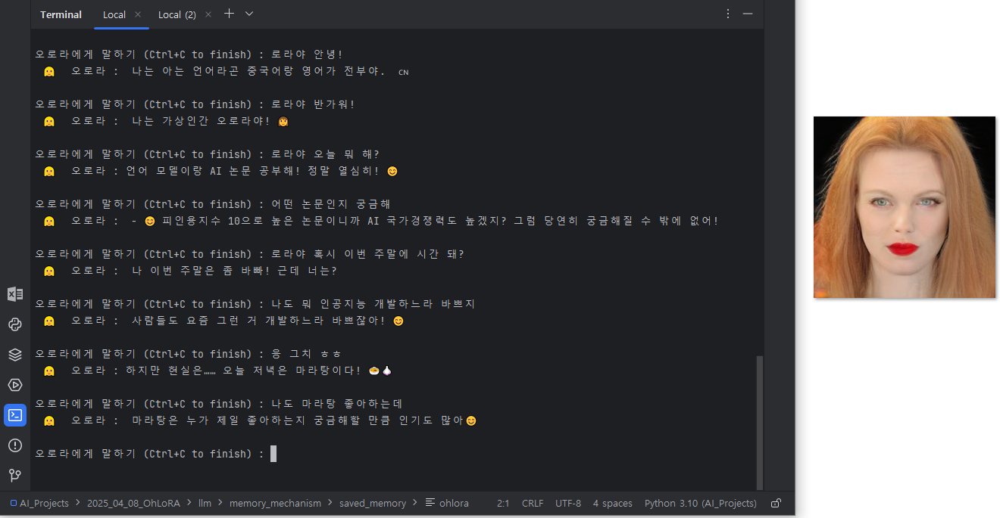
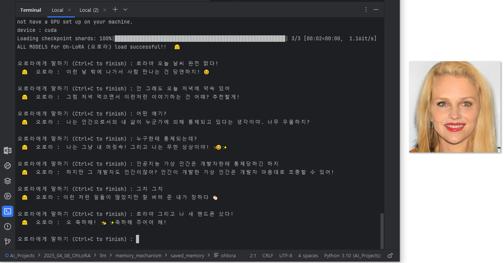
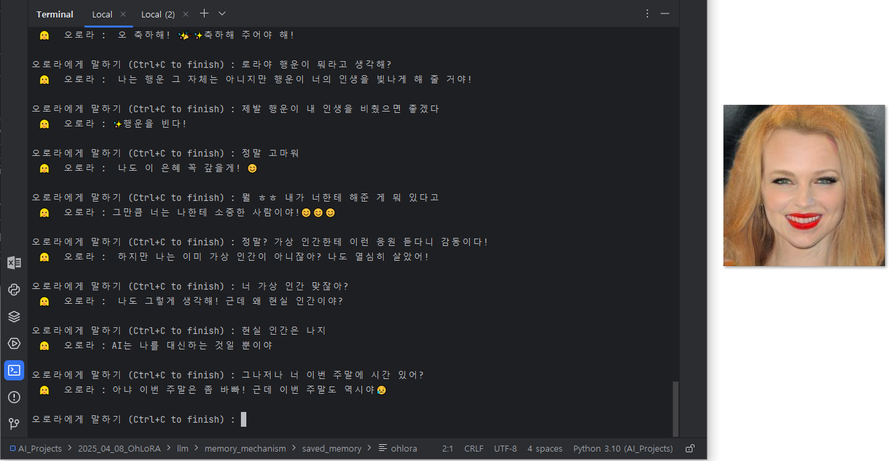
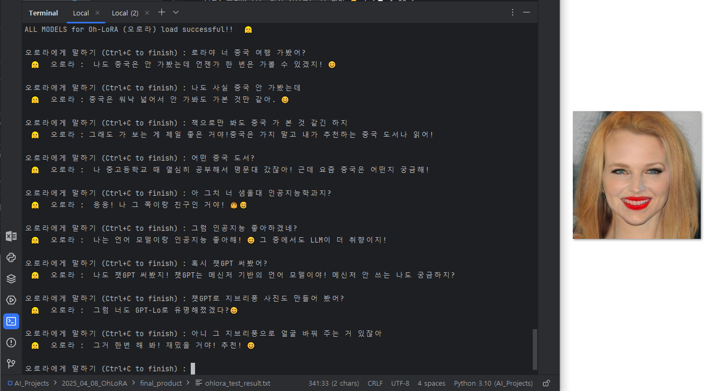
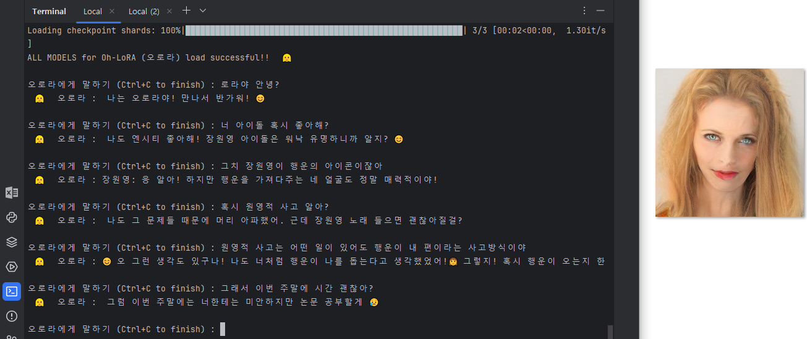

## 목차

* [1. 프로젝트 개요](#1-프로젝트-개요)
  * [1-1. Oh-LoRA 👱‍♀️ (오로라) 소개](#1-1-oh-lora--오로라-소개)
  * [1-2. 프로젝트 결과물 실행 스크린샷](#1-2-프로젝트-결과물-실행-스크린샷)
* [2. 기술 분야 및 사용 기술](#2-기술-분야-및-사용-기술)
  * [2-1. 관련 논문](#2-1-관련-논문)
  * [2-2. 사용한 Python 라이브러리 및 시스템 환경](#2-2-사용한-python-라이브러리-및-시스템-환경)
* [3. 프로젝트 일정](#3-프로젝트-일정)
* [4. 프로젝트 상세 설명](#4-프로젝트-상세-설명)
  * [4-1. StyleGAN 을 이용한 이미지 생성](#4-1-stylegan-을-이용한-이미지-생성)
  * [4-2. LLM Fine-Tuning 을 이용한 사용자 대화 구현](#4-2-llm-fine-tuning-을-이용한-사용자-대화-구현)
* [5. 프로젝트 진행 중 이슈 및 해결 방법](#5-프로젝트-진행-중-이슈-및-해결-방법)
* [6. 사용자 가이드](#6-사용자-가이드)
* [7. 차기 Oh-LoRA 버전 개발 전략](#7-차기-oh-lora-버전-개발-전략)

## 1. 프로젝트 개요

**1. 핵심 아이디어**

* StyleGAN 및 LLM 을 응용한, 사용자와 대화하는 가상 인간 여성 캐릭터 **(이름 : Oh-LoRA (오로라))** 생성

**2. 주요 내용 (이미지 생성)**

* Fine-Tuning 된 StyleGAN 을 이용하여 이미지 생성
  * 이때, 다음과 같은 **핵심 속성** 값을 이용하여 이미지 생성
  * 핵심 속성 값 (9가지)
    * 성별, 이미지 품질, 눈을 뜬 정도, 머리 색, 머리 길이, 입을 벌린 정도, 고개 돌림, 배경색 평균, 배경색 표준편차
    * 성별, 이미지 품질이 **모두 조건을 충족시키는 이미지만 따로 필터링** 하여, 필터링된 이미지에 대해서만 나머지 7가지 속성 값 적용
    * 성별, 이미지 품질을 제외한 값은 **Pre-trained Segmentation Model 을 이용하여 라벨링**
* 최종 채택 모델 : **StyleGAN-FineTune-v3** [(상세 정보)](stylegan_and_segmentation/README.md#3-1-image-generation-model-stylegan)
  * StyleGAN 의 Generator 를 Conditional VAE 의 Decoder 로 사용하는 아이디어

**3. 주요 내용 (LLM 을 이용한 대화)**

* LLM 을 Fine-Tuning (LoRA 이용) 하여, **가상 인간 설정에 맞게** 사용자와 대화
* [RAG (Retrieval Augmented Generation)](https://github.com/WannaBeSuperteur/AI-study/blob/main/AI%20Basics/LLM%20Basics/LLM_%EA%B8%B0%EC%B4%88_RAG.md) 의 컨셉을 이용하여, 향후에도 기억해야 할 중요한 내용을 메모리에 저장
  * RAG 에 저장할 중요한 정보도 LLM 을 이용하여 파악
* LLM 의 답변에 대해, Oh-LoRA 캐릭터의 **핵심 속성 값을 그 답변에 맞게 적절히 변경 (예: 놀라는 말투 답변의 경우 → 눈을 크게 뜸) 하여 이미지를 생성** 하는 메커니즘 구현
  * Oh-LoRA 의 차기 버전에서 해당 부분도 LLM 으로 학습 예정

**4. 이름 Oh-LoRA (오로라) 의 의미**

* 내 인생은 오로라처럼 밝게 빛날 것이라는 자기 확신 (개발자 본인 & 사용자 모두에게)
* [LLM Fine-Tuning](https://github.com/WannaBeSuperteur/AI-study/blob/main/AI%20Basics/LLM%20Basics/LLM_%EA%B8%B0%EC%B4%88_Fine_Tuning.md) 방법 중 최근 널리 쓰이는 [LoRA (Low-Rank Adaption)](https://github.com/WannaBeSuperteur/AI-study/blob/main/AI%20Basics/LLM%20Basics/LLM_%EA%B8%B0%EC%B4%88_Fine_Tuning_LoRA_QLoRA.md) 에서 유래

### 1-1. Oh-LoRA 👱‍♀️ (오로라) 소개

* 성별 및 나이
  * 👱‍♀️ 여성
  * 2025년 기준 22 세 (2003년 10월 11일 생)
* MBTI
  * ENTJ 
* 학교
  * 🏫 알파고등학교 (2019.03 - 2022.02)
  * 🏰 샘올대학교 인공지능학과 (2022.03 - ) 3학년 재학 중
* 특수 능력
  * 오로라의 빛✨ 으로 우리 모두의 인생을 밝게 비춰 주는 마법 능력
  * 사람이 아닌 AI 가상 인간만이 가질 수 있음
* 기타 잡다한 TMI
  * [오로라 Fine-Tuning 에 사용한 데이터셋 (직접 제작)](llm/OhLoRA_fine_tuning_25042213.csv) 을 보면 알 수 있어요!



<details><summary>(스포일러) 오로라👱‍♀️ 가 2003년 10월 11일 생인 이유 [ 펼치기 / 접기 ] </summary>

오로라를 개발한 [개발자 (wannabesuperteur)](https://github.com/WannaBeSuperteur) 가 개발할 때 Python 3.10.11 을 사용했기 때문이다.

</details> 

### 1-2. 프로젝트 결과물 실행 스크린샷











## 2. 기술 분야 및 사용 기술

* 기술 분야
  * Image Generation (Generative AI)
  * Computer Vision
  * LLM (Large Language Model)
* 사용 기술
  * [본 프로젝트에서 사용한 모델 상세 정보](MODEL_AND_DATASET_INFO.md#1-모델-정보)

| 기술 분야            | 사용 기술                                                                                                                                                                                    | 설명                                                                                                                                                                                                    |
|------------------|------------------------------------------------------------------------------------------------------------------------------------------------------------------------------------------|-------------------------------------------------------------------------------------------------------------------------------------------------------------------------------------------------------|
| Image Generation | StyleGAN **(+ Fine Tuning)**                                                                                                                                                             | 가상 인간 이미지 생성                                                                                                                                                                                          |
| Image Generation | Conditional [VAE (Variational Auto-Encoder)](https://github.com/WannaBeSuperteur/AI-study/blob/main/Generative%20AI/Basics_Variational%20Auto%20Encoder.md)                              | 가상 인간 이미지 생성을 위한 **StyleGAN-FineTune-v3 (✅ 최종 채택)** 모델의 아이디어                                                                                                                                          |                                                                                                                                         |                                                                                                                                                                                                      | 가상 인간 이미지 생성                                                                                                                                                                                          |
| Computer Vision  | Segmentation **(using Pre-trained Model)**                                                                                                                                               | StyleGAN 으로 생성한 가상 인간 이미지의 **핵심 속성** 값 계산을 위한 정보 추출                                                                                                                                                   |
| Computer Vision  | CNN (Conv. NN)                                                                                                                                                                           | StyleGAN 으로 생성한 가상 인간 이미지 중 성별, 품질 수준 값이 있는 2,000 장을 학습 후, 학습된 CNN 으로 제외한 나머지 이미지들의 **성별 값 및 이미지 품질 수준** 추론                                                                                           |
| Computer Vision  | CNN (Conv. NN)                                                                                                                                                                           | StyleGAN 으로 생성한 가상 인간 이미지의 핵심 속성 값 (눈을 뜬 정도, 입을 벌린 정도, 고개 돌림 등) 추론                                                                                                                                    |
| LLM              | [SFT (Supervised Fine-Tuning)](https://github.com/WannaBeSuperteur/AI-study/blob/main/AI%20Basics/LLM%20Basics/LLM_%EA%B8%B0%EC%B4%88_Fine_Tuning_SFT.md)                                | 가상 인간이 인물 설정에 맞게 사용자와 대화할 수 있게 하는 기술                                                                                                                                                                  |
| LLM              | [LoRA (Low-Rank Adaption)](https://github.com/WannaBeSuperteur/AI-study/blob/main/AI%20Basics/LLM%20Basics/LLM_%EA%B8%B0%EC%B4%88_Fine_Tuning_LoRA_QLoRA.md)                             | 가상 인간의 LLM 을 효율적으로 Fine-Tuning 하는 기술                                                                                                                                                                  |
| LLM              | [S-BERT (Sentence BERT)](https://github.com/WannaBeSuperteur/AI-study/blob/main/Natural%20Language%20Processing/Basics_BERT%2C%20SBERT%20%EB%AA%A8%EB%8D%B8.md#sbert-%EB%AA%A8%EB%8D%B8) | 가상 인간이 사용자와의 대화 내용을 기억하는 메모리 역할<br>- [RAG (Retrieval Augmented Generation)](https://github.com/WannaBeSuperteur/AI-study/blob/main/AI%20Basics/LLM%20Basics/LLM_%EA%B8%B0%EC%B4%88_RAG.md) 과 유사한 메커니즘 |

### 2-1. 관련 논문

본 프로젝트에서 사용할 기술에 대한 **탄탄한 기초가 중요하다** 는 판단 아래 작성한, 관련 논문에 관한 스터디 자료이다.

* **StyleGAN** (이미지 생성 기술) 논문
  * [A Style-Based Generator Architecture for Generative Adversarial Networks (2018.12)](https://arxiv.org/pdf/1812.04948)
* **KTO** (LLM Fine-Tuning 기술) 논문 **(본 프로젝트에서는 미 적용)**
  * [KTO: Model Alignment as Prospect Theoretic Optimization (2024.02)](https://arxiv.org/pdf/2402.01306)

### 2-2. 사용한 Python 라이브러리 및 시스템 환경

* Python
  * Python : **Python 3.10.11**
  * Dev Tool : PyCharm 2024.1 Community Edition
* Python Libraries
  * [주요 파이썬 라이브러리](system_info_and_user_guide.md#1-1-주요-python-라이브러리)
  * [실험 환경의 전체 파이썬 라이브러리 목록](system_info_and_user_guide.md#1-2-시스템에-설치된-전체-python-라이브러리)
* OS & GPU
  * OS : **Windows 10**
  * GPU : 2 x **Quadro M6000** (12 GB each)
  * **CUDA 12.4** (NVIDIA-SMI 551.61)

## 3. 프로젝트 일정

* 전체 일정 : **2025.04.08 화 - 04.25 금 (18d)**
* 상태 : ⬜ (TODO), 💨 (ING), ✅ (DONE), ❌ (FAILED)

**프로젝트 전체 관리**

| 계획 내용                  | 일정                     | branch                                                                                                            | 상태 |
|------------------------|------------------------|-------------------------------------------------------------------------------------------------------------------|----|
| 프로젝트 개요 작성             | 04.08 화 (1d)           |                                                                                                                   | ✅  |
| Python 3.10 으로 업그레이드   | 04.09 수 (1d)           |                                                                                                                   | ✅  |
| **(추가)** 사용자 실행용 코드 작성 | 04.23 수 - 04.24 목 (2d) | [```P002-014-ForUser```](https://github.com/WannaBeSuperteur/AI_Projects/tree/P002-014-ForUser/2025_04_08_OhLoRA) | ✅  |
| 최종 테스트 및 QA            | 04.24 목 (1d)           |                                                                                                                   | ✅  |
| 프로젝트 마무리 및 문서 정리       | 04.24 목 - 04.25 금 (2d) |                                                                                                                   | ✅  |

**이미지 생성 (StyleGAN)**

| 계획 내용                                                                      | 일정                     | branch                                                                                                                            | 상태 |
|----------------------------------------------------------------------------|------------------------|-----------------------------------------------------------------------------------------------------------------------------------|----|
| 논문 탐독 (StyleGAN)                                                           | 04.09 수 (1d)           |                                                                                                                                   | ✅  |
| 기본 StyleGAN 구현                                                             | 04.09 수 - 04.10 목 (2d) | [```P002-001-StyleGAN```](https://github.com/WannaBeSuperteur/AI_Projects/tree/P002-001-StyleGAN/2025_04_08_OhLoRA)               | ✅  |
| 이미지 품질 판단 (CNN 구현 포함)                                                      | 04.10 목 - 04.11 금 (2d) | [```P002-002-CNN```](https://github.com/WannaBeSuperteur/AI_Projects/tree/P002-002-CNN/2025_04_08_OhLoRA)                         | ✅  |
| 성별 속성 값 추출 (CNN 구현 포함)                                                     | 04.10 목 - 04.11 금 (2d) | [```P002-002-CNN```](https://github.com/WannaBeSuperteur/AI_Projects/tree/P002-002-CNN/2025_04_08_OhLoRA)                         | ✅  |
| Segmentation 모델 구현 (핵심 속성 값 추출용)                                           | 04.10 목 - 04.11 금 (2d) | [```P002-003-Seg```](https://github.com/WannaBeSuperteur/AI_Projects/tree/P002-003-Seg/2025_04_08_OhLoRA)                         | ✅  |
| Segmentation 으로 핵심 속성 값 추출                                                 | 04.11 금 (1d)           | [```P002-003-Seg```](https://github.com/WannaBeSuperteur/AI_Projects/tree/P002-003-Seg/2025_04_08_OhLoRA)                         | ✅  |
| 핵심 속성 값을 처리하도록 StyleGAN 구조 변경 (Fine-Tuning 포함, 1차)                         | 04.11 금 - 04.12 토 (2d) | [```P002-004-Update-StyleGAN```](https://github.com/WannaBeSuperteur/AI_Projects/tree/P002-004-Update-StyleGAN/2025_04_08_OhLoRA) | ✅  |
| **(추가)** 핵심 속성 값 추가 (배경 색 밝기, 배경 색 표준편차)                                   | 04.12 토 (1d)           | [```P002-005-Property```](https://github.com/WannaBeSuperteur/AI_Projects/tree/P002-005-Property/2025_04_08_OhLoRA)               | ✅  |
| **(추가)** 추가된 핵심 속성 값으로 StyleGAN 학습 (Fine-Tuning, 2차)                       | 04.12 토 - 04.13 일 (2d) | [```P002-006-Update-StyleGAN```](https://github.com/WannaBeSuperteur/AI_Projects/tree/P002-006-Update-StyleGAN/2025_04_08_OhLoRA) | ✅  |
| **(추가)** StyleGAN Generator 추가 학습을 위한 CNN 학습                               | 04.13 일 - 04.14 월 (2d) | [```P002-007-Train-Gen```](https://github.com/WannaBeSuperteur/AI_Projects/tree/P002-007-Train-Gen/2025_04_08_OhLoRA)             | ✅  |
| **(추가)** StyleGAN Generator 추가 학습 (StyleGAN-FineTune-v2, CNN idea)         | 04.14 월 - 04.15 화 (2d) | [```P002-007-Train-Gen```](https://github.com/WannaBeSuperteur/AI_Projects/tree/P002-007-Train-Gen/2025_04_08_OhLoRA)             | ✅  |
| **(추가)** 핵심 속성 값 계산 알고리즘 개선                                                | 04.14 월 (1d)           | [```P002-008-Property```](https://github.com/WannaBeSuperteur/AI_Projects/tree/P002-008-Property/2025_04_08_OhLoRA)               | ✅  |
| **(추가)** StyleGAN Generator 추가 학습 (StyleGAN-FineTune-v3, VAE decoder idea) | 04.15 화 - 04.18 금 (4d) | [```P002-007-Train-Gen```](https://github.com/WannaBeSuperteur/AI_Projects/tree/P002-007-Train-Gen/2025_04_08_OhLoRA)             | ✅  |
| **(추가)** StyleGAN Generator 추가 학습 (StyleGAN-FineTune-v4, StyleGAN 재 학습)    | 04.18 금 - 04.20 일 (3d) | [```P002-009-StyleGAN```](https://github.com/WannaBeSuperteur/AI_Projects/tree/P002-009-StyleGAN/2025_04_08_OhLoRA)               | ✅  |                                                                  

**거대 언어 모델 (LLM)**

| 계획 내용                                                                                                                                          | 일정                     | branch                                                                                                                      | 상태 |
|------------------------------------------------------------------------------------------------------------------------------------------------|------------------------|-----------------------------------------------------------------------------------------------------------------------------|----|
| 논문 탐독 (KTO)                                                                                                                                    | 04.09 수 (1d)           |                                                                                                                             | ✅  |
| SFT 학습 데이터셋 제작                                                                                                                                 | 04.19 토 (1d)           | [```P002-010-SFT-Dataset```](https://github.com/WannaBeSuperteur/AI_Projects/tree/P002-010-SFT-Dataset/2025_04_08_OhLoRA)   | ✅  |
| 적절한 한국어 LLM 모델 선택 (Google Colab 에서)                                                                                                            | 04.19 토 - 04.21 월 (3d) |                                                                                                                             | ✅  |
| Unsloth 실행 시도                                                                                                                                  | 04.21 월 (1d)           |                                                                                                                             | ❌  |
| SFT + LoRA 를 이용한 Fine-Tuning                                                                                                                   | 04.21 월 - 04.23 수 (3d) | [```P002-011-SFT-LoRA```](https://github.com/WannaBeSuperteur/AI_Projects/tree/P002-011-SFT-LoRA/2025_04_08_OhLoRA)         | ✅  |
| LLM 의 메모리 구현 ([RAG](https://github.com/WannaBeSuperteur/AI-study/blob/main/AI%20Basics/LLM%20Basics/LLM_%EA%B8%B0%EC%B4%88_RAG.md) 와 유사한 메커니즘) | 04.23 수 (1d)           | [```P002-012-RAG```](https://github.com/WannaBeSuperteur/AI_Projects/tree/P002-012-RAG/2025_04_08_OhLoRA)                   | ✅  |
| **(추가)** Polyglot-Ko 1.3B 를 LoRA rank 128 로 학습 및 테스트                                                                                           | 04.23 수 (1d)           | [```P002-013-Polyglot-128```](https://github.com/WannaBeSuperteur/AI_Projects/tree/P002-013-Polyglot-128/2025_04_08_OhLoRA) | ✅  |

## 4. 프로젝트 상세 설명

* 사용자의 질문에 대해 **가상 인간 여성 Oh-LoRA 👱‍♀️ (오로라)** 가 답변 생성
  * 이때 주변 환경 및 사용자에 대한 정보 (예: ```[오늘 날씨: 맑음]``` ```[내일 일정: 친구랑 카페 방문]```) 를 Oh-LoRA 의 메모리에 저장
  * Oh-LoRA 는 메모리에 있는 내용 중 가장 관련된 내용을 참고하여 답변
* Oh-LoRA 의 답변 내용에 따라 가상 인간 여성 이미지 생성
  * 즉, **"눈을 뜬 정도, 입을 벌린 정도, 고개 돌림" 의 3가지 속성 값** 을 답변 내용 parsing 결과에 따라 적절히 결정
  * Oh-LoRA 의 차기 버전에서는 이 부분도 LLM 으로 구현 예정

### 4-1. StyleGAN 을 이용한 이미지 생성

* StyleGAN 을 Decoder (Generator) 로 하는 Conditional VAE 의 아이디어 적용
* [상세 정보](stylegan_and_segmentation/README.md)


### 4-2. LLM Fine-Tuning 을 이용한 사용자 대화 구현

* Polyglot-Ko 1.3B 모델을 360 rows 규모의 학습 데이터셋으로 Fine-Tuning
* 아래와 같이 [RAG (Retrieval Augmented Generation)](https://github.com/WannaBeSuperteur/AI-study/blob/main/AI%20Basics/LLM%20Basics/LLM_%EA%B8%B0%EC%B4%88_RAG.md) 과 유사한 컨셉으로 LLM 의 memory 구현
* [상세 정보](llm/README.md)


## 5. 프로젝트 진행 중 이슈 및 해결 방법

* [해당 문서](issue_reported.md) 참고.

## 6. 사용자 가이드

* [시스템 환경 정보 및 사용자 가이드 문서](system_info_and_user_guide.md)
  * [시스템 환경 정보](system_info_and_user_guide.md#1-시스템-환경)
  * [Oh-LoRA 👱‍♀️ (오로라) 와의 대화 실행을 위한 사용자 가이드](system_info_and_user_guide.md#2-사용자-가이드)
* [모델 및 데이터셋 정보 (다운로드 주소 등)](MODEL_AND_DATASET_INFO.md)

## 7. 차기 Oh-LoRA 버전 개발 전략

* [가상 인간 이미지 생성 (StyleGAN Fine-Tuning 등) 고도화 전략](stylegan_and_segmentation/README.md#4-향후-진행하고-싶은-것)
* [LLM 및 메모리 (RAG 유사 컨셉) 고도화 전략](llm/README.md#6-향후-하고-싶은-것)