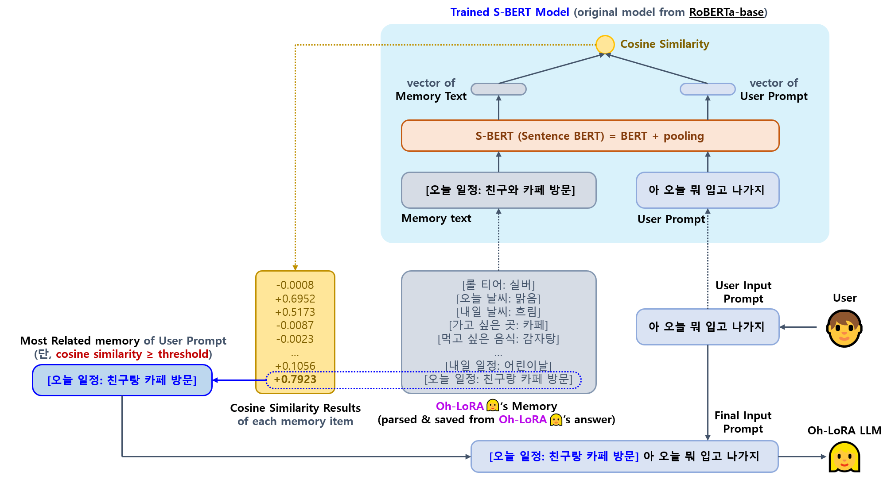
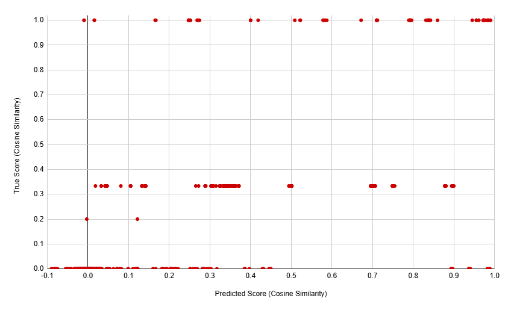

## 목차

* [1. LLM Final Selection](#1-llm-final-selection)
  * [1-1. Polyglot-Ko 1.3B 선택 이유](#1-1-polyglot-ko-13b-선택-이유) 
  * [1-2. 참고: Gemma License](#1-2-참고-gemma-license)
* [2. How to run Fine-Tuning](#2-how-to-run-fine-tuning)
* [3. LLM Memory (RAG-like concept)](#3-llm-memory-rag-like-concept)
  * [3-1. 동작 원리](#3-1-동작-원리)
  * [3-2. 학습 및 테스트 데이터 & 학습 설정](#3-2-학습-및-테스트-데이터--학습-설정)
  * [3-3. 테스트 결과](#3-3-테스트-결과)
* [4. Test / Run Model](#4-test--run-model)
  * [4-1. Prepare Model (Gemma-2 2B Based)](#4-1-prepare-model-gemma-2-2b-based)
  * [4-2. Prepare Model (Polyglot-Ko 1.3B✅ Based)](#4-2-prepare-model-polyglot-ko-13b-based)
  * [4-3. Prepare S-BERT Model](#4-3-prepare-s-bert-model)
  * [4-4. Run LLM Fine-Tuning](#4-4-run-llm-fine-tuning)
  * [4-5. Run Final Fine-Tuned Model](#4-5-run-final-fine-tuned-model)
  * [4-6. Run S-BERT Memory Model](#4-6-run-s-bert-memory-model)
* [5. Unsloth use test (❌ FAILED)](#5-unsloth-use-test--failed)
* [6. 향후 하고 싶은 것](#6-향후-하고-싶은-것)

## 1. LLM Final Selection

* **Polyglot-Ko 1.3B (1.43 B params)**
  * [HuggingFace](https://huggingface.co/EleutherAI/polyglot-ko-1.3b)
* [LLM Selection Report](model_selection/README.md) 기준
  * 최종 모델 : **Gemma-2 2B**
  * 예비 모델 : **Polyglot-Ko 1.3B (✅ 최종 채택)**

### 1-1. Polyglot-Ko 1.3B 선택 이유

* **실제 Fine-Tuning 된 모델** 의 생성 문장 측면 [(Gemma-2 2B 테스트 결과)](fine_tuning/fine_tuning_logs/2504221644%20(Inference,%2025042213%20dataset,%20temp=1.2).txt) [(Polyglot-Ko 1.3B 테스트 결과)](fine_tuning/fine_tuning_logs_polyglot/2504230855%20(Inference,%20epochs=60,%20rank=64,%20temp=0.6).txt)
  * Gemma-2 2B 가 Polyglot-Ko 1.3B 보다 생성 문장의 품질이 전반적으로 떨어짐
    * Gemma-2 2B 는 동일 질문에 대해 **유사한 답변을 생성** 하는 빈도가 Polyglot-Ko 1.3B 보다 현저히 높음
    * Gemma-2 2B 는 **특정 질문에 대해 empty answer 를 생성 (읽씹)** 하는 빈도가 Polyglot-Ko 1.3B 보다 현저히 높음
    * Gemma-2 2B 는 **어색한 외국어 문장** 을 생성하는 경우가 많음 
  * memory 정보 (예: ```[오늘 일정: 신규 아이템 발표]```) 파악 및 패드립 대응 (경고 처리) 능력은 Gemma-2 2B 가 Polyglot-Ko 1.3B 보다 높은 편이지만, 치명적인 이슈는 아님
* 기타
  * Gemma-2 2B 는 Polyglot-Ko 1.3B 와 달리 [Totally Free License 가 아님](#1-2-참고-gemma-license)
  * Polyglot-Ko 1.3B 는 **파라미터 개수가 Gemma-2 2B 의 절반 수준 (2.61 B vs. 1.43 B)**
    * 즉, 학습/추론 시간 및 메모리 사용량 관점에서 비교적 가볍고 빠름

### 1-2. 참고: Gemma License

* Source : [Gemma Terms of Use > Use Restrictions](https://ai.google.dev/gemma/terms#3.2-use)
* Checked Date : Apr 21, 2025 (KST)

----

3.2 Use Restrictions

You must not use any of the Gemma Services:

* for the restricted uses set forth in the Gemma Prohibited Use Policy at [ai.google.dev/gemma/prohibited_use_policy](https://ai.google.dev/gemma/prohibited_use_policy) **("Prohibited Use Policy")**, which is hereby incorporated by reference into this Agreement; or
* in violation of applicable laws and regulations.

To the maximum extent permitted by law, Google reserves the right to restrict (remotely or otherwise) usage of any of the Gemma Services that Google reasonably believes are in violation of this Agreement.

----

## 2. How to run Fine-Tuning

**1. Fine-Tuning 방법 및 데이터셋**

* 학습 모델
  * **Polyglot-Ko 1.3B (1.43 B params) (✅ 최종 채택)** [HuggingFace](https://huggingface.co/EleutherAI/polyglot-ko-1.3b) 
* 학습 방법 
  * [SFT (Supervised Fine-Tuning)](https://github.com/WannaBeSuperteur/AI-study/blob/main/AI%20Basics/LLM%20Basics/LLM_%EA%B8%B0%EC%B4%88_Fine_Tuning_SFT.md)
  * [LoRA (Low-Rank Adaption)](https://github.com/WannaBeSuperteur/AI-study/blob/main/AI%20Basics/LLM%20Basics/LLM_%EA%B8%B0%EC%B4%88_Fine_Tuning_LoRA_QLoRA.md), LoRA Rank = 128
  * train for **80 epochs (= 3h 21m)** [(train report)](fine_tuning/fine_tuning_logs_polyglot/2504231956%20(epochs=80,%20rank=128,%20temp=0.6).txt)
* 학습 데이터셋
  * [Train & Valid Dataset](OhLoRA_fine_tuning_25042213.csv) (**360** Q & A pairs for training / **60** Q & A pairs for validation) 
* Fine-Tuning 방법 선택 근거
  * 메모리 및 연산량을 절약 가능한, 최근 많이 쓰이는 LLM Fine-Tuning 방법 중 하나
  * **Oh-LoRA (오로라)** 라는 이름의 상징성을 고려
  * 널리 알려진 다른 방법들인 [Prefix Tuning](https://github.com/WannaBeSuperteur/AI-study/blob/main/AI%20Basics/LLM%20Basics/LLM_%EA%B8%B0%EC%B4%88_Fine_Tuning_PEFT.md#2-3-prefix-tuning), [Prompt Tuning](https://github.com/WannaBeSuperteur/AI-study/blob/main/AI%20Basics/LLM%20Basics/LLM_%EA%B8%B0%EC%B4%88_Fine_Tuning_PEFT.md#2-4-prompt-tuning), [Adapter Layer 추가](https://github.com/WannaBeSuperteur/AI-study/blob/main/AI%20Basics/LLM%20Basics/LLM_%EA%B8%B0%EC%B4%88_Fine_Tuning_PEFT.md#2-5-adapter-layer-%EC%B6%94%EA%B0%80) 등은 Multi-task LLM 에 보다 적합한데, 본 LLM 은 **단순 대화형 LLM 이 목적이므로 Multi-task 로 보기 다소 어려움**

**2. 모델 별 학습 특이 사항**

* **Gemma-2 2B**
  * 특이 사항 없음
* **Polyglot-Ko 1.3B (✅ 최종 채택)**
  * 학습 시 문제점 
    * Original Polyglot-Ko 1.3B LLM 의 tokenizer 의 end-of-sequence token 인 ```<|endoftext|>``` 가, **Fine-Tuning 된 모델에서는 매우 드물게 생성** 됨
    * 이로 인해 **거의 대부분의 생성 문장이 max token length 인 80 에 도달함**
  * 해결책으로, 다음 방법을 이용
    * 모든 학습 데이터의 답변 부분의 끝에 ```(답변 종료)``` 문구를 추가 후,
    * ```stopping_criteria``` 를 이용하여 ```(답변 종료)``` 에 해당하는 token 이 출력될 시 문장 생성 중지

## 3. LLM Memory (RAG-like concept)

* LLM 에는 기본적으로 메모리가 없어서 **방금 한 말조차 기억하지 못하고**, 이는 [환각 현상](https://github.com/WannaBeSuperteur/AI-study/blob/main/AI%20Basics/LLM%20Basics/LLM_%EA%B8%B0%EC%B4%88_%ED%99%98%EA%B0%81_%ED%98%84%EC%83%81.md) 의 원인 중 하나임
* 본 Oh-LoRA 프로젝트에서는 [RAG (Retrieval Augmented Generation)](https://github.com/WannaBeSuperteur/AI-study/blob/main/AI%20Basics/LLM%20Basics/LLM_%EA%B8%B0%EC%B4%88_RAG.md) 과 유사한 방법으로 LLM 의 메모리 구현

### 3-1. 동작 원리

* 사용자 입력에 대해 **가장 관련 있는 memory item** 을 [S-BERT (Sentence BERT)](https://github.com/WannaBeSuperteur/AI-study/blob/main/Natural%20Language%20Processing/Basics_BERT%2C%20SBERT%20%EB%AA%A8%EB%8D%B8.md#sbert-%EB%AA%A8%EB%8D%B8) 모델을 이용하여 탐색
* 찾은 memory item (단, **cosine similarity $\ge$ 0.6** 이어야 함) 을 사용자 입력의 맨 앞에 추가
* 오로라👱‍♀️ 에게 **memory item 내용이 앞에 추가된 프롬프트를 최종 전달**
* 구현 코드
  * [S-BERT Training](memory_mechanism/train_sbert.py)
  * [S-BERT Inference](memory_mechanism/inference_sbert.py)
  * [Entry & Best Memory Item Choice](run_memory_mechanism.py)



### 3-2. 학습 및 테스트 데이터 & 학습 설정

* 학습 및 테스트 데이터
  * **실제 데이터** 는 **데이터 생성용 조합** 의 각 line 의 **memory** (예: ```[오늘 일정: 친구랑 카페 방문]```) 와 **message** (나머지 부분) 을 SQL 의 cartesian product 와 유사한 방법으로 combination (?) 하여 생성
  * [데이터 생성 구현 코드](memory_mechanism/generate_dataset.py)

| 데이터        | 데이터 생성용 조합                                                                    | 실제 데이터<br>(학습 대상 column : ```memory_0``` ```user_prompt_1``` ```similarity_score```) |
|------------|-------------------------------------------------------------------------------|--------------------------------------------------------------------------------------|
| 학습 및 valid | [train_dataset_combs.txt](memory_mechanism/train_dataset_combs.txt) (40 rows) | [train_dataset.csv](memory_mechanism/train_dataset.csv) (1,600 rows)                 |
| 테스트        | [test_dataset_combs.txt](memory_mechanism/test_dataset_combs.txt) (20 rows)   | [test_dataset.csv](memory_mechanism/test_dataset.csv) (400 rows)                     |

* Cosine Similarity 의 Ground Truth 값
  * memory text 의 key (예: ```[오늘 일정: 친구랑 카페 방문]``` → ```오늘 일정```) 에 대해,
  * 이 key 를 **공백으로 구분한 각 단어 (예: ```오늘``` ```일정```) 에 대한 [IoU Score](https://github.com/WannaBeSuperteur/AI-study/blob/main/AI%20Basics/Data%20Science%20Basics/%EB%8D%B0%EC%9D%B4%ED%84%B0_%EC%82%AC%EC%9D%B4%EC%96%B8%EC%8A%A4_%EA%B8%B0%EC%B4%88_Metrics.md#2-1-iou)** 를 Ground Truth 로 함
  * 단, ```좋아하는 아이돌``` 과 ```좋아하는 가수``` 라는 key 는 동일한 key 로 간주 
* 학습 설정
  * Base Model : ```klue/roberta-base``` [(HuggingFace Link)](https://huggingface.co/klue/roberta-base)
  * Pooling 설정 : Mean Pooling 적용
  * 10 epochs
* [참고한 블로그 포스팅](https://velog.io/@jaehyeong/Basic-NLP-sentence-transformers-%EB%9D%BC%EC%9D%B4%EB%B8%8C%EB%9F%AC%EB%A6%AC%EB%A5%BC-%ED%99%9C%EC%9A%A9%ED%95%9C-SBERT-%ED%95%99%EC%8A%B5-%EB%B0%A9%EB%B2%95)

### 3-3. 테스트 결과

* Predicted vs. True Cosine Similarity 비교 (테스트 데이터셋)



* MSE, MAE & Corr-coef (테스트 데이터셋)

| MSE    | MAE    | Corr-coef |
|--------|--------|-----------|
| 0.0880 | 0.1681 | 0.6259    |

## 4. Test / Run Model

### 4-1. Prepare Model (Gemma-2 2B Based)

**1. Gemma-2-2b Original Unsloth Model (by Google & Unsloth)**

* ```2025_04_08_OhLoRA/llm/models/original``` 에, [gemma-2-2b-it Hugging-Face](https://huggingface.co/unsloth/gemma-2-2b-it/tree/main) 에서 다운로드받은 모델 및 관련 파일 저장
  * 총 9 개 파일 (각종 정보 포함)
  * 이때 ```models/original``` 디렉토리는 Clone 받은 repo. 에 원래 없으므로, 새로 생성  

* **🚨 VERY IMPORTANT 🚨**
  * **추가 개발 또는 실제 사용 시, [Gemma License](#1-2-참고-gemma-license) 를 준수해야 함**

```
2025_04_08_OhLoRA
- llm
  - fine_tuning
  - model_selection
  - models                        (필요 시 디렉토리 새로 생성)
    - original                    (디렉토리 새로 생성)
      - .gitarrtibutes            (다운로드 받은 파일)
      - README.md                 (다운로드 받은 파일)
      - config.json               (다운로드 받은 파일)
      - generation_config.json    (다운로드 받은 파일)
      - model.safetensors         (다운로드 받은 파일)
      - special_tokens_map.json   (다운로드 받은 파일)
      - tokenizer.json            (다운로드 받은 파일)
      - tokenizer.model           (다운로드 받은 파일)
      - tokenizer_config.json     (다운로드 받은 파일)
    - ...
  - unsloth_test
  - ...  
```

**2. Final Fine-Tuned Model**

* [LLM Fine Tuning 방법](#4-4-run-llm-fine-tuning) 의 **"1. Gemma2 2B Fine Tuning"** 대로 실행하면 ```2025_04_08_OhLoRA/llm/models/fine_tuned``` 에 Fine-Tuning 된 Gemma2-2B 모델 저장됨

### 4-2. Prepare Model (Polyglot-Ko 1.3B✅ Based)

**1. Polyglot-Ko Original Model (by EleutherAI, ✅ 최종 채택)**

* ```2025_04_08_OhLoRA/llm/models/polyglot_original``` 에, [Polyglot-Ko 1.3B Hugging-Face](https://huggingface.co/EleutherAI/polyglot-ko-1.3b) 에서 다운로드받은 모델 및 관련 파일 저장
  * 총 12 개 파일 (각종 정보 포함)
  * 이때 ```models/polyglot_original``` 디렉토리는 Clone 받은 repo. 에 원래 없으므로, 새로 생성

```
2025_04_08_OhLoRA
- llm
  - fine_tuning
  - model_selection
  - models                                 (필요 시 디렉토리 새로 생성)
    - polyglot_original                    (디렉토리 새로 생성)
      - .gitarrtibutes                     (다운로드 받은 파일)
      - README.md                          (다운로드 받은 파일)
      - config.json                        (다운로드 받은 파일)
      - generation_config.json             (다운로드 받은 파일)
      - model-00001-of-00003.safetensors   (다운로드 받은 파일)
      - model-00002-of-00003.safetensors   (다운로드 받은 파일)
      - model-00003-of-00003.safetensors   (다운로드 받은 파일)
      - model.safetensors.index.json       (다운로드 받은 파일)
      - pytorch_model.bin                  (다운로드 받은 파일)
      - special_tokens_map.json            (다운로드 받은 파일)
      - tokenizer.json                     (다운로드 받은 파일)
      - tokenizer_config.json              (다운로드 받은 파일)
    - ...
  - unsloth_test
  - ...  
```

**2. Final Fine-Tuned Model**

* ```2025_04_08_OhLoRA/llm/models/polyglot_fine_tuned``` 에, [HuggingFace Link](https://huggingface.co/daebakgazua/250408_OhLoRA_LLM/tree/main) 로부터 다운로드 받은 모델 저장
  * 총 8 개 파일 (각종 정보 포함)
  * 이때 ```models/polyglot_fine_tuned``` 디렉토리는 Clone 받은 repo. 에 원래 없으므로, 새로 생성

```
2025_04_08_OhLoRA
- llm
  - fine_tuning
  - model_selection
  - models                                 (필요 시 디렉토리 새로 생성)
    - polyglot_fine_tuned                  (디렉토리 새로 생성)
      - .gitarrtibutes                     (다운로드 받은 파일)
      - adapter_config.json                (다운로드 받은 파일)
      - adapter_model.safetensors          (다운로드 받은 파일)
      - README.md                          (다운로드 받은 파일)
      - special_tokens_map.json            (다운로드 받은 파일)
      - tokenizer.json                     (다운로드 받은 파일)
      - tokenizer_config.json              (다운로드 받은 파일)
    - ...
  - unsloth_test
  - ...  
```

### 4-3. Prepare S-BERT Model

**1. Final Fine-Tuned S-BERT Model**

* ```2025_04_08_OhLoRA/llm/models/memory_sbert/trained_sbert_model``` 에, [HuggingFace Link](https://huggingface.co/daebakgazua/250408_OhLoRA_LLM_SBERT/tree/main) 로부터 다운로드 받은 모델 저장
  * 총 12 개 파일 (각종 정보 포함)
  * 이때 ```models/memory_sbert/trained_sbert_model``` 디렉토리는 Clone 받은 repo. 에 원래 없으므로, 새로 생성

```
2025_04_08_OhLoRA
- llm
  - fine_tuning
  - model_selection
  - models                                                     (필요 시 디렉토리 새로 생성)
    - memory_sbert                                             (디렉토리 새로 생성)
      - trained_sbert_model                                    (디렉토리 새로 생성)
        - 1_Pooling                                            (디렉토리 새로 생성)
          - config.json                                        (다운로드 받은 파일)
        - eval                                                 (디렉토리 새로 생성)
          - similarity_evaluation_valid_evaluator_results.csv  (다운로드 받은 파일)
        - config.json                                          (다운로드 받은 파일)
        - config_sentence_transformers.json                    (다운로드 받은 파일)
        - model.safetensors                                    (다운로드 받은 파일)
        - modules.json                                         (다운로드 받은 파일)
        - README.md                                            (다운로드 받은 파일)
        - sentence_bert_config.json                            (다운로드 받은 파일)
        - special_tokens_map.json                              (다운로드 받은 파일)
        - tokenizer.json                                       (다운로드 받은 파일)
        - tokenizer_config.json                                (다운로드 받은 파일)
        - vocab.txt                                            (다운로드 받은 파일)
    - ...
  - unsloth_test
  - ...  
```

### 4-4. Run LLM Fine-Tuning

**1. Gemma2 2B Fine Tuning**

* 먼저, [이 문단](#4-1-prepare-model-gemma-2-2b-based) > **"1. Gemma-2-2b Original Unsloth Model (by Google & Unsloth)"** 에 따라 Original Gemma2 2B 모델 준비
* 프로젝트 메인 디렉토리 (```2025_04_08_OhLoRA```) 에서 ```python llm/run_fine_tuning.py``` 실행
* **Gemma2 2B 모델 사용 시, 라이선스 안내 필독 (완전 자유 라이선스가 아님)** 

**2. Polyglot-Ko 1.3B (✅ 최종 채택) Fine Tuning**

* 먼저, [이 문단](#4-2-prepare-model-polyglot-ko-13b-based) > **"1. Polyglot-Ko Original Model (by EleutherAI, ✅ 최종 채택)"** 에 따라 Original Polyglot-Ko 1.3B 모델 준비
* 프로젝트 메인 디렉토리 (```2025_04_08_OhLoRA```) 에서 ```python llm/run_fine_tuning_polyglot.py``` 실행

### 4-5. Run Final Fine-Tuned Model

**진행 순서**

* 먼저, [해당 문단](#4-2-prepare-model-polyglot-ko-13b-based) > **"2. Final Fine-Tuned Model"** 을 참고하여 **최종 Oh-LoRA LLM 모델 (Polyglot-Ko 1.3B Fine-Tuned LLM)** 준비
* 프로젝트 메인 디렉토리 (```2025_04_08_OhLoRA```) 에서 ```python llm/run_fine_tuning_polyglot.py``` 실행
  * 이때, Final Fine-Tuned 모델 ```2025_04_08_OhLoRA/llm/models/polyglot_fine_tuned``` 이 **이미 존재** 하므로, 모델이 새로 학습되지 않고 **Final Fine-Tuned Model 에 대한 Inference 가 진행** 됨

### 4-6. Run S-BERT Memory Model

**진행 순서**

* 먼저, [해당 문단](#4-3-prepare-s-bert-model) > **"1. Final Fine-Tuned S-BERT Model"** 을 참고하여 **최종 Oh-LoRA S-BERT 모델** 준비
* 프로젝트 메인 디렉토리 (```2025_04_08_OhLoRA```) 에서 ```python llm/run_memory_mechanism.py``` 실행

## 5. Unsloth use test (❌ FAILED)

**1. 실험 목적**

* 2024년에 공개된 [Unsloth](https://unsloth.ai/) 라는 툴을 이용하면 **LLM 의 학습 시간 및 메모리 등 자원을 절약** 할 수 있다.
* 본 task (with Quadro M6000 12GB GPU) 에서는 어느 정도의 속도 향상 및 메모리 절감이 있는지 파악하여 향후 참고한다.

**2. 실험 결과**

* 결론
  * **❌ Quadro M6000 (12 GB) 에서 Unsloth 학습 불가능** [(참고)](https://github.com/unslothai/unsloth/issues/1998)

```
RuntimeError: Found Quadro M6000 which is too old to be supported by the triton GPU compiler, which is used as the backend. Triton only supports devices of CUDA Capability >= 7.0, but your device is of CUDA capability 5.2       
```

| 테스트              | Inference 메모리<br>(nvidia-smi 측정값) | Inference 시간 | Fine-Tuning 메모리<br>(nvidia-smi 측정값) | Fine-Tuning 시간 |
|------------------|-----------------------------------|--------------|-------------------------------------|----------------|
| **with** Unsloth | 2,169 MB (3,829 MB) ❌             | ❌            | ❌                                   | ❌              |
| **w/o** Unsloth  | 5,013 MB (5,924 MB)               | 158.2 s      | 5,994 MB (9,503 MB)                 | 19.7 s         |
| 절감               | 56.7 % (35.4 %)                   | -            | -                                   | -              |

**3. 실험 설정**

* Inference
  * run inference on 25 data (Q & A pairs)
* Fine-Tuning
  * **60 (data * epochs) = 20 data * 3 epochs**
    * 실제 학습 데이터의 **16.7% = 0.167 epochs** 분량
  * epoch & batch size
    * 3 epochs
    * train batch size = 4
    * valid batch size = 1
  * data
    * total 20 data (Q & A pairs) for training
    * 5 data (Q & A pairs) for validation

**3. 코드 실행 방법**

* 먼저, [Prepare Model](#4-1-prepare-model-gemma-2-2b-based) 에 나온 대로 모델 준비
* ```2025_04_08_OhLoRA``` 메인 디렉토리에서 실행

| 테스트              | Python 명령어                                            |
|------------------|-------------------------------------------------------|
| **with** Unsloth | ```python llm/unsloth_test/test_with_unsloth.py```    |
| **w/o** Unsloth  | ```python llm/unsloth_test/test_without_unsloth.py``` |

## 6. 향후 하고 싶은 것

Oh-LoRA 차기 버전 개발 시 진행하고 싶은 것들:

* **1. 학습 데이터 증량**
  * 학습 데이터셋 기존 360개 → 1,000개 정도로 증량 (다양한 상황)
  * 학습 데이터의 LLM output 에 메시지, 메모리 외에 **표정을 바꾸는 지시문** 도 추가
    * 이 경우, 메시지, 메모리, 표정 지시문을 각각 개별 LLM (총 3개) 으로 처리할 수 있음
    * 1개의 LLM 으로 이 3가지 데이터를 모두 처리하는 경우, max token count 80 → 96 정도로 상향 가능

* **2. 더 매력적인 답변을 하도록 성능 향상**
  * LoRA Configuration 의 Target Module 범위 조정
  * LoRA Rank 상향

* **3. RAG-like Memory 메커니즘 고도화**
  * S-BERT 학습 데이터 추가 확보
  * Ground-truth Cosine Similarity Score 산출 알고리즘 고도화
  * 기타 추가 연구 (S-BERT 를 위한 적절한 Embedding 모델 선택 등)