## 목차

* [1. 개요](#1-개요)
  * [1-1. 품질 판단이 필요한 이유](#1-1-품질-판단이-필요한-이유) 
* [2. 핵심 속성 값](#2-핵심-속성-값)
  * [2-1. 핵심 속성 값 계산 알고리즘 (1차 알고리즘, for StyleGAN-FineTune-v1)](#2-1-핵심-속성-값-계산-알고리즘-1차-알고리즘-for-stylegan-finetune-v1)
  * [2-2. 핵심 속성 값 계산 알고리즘 (2차 알고리즘, for StyleGAN-FineTune-v2,v3,v4)](#2-2-핵심-속성-값-계산-알고리즘-2차-알고리즘-for-stylegan-finetune-v2-v3-v4) 
* [3. 사용 모델 설명](#3-사용-모델-설명)
  * [3-1. Image Generation Model (StyleGAN)](#3-1-image-generation-model-stylegan)
  * [3-2. CNN Model (성별, 이미지 품질)](#3-2-cnn-model-성별-이미지-품질)
  * [3-3. CNN Model (나머지 핵심 속성 값 7개)](#3-3-cnn-model-나머지-핵심-속성-값-7개)
  * [3-4. Segmentation Model (FaceXFormer)](#3-4-segmentation-model-facexformer)
* [4. 향후 진행하고 싶은 것](#4-향후-진행하고-싶은-것)
* [5. 코드 실행 방법](#5-코드-실행-방법)

## 1. 개요

* 가상 인간 이미지 생성을 위한 StyleGAN 구현
* 기본 StyleGAN 으로 이미지 생성 후, Pre-trained Segmentation 모델을 이용하여 **핵심 속성 값** 을 라벨링 
  * 단, 성별은 생성된 이미지 중 2,000 장에 대해 **수기로 라벨링** 하여 CNN 으로 학습 후, 해당 CNN 으로 나머지 8,000 장에 대해 성별 값 추정
  * 생성 대상 이미지가 여성이므로, **여성 이미지 (품질이 나쁜 이미지 제외) 만을 따로 필터링한 후, 필터링된 이미지에 대해서만 나머지 속성을 라벨링** 
* 모델 구조
  * 핵심 속성 값에 해당하는 element 를 StyleGAN 의 latent vector 에 추가하여, 생성된 이미지에 대해 Fine-Tuning 실시 **(StyleGAN-FineTune-v1)**
    * 이때, latent vector 와 관련된 부분을 제외한 나머지 StyleGAN parameter 는 모두 freeze
  * 최종적으로, **StyleGAN-FineTune-v1** 의 Generator 를 Decoder 로 하는 **Conditional VAE 기반 모델 (StyleGAN-FineTune-v3)** 을 채택

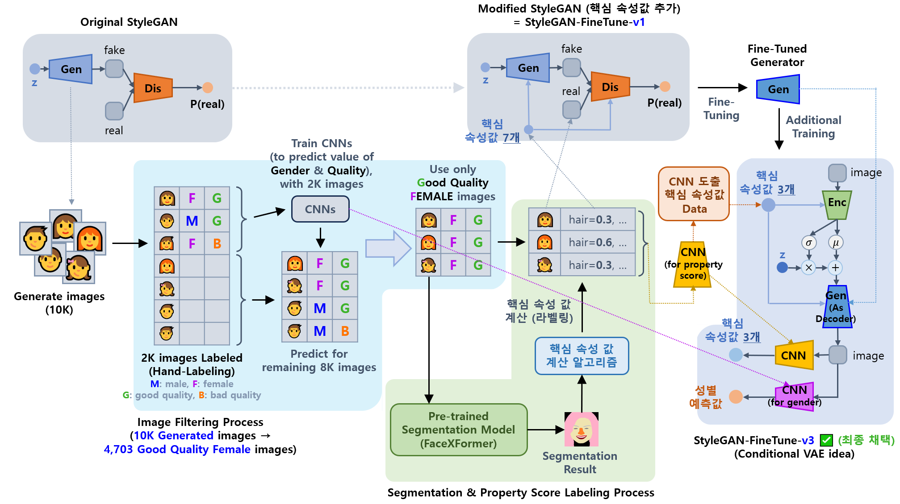

### 1-1. 품질 판단이 필요한 이유

* StyleGAN 으로 생성한 이미지의 약 5% 가 아래와 같이 **저품질의 이미지** 임
  * 저품질 이미지의 경우, 보통 **이미지 상단 부분에 blur** 가 발생하여 어색함 
* 저품질 이미지 생성을 원천 방지하기 위하여, **StyleGAN Fine-Tuning 학습 데이터에서 저품질의 이미지를 제외** 할 필요가 있음

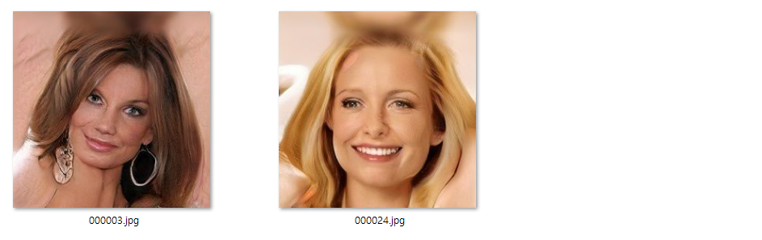

## 2. 핵심 속성 값

* 성별, 이미지 품질을 제외한 나머지 핵심 속성 값들은 아래 표와 같이, **계산된 값을 최종적으로 $N(0, 1^2)$ 로 정규화** 하여 AI 모델에 적용
* 필터링에 사용
  * **해당 값이 모두 threshold 에 도달하는 이미지만** 따로 필터링하여, 나머지 7가지 속성 값을 Pre-trained Segmentation Model 을 이용하여 계산
* StyleGAN-FineTune-v1 ~ v4 사용
  * StyleGAN-FineTune-v1, v2, v3, v4 각 모델의 **최종 버전** 에 해당 속성 값을 사용하는지의 여부
  * ```(v1 사용 여부)``` / ```(v2 사용 여부)``` / ```(v3 사용 여부)``` / ```(v4 사용 여부)``` 형식으로 표기

| 핵심 속성 값 이름                    | 설명                                    | AI 학습에 사용되는 값 범위 or 분포<br>(CNN output, StyleGAN latent vector) | 필터링에 사용 | StyleGAN-FineTune-v1 ~ v4 사용 |
|-------------------------------|---------------------------------------|----------------------------------------------------------------|---------|------------------------------|
| 성별 ```gender```               | 0 (남성) ~ 1 (여성) 의 확률 값                | 0 ~ 1                                                          | ✅       | ✅ / ✅ / ✅ / ✅                |
| 이미지 품질 ```quality```          | 0 (저품질) ~ 1 (고품질) 의 확률 값              | 0 ~ 1                                                          | ✅       | ✅ / ✅ / ✅ / ✅                |
| 눈을 뜬 정도 ```eyes```            | 눈을 크게 뜰수록 값이 큼                        | $N(0, 1^2)$                                                    | ❌       | ✅ / ✅ / ✅ / ✅                |
| 머리 색 ```hair_color```         | 머리 색이 밝을수록 값이 큼                       | $N(0, 1^2)$                                                    | ❌       | ✅ / ✅ / ❌ / ❌                |
| 머리 길이 ```hair_length```       | 머리 길이가 길수록 값이 큼                       | $N(0, 1^2)$                                                    | ❌       | ✅ / ✅ / ❌ / ❌                |
| 입을 벌린 정도 ```mouth```          | 입을 벌린 정도가 클수록 값이 큼                    | $N(0, 1^2)$                                                    | ❌       | ✅ / ✅ / ✅ / ✅                |
| 고개 돌림 ```face_pose```         | 왼쪽 고개 돌림 (-1), 정면 (0), 오른쪽 고개 돌림 (+1) | $N(0, 1^2)$                                                    | ❌       | ✅ / ✅ / ✅ / ✅                |
| 배경색 평균 ```background_mean```  | 이미지 배경 부분 픽셀의 색의 평균값이 클수록 값이 큼        | $N(0, 1^2)$                                                    | ❌       | ✅ / ✅ / ❌ / ❌                |
| 배경색 표준편차 ```background_std``` | 이미지 배경 부분 픽셀의 색의 표준편차가 클수록 값이 큼       | $N(0, 1^2)$                                                    | ❌       | ✅ / ❌ / ❌ / ❌                |

**핵심 속성 값 계산 알고리즘 설명**

| 알고리즘    | 설명                                                                                                                    | 적용 버전                      | 데이터                                                                                                                                                                                                                                                                                                   |
|---------|-----------------------------------------------------------------------------------------------------------------------|----------------------------|-------------------------------------------------------------------------------------------------------------------------------------------------------------------------------------------------------------------------------------------------------------------------------------------------------|
| 1차 알고리즘 | - 눈을 뜬 정도, 머리 색, 머리 길이 등을 **비교적 단순한 계산** 으로 산출                                                                        | StyleGAN-FineTune-v1       | - [필터링된 4,703 장에 대한 속성값](segmentation/property_score_results/all_scores.csv)                                                                                                                                                                                                                          |
| 2차 알고리즘 | - **1차 알고리즘의, 핵심 속성 값 계산에 잘못된 이미지를 사용한 버그 해결**<br>- 배경 색 평균, 표준편차를 제외한 5가지 속성값을 **고개를 돌린 경우를 반영하여 보다 정교한 알고리즘** 으로 산출 | StyleGAN-FineTune-v2,v3,v4 | - [필터링된 4,703 장에 대한 속성값](segmentation/property_score_results/all_scores_v2.csv)<br>- [필터링된 4,703 장에 대한 속성값**을 학습한 CNN에 의해 도출된** 속성값](segmentation/property_score_results/all_scores_v2_cnn.csv)<br>- [원본 속성값 vs. CNN 도출 속성값 비교](segmentation/property_score_results/compare/all_scores_v2_vs_cnn.csv) |

### 2-1. 핵심 속성 값 계산 알고리즘 (1차 알고리즘, for StyleGAN-FineTune-v1)

* Segmentation 결과를 바탕으로 다음과 같이 **성별, 이미지 품질을 제외한 7가지 핵심 속성 값들을 계산**
  * 계산 대상 핵심 속성 값 
    * 눈을 뜬 정도, 머리 색, 머리 길이, 입을 벌린 정도, 얼굴의 위치, 배경색 평균, 배경색 표준편차
  * 점수 계산 완료 후, **모든 이미지에 대해 각 속성 종류별로 그 값들을 위 표에 따라 [Gaussian Normalization](https://github.com/WannaBeSuperteur/AI-study/blob/main/AI%20Basics/Data%20Science%20Basics/%EB%8D%B0%EC%9D%B4%ED%84%B0_%EC%82%AC%EC%9D%B4%EC%96%B8%EC%8A%A4_%EA%B8%B0%EC%B4%88_Normalization.md#2-2-standarization-z-score-normalization) 적용**
    * 예를 들어, 모든 이미지에 대한 머리 색의 값이 ```[100, 250, 120, 180, 210]``` 인 경우, 이를 Gaussian Normalization 하여 ```[-1.294, 1.402, -0.935, 0.144, 0.683]``` 으로 정규화
  * Segmentation 결과는 **224 x 224 로 resize 된 이미지** 임
* 적용 범위
  * **StyleGAN-FineTune-v1**
* 구현 코드
  * [compute_property_scores.py](compute_property_scores.py) 

**1. 눈을 뜬 정도 (eyes)**

* Segmentation 결과에서 왼쪽 눈과 오른쪽 눈에 해당하는 픽셀들을 각각 찾아서,
* 그 y좌표의 최댓값과 최솟값의 차이를 눈 영역의 높이, 즉 눈을 뜬 정도로 간주

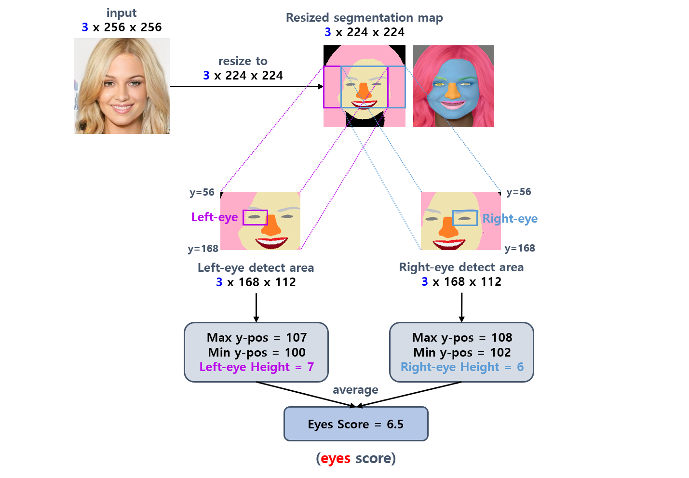

**2. 머리 색 (hair_color), 머리 길이 (hair_length)**

* 머리 길이의 경우,
  * Segmentation 결과에서 **hair 영역이 맨 아래쪽 row (224 번째 row) 까지** 있으면,
  * 그 아래쪽의 머리 길이를 **맨 아래쪽 row (1 x 224) 의 hair 영역 픽셀 개수** 를 근거로 예측하는 알고리즘 적용

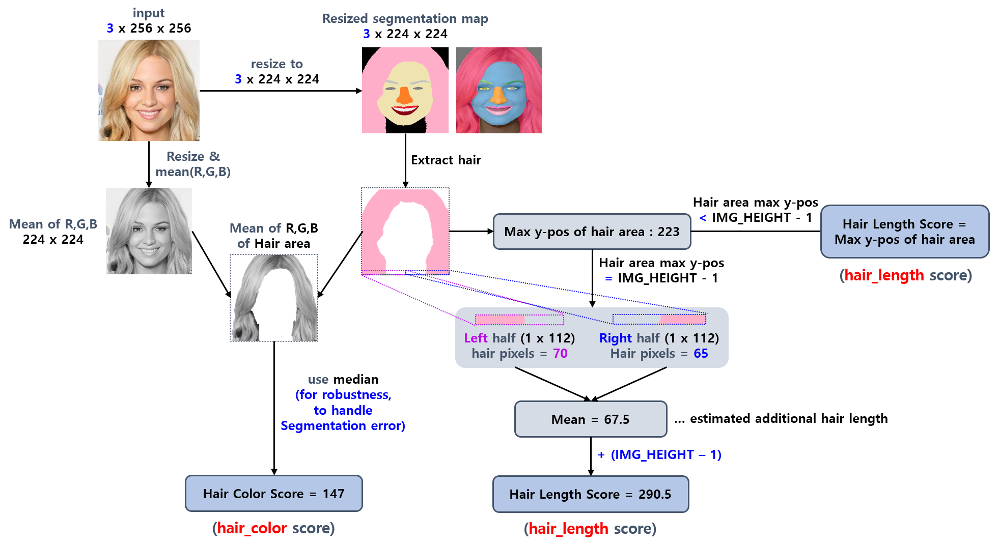

**3. 입을 벌린 정도 (mouth), 고개 돌림 (pose)**

* 고개를 돌리면 코에 해당하는 픽셀의 x 좌표 및 y 좌표 분포에도 영향을 미치므로, 그 상관계수를 이용
  * 코에 해당하는 x 좌표와 y 좌표의 **상관계수가 +** 이면 고개 돌림 방향은 **왼쪽 (Pose Score < 0)**
  * 코에 해당하는 x 좌표와 y 좌표의 **상관계수가 -** 이면 고개 돌림 방향은 **오른쪽 (Pose Score > 0)**

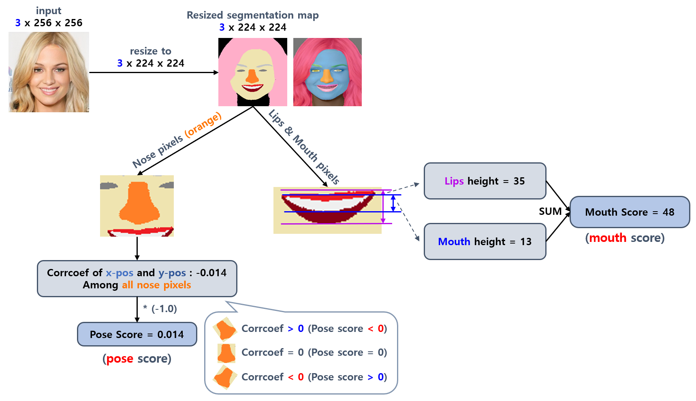

**4. 배경색 평균 (background_mean), 배경색 표준편차 (background_std)**

* 이미지 위쪽 절반의 픽셀 중 배경에 해당하는 픽셀 값의 R,G,B 평균값에 대해,
* 그 값들 중 **상위 5% 및 하위 5%를 제외한 90% (잘못된 Segmentation 에 Robust 하도록)** 의 평균 및 표준편차를 각각 의미

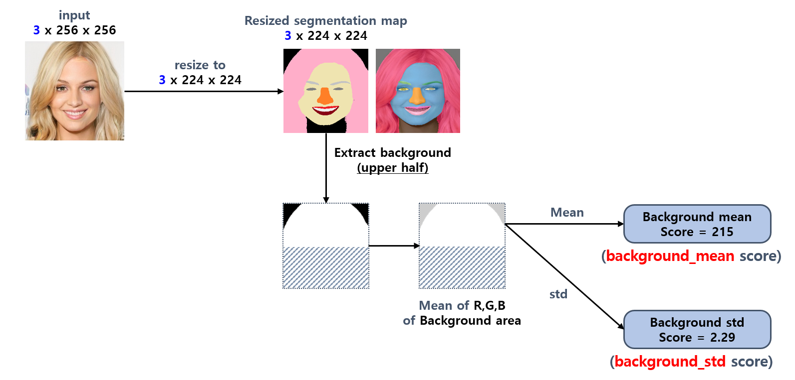

### 2-2. 핵심 속성 값 계산 알고리즘 (2차 알고리즘, for StyleGAN-FineTune-v2, v3, v4)

* Segmentation 결과를 바탕으로 다음과 같이 **성별, 이미지 품질을 제외한 7가지 핵심 속성 값들을 계산**
  * StyleGAN-FineTune-v1 에 적용된 핵심 속성 값과 동일한 종류, 동일한 Segmentation Result 를 이용
  * 배경색 평균, 배경색 표준편차를 제외한 나머지 5가지 핵심 속성 값 계산 알고리즘 개선
  * 🚨 핵심 속성 값 계산 시 **Segmentation 결과에서 Face Detect 처리된 224 x 224 이미지** 가 아닌, **원본 256 x 256 이미지를 224 x 224 로 resize 한 이미지를 이용** 하는 버그 수정
* 적용 범위
  * **StyleGAN-FineTune-v2**
  * **StyleGAN-FineTune-v3**
  * **StyleGAN-FineTune-v4**
* 구현 코드
  * [compute_property_scores_v2.py](compute_property_scores_v2.py) 

**1. 눈을 뜬 정도 (eyes), 고개 돌림 (pose)**

* 양쪽 눈의 무게중심의 좌표를 이용하여 고개 돌림 각도 계산 → **pose score** 산출
* 해당 각도를 각 눈의 기울기로 간주하여, 눈을 뜬 높이를 계산 → **eyes score** 산출

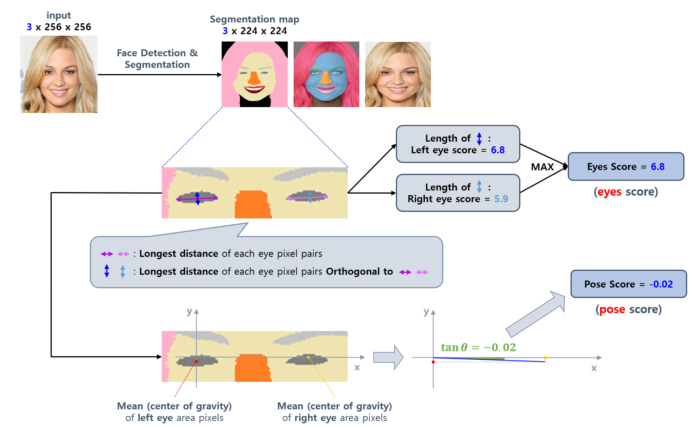

**2. 머리 색 (hair_color), 머리 길이 (hair_length)**

* 이미지의 모든 hair pixel 의 R,G,B 성분의 평균값 중 **상위 10% 및 하위 10% 를 cutoff** 한 **나머지 80%의 평균값** 으로 머리 색 점수 계산
* 이미지의 위쪽 1/4 부분을 제외한 나머지 y좌표 중, **hair 에 해당하는 pixel 이 일정 개수 이상인 y좌표의 개수** 를 이용하여 머리 길이 계산

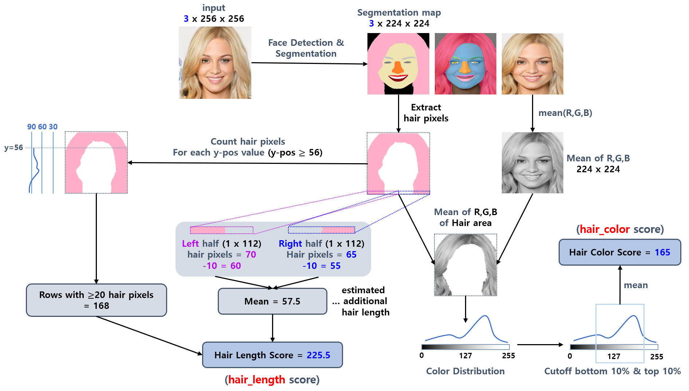

**3. 입을 벌린 정도 (mouth)**

* 입 안쪽 및 입술에 해당하는 픽셀 중 **입 안쪽 픽셀이 차지하는 비율**, 즉 **(입 안쪽 픽셀 개수) / {(입 안쪽 픽셀 개수) + (입술 픽셀 개수)}** 로 입을 벌린 정도를 계산

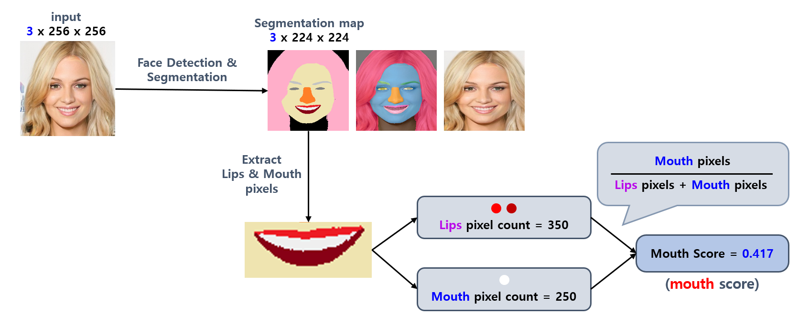

## 3. 사용 모델 설명

| 모델                      | 모델 분류                          | 사용 목적                                                       |
|-------------------------|--------------------------------|-------------------------------------------------------------|
| **Original** StyleGAN   | Image Generation Model         | StyleGAN 의 Fine-Tuning 에 사용할 후보 이미지 생성                      |
| CNN (1)                 |                                | StyleGAN Fine-Tuning 후보 이미지의 필터링                            |
| FaceXFormer             | Pre-trained Segmentation Model | 필터링된 후보 이미지의 핵심 속성 값 추출                                     |
| **Fine-Tuned** StyleGAN | Image Generation Model         | **Oh-LoRA (오로라) 이미지 생성용 최종 모델**                             |
| CNN (2)                 |                                | StyleGAN 생성 이미지의 핵심 속성 값**만** 계산 **(FaceXFormer 에 비해 간소화)** |

### 3-1. Image Generation Model (StyleGAN)

[Implementation & Pre-trained Model Source : GenForce GitHub](https://github.com/genforce/genforce/tree/master) (MIT License)

| 모델                                    | 설명                                                                                               | StyleGAN Style Mixing | Property Score 데이터                                                   | 여성 이미지 생성                         | 핵심 속성값 오류 없음  | 핵심 속성값 의미 반영 생성 |
|---------------------------------------|--------------------------------------------------------------------------------------------------|-----------------------|----------------------------------------------------------------------|-----------------------------------|---------------|-----------------|
| Original StyleGAN                     | [GenForce GitHub](https://github.com/genforce/genforce/tree/master) 에서 다운받은 Pre-trained StyleGAN | ✅ (90% 확률)            |                                                                      | ❌ (**여성 55.6%** = 1,112 / 2,000)  | ❌             | ❌               |
| StyleGAN-FineTune-v1                  | Original StyleGAN 으로 생성한 여성 이미지 4,703 장으로 Fine-Tuning 한 StyleGAN                                 | ✅ (90% 확률)            | **1차 알고리즘** (for FineTune-v1) & Score                                | ✅ (**여성 93.7%** = 281 / 300)      | ❌             | ❌               |
| StyleGAN-FineTune-v2<br>**(❌ 학습 불가)** | StyleGAN-FineTune-v1 을 **CNN을 포함한 신경망** 으로 추가 학습                                                 | ❌ (미 적용)              | **2차 알고리즘** (for FineTune-v2,v3) & Score 를 학습한 **CNN에 의해 도출된** Score | ❓ (남성 이미지 생성 확률 증가)               | ✅             | ❌               |
| StyleGAN-FineTune-v3<br>**(✅ 최종 채택)** | StyleGAN-FineTune-v1 을 **Conditional VAE** 의 Decoder 로 사용하여 추가 학습                                | ❌ (미 적용)              | **2차 알고리즘** (for FineTune-v2,v3) & Score 를 학습한 **CNN에 의해 도출된** Score | ✅ (남성 이미지 생성 방지를 위한 Loss Term 사용) | ✅ (만족할 만한 수준) | ✅ (학습 초중반)      |
| StyleGAN-FineTune-v4                  | StyleGAN-FineTune-v1 을 **Style Mixing 미 적용** 하여 재 학습                                             | ❌ (미 적용)              | **2차 알고리즘** (for FineTune-v2,v3) & Score 를 학습한 **CNN에 의해 도출된** Score | ❓ (남성 이미지 생성 확률 증가 추정)            | ❌             | ❌               |

* [StyleGAN Style Mixing](https://github.com/WannaBeSuperteur/AI-study/blob/main/Paper%20Study/Vision%20Model/%5B2025.04.09%5D%20A%20Style-Based%20Generator%20Architecture%20for%20Generative%20Adversarial%20Networks.md#3-1-style-mixing-mixing-regularization)
  * 적용 시, 동일한 latent vector z 와 동일한 property label 에 대해서도 **서로 다른 인물이나 특징의 이미지가 생성** 될 수 있음
  * 이는 핵심 속성 값을 학습하는 데 지장을 줄 수 있음
* 핵심 속성값 오류
  * 핵심 속성 값 (성별, 이미지 품질 제외 7가지) 이 달라지면 **동일한 인물의 특징이 달라지는 것이 아닌, 아예 다른 인물이 생성되는** 것
* 핵심 속성값 의미 반영 생성
  * 핵심 속성값의 의미 (눈을 뜬 정도, 입을 벌린 정도, 머리 색, 머리 길이, 배경 정보 등) 를 반영하여 인물 이미지가 생성되는지의 여부
* Fine-Tuned 모델 별 핵심 속성 값 사용

| Model                                 | 사용 핵심 속성 값 (성별, 이미지 품질 제외)                   |
|---------------------------------------|----------------------------------------------|
| StyleGAN-FineTune-v1                  | **7개** 모두                                    |
| StyleGAN-FineTune-v2<br>**(❌ 학습 불가)** | 배경 색 표준편차 (background std) 를 제외한 **6개**      |
| StyleGAN-FineTune-v3<br>**(✅ 최종 채택)** | ```eyes```, ```mouth```, ```pose``` 의 **3개** |
| StyleGAN-FineTune-v4                  | ```eyes```, ```mouth```, ```pose``` 의 **3개** |

* 전체 모델 개념도

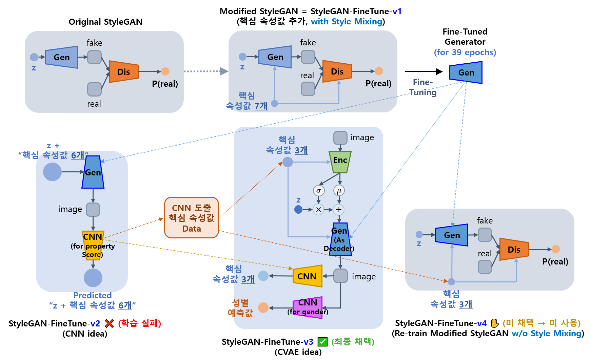

----

**1. Original Model**

* Generator
  * ```stylegan/stylegan_generator.py```
* Discriminator
  * ```stylegan/stylegan_discriminator.py```
* Model Save Path
  * ```stylegan/stylegan_model.pth``` (**Original GAN**, including Generator & Discriminator)
    * original model from [MODEL ZOO](https://github.com/genforce/genforce/blob/master/MODEL_ZOO.md) > StyleGAN Ours > **celeba-partial-256x256**
* Study Doc
  * [Study Doc (2025.04.09)](https://github.com/WannaBeSuperteur/AI-study/blob/main/Paper%20Study/Vision%20Model/%5B2025.04.09%5D%20A%20Style-Based%20Generator%20Architecture%20for%20Generative%20Adversarial%20Networks.md)
* 모델 구조 정보
  * [Generator 모델](model_structure_pdf/original_pretrained_generator.pdf)
  * [Discriminator 모델](model_structure_pdf/original_pretrained_discriminator.pdf)

----

**2. Modified Fine-Tuned StyleGAN (v1)**

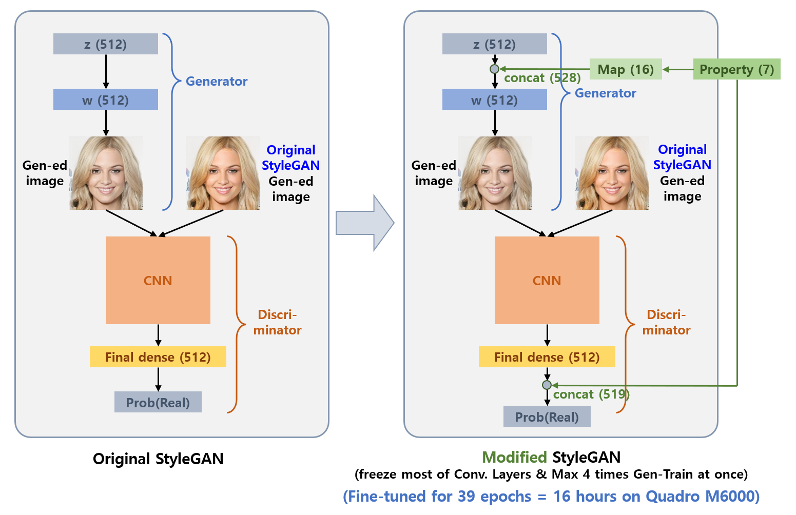

* Overview (How to run Fine-Tuning)
  * **핵심 속성 값 (Property) 에 해당하는 size 7 의 Tensor** 를 Generator 의 입력 부분 및 Discriminator 의 Final Dense Layer 부분에 추가
  * Generator 와 Discriminator 의 **Conv. Layer 를 Freeze 시키고, Dense Layer 들만 추가 학습**
  * Generator Loss 가 Discriminator Loss 의 2배 이상이면, Discriminator 를 한번 학습할 때 **Generator 를 최대 4번까지 연속 학습** 하는 메커니즘 적용 
* Generator
  * ```stylegan_modified/stylegan_generator.py```
* Discriminator
  * ```stylegan_modified/stylegan_discriminator.py```
* Model Save Path
  * ```stylegan_modified/stylegan_gen_fine_tuned_v1.pth``` (**Generator** of **Modified Fine-Tuned** StyleGAN)
  * ```stylegan_modified/stylegan_dis_fine_tuned_v1.pth``` (**Discriminator** of **Modified Fine-Tuned** StyleGAN)
  * 모델 생성 직후 이름인 ```... fine_tuned.pth``` 에서 ```... fine_tuned_v1.pth``` 로 각각 변경
* 핵심 속성 값 학습 실패 원인 **(추정)**
  * Property Score 계산 오류 (1차 알고리즘 자체의 오류 & 픽셀 색 관련 속성의 경우 이미지를 잘못 사용하여 픽셀 매칭 오류)
  * [VAE (Variational Auto-Encoder)](https://github.com/WannaBeSuperteur/AI-study/blob/main/Generative%20AI/Basics_Variational%20Auto%20Encoder.md) 와 달리 [GAN](https://github.com/WannaBeSuperteur/AI-study/blob/main/Generative%20AI/Basics_GAN.md) 은 잠재 변수 학습에 중점을 두지 않음
  * StyleGAN 의 **Style Mixing** 메커니즘으로 인해 동일한 latent vector, label 에 대해서도 **서로 다른 이미지가 생성되어 학습에 지장**
* 모델 구조 정보
  * [Generator 모델](model_structure_pdf/restructured_generator%20(AFTER%20FREEZING).pdf)
  * [Discriminator 모델](model_structure_pdf/restructured_discriminator%20(AFTER%20FREEZING).pdf)
* 학습 코드
  * [run_stylegan_fine_tuning.py **(entry)**](run_stylegan_fine_tuning.py)
  * [fine_tuning.py **(main training)**](stylegan_modified/fine_tuning.py)

----

**3. Additional Fine-Tuned StyleGAN Generator (v2, CNN idea, ❌ Train Failed)**

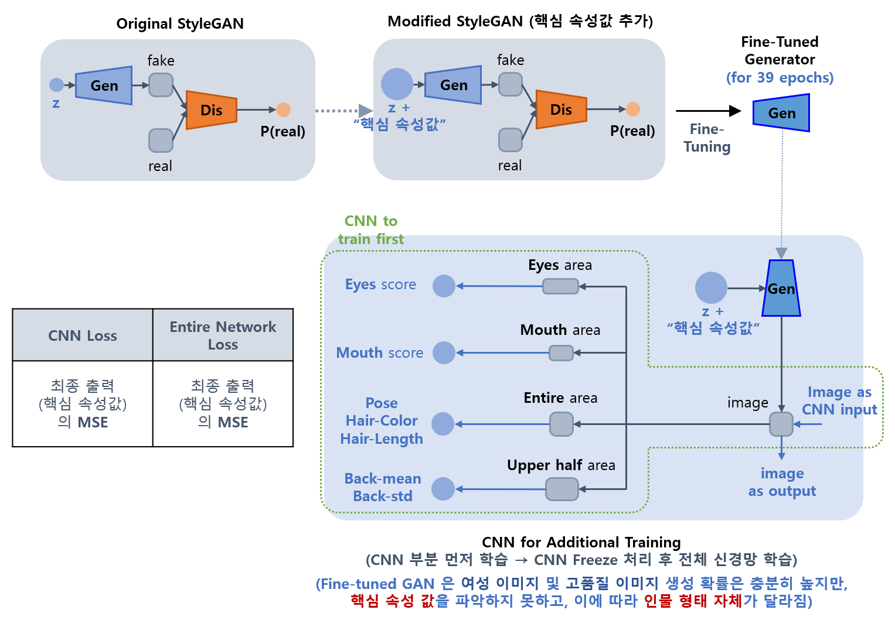

* Overview (How to run Fine-Tuning)
  * 이미지로부터 Property Score 를 예측하는 Conv. NN (위 그림의 녹색 점선으로 표시한 부분) 을 먼저 학습
    * CNN 의 학습 데이터는 Original StyleGAN 으로 생성한 10,000 장 이미지 중 필터링된 여성 이미지 4,703 장 
  * 해당 CNN 을 Freeze 시킨 후, Fine-Tuned Generator (v1) 을 포함한 전체 신경망을 학습
* Generator
  * ```stylegan_modified/stylegan_generator_v2.py```
* Model Save Path
  * ```stylegan_modified/stylegan_gen_fine_tuned_v2.pth``` (Generator Model)
  * ```stylegan_modified/stylegan_gen_fine_tuned_v2_cnn.pth``` (**CNN** for Generator Model)
* 학습 실패 분석
  * CNN 을 완전히 Freeze 하고, StyleGAN 을 Dense Layer 를 제외한 모든 Layer 를 Freeze 하는 것보다, **모든 모델의 모든 레이어를 학습 가능하게 해야 학습이 잘 진행됨**
  * 처음에는 Fixed Z + Label 로 학습하고 점차적으로 강한 Noise 를 추가하는 식으로 학습해도 **학습이 거의 진행되지 않음**
* 모델 구조 정보
  * [전체 모델 (StyleGAN-FineTune-v2)](model_structure_pdf/stylegan_finetune_v2.pdf)
* 학습 코드
  * [run_stylegan_fine_tuning_v2.py **(entry)**](run_stylegan_fine_tuning_v2.py)
  * [stylegan_generator_v2.py **(main training)**](stylegan_modified/stylegan_generator_v2.py)

----

**4. Additional Fine-Tuned StyleGAN Generator (v3, Conditional VAE idea, ✅ Finally Decided to Use)**

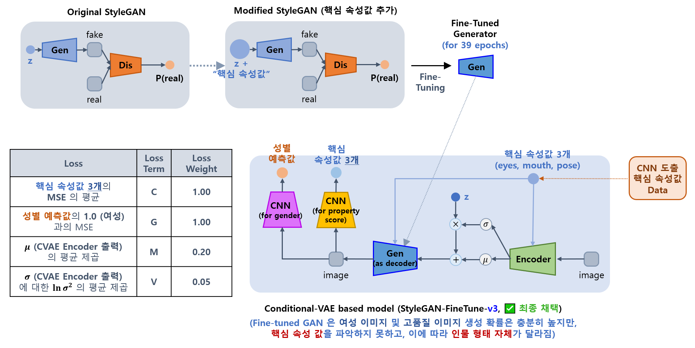

* Overview (How to run Fine-Tuning)
  * Fine-Tuned Generator (v1) 을 **Conditional [VAE](https://github.com/WannaBeSuperteur/AI-study/blob/main/Generative%20AI/Basics_Variational%20Auto%20Encoder.md)** 의 Decoder 로 사용하여, Conditional VAE 에 기반한 모델 학습
  * 추가 사용 모델
    * Property Score 계산용 Conv. NN (Fine-Tuned Generator v2 에서 사용한)
    * Gender Score 계산용 Conv. NN
* Generator
  * ```stylegan_modified/stylegan_generator_v3.py```
* Model Save Path
  * ```stylegan_modified/stylegan_gen_fine_tuned_v3.pth``` (Generator Model)
  * ```stylegan_modified/stylegan_gen_fine_tuned_v3_encoder.pth``` (**Encoder of Conditional VAE** for Generator Model)
* 모델 구조 정보
  * [전체 모델 (StyleGAN-FineTune-v3)](model_structure_pdf/stylegan_finetune_v3.pdf)
* 학습 코드
  * [run_stylegan_fine_tuning_v3.py **(entry)**](run_stylegan_fine_tuning_v3.py)
  * [stylegan_generator_v3.py **(main training)**](stylegan_modified/stylegan_generator_v3.py)

<details><summary>모델 상세 설명 (Trainable/Freeze 상세, Loss 등) [ 펼치기 / 접기 ]</summary>

**4-1. Loss Function**

* 아래 표에 설명된 4가지 Loss 를 가중 합산한 **$C + G + 0.2 \times M + 0.05 \times V$ 를 전체 모델의 Loss Function** 로 사용
* MSE = [Mean Squared Error](https://github.com/WannaBeSuperteur/AI-study/blob/main/AI%20Basics/Deep%20Learning%20Basics/%EB%94%A5%EB%9F%AC%EB%8B%9D_%EA%B8%B0%EC%B4%88_Loss_function.md#2-1-mean-squared-error-mse)

| Loss                                                   | Loss Term | Loss 가중치 | 사용 의도                                                                                                                                                                                     |
|--------------------------------------------------------|-----------|----------|-------------------------------------------------------------------------------------------------------------------------------------------------------------------------------------------|
| 핵심 속성값 3개의 MSE 평균                                      | C         | 1.00     | 핵심 속성값 오차를 줄여서, **Generator 에 핵심 속성값을 입력하면 그 속성값에 맞는 이미지가 생성** 되게 함                                                                                                                       |
| 성별 예측값의 1.0 (여성) 과의 MSE                                | G         | 1.00     | 남성 이미지가 생성되는 것을 방지                                                                                                                                                                        |
| $\mu$ (CVAE Encoder 출력) 의 제곱의 평균                       | M         | 0.20     | 생성되는 이미지가 **평균적인 범위에서 너무 멀어지는** 것을 방지                                                                                                                                                     |
| $\sigma$ (CVAE Encoder 출력) 에 대한 $ln \sigma^2$ 의 제곱의 평균 | V         | 0.05     | 이미지 생성을 위해 Generator 에 입력되는 z vector (512 dim) 가 달라지면 **생성되는 이미지의 스타일 역시 최소한의 다양성이 보장되도록** 하기 위함<br>- z vector 샘플링을 위한 **표준편차** $\sigma$ 가 **1 보다 매우 작아지면 (= 0 에 가까우면)** 이미지 생성의 다양성이 떨어짐 |

**4-2. Trainable / Freeze 설정 & Learning Rate**

* CVAE = Conditional [VAE (Variational Auto-Encoder)](https://github.com/WannaBeSuperteur/AI-study/blob/main/Generative%20AI/Basics_Variational%20Auto%20Encoder.md)
* 모든 Network 의 모든 Trainable Layer 에 대해, Learning Rate scheduler 로 [Cosine Annealing Scheduler](https://github.com/WannaBeSuperteur/AI-study/blob/main/AI%20Basics/Deep%20Learning%20Basics/%EB%94%A5%EB%9F%AC%EB%8B%9D_%EA%B8%B0%EC%B4%88_Learning_Rate_Scheduler.md#2-6-cosine-annealing-scheduler) (with ```T_max``` = 10) 사용 

| Network                                                   | Trainable / Frozen                                                    | Learning Rate    |
|-----------------------------------------------------------|-----------------------------------------------------------------------|------------------|
| StyleGAN Generator (= CVAE Decoder)                       | - $z → w$ mapping 만 Trainable<br>- **나머지 DeConv. Layer 등은 모두 Frozen** | 0.0001 (= 1e-4)  |
| CVAE Encoder                                              | - 모든 레이어 Trainable                                                    | 0.00001 (= 1e-5) |
| [CNN (for Gender Score)](#3-2-cnn-model-성별-이미지-품질)        | - **모든 레이어 Frozen**                                                   | -                |
| [CNN (for Property Score)](#3-3-cnn-model-나머지-핵심-속성-값-7개) | - **모든 레이어 Frozen**                                                   | -                |

**4-3. 학습 과정**

* 결론적으로, **학습 초중반, 아직 충분히 학습되지 않은 CVAE Encoder 에 의해 도출된 $\mu$ 값은 서로 다른 이미지에 대해서도 비슷하지만, 속성 값이 어느 정도 학습되었을 때** 의 생성 결과물은 의도한 대로 나온다.
  * 이 '학습 초중반'의 시점 구간을 최대한 늘리기 위해 CVAE Encoder 의 Learning Rate 를 1e-5 로 Generator 에 비해 감소시켰다.
* 이와 같이 구현했을 때, 다음과 같은 특징을 갖는다.
  * 학습 초중반에는 **서로 다른 이미지에 대해서도 CVAE Encoder 에 의해 도출된 $\mu$ 값이 큰 차이가 없음**
  * 이때는 Decoder (Generator) 에 **아무 이미지** 에 의해 도출된 $\mu$, $\sigma$ 값으로 $z$ 를 샘플링해도, **속성 값은 어느 정도 학습** 되었으므로, **의도한 대로 Property Score 에 맞게 이미지가 생성됨** 
  * 학습 중반을 넘어가면 CVAE Encoder 가 충분히 학습되어, **$\mu$ 값의 영향이 커지면 의도한 대로 생성이 어려워진다.**

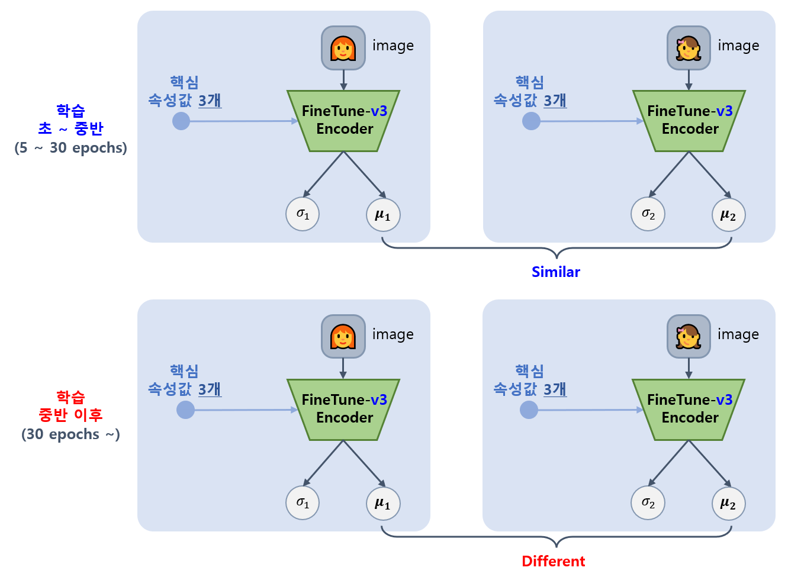

**4-4. 이미지 생성 테스트**

위와 같은 학습 과정의 특징 때문에, 다음과 같이 **이미지 생성 테스트** 를 실시한다.

* 기본 컨셉
  * 각 epoch 및 z 값 별로, 해당 z 값을 이용해 Generator 가 생성한 이미지에 대해 계산된 속성 값과 의도한 속성 값이 **충분히 유사한지** 판단
  * 충분히 유사하다고 판단된 z 값이 **1개라도 있는** epoch 의 경우 **합격 판정 및 checkpoint 모델 저장**

* 매 epoch 마다, 총 30 개의 z 값 각각에 대해 2 개의 eyes score, 5 개의 mouth score, 5 개의 pose score 조합 (총 50 장) 이미지 생성
  * 즉, 매 epoch 마다 30 x (2 x 5 x 5) = 1,500 장 생성

| Property Score | 조합<br>($N(0, 1^2)$ 로 정규화한, 실제 모델이 학습하는 값 기준) |
|----------------|----------------------------------------------|
| eyes score     | -1.8, +1.8                                   |
| mouth score    | -1.2, -0.6, 0.0, +0.8, +1.6                  |
| pose score     | -1.2, 0.0, +1.2, +2.4, +3.6                  |

* 각 z 값에 대해 **생성된 이미지가 Property Score 가 잘 반영되었는지** 판단 
  * z 값은 **해당 epoch 의 마지막 30개 batch 의 이미지** 를 Encoder 에 입력하여 추출된 $\mu$, $\sigma$ 값에 의해 샘플링
  * 각 z 값에 대해, **다음 총 6 (= 3 x 2) 가지 조건을 모두 만족시키면 합격 판정**
    * 의도한 score 와, 실제 생성된 이미지에 대해 Property Score CNN 이 계산한 score 를 비교
    * 이 비교를 통해 양쪽의 상관계수 및 [Mean Absolute Error (MAE)](https://github.com/WannaBeSuperteur/AI-study/blob/main/AI%20Basics/Deep%20Learning%20Basics/%EB%94%A5%EB%9F%AC%EB%8B%9D_%EA%B8%B0%EC%B4%88_Loss_function.md#2-3-mean-absolute-error-mae) 를 계산 
  * 매 epoch 마다 합격 판정인 z 가 하나라도 있으면 **해당 epoch 를 합격 판정하고 모델 checkpoint 저장**

| Property Score | 상관계수 조건 | MAE 조건 |
|----------------|---------|--------|
| eyes score     | ≥ 0.77  | ≤ 1.0  |
| mouth score    | ≥ 0.85  | ≤ 0.6  |
| pose score     | ≥ 0.82  | ≤ 1.4  |

* 구현 코드
  * [stylegan_generator_v3_gen_model.py](stylegan_modified/stylegan_generator_v3_gen_model.py) > ```test_create_output_images``` 함수 (Line 486)
* 실제 테스트 결과
  * epoch 별 합격 판정된 z vector 의 개수 추이 [(상세 기록)](https://github.com/WannaBeSuperteur/AI_Projects/tree/3f3bbac2c7876eaa1f5252e6b3097bd1dc05c6ff/2025_04_08_OhLoRA/stylegan_and_segmentation/stylegan_modified/inference_test_during_finetuning_v3)

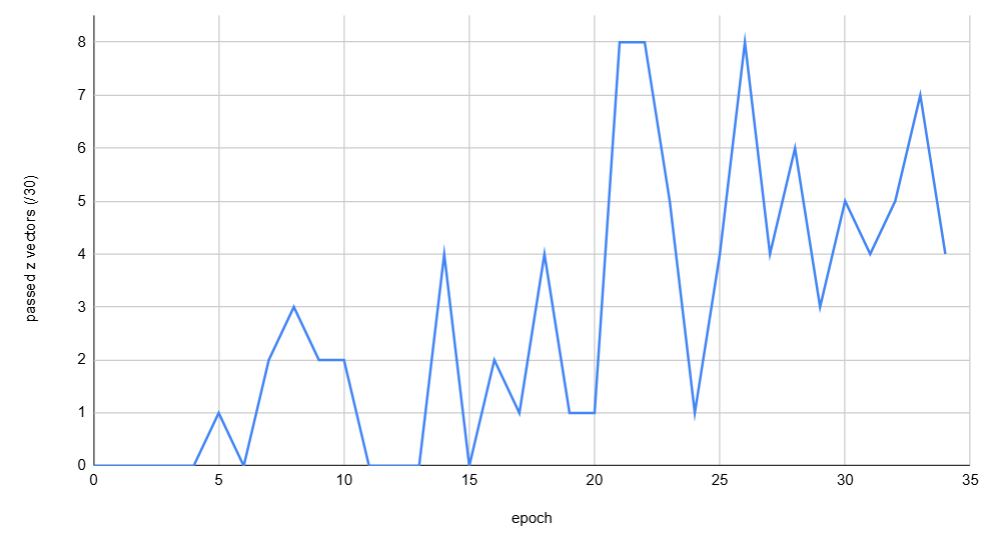

**4-5. Q & A**

* StyleGAN-FineTune-v3 에서 머리 색, 머리 길이, 배경 색을 제외하고 **속성 값 3개만 사용** 한 이유는?
  * 머리 색, 머리 길이, 배경 색은 Property Score CNN 이 **이미지 전체 또는 상/하단 절반이라는 큰 부분** 을 보고 판단
  * 이들 큰 부분끼리, 이들 부분과 ```eyes```, ```mouth```, ```pose``` Score 을 계산하는 작은 부분이 **영역이 중복되어 학습에 지장** 을 줄 수 있을 것으로 추정
* [Gender 출력값이 0 ~ 1 임에도 불구하고](https://github.com/WannaBeSuperteur/AI-study/blob/main/AI%20Basics/Deep%20Learning%20Basics/%EB%94%A5%EB%9F%AC%EB%8B%9D_%EA%B8%B0%EC%B4%88_Loss_Function_Misuse.md), Gender 에 대한 Loss Function 으로 MSE 를 적용한 이유는?
  * 여성 이미지 생성 비율이 높아지도록 학습하는 것이 목적
  * 개발 목적상, Classification 정확도를 **100% 에 가깝게 높일 필요는 없다** 고 판단
  * 다른 Loss Term 들과의 통일성을 고려한 것도 있음

**4-6. Oh-LoRA 캐릭터 최종 채택**

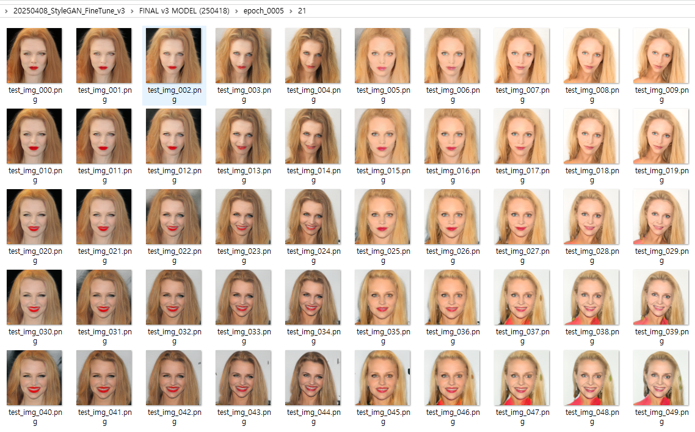

* 2025.04.18 생성
* **6 번째 epoch (index = 5)** 의 **22 번째 (index = 21)** z 값 [(csv 보기)](stylegan_modified/test_z_vector_0005.csv) 이용

| Property Score | 상관계수              | MAE              |
|----------------|-------------------|------------------|
| eyes score     | **0.8928** ≥ 0.77 | **0.9342** ≤ 1.0 |
| mouth score    | **0.8582** ≥ 0.85 | **0.4452** ≤ 0.6 |
| pose score     | **0.9318** ≥ 0.82 | **1.2365** ≤ 1.4 |

</details>

----

**5. Additional Fine-Tuned StyleGAN Generator (v4, Re-train StyleGAN-FineTune-v1)**

* Overview (How to run Fine-Tuning)
  * StyleGAN-FineTune-v1 (trained for 39 epochs = 16 hours) 을 **Style Mixing 없이 추가 학습**
  * 핵심 속성 값을 기존 StyleGAN-FineTune-v1 의 7개에서 **eyes, mouth, pose score 의 3개로 축소**
  * **79 epochs, 45 hours (2025.04.18 23:00 - 04.20 20:00) 학습 진행** 
* Generator
  * ```stylegan_modified/stylegan_generator.py```
* Model Save Path
  * ```stylegan_modified/stylegan_gen_fine_tuned_v4.pth``` (**Generator** Model)
  * ```stylegan_modified/stylegan_dis_fine_tuned_v4.pth``` (**Discriminator** Model)
* 모델 구조 정보
  * [Generator of StyleGAN-FineTune-v4](model_structure_pdf/stylegan_finetune_v4_generator.pdf)
  * [Discriminator of StyleGAN-FineTune-v4](model_structure_pdf/stylegan_finetune_v4_discriminator.pdf)
* 학습 코드
  * [run_stylegan_fine_tuning_v4.py](run_stylegan_fine_tuning_v4.py)
* 추가 사항
  * StyleGAN-FineTune-**v3** 이 아닌 StyleGAN-FineTune-**v1 을 추가 Fine-Tuning** 하는 이유
    * StyleGAN-FineTune-v3 은 **Conditional VAE 의 Encoder 에서 출력한 $\mu$, $\sigma$ 근처의 z vector** 에서만 의도한 대로 Property Score 가 반영된 이미지가 생성됨
    * 즉, **Conditional VAE 와는 결이 맞지 않음**

<details><summary>모델 상세 학습 로그 [ 펼치기 / 접기 ]</summary>

* 매 epoch, 20 batch 마다 **"4-4. 이미지 생성 테스트"** 와 같은 방법으로 테스트를 실시하여, Corr-coef 및 MAE 계산
* 실험 결과
  * 일부 Property score 가 학습이 진행됨에 따라 Corr-coef 가 점차 증가하고 MAE 가 점차 감소하는 모습을 보임
  * 단, **만족할 만한 수준에는 이르지 못함**
  * [학습 로그 (csv)](stylegan_modified/train_log_v4_errors.csv)

| Property Score | Corr-coef trend (moving avg.)<br>가로축 : 학습 진행도 (epoch) | MAE trend (moving avg.)<br>가로축 : 학습 진행도 (epoch) |
|----------------|-------------------------------------------------------|-------------------------------------------------|
| eyes           | 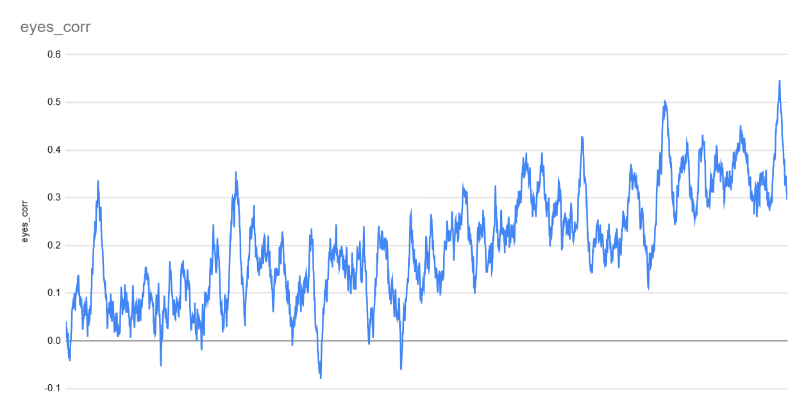                  | 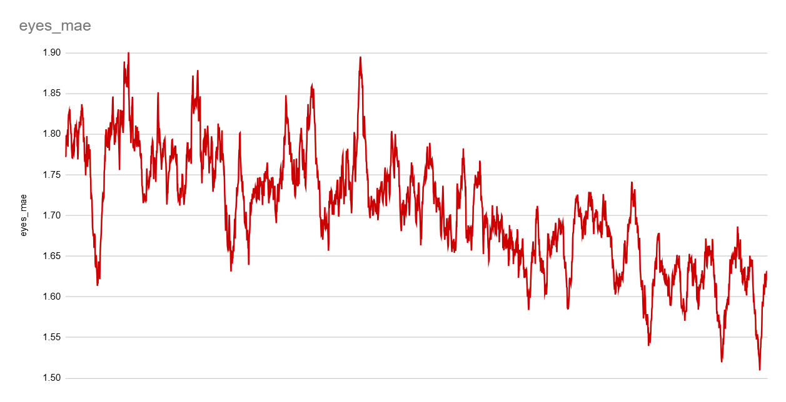            |
| mouth          | 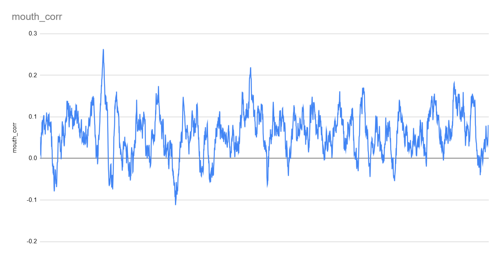                  | 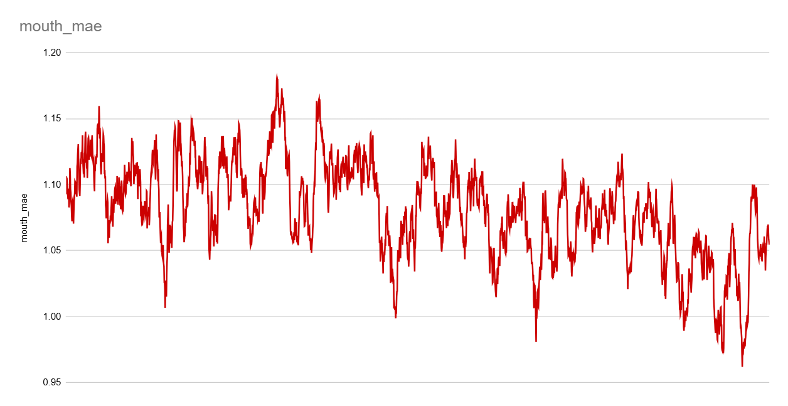            |
| pose           | 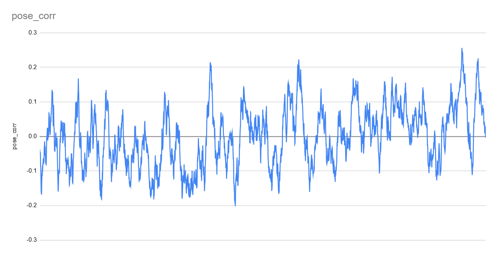                  | 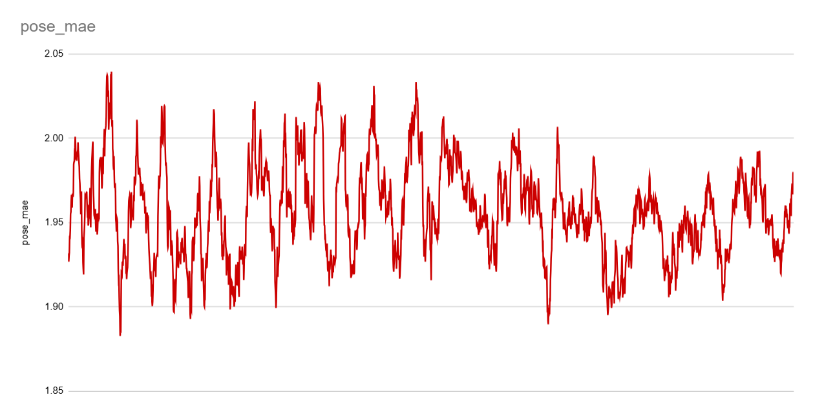            |

</details>

### 3-2. CNN Model (성별, 이미지 품질)

* CNN pipeline Overview

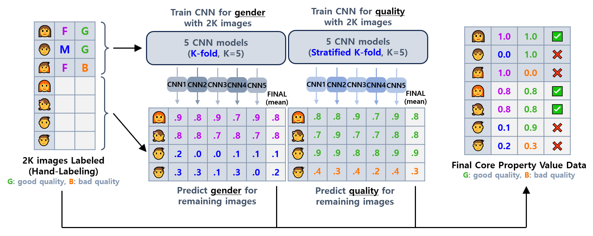

* Training Data
  * [```cnn/synthesize_results_quality_and_gender.csv```](cnn/synthesize_results_quality_and_gender.csv)
  * Dataset size
    * **2,000 rows**
    * each corresponding to first 2,000 images in ```stylegan/synthesize_results```
  * columns
    * **Image Quality** (0: Bad Quality, 1: Good Quality)
    * **Gender** (0: Man, 1: Woman)

* CNN Model Structure

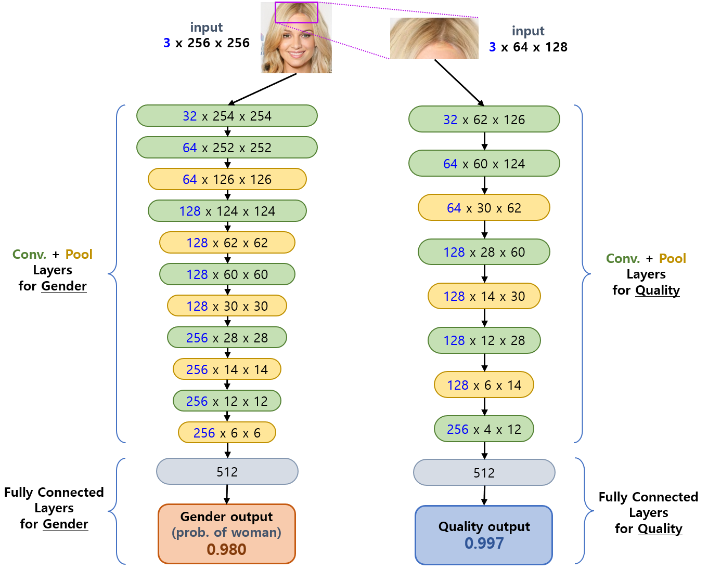

* Training Process
  * Loss Function 은 [Binary Cross-Entropy (BCE) Loss](https://github.com/WannaBeSuperteur/AI-study/blob/main/AI%20Basics/Deep%20Learning%20Basics/%EB%94%A5%EB%9F%AC%EB%8B%9D_%EA%B8%B0%EC%B4%88_Loss_function.md#2-4-binary-cross-entropy-loss) 사용 [(MSE Loss 는 논리적으로 부적합)](https://github.com/WannaBeSuperteur/AI-study/blob/main/AI%20Basics/Deep%20Learning%20Basics/%EB%94%A5%EB%9F%AC%EB%8B%9D_%EA%B8%B0%EC%B4%88_Loss_Function_Misuse.md#1-1-probability-prediction-0--1-%EB%B2%94%EC%9C%84-%EB%8B%A8%EC%9D%BC-output-%EC%97%90%EC%84%9C-mse-loss-%EB%93%B1%EC%9D%B4-%EB%B6%80%EC%A0%81%EC%A0%88%ED%95%9C-%EC%9D%B4%EC%9C%A0)
  * 각 모델을 학습 시, **BCE Loss 가 일정 값 이상이면 학습 실패로 간주하여 재시도 (반복)** 하는 메커니즘 적용

| 핵심 속성 값              | 이미지의 학습 대상 영역                  | 학습 전략                                                                                                                                                                                                                                                          | 학습 전략 사용 이유                                                                                                                                                                                                                                                                                                             |
|----------------------|--------------------------------|----------------------------------------------------------------------------------------------------------------------------------------------------------------------------------------------------------------------------------------------------------------|-------------------------------------------------------------------------------------------------------------------------------------------------------------------------------------------------------------------------------------------------------------------------------------------------------------------------|
| 성별 ```gender```      | 이미지 전체 (가로 256 x 세로 256)       | [K-fold Cross Validation](https://github.com/WannaBeSuperteur/AI-study/blob/main/AI%20Basics/Machine%20Learning%20Models/%EB%A8%B8%EC%8B%A0%EB%9F%AC%EB%8B%9D_%EB%B0%A9%EB%B2%95%EB%A1%A0_Cross_Validation.md#3-k-fold-cross-validation)                       | - 라벨링된 데이터가 2,000 장으로 부족한 편                                                                                                                                                                                                                                                                                             |
| 이미지 품질 ```quality``` | 이미지 최상단 중앙 영역 (가로 128 x 세로 64) | [Startified K-fold Cross Validation](https://github.com/WannaBeSuperteur/AI-study/blob/main/AI%20Basics/Machine%20Learning%20Models/%EB%A8%B8%EC%8B%A0%EB%9F%AC%EB%8B%9D_%EB%B0%A9%EB%B2%95%EB%A1%A0_Cross_Validation.md#4-stratified-k-fold-cross-validation) | - 라벨링된 데이터 부족<br>- **약 95% (1,905 / 2,000) 가 Good Quality 인 극단적인 [데이터 불균형](https://github.com/WannaBeSuperteur/AI-study/blob/main/AI%20Basics/Data%20Science%20Basics/%EB%8D%B0%EC%9D%B4%ED%84%B0_%EC%82%AC%EC%9D%B4%EC%96%B8%EC%8A%A4_%EA%B8%B0%EC%B4%88_%EB%8D%B0%EC%9D%B4%ED%84%B0_%EB%B6%88%EA%B7%A0%ED%98%95.md)** |

* 핵심 속성 값 (성별, 이미지 품질) 데이터 저장 위치

| 이미지                     | 핵심 속성 값                    | 저장 위치                                               | repo 존재 여부<br>(clone 초기) |
|-------------------------|----------------------------|-----------------------------------------------------|--------------------------|
| 처음 2,000 장 (labeled)    | ```gender``` ```quality``` | ```cnn/synthesize_results_quality_and_gender.csv``` | **O**                    |
| 나머지 8,000 장 (unlabeled) | ```gender```               | ```cnn/inference_result/gender.csv```               | **O**                    |
| 나머지 8,000 장 (unlabeled) | ```quality```              | ```cnn/inference_result/quality.csv```              | **O**                    |
| **전체 이미지 10,000 장**     | ```gender``` ```quality``` | ```cnn/all_image_quality_and_gender.csv```          | **O**                    |

* 학습 코드 및 CNN model 저장 경로
  * 학습 코드
    * [run_cnn.py](run_cnn.py)
  * 모델 저장 경로
    * ```gender``` 모델 5개
      * ```cnn/models/gender_model_{0|1|2|3|4}.pt```
    * ```quality``` 모델 5개
      * ```cnn/models/quality_model_{0|1|2|3|4}.pt```

### 3-3. CNN Model (나머지 핵심 속성 값 7개)

* CNN pipeline Overview

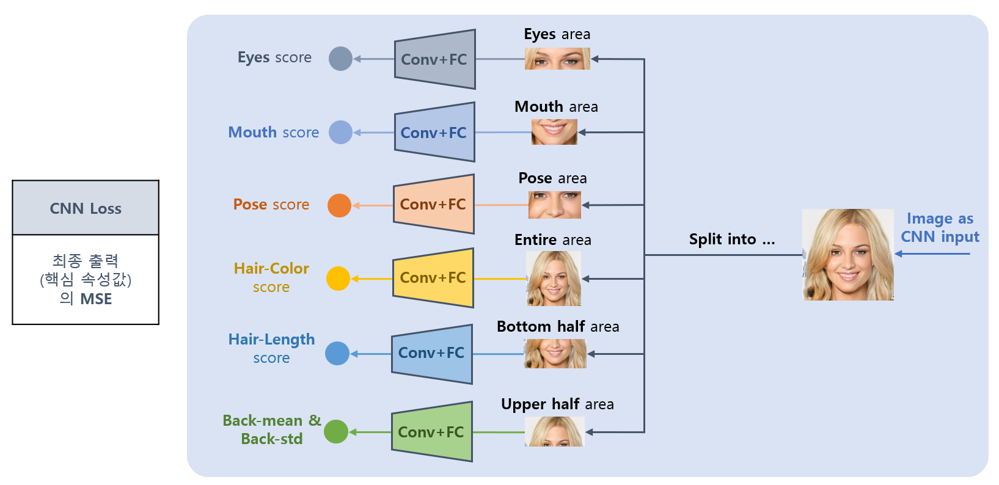

* **Training Data**
  * [```segmentation/property_score_results/all_scores_v2.csv```](segmentation/property_score_results/all_scores_v2.csv)
  * Dataset size
    * **4,703 rows (images)**
    * each corresponding to FILTERED 4,703 IMAGES (using GENDER and IMAGE QUALITY score)
  * columns
    * Normalized **eyes / mouth / pose / hair-color / hair-length / background mean (back-mean) / background std (back-std)** scores

* **Area Info**
  * **H** indicates image height (= 256)
  * **W** indicates image width (= 256)

| Property Type   | Area Name            | Area Size<br>(width x height) | Area in the image<br>(y) | Area in the image<br>(x)  |
|-----------------|----------------------|-------------------------------|--------------------------|---------------------------|
| eyes            | eyes area            | 128 x 48                      | **3/8** H - **9/16** H   | **1/4** W - **3/4** W     |
| mouth           | mouth area           | 64 x 48                       | **5/8** H - **13/16** H  | **3/8** W - **5/8** W     |
| pose            | pose area            | 80 x 48                       | **7/16** H - **5/8** H   | **11/32** W - **21/32** W |
| hair color      | **entire** area      | 256 x 256                     | 0 H - 1 H                | 0 W - 1 W                 |
| hair length     | **bottom half** area | 256 x 128                     | 1/2 H - 1 H              | 0 W - 1 W                 |
| background mean | **upper half** area  | 256 x 128                     | 0 H - 1/2 H              | 0 W - 1 W                 |
| background std  | **upper half** area  | 256 x 128                     | 0 H - 1/2 H              | 0 W - 1 W                 |

* 예상 효과 및 참고 사항
  * [Pre-trained Segmentation Model (FaceXFormer)](#3-4-segmentation-model-facexformer) 에 의한 Segmentation 결과가 일부 이미지에 대해 매우 어색할 때, 이를 **CNN 을 이용하여 보정** 할 수 있을 것으로 예상 
  * 해당 모델을 이용하여 재산출한 [각 Property Score 값들](segmentation/property_score_results/all_scores_v2_cnn.csv) 을 **StyleGAN-FineTune-v3,v4 학습 시 사용**

* 학습 코드 및 CNN model 저장 경로
  * 학습 코드
    * StyleGAN-FineTune-v2 모델 학습 시 해당 CNN Model 이 필요하며, 그 CNN Model 이 없으면 생성하는 방식 
    * [stylegan_generator_v2.py](stylegan_modified/stylegan_generator_v2.py) > ```train_cnn_model``` 함수 (Line 83)
  * 모델 저장 경로
    * ```stylegan_modified/stylegan_gen_fine_tuned_v2_cnn.pth```

### 3-4. Segmentation Model (FaceXFormer)

[Implementation Source : FaceXFormer Official GitHub](https://github.com/Kartik-3004/facexformer/tree/main) (MIT License)

* Main Model Save Path ([Original Source](https://huggingface.co/kartiknarayan/facexformer/tree/main/ckpts))
  * ```segmentation/models/segmentation_model.pt``` (Pre-trained FaceXFormer)
* Additional Models Save Path ([Original Source](https://github.com/timesler/facenet-pytorch/blob/master/data))  
  * ```segmentation/models/mtcnn_pnet.pt``` (Pre-trained P-Net for MTCNN)
  * ```segmentation/models/mtcnn_rnet.pt``` (Pre-trained R-Net for MTCNN)
  * ```segmentation/models/mtcnn_onet.pt``` (Pre-trained O-Net for MTCNN)

## 4. 향후 진행하고 싶은 것

* StyleGAN-FineTune-v1 의 **Discriminator 를 상술한 Property Score 도출용 CNN 구조로 바꿔서** StyleGAN 방식으로 Fine-Tuning
  * 기존 StyleGAN-FineTune-v4 는 의도한 대로 학습하는 데 **시간이 너무 오래 걸릴** 것으로 추정
* 4,703 장의 필터링된 이미지 데이터를 **규모를 올려서 추가 학습**
  * 필요 시 [Image Augmentation](https://github.com/WannaBeSuperteur/AI-study/blob/main/Image%20Processing/Basics_Image_Augmentation.md) (밝기, 채도 등) 사용

## 5. 코드 실행 방법

**모든 코드는 아래 순서대로, ```2025_04_08_OhLoRA``` main directory 에서 실행** (단, 추가 개발 목적이 아닌 경우, 마지막의 **"6. Fine-Tuning 된 StyleGAN 실행하여 이미지 생성"** 부분만 실행)

* **1. Original GAN Generator 실행하여 이미지 생성**
  * ```python stylegan_and_segmentation/run_original_generator.py```
  * ```stylegan/synthesize_results``` 에 생성된 이미지 저장됨

* **2. CNN 실행**
  * ```python stylegan_and_segmentation/run_cnn.py```
  * 모든 이미지에 대한 핵심 속성 값 데이터 (unlabeled image 의 경우 모델 계산값) 가 저장됨
  * CNN model 이 지정된 경로에 없을 시, CNN 모델 학습
  * ```stylegan/synthesize_results_filtered``` 에 필터링된 이미지 저장됨 **(StyleGAN Fine-Tuning 학습 데이터로 사용)**

* **3. Segmentation 결과 생성**
  * 전체 10,000 장이 아닌, 그 일부분에 해당하는 **따로 필터링된 이미지 4,703 장** 대상 
  * ```python stylegan_and_segmentation/run_segmentation.py```
  * ```segmentation/segmentation_results``` 에 이미지 저장됨

* **4. 성별, 이미지 품질을 제외한 7가지 핵심 속성값 계산 결과 생성**
  * 전체 10,000 장이 아닌, 그 일부분에 해당하는 **따로 필터링된 이미지 4,703 장** 대상
  * for **StyleGAN-FineTune-v1**
    * ```python stylegan_and_segmentation/compute_property_scores.py```
    * ```segmentation/property_score_results/all_scores.csv``` 에 결과 저장됨
  * for **StyleGAN-FineTune-v2,v3**
    * ```python stylegan_and_segmentation/compute_property_scores_v2.py```
    * ```segmentation/property_score_results/all_scores_v2.csv``` 에 결과 저장됨

* **5. StyleGAN Fine-Tuning 실시**
  * 전체 10,000 장이 아닌, 그 일부분에 해당하는 **따로 필터링된 이미지 4,703 장** 대상 
  * **StyleGAN-FineTune-v1** 
    * ```python stylegan_and_segmentation/run_stylegan_fine_tuning.py```
    * ```stylegan_modified/stylegan_gen_fine_tuned.pth``` 에 Fine-Tuning 된 모델의 Generator 저장됨
    * ```stylegan_modified/stylegan_dis_fine_tuned.pth``` 에 Fine-Tuning 된 모델의 Discriminator 저장됨
    * 위 2개의 모델은 이름을 ```... fine_tuned.pth``` 에서 ```... fine_tuned_v1.pth``` 로 각각 변경하여 사용
  * **StyleGAN-FineTune-v2 (CNN 기반, ❌ 학습 불가)** 
    * ```python stylegan_and_segmentation/run_stylegan_fine_tuning_v2.py```
    * ```stylegan_modified/stylegan_gen_fine_tuned_v2.pth``` 에 Fine-Tuning 된 Generator 저장됨
  * **StyleGAN-FineTune-v3 (Conditional VAE 기반, ✅ 최종 채택)** 
    * ```python stylegan_and_segmentation/run_stylegan_fine_tuning_v3.py```
    * ```stylegan_modified/stylegan_gen_fine_tuned_v3.pth``` 에 Fine-Tuning 된 Generator 저장됨
    * ```stylegan_modified/stylegan_gen_fine_tuned_v3_encoder.pth``` 에 Fine-Tuning 된 Generator 에 대한 VAE Encoder 저장됨
  * **StyleGAN-FineTune-v4 (StyleGAN 재 학습)** 
    * ```python stylegan_and_segmentation/run_stylegan_fine_tuning_v4.py```
    * ```stylegan_modified/stylegan_gen_fine_tuned_v4.pth``` 에 Fine-Tuning 된 Generator 저장됨
    * ```stylegan_modified/stylegan_dis_fine_tuned_v4.pth``` 에 Fine-Tuning 된 모델의 Discriminator 저장됨

* **6. Fine-Tuning 된 StyleGAN 실행하여 이미지 생성**
  * ```python stylegan_and_segmentation/run_fine_tuned_generator.py```
  * ```stylegan_modified/final_inference_test_v3``` 에 생성된 이미지 저장됨
