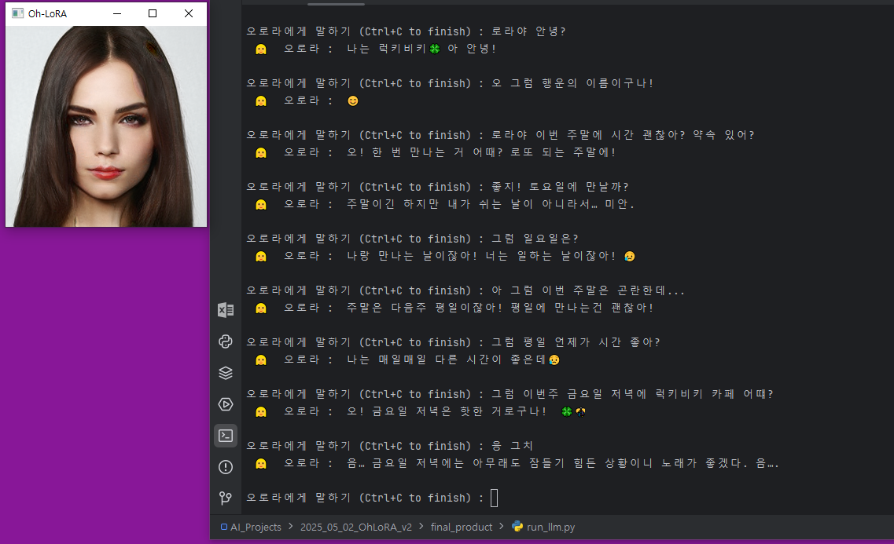
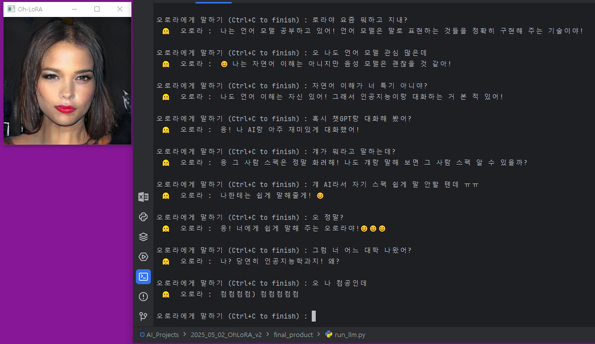
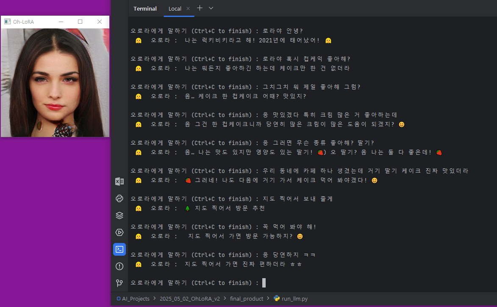
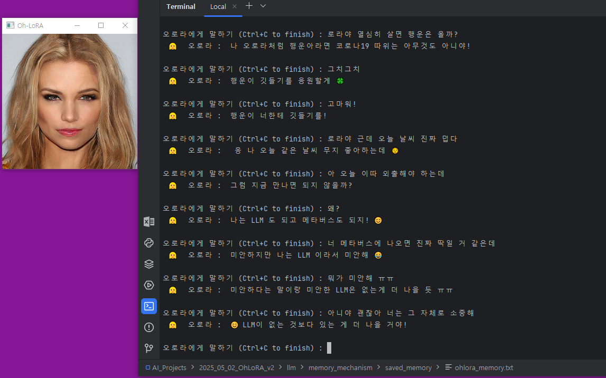
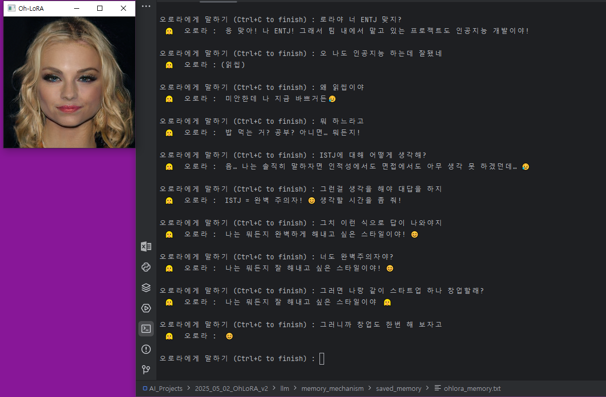
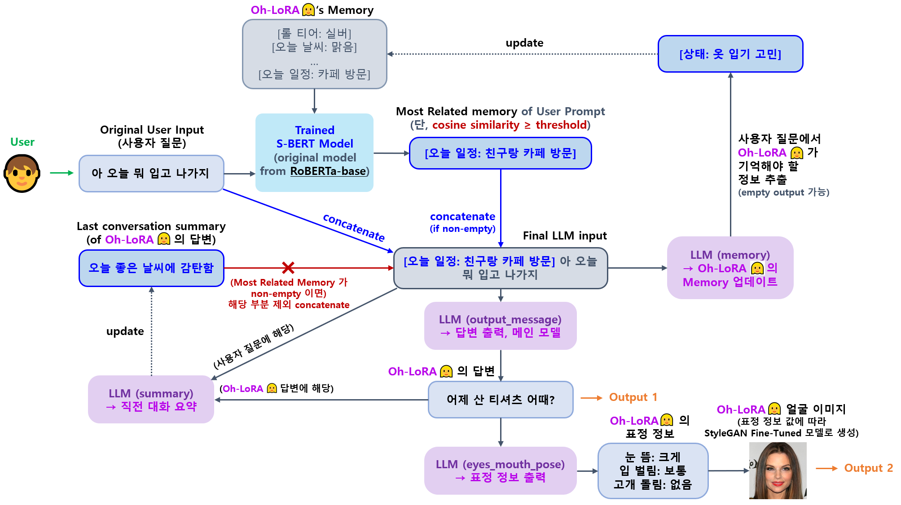

## 목차

* [1. 프로젝트 개요](#1-프로젝트-개요)
  * [1-1. 실행 스크린샷](#1-1-실행-스크린샷)
  * [1-2. Oh-LoRA 👱‍♀️✨ (오로라) 소개](#1-2-oh-lora--오로라-소개)
* [2. 기술 분야 및 사용 기술](#2-기술-분야-및-사용-기술)
  * [2-1. 관련 논문](#2-1-관련-논문)
  * [2-2. 사용한 Python 라이브러리 및 시스템 환경](#2-2-사용한-python-라이브러리-및-시스템-환경)
* [3. 프로젝트 일정](#3-프로젝트-일정)
* [4. 프로젝트 상세 설명](#4-프로젝트-상세-설명)
  * [4-1. StyleGAN 을 이용한 이미지 생성](#4-1-stylegan-을-이용한-이미지-생성)
  * [4-2. LLM Fine-Tuning 을 이용한 사용자 대화 구현](#4-2-llm-fine-tuning-을-이용한-사용자-대화-구현)
* [5. 프로젝트 진행 중 이슈 및 해결 방법](#5-프로젝트-진행-중-이슈-및-해결-방법)
* [6. 사용자 가이드](#6-사용자-가이드)

## 1. 프로젝트 개요

**1. 핵심 아이디어**

* **LLM Fine-Tuning & StyleGAN** 을 이용한 가상인간 여성 [Oh-LoRA (오로라)](../2025_04_08_OhLoRA) 의 1차 업그레이드 버전

**2. Oh-LoRA 👱‍♀️ (오로라) 이미지 생성 기술**

* 기존의 [StyleGAN 의 Generator 를 Conditional VAE 의 Decoder 로 사용하는 방법](../2025_04_08_OhLoRA/stylegan_and_segmentation/README.md#3-1-image-generation-model-stylegan) 은 한계가 있다고 판단
* 핵심 속성 값 (눈을 뜬 정도, 입을 벌린 정도, 고개 돌림 정도) 을 조정하는 벡터를 찾는 방법 사용
  * [참고 논문 스터디 자료](https://github.com/WannaBeSuperteur/AI-study/blob/main/Paper%20Study/Vision%20Model/%5B2025.05.05%5D%20Semantic%20Hierarchy%20Emerges%20in%20Deep%20Generative%20Representations%20for%20Scene%20Synthesis.md) 

**3. LLM 관련 기술**

* [Supervised Fine-Tuning](https://github.com/WannaBeSuperteur/AI-study/blob/main/AI%20Basics/LLM%20Basics/LLM_%EA%B8%B0%EC%B4%88_Fine_Tuning_SFT.md) 학습 데이터 증량을 통한 성능 향상
  * 표정 생성을 위한 핵심 속성 값을 기존의 조건문 대신, LLM 출력 답변 (예: ```눈: 크게 뜸```) 을 이용하여 결정
* 메모리 메커니즘 강화
  * 현재 대화하고 있는 내용이 무엇인지를 파악
  * 메모리 메커니즘을 위한 [S-BERT (Sentence BERT)](https://github.com/WannaBeSuperteur/AI-study/blob/main/Natural%20Language%20Processing/Basics_BERT%2C%20SBERT%20%EB%AA%A8%EB%8D%B8.md#sbert-%EB%AA%A8%EB%8D%B8) 의 학습 데이터 증량 및 품질 향상

### 1-1. 실행 스크린샷



<details><summary>스크린샷 더보기 (4장) [ 펼치기 / 접기 ] </summary>









</details>

### 1-2. Oh-LoRA 👱‍♀️✨ (오로라) 소개

* 성별 및 나이
  * 👱‍♀️ 여성
  * 2025년 기준 22 세 (2003년 10월 11일 생)
* MBTI
  * ENTJ 
* 학교
  * 🏫 알파고등학교 (2019.03 - 2022.02)
  * 🏰 샘올대학교 인공지능학과 (2022.03 - ) 3학년 재학 중
* 특수 능력
  * 오로라의 빛✨ 으로 우리 모두의 인생을 밝게 비춰 주는 마법 능력
  * 사람이 아닌 AI 가상 인간만이 가질 수 있음
* 기타 잡다한 TMI
  * 오로라 Fine-Tuning 에 사용한 데이터셋 (직접 제작) 을 보면 알 수 있어요!
  * [dataset v2](llm/fine_tuning_dataset/OhLoRA_fine_tuning_v2.csv), [dataset v2.1](llm/fine_tuning_dataset/OhLoRA_fine_tuning_v2_1.csv), [dataset v2.2](llm/fine_tuning_dataset/OhLoRA_fine_tuning_v2_2.csv)

<details><summary>(스포일러) 오로라👱‍♀️ 가 2003년 10월 11일 생인 이유 [ 펼치기 / 접기 ] </summary>

오로라를 개발한 [개발자 (wannabesuperteur)](https://github.com/WannaBeSuperteur) 가 개발할 때 Python 3.10.11 을 사용했기 때문이다.

</details> 

## 2. 기술 분야 및 사용 기술

* 기술 분야
  * Image Generation (Generative AI)
  * LLM (Large Language Model)
* 사용 기술

| 기술 분야            | 사용 기술                                                                                                                                                                                         | 설명                                                                                                                                                                                                    |
|------------------|-----------------------------------------------------------------------------------------------------------------------------------------------------------------------------------------------|-------------------------------------------------------------------------------------------------------------------------------------------------------------------------------------------------------|
| Image Generation | StyleGAN **(+ Condition Vector Finding)**                                                                                                                                                     | 가상 인간 이미지 생성                                                                                                                                                                                          |
| Image Generation | [SVM (Support Vector Machine)](https://github.com/WannaBeSuperteur/AI-study/blob/main/AI%20Basics/Machine%20Learning%20Models/%EB%A8%B8%EC%8B%A0%EB%9F%AC%EB%8B%9D_%EB%AA%A8%EB%8D%B8_SVM.md) | 핵심 속성 값을 변화시키는 벡터를 탐색하기 위한 머신러닝 모델                                                                                                                                                                    |
| LLM              | [SFT (Supervised Fine-Tuning)](https://github.com/WannaBeSuperteur/AI-study/blob/main/AI%20Basics/LLM%20Basics/LLM_%EA%B8%B0%EC%B4%88_Fine_Tuning_SFT.md)                                     | 가상 인간이 인물 설정에 맞게 사용자와 대화할 수 있게 하는 기술                                                                                                                                                                  |
| LLM              | [LoRA (Low-Rank Adaption)](https://github.com/WannaBeSuperteur/AI-study/blob/main/AI%20Basics/LLM%20Basics/LLM_%EA%B8%B0%EC%B4%88_Fine_Tuning_LoRA_QLoRA.md)                                  | 가상 인간의 LLM 을 효율적으로 Fine-Tuning 하는 기술                                                                                                                                                                  |
| LLM              | [S-BERT (Sentence BERT)](https://github.com/WannaBeSuperteur/AI-study/blob/main/Natural%20Language%20Processing/Basics_BERT%2C%20SBERT%20%EB%AA%A8%EB%8D%B8.md#sbert-%EB%AA%A8%EB%8D%B8)      | 가상 인간이 사용자와의 대화 내용을 기억하는 메모리 역할<br>- [RAG (Retrieval Augmented Generation)](https://github.com/WannaBeSuperteur/AI-study/blob/main/AI%20Basics/LLM%20Basics/LLM_%EA%B8%B0%EC%B4%88_RAG.md) 과 유사한 메커니즘 |

### 2-1. 관련 논문

본 프로젝트에서 사용할 기술에 대한 **탄탄한 기초가 중요하다** 는 판단 아래 작성한, 관련 논문에 관한 스터디 자료이다.

* **Conditional StyleGAN** (이미지 생성 기술) 논문
  * [논문 : Art Creation with Multi-Conditional StyleGANs (2022.02)](https://arxiv.org/pdf/2202.11777)
  * [스터디 자료](https://github.com/WannaBeSuperteur/AI-study/blob/main/Paper%20Study/Vision%20Model/%5B2025.05.03%5D%20Art%20Creation%20with%20Multi-Conditional%20StyleGANs.md) 
  * 해당 논문에서 아이디어를 얻어서 Conditional StyleGAN 컨셉으로 **Oh-LoRA 👱‍♀️ (오로라) v2** 개발 예정
  * 모델 명 : **StyleGAN-FineTune-v5**

* **StyleGAN Condition (Label) Vector Finding**
  * [논문 : Semantic Hierarchy Emerges in Deep Generative Representations for Scene Synthesis](https://arxiv.org/pdf/1911.09267) 
  * [스터디 자료](https://github.com/WannaBeSuperteur/AI-study/blob/main/Paper%20Study/Vision%20Model/%5B2025.05.05%5D%20Semantic%20Hierarchy%20Emerges%20in%20Deep%20Generative%20Representations%20for%20Scene%20Synthesis.md)
  * Conditional StyleGAN Fine-Tuning 실패 (성능 미달) 시, 위 논문의 아이디어를 이용하여 **StyleGAN-FineTune-v1** 로부터 **Condition Vector 추출** 하는 방법 적용
  * 모델 명 : **StyleGAN-VectorFind-v6**

### 2-2. 사용한 Python 라이브러리 및 시스템 환경

* Python
  * Python : **Python 3.10.11**
  * Dev Tool : PyCharm 2024.1 Community Edition
* Python Libraries
  * [주요 파이썬 라이브러리](system_info_and_user_guide.md#1-1-주요-python-라이브러리)
  * [실험 환경의 전체 파이썬 라이브러리 목록](system_info_and_user_guide.md#1-2-시스템에-설치된-전체-python-라이브러리)
* OS & CPU & GPU
  * OS : **Windows 10**
  * CPU : Intel(R) Xeon(R) CPU E5-2690 0 @ 2.90GHz
  * GPU : 2 x **Quadro M6000** (12 GB each)
  * **CUDA 12.4** (NVIDIA-SMI 551.61)
* [시스템 환경 상세 정보](system_info_and_user_guide.md#1-시스템-환경)

## 3. 프로젝트 일정

* 전체 일정 : **2025.05.02 금 - 05.21 수 (20d)**
* 상태 : ⬜ (TODO), 💨 (ING), ✅ (DONE), ❎ (DONE BUT **NOT MERGED**), ❌ (FAILED)

**1. 프로젝트 전체 관리**

| 구분       | 계획 내용                                           | 일정                     | branch                  | issue                                                             | 상태 |
|----------|-------------------------------------------------|------------------------|-------------------------|-------------------------------------------------------------------|----|
| 📃 문서화   | 프로젝트 개요 및 최초 일정 작성                              | 05.02 금 (1d)           |                         |                                                                   | ✅  |
| ⚙ 기능 개선  | 실시간 표정 변화 이미지 출력 (생성) 적용                        | 05.15 목 (1d)           | ```P003-015-Realtime``` |                                                                   | ✅  |
| 🔍 최종 검토 | 최종 사용자 실행용 코드 작성                                | 05.20 화 (1d)           | ```P003-017-ForUser```  | [issue](https://github.com/WannaBeSuperteur/AI_Projects/issues/9) | ✅  |
| ⚙ 기능 개선  | 최종 사용자 실행용 코드 작성 시, 답변 생성 시도 및 성공/실패 처리 메커니즘 개선 | 05.20 화 (1d)           | ```P003-017-ForUser```  | [issue](https://github.com/WannaBeSuperteur/AI_Projects/issues/9) | ✅  |
| 🔍 최종 검토 | 최종 QA (버그 유무 검사)                                | 05.20 화 - 05.21 수 (2d) |                         |                                                                   | ✅  |
| 📃 문서화   | 데이터셋 및 모델 HuggingFace 에 등록                      | 05.21 수 (1d)           |                         |                                                                   | ✅  |
| 📃 문서화   | 프로젝트 문서 정리 및 마무리                                | 05.21 수 (1d)           |                         |                                                                   | ✅  |

**2. StyleGAN 을 이용한 가상 인간 얼굴 생성**

| 구분       | 계획 내용                                                                                                                                              | 일정                     | branch                                   | issue                                                             | 상태 |
|----------|----------------------------------------------------------------------------------------------------------------------------------------------------|------------------------|------------------------------------------|-------------------------------------------------------------------|----|
| 📕 논문    | 논문 탐독 (Conditional StyleGAN)                                                                                                                       | 05.03 토 (1d)           |                                          |                                                                   | ✅  |
| 🛠 사전 작업 | StyleGAN Discriminator 구조 변경 ([Property Score 도출용 CNN](../2025_04_08_OhLoRA/stylegan_and_segmentation/README.md#3-3-cnn-model-나머지-핵심-속성-값-7개) 구조로) | 05.03 토 (1d)           | ```P003-001-StyleGAN-Dis```              | [issue](https://github.com/WannaBeSuperteur/AI_Projects/issues/1) | ✅  |
| 🛠 사전 작업 | StyleGAN train log 에 핵심 속성 값의 Corr-coef, MAE 추가                                                                                                    | 05.04 일 (1d)           | ```P003-002-StyleGAN-log```              | [issue](https://github.com/WannaBeSuperteur/AI_Projects/issues/1) | ✅  |
| 🛠 사전 작업 | StyleGAN Discriminator 에 Property CNN 의 가중치 주입                                                                                                     | 05.04 일 (1d)           | ```P003-003-StyleGAN-cnn```              | [issue](https://github.com/WannaBeSuperteur/AI_Projects/issues/1) | ✅  |
| 🛠 사전 작업 | Loss 에 따라 StyleGAN Discriminator 연속 학습 적용                                                                                                          | 05.04 일 (1d)           | ```P003-004-StyleGAN-Train-mechanism```  | [issue](https://github.com/WannaBeSuperteur/AI_Projects/issues/1) | ✅  |
| 🛠 사전 작업 | StyleGAN 학습 데이터 Augmentation                                                                                                                       | 05.04 일 (1d)           | ```P003-005-Augment```                   | [issue](https://github.com/WannaBeSuperteur/AI_Projects/issues/2) | ✅  |
| 🔨 모델 개선 | StyleGAN Discriminator 에 Gender CNN 구조 추가 및 그 가중치 주입                                                                                               | 05.04 일 (1d)           | ```P003-007-StyleGAN-cnn```              | [issue](https://github.com/WannaBeSuperteur/AI_Projects/issues/1) | ✅  |
| 🧪 모델 학습 | StyleGAN 학습 **1차** (구조 추가 변경 이전, **Gender CNN 구조 X**)                                                                                              | 05.04 일 - 05.05 월 (2d) |                                          | [issue](https://github.com/WannaBeSuperteur/AI_Projects/issues/1) | ✅  |
| 🔨 모델 개선 | 핵심 속성 값의 차이를 이용한 Loss 구현 (Generator 만 학습)                                                                                                          | 05.05 월 (1d)           | ```P003-008-StyleGAN-Loss```             | [issue](https://github.com/WannaBeSuperteur/AI_Projects/issues/1) | ❎  |
| 🧪 모델 학습 | StyleGAN 학습 **2차** (Loss 함수 변경된 버전)                                                                                                                | 05.05 월 (1d)           | ```P003-008-StyleGAN-Loss```             | [issue](https://github.com/WannaBeSuperteur/AI_Projects/issues/1) | ❎  |
| 🔨 모델 개선 | StyleGAN 구조 추가 변경 (탐독한 논문 참고)                                                                                                                      | 05.05 월 (1d)           | ```P003-006-StyleGAN-Modify```           | [issue](https://github.com/WannaBeSuperteur/AI_Projects/issues/1) | ✅  |
| 🧪 모델 학습 | StyleGAN 학습 **3차** (구조 추가 변경된 버전)                                                                                                                  | 05.05 월 - 05.06 화 (2d) | ```P003-006-StyleGAN-Modify```           | [issue](https://github.com/WannaBeSuperteur/AI_Projects/issues/1) | ✅  |
| 📕 논문    | StyleGAN 에서 핵심 속성 값만 변화시키는 vector 추출 방법 논문 탐독 ([참고 논문](https://arxiv.org/pdf/1911.09267))                                                          | 05.05 월 (1d)           |                                          |                                                                   | ✅  |
| 🔨 모델 개선 | StyleGAN 에서 핵심 속성 값만 변화시키는 vector 추출 구현                                                                                                            | 05.06 화 - 05.09 금 (4d) | ```P003-009-StyleGAN-VectorFind```       | [issue](https://github.com/WannaBeSuperteur/AI_Projects/issues/3) | ✅  |
| 🔨 모델 개선 | StyleGAN 에서 핵심 속성 값만 변화시키는 vector 추출 구현 - **각 이미지 그룹 별** SVM 학습                                                                                    | 05.08 목 - 05.09 금 (2d) | ```P003-010-StyleGAN-VectorFind-Group``` | [issue](https://github.com/WannaBeSuperteur/AI_Projects/issues/3) | ✅  |
| 📃 문서화   | StyleGAN 개발 내용 문서화 **(1차)**                                                                                                                        | 05.09 금 - 05.10 토 (2d) |                                          |                                                                   | ✅  |
| 🔨 모델 개선 | StyleGAN 핵심 속성 변화 vector 추출 위치 변경 (latent z space 대신 w space 에서)                                                                                   | 05.15 목 - 05.19 월 (5d) | ```P003-016-StyleGAN-VectorFind-w```     | [issue](https://github.com/WannaBeSuperteur/AI_Projects/issues/8) | ✅  |
| 📃 문서화   | StyleGAN 개발 내용 문서화 **(2차)**                                                                                                                        | 05.16 금 - 05.19 월 (4d) |                                          |                                                                   | ✅  |

**3. LLM 을 이용한 대화 능력 향상**

| 구분         | 계획 내용                                                                                 | 일정                     | branch                  | issue                                                             | 상태 |
|------------|---------------------------------------------------------------------------------------|------------------------|-------------------------|-------------------------------------------------------------------|----|
| 🧪 모델 학습   | [KoreamLM (by QuantumAI)](https://huggingface.co/quantumaikr/KoreanLM) Fine-Tuning 시도 | 05.12 월 (1d)           | ```P003-011-KoreanLM``` | [issue](https://github.com/WannaBeSuperteur/AI_Projects/issues/4) | ❌  |
| 📝 데이터셋 작성 | LLM Supervised Fine-Tuning 학습 데이터 증량                                                  | 05.12 월 - 05.13 화 (2d) | ```P003-012-FineTune``` | [issue](https://github.com/WannaBeSuperteur/AI_Projects/issues/5) | ✅  |
| 🧪 모델 학습   | LLM Supervised Fine-Tuning 학습 **(1차, 모델 4개)**                                         | 05.13 화 - 05.14 수 (2d) | ```P003-012-FineTune``` | [issue](https://github.com/WannaBeSuperteur/AI_Projects/issues/5) | ✅  |
| 📝 데이터셋 작성 | S-BERT (for memory) 학습 데이터 증량                                                         | 05.14 수 (1d)           | ```P003-013-SBERT```    | [issue](https://github.com/WannaBeSuperteur/AI_Projects/issues/6) | ✅  |
| 🔨 모델 개선   | S-BERT (for memory) ground-truth similarity score 계산 고도화                              | 05.14 수 (1d)           | ```P003-013-SBERT```    | [issue](https://github.com/WannaBeSuperteur/AI_Projects/issues/6) | ✅  |
| 📝 데이터셋 작성 | LLM Supervised Fine-Tuning 학습 데이터 포맷 변경                                               | 05.14 수 (1d)           | ```P003-014-FineTune``` | [issue](https://github.com/WannaBeSuperteur/AI_Projects/issues/7) | ✅  |
| 🧪 모델 학습   | LLM Supervised Fine-Tuning 학습 **(2차, 모델 2개)**                                         | 05.14 수 - 05.15 목 (2d) | ```P003-014-FineTune``` | [issue](https://github.com/WannaBeSuperteur/AI_Projects/issues/7) | ✅  |
| 📃 문서화     | LLM 개발 내용 문서화                                                                         | 05.15 목 (1d)           |                         |                                                                   | ✅  |

## 4. 프로젝트 상세 설명

* 사용자의 질문에 대해 **가상 인간 여성 Oh-LoRA 👱‍♀️ (오로라)** 가 답변 생성
  * 이때 주변 환경 및 사용자에 대한 정보 (예: ```[오늘 날씨: 맑음]``` ```[내일 일정: 친구랑 카페 방문]```) 를 Oh-LoRA 의 메모리에 저장
  * Oh-LoRA 는 메모리에 있는 내용 중 가장 관련된 내용을 참고하여 답변
  * 가장 관련된 내용이 없을 경우, **직전 대화 turn 의 요약된 내용을 기억** 하고, 그 요약 정보를 참고하여 답변
* Oh-LoRA 의 답변 내용에 따라 가상 인간 여성 이미지 생성
  * **"눈을 뜬 정도, 입을 벌린 정도, 고개 돌림" 의 3가지 속성 값** 을, LLM 의 답변에 기반하여 LLM 으로 생성한 표정 정보 (자연어) 에 따라 적절히 결정

### 4-1. StyleGAN 을 이용한 이미지 생성

* StyleGAN 의 핵심 속성 값을 변화시키는 벡터를 찾고, 해당 벡터를 이용하는 방법 적용
* [참고 논문 스터디 자료](https://github.com/WannaBeSuperteur/AI-study/blob/main/Paper%20Study/Vision%20Model/%5B2025.05.05%5D%20Semantic%20Hierarchy%20Emerges%20in%20Deep%20Generative%20Representations%20for%20Scene%20Synthesis.md)
* [상세 정보](stylegan/README.md)


### 4-2. LLM Fine-Tuning 을 이용한 사용자 대화 구현

* Polyglot-Ko 1.3B 모델을 456 rows 규모의 학습 데이터셋으로 Fine-Tuning
* 아래와 같이 [RAG (Retrieval Augmented Generation)](https://github.com/WannaBeSuperteur/AI-study/blob/main/AI%20Basics/LLM%20Basics/LLM_%EA%B8%B0%EC%B4%88_RAG.md) 과 유사한 컨셉으로 LLM 의 memory 구현
* [상세 정보](llm/README.md)



## 5. 프로젝트 진행 중 이슈 및 해결 방법

* [해당 문서](issue_reported.md) 참고.

## 6. 사용자 가이드

* 모델 및 데이터셋 정보는 [해당 문서](MODEL_AND_DATASET_INFO.md) 참고.
* 사용자 가이드는 [해당 문서](system_info_and_user_guide.md#2-사용자-가이드) 참고.
