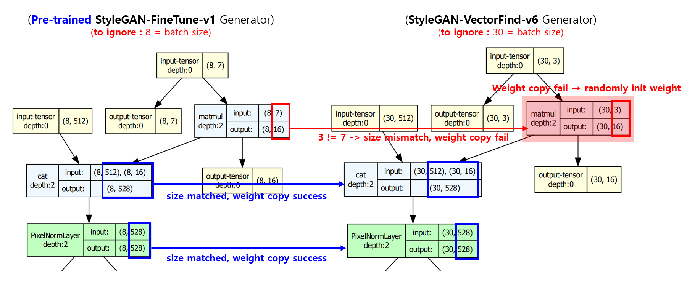

## 목차

* [1. 전체 이슈 요약](#1-전체-이슈-요약)
* [2. 이슈 상세](#2-이슈-상세)
  * [2-1. 동일 벡터로 매번 서로 다른 이미지 생성 (해결 완료)](#2-1-동일-벡터로-매번-서로-다른-이미지-생성-해결-완료) 
  * [**2-2. KoreanLM-1.5B LLM 학습 불가 (해결 보류)**](#2-2-koreanlm-15b-llm-학습-불가-해결-보류)

## 1. 전체 이슈 요약

| 이슈 분류    | 이슈                                                                            | 날짜         | 심각성    | 상태        | 원인 (및 해결 방법)                                                                                                                                                                                                                                                      | 시도했으나 실패한 해결 방법                                          |
|----------|-------------------------------------------------------------------------------|------------|--------|-----------|-------------------------------------------------------------------------------------------------------------------------------------------------------------------------------------------------------------------------------------------------------------------|----------------------------------------------------------|
| StyleGAN | StyleGAN-FineTune-v1 으로 **동일 latent z & 속성값 변화 벡터** 로 생성된 이미지가 **생성 시마다 달라짐** | 2025.05.09 | **심각** | 해결 완료     | ```label_weight``` 가중치가 로딩되지 않아, 랜덤하게 [Weight Init](https://github.com/WannaBeSuperteur/AI-study/blob/main/AI%20Basics/Deep%20Learning%20Basics/%EB%94%A5%EB%9F%AC%EB%8B%9D_%EA%B8%B0%EC%B4%88_Weight_initialization.md) 됨 → StyleGAN-VectorFind-v6 모델을 **별도 저장** | -                                                        |
| LLM      | KoreanLM-1.5B LLM 학습 불가                                                       | 2025.05.12 | 낮음     | **해결 보류** | tokenizer 또는 token 이슈로 추정                                                                                                                                                                                                                                         | - tokenizer 의 ```padding_side``` 를 left 로 설정 **(해결 안됨)** |

## 2. 이슈 상세

### 2-1. 동일 벡터로 매번 서로 다른 이미지 생성 (해결 완료)

**1. 문제 상황**

* **StyleGAN-FineTune-v1** [(참고)](../2025_04_08_OhLoRA/stylegan_and_segmentation/README.md#3-1-image-generation-model-stylegan) 의 Pre-trained Model 을 이용하여 가상 인간 이미지 생성
  * 이때, Fine-Tuning 대신, **Pre-trained Model 로부터** [SVM (Support Vector Machine)](https://github.com/WannaBeSuperteur/AI-study/blob/main/AI%20Basics/Machine%20Learning%20Models/%EB%A8%B8%EC%8B%A0%EB%9F%AC%EB%8B%9D_%EB%AA%A8%EB%8D%B8_SVM.md) 을 이용하여 [핵심 속성 값 (```eyes```, ```mouth```, ```pose```)](../2025_04_08_OhLoRA/stylegan_and_segmentation/README.md#2-핵심-속성-값) 을 [변화시키는 벡터를 찾는 아이디어](https://github.com/WannaBeSuperteur/AI-study/blob/main/Paper%20Study/Vision%20Model/%5B2025.05.05%5D%20Semantic%20Hierarchy%20Emerges%20in%20Deep%20Generative%20Representations%20for%20Scene%20Synthesis.md) 를 적용 
* 이미지 생성 시, **latent z vector 와 핵심 속성 값 변화 벡터가 동일** 한데도, 생성할 때마다 **서로 다른 이미지** 가 생성됨

**2. 문제 원인 및 해결 방법**

* 문제 원인
  * **StyleGAN-FineTune-v1** 의 Pre-trained Model 로딩 시,
    * 다음과 같이 ```label_weight``` 부분의 가중치가 로딩되지 않아, 이 부분은 로딩 시마다 **랜덤하게 초기화** 됨
    * 기존 StyleGAN-FineTune-v1 모델의 ```label_weight``` 과 크기가 맞지 않아 (```dim``` : ```3``` vs. ```7```) 로딩하지 않았던 부분임



* 해결 방법
  * 핵심 속성 값 (```eyes```, ```mouth```, ```pose```) 를 변화시키는 벡터를 추출한 **StyleGAN-FineTune-v1** Pre-trained Model 을 **(해당 랜덤하게 초기화된 weight 까지) 별도 저장**
  * 별도 저장된 모델을 로딩하여, **모든 가중치가 strict 하게 로딩** 되게 함

**3. 교훈**

* 모델을 학습하는 것이 아닌, **학습된 모델로부터 원하는 벡터 추출 등 추가 작업** 을 할 때는 **모든 가중치를 strict 하게 로딩** 하자.
* 이를 통해 모델이 이미지를 생성할 때마다 서로 다른 이미지가 생성되는 등의 버그를 방지하자.

## 2-2. KoreanLM-1.5B LLM 학습 불가 (해결 보류)

**1. 문제 상황**

* [Quantum AI 의 KoreanLM-1.5B](https://huggingface.co/quantumaikr/KoreanLM-1.5b/tree/main) LLM 학습 시 다음 오류 발생

**2. 시도한 해결 방법**

* tokenizer 의 ```padding_size``` 를 ```right``` → ```left``` 로 변경

```python
tokenizer = AutoTokenizer.from_pretrained(f'{PROJECT_DIR_PATH}/llm/models/koreanlm_original',
                                          padding_side='left')
```

* 결과
  * **동일한 오류가 여전히 발생 (즉, 근본적인 해결책 아님)**
  * 단, ```padding_size``` 변경 전 (0~2개 데이터 학습) 과 달리 **오류 발생 전까지 평균 3~5 개의 데이터를 학습** 함 

* 오류 로그
  * ```padding_side``` 값을 ```left``` 로 바꾸기 전/후 모두 동일

**기본 설정**

```
  File "C:\Users\20151\Documents\AI_Projects\venv\lib\site-packages\transformers\models\llama\modeling_llama.py", line 821, in forward
    outputs: BaseModelOutputWithPast = self.model(
  File "C:\Users\20151\Documents\AI_Projects\venv\lib\site-packages\torch\nn\modules\module.py", line 1739, in _wrapped_call_impl
    return self._call_impl(*args, **kwargs)
  File "C:\Users\20151\Documents\AI_Projects\venv\lib\site-packages\torch\nn\modules\module.py", line 1750, in _call_impl
    return forward_call(*args, **kwargs)
  File "C:\Users\20151\Documents\AI_Projects\venv\lib\site-packages\transformers\utils\generic.py", line 965, in wrapper
    output = func(self, *args, **kwargs)
    cache_position = torch.arange(
RuntimeError: CUDA error: device-side assert triggered
CUDA kernel errors might be asynchronously reported at some other API call, so the stacktrace below might be incorrect.
For debugging consider passing CUDA_LAUNCH_BLOCKING=1
Compile with `TORCH_USE_CUDA_DSA` to enable device-side assertions.

  0%|                                                                                                                                                                                                     | 0/7200 [00:02<?, ?it/s]
```

**```CUDA_LAUNCH_BLOCKING=1``` 설정**

```
    return forward_call(*args, **kwargs)
  File "C:\Users\20151\Documents\AI_Projects\venv\lib\site-packages\torch\nn\modules\sparse.py", line 190, in forward
    return F.embedding(
  File "C:\Users\20151\Documents\AI_Projects\venv\lib\site-packages\torch\nn\functional.py", line 2551, in embedding
    return torch.embedding(weight, input, padding_idx, scale_grad_by_freq, sparse)
RuntimeError: CUDA error: device-side assert triggered
Compile with `TORCH_USE_CUDA_DSA` to enable device-side assertions.

  0%|                                                                                                                                                                                           | 4/7200 [00:06<3:18:51,  1.66s/it]
```

**3. 참고 사항**

* CUDA OOM 관련 오류는 아님을 확인 (학습이 진행되는 잠깐 동안 ```nvidia-smi``` 체크)

**4. 해결 보류 사유**

* 기존 Polyglot-Ko 1.3B 외에 새로운 LLM의 성능은 어떤지 테스트하는 것이므로, **크리티컬하지 않음**
* **문제 해결에 오랜 시간이 소요** 될 가능성
  * 해당 모델 자체의 인지도도 낮은 편이고, 해당 모델로 Fine-Tuning 을 실시한 블로그 포스팅 등도 드묾
  * 모델 자체의 문제일 가능성도 있다고 판단됨