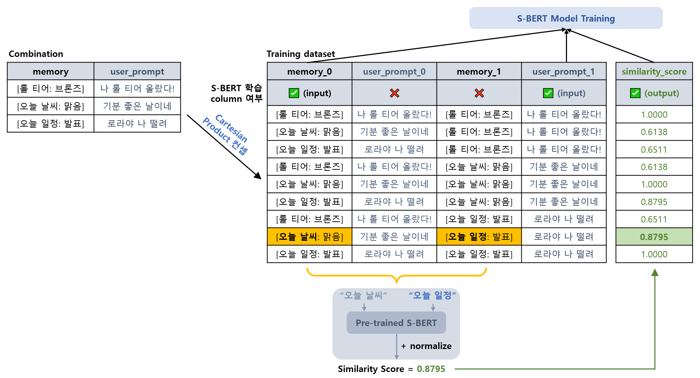
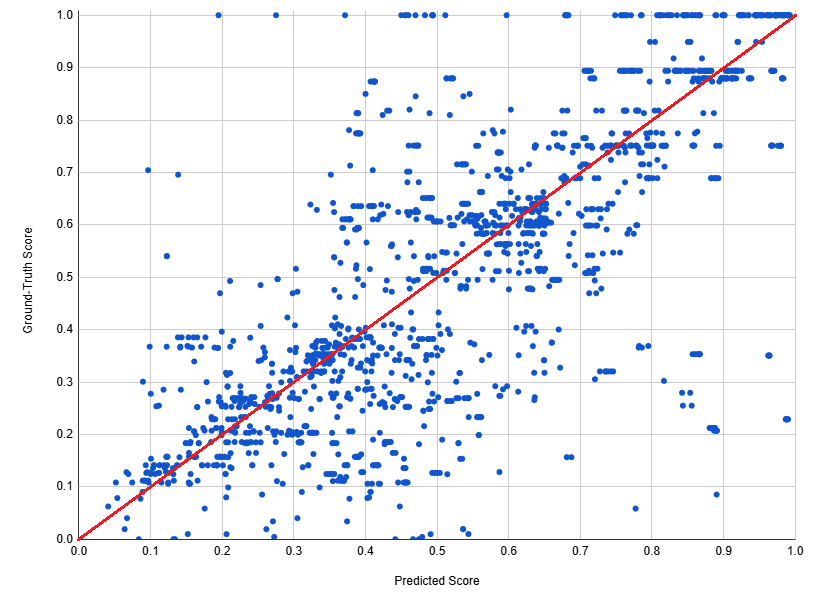

## 메모리 메커니즘 학습 및 테스트 데이터 & 학습 설정



* 학습 및 테스트 데이터
  * **실제 데이터** 는 **데이터 생성용 조합** 의 각 line 의 **memory** (예: ```[오늘 일정: 친구랑 카페 방문]```) 와 **message** (나머지 부분) 을 SQL 의 cartesian product 와 유사한 방법으로 combination (?) 하여 생성
  * [데이터 생성 구현 코드](memory_mechanism/generate_dataset.py)

| 데이터        | 데이터 생성용 조합                                                                    | 실제 데이터<br>(학습 대상 column : ```memory_0``` ```user_prompt_1``` ```similarity_score```) |
|------------|-------------------------------------------------------------------------------|--------------------------------------------------------------------------------------|
| 학습 및 valid | [train_dataset_combs.txt](memory_mechanism/train_dataset_combs.txt) (80 rows) | [train_dataset.csv](memory_mechanism/train_dataset.csv) (6,400 rows)                 |
| 테스트        | [test_dataset_combs.txt](memory_mechanism/test_dataset_combs.txt) (40 rows)   | [test_dataset.csv](memory_mechanism/test_dataset.csv) (1,600 rows)                   |

* Cosine Similarity 의 Ground Truth 값
  * 2 개의 memory text 의 key (예: ```[오늘 일정: 친구랑 카페 방문]``` → ```오늘 일정```) 에 대해,
  * **Pre-trained [S-BERT (Sentence BERT)](https://github.com/WannaBeSuperteur/AI-study/blob/main/Natural%20Language%20Processing/Basics_BERT%2C%20SBERT%20%EB%AA%A8%EB%8D%B8.md#sbert-%EB%AA%A8%EB%8D%B8) Model** 에 의해 도출된 유사도 **(Cosine Similarity)** 를 Ground Truth 로 함
  * 단, ```좋아하는 아이돌``` 과 ```좋아하는 가수``` 라는 key 는 동일한 key 로 간주 
* 학습 설정
  * Base Model : ```klue/roberta-base``` [(HuggingFace Link)](https://huggingface.co/klue/roberta-base)
  * Pooling 설정 : Mean Pooling 적용
  * 10 epochs
* [참고한 블로그 포스팅](https://velog.io/@jaehyeong/Basic-NLP-sentence-transformers-%EB%9D%BC%EC%9D%B4%EB%B8%8C%EB%9F%AC%EB%A6%AC%EB%A5%BC-%ED%99%9C%EC%9A%A9%ED%95%9C-SBERT-%ED%95%99%EC%8A%B5-%EB%B0%A9%EB%B2%95)

## 메모리 메커니즘 테스트 결과

* Predicted vs. True Cosine Similarity 비교 (테스트 데이터셋)



* MSE, MAE & Corr-coef (테스트 데이터셋)

| Fine-Tuned S-BERT 모델                                            | [MSE](https://github.com/WannaBeSuperteur/AI-study/blob/main/AI%20Basics/Deep%20Learning%20Basics/%EB%94%A5%EB%9F%AC%EB%8B%9D_%EA%B8%B0%EC%B4%88_Loss_function.md#2-1-mean-squared-error-mse) | [MAE](https://github.com/WannaBeSuperteur/AI-study/blob/main/AI%20Basics/Deep%20Learning%20Basics/%EB%94%A5%EB%9F%AC%EB%8B%9D_%EA%B8%B0%EC%B4%88_Loss_function.md#2-3-mean-absolute-error-mae) | Corr-coef (상관계수) |
|-----------------------------------------------------------------|-----------------------------------------------------------------------------------------------------------------------------------------------------------------------------------------------|------------------------------------------------------------------------------------------------------------------------------------------------------------------------------------------------|------------------|
| 현재 버전                                                           | **0.0355**                                                                                                                                                                                    | **0.1280**                                                                                                                                                                                     | **0.7449**       |
| [오로라 1차 프로젝트](../../2025_04_08_OhLoRA/llm/README.md#3-3-테스트-결과) | 0.0880                                                                                                                                                                                        | 0.1681                                                                                                                                                                                         | 0.6259           |
| 비교                                                              | 🔽 **59.7 %**                                                                                                                                                                                 | 🔽 **23.9 %**                                                                                                                                                                                  | 🔼 **11.9 %p**   |

## 코드 실행 방법

모든 코드는 ```2025_05_02_OhLoRA_v2``` (프로젝트 메인 디렉토리) 에서 실행

* **Polyglot-Ko 1.3B** Fine-Tuned 모델 실행 (해당 모델 없을 시, Fine-Tuning 먼저 실행) 

| 모델                                      | 실행 방법 (option 1)                                                                   | 실행 방법 (option 2)                                                |
|-----------------------------------------|------------------------------------------------------------------------------------|-----------------------------------------------------------------|
| **메시지 (LLM answer)** 출력 모델              | ```python llm/run_fine_tuning.py -llm_name polyglot -output_col output_message```  | ```python llm/run_fine_tuning.py -output_col output_message```  |
| **LLM 메모리 (RAG-like concept)** 출력 모델    | ```python llm/run_fine_tuning.py -llm_name polyglot -output_col memory```          | ```python llm/run_fine_tuning.py -output_col memory```          |
| **LLM answer 요약** 출력 모델                 | ```python llm/run_fine_tuning.py -llm_name polyglot -output_col summary```         | ```python llm/run_fine_tuning.py -output_col summary```         |
| **Oh-LoRA 👱‍♀️ (오로라) 의 표정 & 몸짓** 출력 모델 | ```python llm/run_fine_tuning.py -llm_name polyglot -output_col eyes_mouth_pose``` | ```python llm/run_fine_tuning.py -output_col eyes_mouth_pose``` |

### 모델 다운로드 경로

| 모델 이름                  | 원본 모델                                                                                | Fine-Tuned LLM<br>(for OhLoRA-v2 👱‍♀️)                               |
|------------------------|--------------------------------------------------------------------------------------|-----------------------------------------------------------------------|
| ```Polyglot-Ko 1.3B``` | [EleutherAI HuggingFace](https://huggingface.co/EleutherAI/polyglot-ko-1.3b)         | TBU                                                                   |
| ```KoreanLM 1.5B```    | [Quantum AI HuggingFace](https://huggingface.co/quantumaikr/KoreanLM-1.5b/tree/main) | ❌ 학습 실패 [(참고)](../issue_reported.md#2-2-koreanlm-15b-llm-학습-불가-해결-보류) |