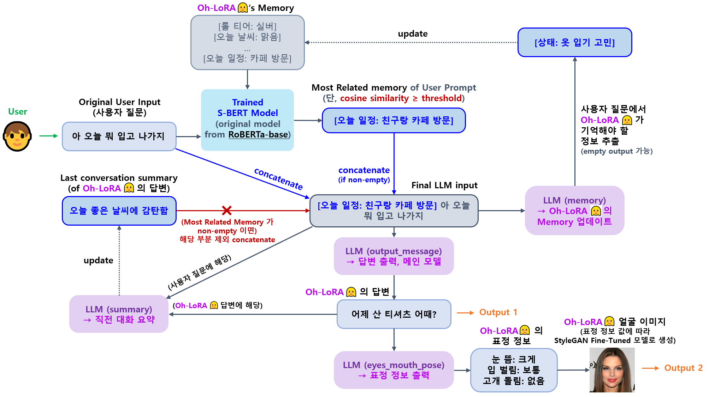

## 목차

* [1. OhLoRA-v2 LLM 전체 메커니즘](#1-ohlora-v2-llm-전체-메커니즘)
  * [1-1. LLM Memory (RAG-like concept)](#1-1-llm-memory-rag-like-concept)
  * [1-2. LLM Memory 메커니즘 학습 (S-BERT)](#1-2-llm-memory-메커니즘-학습-s-bert)
  * [1-3. LLM Memory 메커니즘 테스트 결과](#1-3-llm-memory-메커니즘-테스트-결과)
* [2. OhLoRA-v2 LLM Final Selection](#2-ohlora-v2-llm-final-selection)
* [3. OhLoRA-v2 LLM Fine-Tuning](#3-ohlora-v2-llm-fine-tuning)
* [4. 코드 실행 방법](#4-코드-실행-방법)
  * [4-1. 모델 다운로드 경로](#4-1-모델-다운로드-경로)

## 1. OhLoRA-v2 LLM 전체 메커니즘



* [LLM Memory](#1-1-llm-memory-rag-like-concept) 는 [RAG (Retrieval Augmented Generation)](https://github.com/WannaBeSuperteur/AI-study/blob/main/AI%20Basics/LLM%20Basics/LLM_%EA%B8%B0%EC%B4%88_RAG.md) 과 유사한 컨셉

| 모델                                     | 설명                                                                                                                                  |
|----------------------------------------|-------------------------------------------------------------------------------------------------------------------------------------|
| LLM 답변 ```output_message```            | Oh-LoRA 👱‍♀️ (오로라) 의 답변을 위한 메인 LLM                                                                                                 |
| memory (RAG-like concept) ```memory``` | 사용자의 질문 및 관련 정보로부터 Oh-LoRA 👱‍♀️ (오로라) 가 기억해야 할 내용 추출<br>- 이를 통해 [Oh-LoRA 👱‍♀️ (오로라) 의 메모리](#1-1-llm-memory-rag-like-concept) 업데이트 |
| 표정/몸짓 ```eyes_mouth_pose```            | [Oh-LoRA 👱‍♀️ (오로라) 이미지 생성](../stylegan/README.md) 을 위한 표정 정보 추출                                                                   |
| summary (하고 있는 대화 요약) ```summary```    | 사용자의 질문 및 Oh-LoRA 👱‍♀️ (오로라) 의 답변 내용을 요약하여, **다음 턴에서 이 정보를 활용하여 오로라가 보다 자연스럽게 답할 수 있게** 함                                          |

### 1-1. LLM Memory (RAG-like concept)


* 동작 원리
  * [오로라 1차 프로젝트의 LLM Memory 구현](../../2025_04_08_OhLoRA/llm/README.md#3-llm-memory-rag-like-concept) 과 동일
* 구현 코드
  * [S-BERT Training](memory_mechanism/train_sbert.py)
  * [S-BERT Inference](memory_mechanism/inference_sbert.py)
  * [Entry & Best Memory Item Choice](run_memory_mechanism.py)

### 1-2. LLM Memory 메커니즘 학습 (S-BERT)


* 학습 및 테스트 데이터
  * **실제 데이터** 는 **데이터 생성용 조합** 의 각 line 의 **memory** (예: ```[오늘 일정: 친구랑 카페 방문]```) 와 **message** (나머지 부분) 을 SQL 의 cartesian product 와 유사한 방법으로 combination (?) 하여 생성
  * [데이터 생성 구현 코드](memory_mechanism/generate_dataset.py)

| 데이터        | 데이터 생성용 조합                                                                    | 실제 데이터<br>(학습 대상 column : ```memory_0``` ```user_prompt_1``` ```similarity_score```) |
|------------|-------------------------------------------------------------------------------|--------------------------------------------------------------------------------------|
| 학습 및 valid | [train_dataset_combs.txt](memory_mechanism/train_dataset_combs.txt) (80 rows) | [train_dataset.csv](memory_mechanism/train_dataset.csv) (6,400 rows)                 |
| 테스트        | [test_dataset_combs.txt](memory_mechanism/test_dataset_combs.txt) (40 rows)   | [test_dataset.csv](memory_mechanism/test_dataset.csv) (1,600 rows)                   |

* Cosine Similarity 의 Ground Truth 값
  * 기본 컨셉 
    * 2 개의 memory text 의 key (예: ```[오늘 일정: 친구랑 카페 방문]``` → ```오늘 일정```) 에 대해,
    * **Pre-trained [S-BERT (Sentence BERT)](https://github.com/WannaBeSuperteur/AI-study/blob/main/Natural%20Language%20Processing/Basics_BERT%2C%20SBERT%20%EB%AA%A8%EB%8D%B8.md#sbert-%EB%AA%A8%EB%8D%B8) Model** 에 의해 도출된 유사도 **(Cosine Similarity)** 를 Ground Truth 로 함
  * 추가 구현 사항
    * ```좋아하는 아이돌``` 과 ```좋아하는 가수``` 라는 key 는 동일한 key 로 간주 
    * S-BERT 에 의해 계산된 similarity score ```x``` 의 분포를 **0 ~ 1 로 [정규화 (Normalization)](https://github.com/WannaBeSuperteur/AI-study/blob/main/AI%20Basics/Data%20Science%20Basics/%EB%8D%B0%EC%9D%B4%ED%84%B0_%EC%82%AC%EC%9D%B4%EC%96%B8%EC%8A%A4_%EA%B8%B0%EC%B4%88_Normalization.md)** 하기 위해 다음 수식 적용
      * **```x``` ← max(2.6 $\times$ ```x``` - 1.6, 0)**
    * memory text 의 key 가 ```상태``` 인 경우에는 그 대신 memory text 의 'value'를 이용
      * 예: ```[상태: 오로라 만나고 싶음]``` → key 인 ```상태``` 대신 value 인 ```오로라 만나고 싶음``` 을 이용 

* 학습 설정
  * Base Model : ```klue/roberta-base``` [(HuggingFace Link)](https://huggingface.co/klue/roberta-base)
  * Pooling 설정 : Mean Pooling 적용
  * 10 epochs

* 참고
  * [오로라 1차 프로젝트의 LLM Memory 용 S-BERT 모델 학습](../../2025_04_08_OhLoRA/llm/README.md#3-2-학습-및-테스트-데이터--학습-설정) 
  * [블로그 포스팅](https://velog.io/@jaehyeong/Basic-NLP-sentence-transformers-%EB%9D%BC%EC%9D%B4%EB%B8%8C%EB%9F%AC%EB%A6%AC%EB%A5%BC-%ED%99%9C%EC%9A%A9%ED%95%9C-SBERT-%ED%95%99%EC%8A%B5-%EB%B0%A9%EB%B2%95)

### 1-3. LLM Memory 메커니즘 테스트 결과

* Predicted vs. True Cosine Similarity 비교 (테스트 데이터셋)


* MSE, MAE & Corr-coef (테스트 데이터셋)

| Fine-Tuned S-BERT 모델                                            | [MSE](https://github.com/WannaBeSuperteur/AI-study/blob/main/AI%20Basics/Deep%20Learning%20Basics/%EB%94%A5%EB%9F%AC%EB%8B%9D_%EA%B8%B0%EC%B4%88_Loss_function.md#2-1-mean-squared-error-mse) | [MAE](https://github.com/WannaBeSuperteur/AI-study/blob/main/AI%20Basics/Deep%20Learning%20Basics/%EB%94%A5%EB%9F%AC%EB%8B%9D_%EA%B8%B0%EC%B4%88_Loss_function.md#2-3-mean-absolute-error-mae) | Corr-coef (상관계수) |
|-----------------------------------------------------------------|-----------------------------------------------------------------------------------------------------------------------------------------------------------------------------------------------|------------------------------------------------------------------------------------------------------------------------------------------------------------------------------------------------|------------------|
| 현재 버전                                                           | **0.0355**                                                                                                                                                                                    | **0.1280**                                                                                                                                                                                     | **0.7449**       |
| [오로라 1차 프로젝트](../../2025_04_08_OhLoRA/llm/README.md#3-3-테스트-결과) | 0.0880                                                                                                                                                                                        | 0.1681                                                                                                                                                                                         | 0.6259           |
| 비교                                                              | 🔽 **59.7 %**                                                                                                                                                                                 | 🔽 **23.9 %**                                                                                                                                                                                  | 🔼 **11.9 %p**   |

## 2. OhLoRA-v2 LLM Final Selection

* **Polyglot-Ko 1.3B (1.43 B params)**
  * [HuggingFace](https://huggingface.co/EleutherAI/polyglot-ko-1.3b)
* [오로라 1차 프로젝트](../../2025_04_08_OhLoRA/llm/README.md#1-llm-final-selection) 와 완전히 동일

## 3. OhLoRA-v2 LLM Fine-Tuning

* 학습 모델
  * **Polyglot-Ko 1.3B (1.43 B params) (✅ 최종 채택)** [HuggingFace](https://huggingface.co/EleutherAI/polyglot-ko-1.3b) 
* 학습 방법 
  * [SFT (Supervised Fine-Tuning)](https://github.com/WannaBeSuperteur/AI-study/blob/main/AI%20Basics/LLM%20Basics/LLM_%EA%B8%B0%EC%B4%88_Fine_Tuning_SFT.md)
  * [LoRA (Low-Rank Adaption)](https://github.com/WannaBeSuperteur/AI-study/blob/main/AI%20Basics/LLM%20Basics/LLM_%EA%B8%B0%EC%B4%88_Fine_Tuning_LoRA_QLoRA.md), LoRA Rank = 128
  * train for **60 epochs**
  * initial [learning rate](https://github.com/WannaBeSuperteur/AI-study/blob/main/AI%20Basics/Deep%20Learning%20Basics/%EB%94%A5%EB%9F%AC%EB%8B%9D_%EA%B8%B0%EC%B4%88_Learning_Rate.md) : **0.0003 (= 3e-4)**
* 학습 데이터셋
  * train 데이터 **456 rows**, valid 데이터 **70 rows** (v2, v2.1, v2.2 모두 동일)

| 모델                                     | 학습 데이터셋                                                                    |
|----------------------------------------|----------------------------------------------------------------------------|
| LLM 답변 ```output_message```            | dataset **v2.1** [(link)](fine_tuning_dataset/OhLoRA_fine_tuning_v2_1.csv) |
| memory (RAG-like concept) ```memory``` | dataset **v2** [(link)](fine_tuning_dataset/OhLoRA_fine_tuning_v2.csv)     |
| 표정/몸짓 ```eyes_mouth_pose```            | dataset **v2** [(link)](fine_tuning_dataset/OhLoRA_fine_tuning_v2.csv)     |
| summary (하고 있는 대화 요약) ```summary```    | dataset **v2.2** [(link)](fine_tuning_dataset/OhLoRA_fine_tuning_v2_2.csv) |

* 참고
  * [오로라 1차 프로젝트에서의 LLM Fine-Tuning 방법](../../2025_04_08_OhLoRA/llm/README.md#2-how-to-run-fine-tuning) 

## 4. 코드 실행 방법

모든 코드는 ```2025_05_02_OhLoRA_v2``` (프로젝트 메인 디렉토리) 에서 실행

* **Polyglot-Ko 1.3B** Fine-Tuned 모델 실행 (해당 모델 없을 시, Fine-Tuning 먼저 실행) 

| 모델                                      | 실행 방법 (option 1)                                                                   | 실행 방법 (option 2)                                                |
|-----------------------------------------|------------------------------------------------------------------------------------|-----------------------------------------------------------------|
| **메시지 (LLM answer)** 출력 모델              | ```python llm/run_fine_tuning.py -llm_name polyglot -output_col output_message```  | ```python llm/run_fine_tuning.py -output_col output_message```  |
| **LLM 메모리 (RAG-like concept)** 출력 모델    | ```python llm/run_fine_tuning.py -llm_name polyglot -output_col memory```          | ```python llm/run_fine_tuning.py -output_col memory```          |
| **LLM answer 요약** 출력 모델                 | ```python llm/run_fine_tuning.py -llm_name polyglot -output_col summary```         | ```python llm/run_fine_tuning.py -output_col summary```         |
| **Oh-LoRA 👱‍♀️ (오로라) 의 표정 & 몸짓** 출력 모델 | ```python llm/run_fine_tuning.py -llm_name polyglot -output_col eyes_mouth_pose``` | ```python llm/run_fine_tuning.py -output_col eyes_mouth_pose``` |

* **Memory Mechanism (S-BERT)** 모델 실행 (해당 모델 없을 시, Training 먼저 실행)
  * ```python llm/run_memory_mechanism.py```

### 4-1. 모델 다운로드 경로

* ```S-BERT (roberta-base)``` 모델은 학습 코드 실행 시 원본 모델을 자동으로 다운로드 후 학습하므로, **별도 다운로드 불필요**

| 모델 이름                       | 원본 모델                                                                                | Fine-Tuned LLM<br>(for OhLoRA-v2 👱‍♀️)                               |
|-----------------------------|--------------------------------------------------------------------------------------|-----------------------------------------------------------------------|
| ```Polyglot-Ko 1.3B```      | [EleutherAI HuggingFace](https://huggingface.co/EleutherAI/polyglot-ko-1.3b)         | TBU                                                                   |
| ```KoreanLM 1.5B```         | [Quantum AI HuggingFace](https://huggingface.co/quantumaikr/KoreanLM-1.5b/tree/main) | ❌ 학습 실패 [(참고)](../issue_reported.md#2-2-koreanlm-15b-llm-학습-불가-해결-보류) |
| ```S-BERT (roberta-base)``` | [HuggingFace](https://huggingface.co/klue/roberta-base)                              | TBU                                                                   |