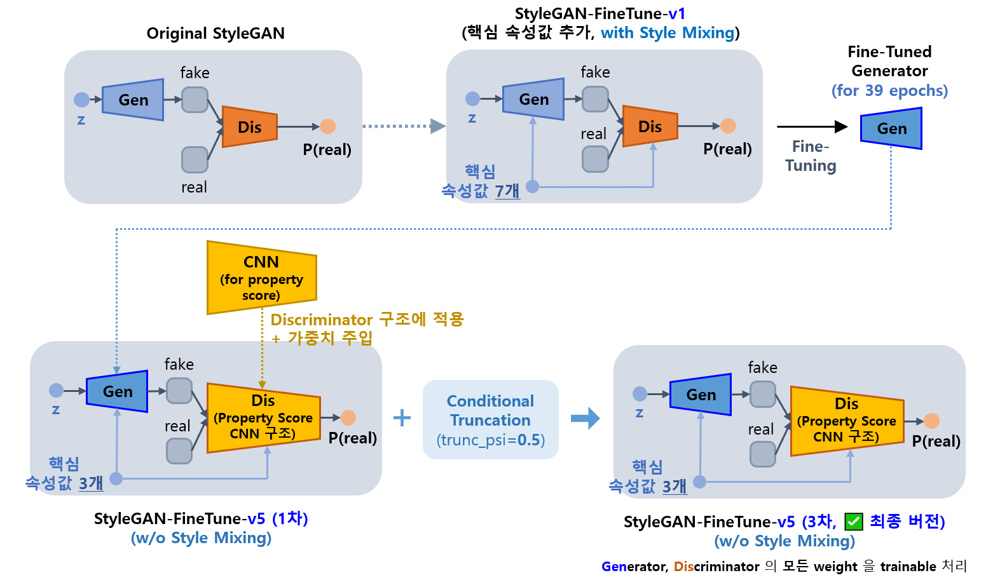
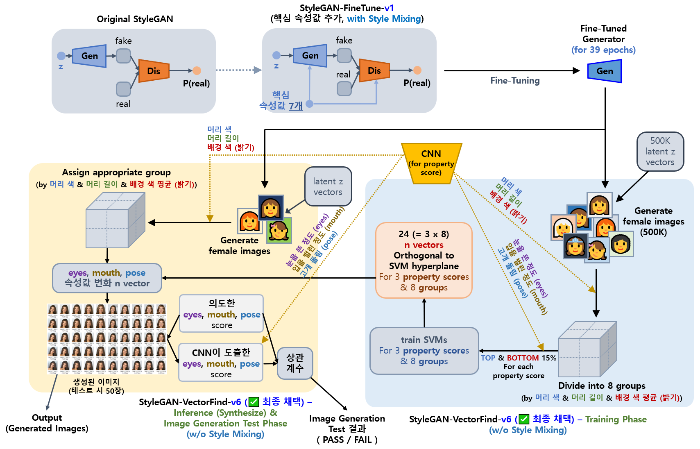
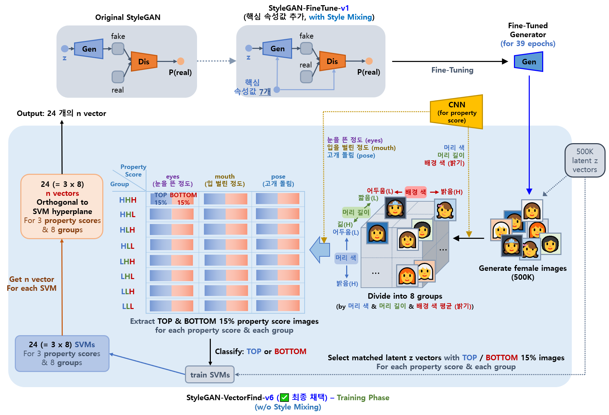
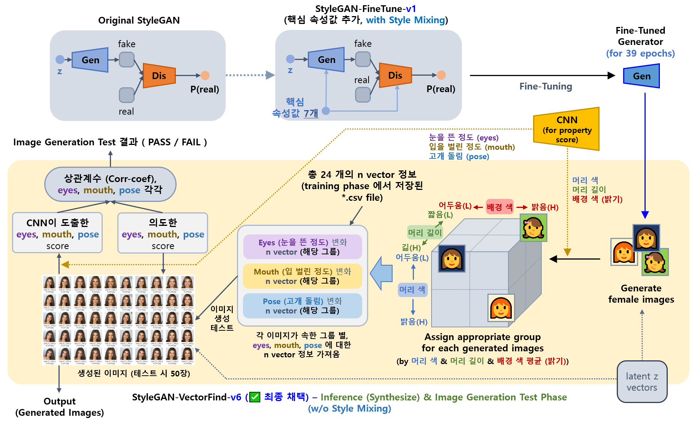
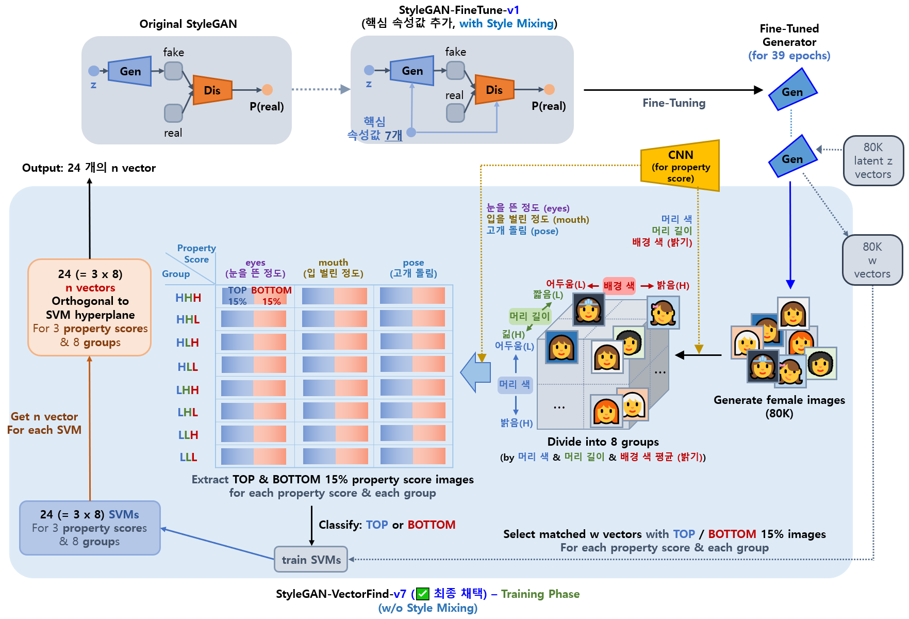
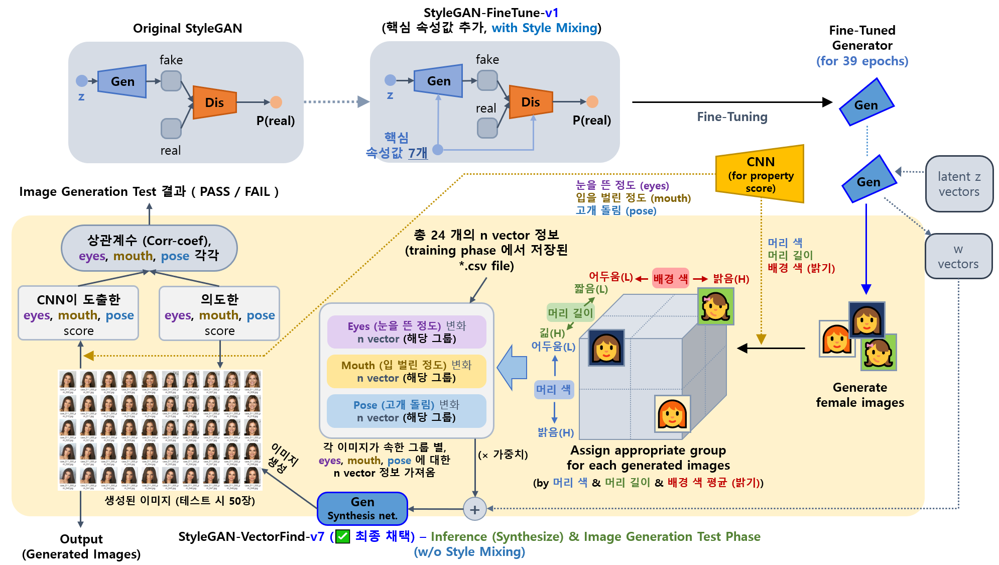

## 목차

* [1. 개요](#1-개요)
  * [1-1. 기존 StyleGAN-FineTune-v4 성능 향상 어려운 원인](#1-1-기존-stylegan-finetune-v4-성능-향상-어려운-원인) 
  * [1-2. StyleGAN-FineTune-v5 개선 방안](#1-2-stylegan-finetune-v5-개선-방안) 
* [2. 핵심 속성 값](#2-핵심-속성-값)
* [3. 사용 모델 설명](#3-사용-모델-설명)
  * [3-1. Fine-Tuned StyleGAN (StyleGAN-FineTune-v5)](#3-1-fine-tuned-stylegan-stylegan-finetune-v5) 
  * [3-2. StyleGAN-FineTune-v1 기반 핵심 속성값 변환 Latent z Vector 탐색 (StyleGAN-VectorFind-v6)](#3-2-stylegan-finetune-v1-기반-핵심-속성값-변환-latent-z-vector-탐색-stylegan-vectorfind-v6)
  * [3-3. StyleGAN-FineTune-v1 기반 핵심 속성값 변환 Intermediate w Vector 탐색 (StyleGAN-VectorFind-v7)](#3-3-stylegan-finetune-v1-기반-핵심-속성값-변환-intermediate-w-vector-탐색-stylegan-vectorfind-v7) 
* [4. 향후 진행하고 싶은 것](#4-향후-진행하고-싶은-것)
* [5. 코드 실행 방법](#5-코드-실행-방법)

## 1. 개요

* **Oh-LoRA 👱‍♀️ (오로라) 프로젝트의 v2 버전** 에서 사용하는 **가상 인간 여성 이미지 생성 알고리즘**
* **✅ 최종 채택** 알고리즘 : [StyleGAN-VectorFind-v6](#3-3-stylegan-finetune-v1-기반-핵심-속성값-변환-intermediate-w-vector-탐색-stylegan-vectorfind-v7)
  * StyleGAN-FineTune-v1 (**Fine-Tuned** StyleGAN, **여성 이미지 생성 확률 90% 이상**) 기반
  * StyleGAN-FineTune-v1 의 latent z vector 에서, **[핵심 속성 값](#2-핵심-속성-값) 을 변화시키는 벡터** 를 찾는 아이디어
  * [오로라 1차 프로젝트](../../2025_04_08_OhLoRA) 당시 **StyleGAN-FineTune-v2** 학습 목적으로 개발한 [Property Score CNN](../../2025_04_08_OhLoRA/stylegan_and_segmentation/README.md#3-3-cnn-model-나머지-핵심-속성-값-7개) 이 사용됨
    * StyleGAN-VectorFind-v7 의 **Training Phase 및 Inference & Image Generation Test Phase 에서 모두** 사용됨

**전체 모델 파이프라인 그림**

* StyleGAN-VectorFind-v7 을 제외한 나머지 부분은 [오로라 1차 프로젝트의 해당 부분](../../2025_04_08_OhLoRA/stylegan_and_segmentation/README.md) 과 동일 (해당 문서 참고)


### 1-1. 기존 StyleGAN-FineTune-v4 성능 향상 어려운 원인

[참고: Oh-LoRA (오로라) 1차 프로젝트 문서](../../2025_04_08_OhLoRA/stylegan_and_segmentation/README.md#3-1-image-generation-model-stylegan)

* 문제 상황
  * 기존 **StyleGAN-FineTune-v4** 의 경우 **StyleGAN-FineTune-v5** 와 마찬가지로 **StyleGAN-FineTune-v1** 을 핵심 속성 값을 이용하여 추가 Fine-Tuning
  * 그러나, **만족할 만한 성능이 나오지 않음**
* 문제 원인 (추정)
  * **Discriminator 구조상의 문제**
    * StyleGAN 의 Discriminator 를 **원래 StyleGAN 의 것으로** 사용
    * 이로 인해, Property CNN 구조처럼 핵심 속성 값을 계산하는 데 특화되어 있지 않음
    * 즉, **Discriminator 의 성능이 충분하지 않아서**, 이와 경쟁하는 Generator 의 성능도 크게 향상되기 어려웠음
  * **Frozen Layer**
    * Discriminator 의 Conv. Layer, Generator 의 Synthesize Layer 등, **Dense Layer 를 제외한 거의 모든 레이어를 Freeze** 처리함
    * 이로 인해 성능이 빠르게 향상되지 않음

### 1-2. StyleGAN-FineTune-v5 개선 방안

* Discriminator 구조를 [오로라 1차 프로젝트](../../2025_04_08_OhLoRA/README.md) 의 [Property Score 계산용 CNN](../../2025_04_08_OhLoRA/stylegan_and_segmentation/README.md#3-3-cnn-model-나머지-핵심-속성-값-7개) 의 구조로 바꾼다.
  * 해당 CNN의 가중치를 먼저 Discriminator 에 주입시킨 후 학습한다.
* Generator 와 Discriminator 의 모든 layer 를 **trainable (학습 가능) 상태** 로 만든다.

## 2. 핵심 속성 값

* 눈을 뜬 정도 ```eyes```, 입을 벌린 정도 ```mouth```, 고개 돌림 정도 ```pose``` 의 3가지 사용
* 상세 정보는 [오로라 1차 프로젝트 문서의 해당 부분](../../2025_04_08_OhLoRA/stylegan_and_segmentation/README.md#2-핵심-속성-값) 참고.
  * 여기서는 핵심 속성 값 계산 알고리즘으로 위 문서에서 언급된 알고리즘 중 [2차 알고리즘](../../2025_04_08_OhLoRA/stylegan_and_segmentation/README.md#2-2-핵심-속성-값-계산-알고리즘-2차-알고리즘-for-stylegan-finetune-v2-v3-v4) 사용

## 3. 사용 모델 설명

| 모델                                                                                                               | 최종 채택 | 핵심 아이디어                                                                                                                                                                                                                                                                                                                                                                                                                  | 성능 보고서                                                                                   |
|------------------------------------------------------------------------------------------------------------------|-------|--------------------------------------------------------------------------------------------------------------------------------------------------------------------------------------------------------------------------------------------------------------------------------------------------------------------------------------------------------------------------------------------------------------------------|------------------------------------------------------------------------------------------|
| [StyleGAN-FineTune-v5](#3-1-fine-tuned-stylegan-stylegan-finetune-v5)                                            | ❌     | - StyleGAN-FineTune-v1 의 **Discriminator 를 [Property Score 계산용 CNN](../../2025_04_08_OhLoRA/stylegan_and_segmentation/README.md#3-3-cnn-model-나머지-핵심-속성-값-7개) 구조로 바꿔서** 학습<br>- Conditional Truncation 적용 (```trunc_psi``` = 0.5) [(논문 스터디 자료)](https://github.com/WannaBeSuperteur/AI-study/blob/main/Paper%20Study/Vision%20Model/%5B2025.05.03%5D%20Art%20Creation%20with%20Multi-Conditional%20StyleGANs.md)         | [성능 보고서 **(1차, 3차 모두 성능 미달)**](stylegan_finetune_v5/train_result.md)                     |
| [StyleGAN-VectorFind-v6](#3-2-stylegan-finetune-v1-기반-핵심-속성값-변환-latent-z-vector-탐색-stylegan-vectorfind-v6)       | ❌     | - **핵심 속성값을 잘 변화** 시키는, latent vector z 에 대한 **벡터 찾기** [(논문 스터디 자료)](https://github.com/WannaBeSuperteur/AI-study/blob/main/Paper%20Study/Vision%20Model/%5B2025.05.05%5D%20Semantic%20Hierarchy%20Emerges%20in%20Deep%20Generative%20Representations%20for%20Scene%20Synthesis.md)<br>- 이때, 이미지를 머리 색 ```hair_color```, 머리 길이 ```hair_length```, 배경색 밝기 평균 ```background_mean``` 에 기반하여 8 그룹으로 나누고, **각 그룹별로 해당 벡터 찾기** | [성능 보고서 **(합격)**](stylegan_vectorfind_v6/svm_train_report/img_generation_test_result.md) |                                                    
| [StyleGAN-VectorFind-v7](#3-3-stylegan-finetune-v1-기반-핵심-속성값-변환-intermediate-w-vector-탐색-stylegan-vectorfind-v7) | ✅     | - StyleGAN-VectorFind-v6 과 동일<br>- 단, latent vector z 대신 **entangle (속성 간 얽힘) 이 보다 덜한 intermediate vector w 를 이용**                                                                                                                                                                                                                                                                                                       | [성능 보고서 **(합격)**](stylegan_vectorfind_v7/svm_train_report/img_generation_test_result.md) |                                                    

### 3-1. Fine-Tuned StyleGAN (StyleGAN-FineTune-v5)

**1. 핵심 아이디어**

* StyleGAN-FineTune-v1 의 **Discriminator 를 [Property Score 계산용 CNN](../../2025_04_08_OhLoRA/stylegan_and_segmentation/README.md#3-3-cnn-model-나머지-핵심-속성-값-7개) 구조로 변경**
  * 처음에 해당 Property Score CNN 의 가중치를 Discriminator 에 주입
* **Conditional Truncation** 적용 (```trunc_psi``` = 0.5)
  * [해당 스터디 자료](https://github.com/WannaBeSuperteur/AI-study/blob/main/Paper%20Study/Vision%20Model/%5B2025.05.03%5D%20Art%20Creation%20with%20Multi-Conditional%20StyleGANs.md) 의 논문의 핵심 아이디어임
* 기타 설정
  * StyleGAN 에서 **Style Mixing 미 적용**
  * 최종 버전 (3차 모델) 의 경우, Generator 와 Discriminator 의 모든 weight 을 학습 가능 (trainable) 처리



**2. 성능 보고서**

* [성능 보고서](stylegan_finetune_v5/train_result.md)
* 성능 보고서 요약

| 모델    | ```eyes``` 속성값 | ```mouth``` 속성값    | ```pose``` 속성값 |
|-------|----------------|--------------------|----------------|
| 1차 모델 | 학습이 **전혀 안 됨** | 학습이 **전혀 안 됨**     | 학습이 **거의 안 됨** |
| 3차 모델 | 학습이 **전혀 안 됨** | 학습이 **약간 됨 (불만족)** | 학습이 **거의 안 됨** |

### 3-2. StyleGAN-FineTune-v1 기반 핵심 속성값 변환 Latent z Vector 탐색 (StyleGAN-VectorFind-v6)

**1. 핵심 아이디어**

* **[StyleGAN-FineTune-v1](../../2025_04_08_OhLoRA/stylegan_and_segmentation/README.md#3-1-image-generation-model-stylegan) Generator** 기준
* **핵심 속성값을 잘 변화** 시키는, **latent vector z 에 대한 벡터 (n vector)** 찾기
  * 즉, n vector 를 랜덤하게 생성된 latent vector z 에 적절한 가중치로 가감하면, **```eyes``` ```mouth``` ```pose``` 의 핵심 속성 값이 바뀌고 나머지 속성들 (예: 배경 색, 전반적인 얼굴 형태) 은 거의 바뀌지 않은** 이미지를 생성할 수 있음
  * [참고 논문에 대한 스터디 자료](https://github.com/WannaBeSuperteur/AI-study/blob/main/Paper%20Study/Vision%20Model/%5B2025.05.05%5D%20Semantic%20Hierarchy%20Emerges%20in%20Deep%20Generative%20Representations%20for%20Scene%20Synthesis.md)
* 이미지를 머리 색 ```hair_color```, 머리 길이 ```hair_length```, 배경색 밝기 평균 ```background_mean``` 에 기반하여 8 그룹으로 나누고, **각 그룹별로 n vector 찾기**
  * **각 그룹별로 최적의 n vector 를 찾음** 으로써, 그룹으로 나뉘지 않았을 때에 비해 성능 향상을 꾀함
  * **머리 색, 머리 길이, 배경색 밝기 평균** 의 3가지 값에 대해, 각각 [해당 데이터](all_scores_v2_cnn.csv) 에서의 median 보다 큰지/작은지로 구분
    * 실제 median 값은 각각 ```-0.2709```, ```+0.3052```, ```+0.0742``` 
  * 즉, 값이 3가지이고 일정 기준보다 높다/낮다 만 있으므로, $2^3 = 8$ 개의 그룹으로 분류됨



**2. Training Phase**

* 핵심 아이디어
  * 핵심 속성 값 ```eyes``` ```mouth``` ```pose``` 를 가장 잘 변화시키는 **n vector 를 탐색하고, 그 결과를 csv 파일로 저장**
* n vector 정보 저장 위치
  * [property_score_vectors 디렉토리](stylegan_vectorfind_v6/property_score_vectors)



**3. Inference (Synthesize) & Image Generation Test Phase**

* 핵심 아이디어
  * **Training Phase 에서 찾은 n vector** 를 이용하여, 실제 이미지 생성 & 해당 n vector 가 핵심 속성값을 잘 변화시키는지 테스트
  * 이미지 생성 테스트에서 **합격한 벡터 중 일부를 사람이 최종 선별** 하여, 실제 **OhLoRA-v2** 버전의 **Oh-LoRA 👱‍♀️ (오로라)** 이미지 생성 용도로 사용할 latent vector (z) 를 획득 [(실제 획득 결과)](stylegan_vectorfind_v6/final_OhLoRA_info.md)
* Output (2가지)
  * 생성된 이미지
  * 핵심 속성값을 잘 변화시키는지에 대한 테스트 **(이미지 생성 테스트)** 결과 (PASS or FAIL)
* 참고 사항 (실제 구현)
  * **latent z vector** 는 [stylegan_vectorfind_v6/ohlora_z_vectors.csv 경로](stylegan_vectorfind_v6/ohlora_z_vectors.csv) 에 관련 정보가 저장되어 있으면 해당 정보에 따라 생성하고, 그렇지 않으면 랜덤으로 생성
  * **생성된 이미지를 그룹에 할당** 할 때, [stylegan_vectorfind_v6/ohlora_z_group_names.csv 경로](stylegan_vectorfind_v6/ohlora_z_group_names.csv) 에 관련 정보가 저장되어 있으면 Property Score CNN 을 이용하는 것이 아닌, 해당 저장된 정보를 이용하여 그룹에 할당
  * 현재 구현을 기준으로, 이미지 생성 테스트에서 합격하는 벡터는 **전체 latent vector (z) 의 약 4 ~ 5%** 정도



**4. 성능 보고서**

* [이미지 생성 테스트 결과](stylegan_vectorfind_v6/svm_train_report/img_generation_test_result.md)
* [성능 및 각 학습 단계별 실행 시간](stylegan_vectorfind_v6/svm_train_report/performance_and_time.md)
* [SVM training 결과 중심 상세 리포트](stylegan_vectorfind_v6/svm_train_report/svm_train_report.md)
* [최종 사용할 Oh-LoRA 👱‍♀️ (오로라) 이미지](stylegan_vectorfind_v6/final_OhLoRA_info.md)

**5. Latent vector (z) 관련**

* StyleGAN-FineTune-v1 학습 시 latent z vector 512 dim 외에, **원래 label 용도로 추가된 3 dim 을 핵심 속성값 변환 Vector 탐색 목적으로 추가 활용**
  * 즉, 512 + 3 = 총 515 dim 을 latent z vector 처럼 사용 
  * 해당 3 dim 은 StyleGAN-FineTune-v1 에서는 **16 dim 으로 mapping** 된 후, **latent z dim 512 + 16 → 528 로 concat** 되었음 [(참고)](../../2025_04_08_OhLoRA/stylegan_and_segmentation/model_structure_pdf/stylegan_finetune_v4_generator.pdf)

**6. 기타 참고 사항**

* n vector 를 찾을 때 [SVM (Support Vector Machine)](https://github.com/WannaBeSuperteur/AI-study/blob/main/AI%20Basics/Machine%20Learning%20Models/%EB%A8%B8%EC%8B%A0%EB%9F%AC%EB%8B%9D_%EB%AA%A8%EB%8D%B8_SVM.md) 을 이용하고, 속성 값이 상/하위 일정 비율인 이미지만을 SVM이 학습하는 것은 [해당 논문](https://arxiv.org/pdf/1911.09267) 의 핵심 아이디어임
* **이미지를 8개의 그룹으로 나누고, 각 그룹별로 (최적의) n vector 를 찾아서 성능 향상을 꾀하는 것** 은 위 논문의 아이디어와 본인의 아이디어를 **융합하여 적용** 한 것임

### 3-3. StyleGAN-FineTune-v1 기반 핵심 속성값 변환 Intermediate w Vector 탐색 (StyleGAN-VectorFind-v7)

```
OhLoRA-v2 프로젝트에서 오로라 (Oh-LoRA) 👱‍♀️ 이미지 생성을 위한 모델로 "️✅ 최종 채택"
```

**1. 핵심 아이디어**

* [StyleGAN-VectorFind-v6](#3-2-stylegan-finetune-v1-기반-핵심-속성값-변환-latent-z-vector-탐색-stylegan-vectorfind-v6) 기반
* **latent vector (z)** 대신 **intermediate vector (w)** 를 이용하여 핵심 속성 값을 변화
  * [참고: z vector 대신 w vector 가 **entangle, 즉 속성 (얼굴형, 피부 색, 머리 길이 등) 간 얽힘** 이 덜 되어 있음](https://github.com/WannaBeSuperteur/AI-study/blob/main/Paper%20Study/Vision%20Model/%5B2025.04.09%5D%20A%20Style-Based%20Generator%20Architecture%20for%20Generative%20Adversarial%20Networks.md#4-1-feature-%EB%A1%9C%EC%9D%98-mapping-%EB%B9%84%EA%B5%90)

| 구분                                                                                                                                          | latent vector (z)                         | intermediate vector (w)          |
|---------------------------------------------------------------------------------------------------------------------------------------------|-------------------------------------------|----------------------------------|
| 신경망 내에서의 위치<br>([StyleGAN Generator](https://github.com/WannaBeSuperteur/AI-study/blob/main/Paper%20Study/images/Vision_StyleGAN_1.PNG) 기준) | 입력 부분 (mapping 이전)                        | mapping 이후, synthesis network 이전 |
| 차원<br>([모델 구조 PDF 파일](model_structure_pdf/finetune_v1_generator_for_v7.pdf))                                                                | **515** = 512 (original) + 3 (additional) | **512**                          |


**2. Training Phase**

| 구분                                                                                                                                                                                                  | [StyleGAN-VectorFind-v6](#3-2-stylegan-finetune-v1-기반-핵심-속성값-변환-latent-z-vector-탐색-stylegan-vectorfind-v6) | StyleGAN-VectorFind-v7    |
|-----------------------------------------------------------------------------------------------------------------------------------------------------------------------------------------------------|------------------------------------------------------------------------------------------------------------|---------------------------|
| vector 추출을 위한 생성 이미지 개수                                                                                                                                                                             | 500,000 개 (= 500K)                                                                                         | 80,000 개 (= 80K)          | 
| [SVM (Support Vector Machine)](https://github.com/WannaBeSuperteur/AI-study/blob/main/AI%20Basics/Machine%20Learning%20Models/%EB%A8%B8%EC%8B%A0%EB%9F%AC%EB%8B%9D_%EB%AA%A8%EB%8D%B8_SVM.md) 학습 대상 | **latent z** vector                                                                                        | **intermediate w** vector |



**3. Inference (Synthesize) & Image Generation Test Phase**

| 구분                | [StyleGAN-VectorFind-v6](#3-2-stylegan-finetune-v1-기반-핵심-속성값-변환-latent-z-vector-탐색-stylegan-vectorfind-v6) | StyleGAN-VectorFind-v7                                                                                                                                                                     |
|-------------------|------------------------------------------------------------------------------------------------------------|--------------------------------------------------------------------------------------------------------------------------------------------------------------------------------------------|
| n vector 정보 저장 대상 | **latent z** vector                                                                                        | **intermediate w** vector                                                                                                                                                                  | 
| 이미지 생성용 벡터 생성 방법  | - **latent z** vector 에 각 핵심 속성 값 별 (weight) $\times$ (n vector) 을 더함                                      | - latent z vector 를 Fine-Tuned StyleGAN Generator 의 **mapping network** 에 입력 → **intermediate w** vector 를 출력<br>- **intermediate w** vector 각 핵심 속성 값 별 (weight) $\times$ (n vector) 을 더함 |
| 이미지 생성 방법         | - 이미지 생성용 **latent z** vector 를 Fine-Tuned StyleGAN Generator 의 **전체 구조** 에 직접 입력 → 이미지 생성                 | - 이미지 생성용 **intermediate w** vector 를 Fine-Tuned StyleGAN Generator 의 **synthesis network** 에 입력 → 이미지 생성                                                                                  |                                                                             |



**4. 성능 보고서**

* [이미지 생성 테스트 결과](stylegan_vectorfind_v7/svm_train_report/img_generation_test_result.md)
* [최종 사용할 Oh-LoRA 👱‍♀️ (오로라) 이미지](stylegan_vectorfind_v7/final_OhLoRA_info.md)

## 4. 향후 진행하고 싶은 것

* 기존의 **고품질 & 여성** 이라는 조건 외에, **젊어 보이는 사람의** 이미지를 [필터링](../../2025_04_08_OhLoRA/stylegan_and_segmentation/README.md#3-2-cnn-model-성별-이미지-품질) 조건에 추가
  * StyleGAN-FineTune-v1 으로 이미지를 추가 생성 후, **고품질 & 여성 & 젊어 보임** 이라는 3가지 조건으로 필터링
    * StyleGAN-FineTune-v1 은 **고품질의 여성 이미지 생성 확률이 90% 이상** 으로 높지만 완벽하지는 않으므로 **고품질 & 여성** 조건으로도 필터링 필요
  * **젊어 보임** 을 판단하는 CNN 을 [성별 & 이미지 품질 판단 CNN 과 동일한 방법](../../2025_04_08_OhLoRA/stylegan_and_segmentation/README.md#3-2-cnn-model-성별-이미지-품질) 으로 개발

* StyleGAN-VectorFind-v7 의 **이미지 생성 테스트 합격 기준** 변경
  * 현재 합격 기준 [(참고)](stylegan_vectorfind_v6/svm_train_report/img_generation_test_result.md#1-final-report) 보다 ```pose``` 의 cutoff 를 하향
  * 이미지의 **품질 (고품질) & 성별 (여성) & 일관성 (나머지 속성)** 을 합격 기준에 추가
    * 나머지 속성에 대한 **일관성** 이란, ```eyes``` ```mouth``` ```pose``` 값을 바꿔도 배경, 전반적인 얼굴 형태 등은 바뀌지 않음을 의미 

## 5. 코드 실행 방법

모든 코드는 ```2025_05_02_OhLoRA_v2``` (프로젝트 메인 디렉토리) 에서 실행

* **StyleGAN-FineTune-v5** 모델 Fine-Tuning
  * ```python stylegan/run_stylegan_finetune_v5.py```

* **StyleGAN-VectorFind-v6** 모델을 실행하여 Property Score 를 바꾸는 **latent z** vector 탐색
  * ```python stylegan/run_stylegan_vectorfind_v6.py```

* **StyleGAN-VectorFind-v7** 모델을 실행하여 Property Score 를 바꾸는 **intermediate w** vector 탐색
  * ```python stylegan/run_stylegan_vectorfind_v7.py```