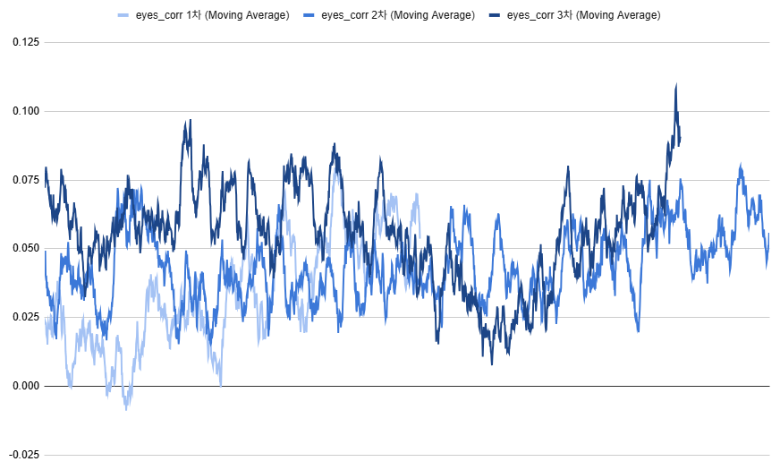
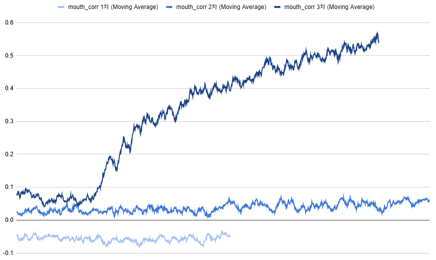
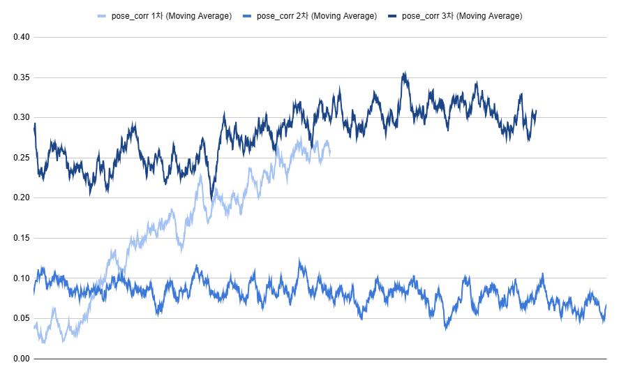
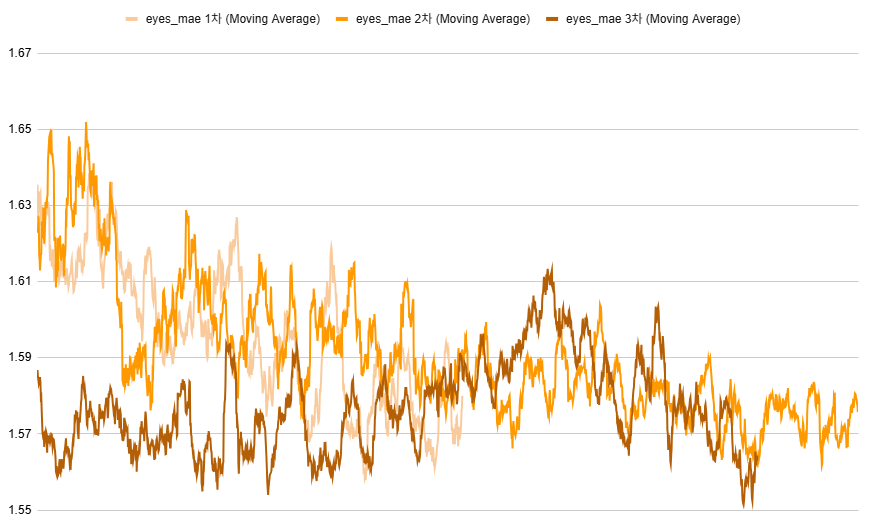
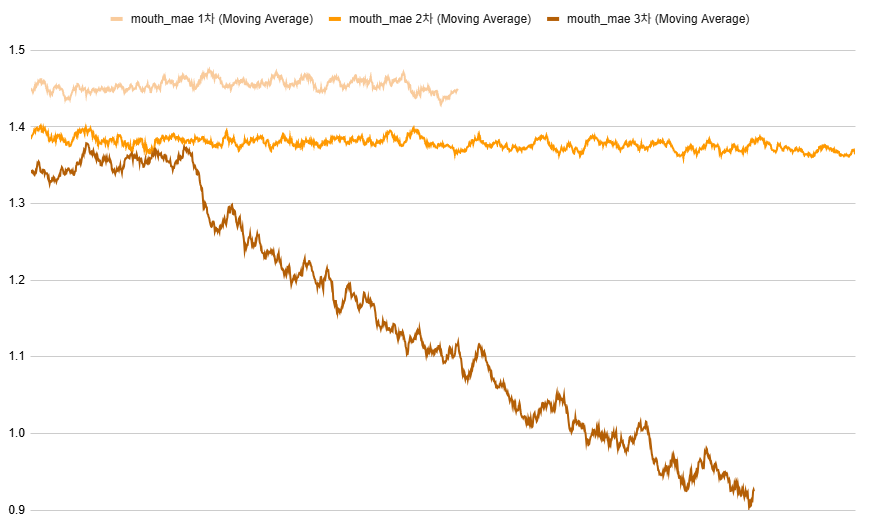
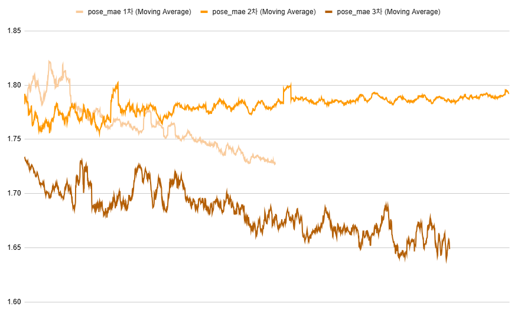

## 목차

* [1. 실험 개요](#1-실험-개요)
* [2. 실험 결과 요약](#2-실험-결과-요약)
* [3. 실험 결과 상세](#3-실험-결과-상세)
  * [3-1. Corr-coef of eyes, mouth, pose](#3-1-corr-coef-of-eyes-mouth-pose)
  * [3-2. MAE of eyes, mouth, pose](#3-2-mae-of-eyes-mouth-pose)

## 1. 실험 개요

다음 2가지의 값을 비교하여, **학습된 StyleGAN-FineTune-v5 모델이 생성한 이미지가 핵심 속성 값 label 에 얼마나 부합하는지** 를 평가한다.

* StyleGAN-FineTune-v5 모델이 생성한 이미지들의 **의도한 [핵심 속성 값](../../../2025_04_08_OhLoRA/stylegan_and_segmentation/README.md#2-핵심-속성-값) (```eyes```, ```mouth```, ```pose```)**
* StyleGAN-FineTune-v5 모델이 생성한 이미지들에 대해 **[핵심 속성 값을 도출하는, Pre-trained CNN 모델](../../../2025_04_08_OhLoRA/stylegan_and_segmentation/README.md#3-3-cnn-model-나머지-핵심-속성-값-7개) 에 의해 도출된 핵심 속성 값 (```eyes```, ```mouth```, ```pose```)**

## 2. 실험 결과 요약

* 최종 결론
  * 1차, 2차, 3차 실험 **모두** 만족스러운 이미지가 생성되지 않음
  * **StyleGAN-FineTune-v1 + 핵심 속성 값 도출 CNN** 을 기반으로, [Label 을 나타내는 벡터를 찾는 방법](https://github.com/WannaBeSuperteur/AI-study/blob/main/Paper%20Study/Vision%20Model/%5B2025.05.05%5D%20Semantic%20Hierarchy%20Emerges%20in%20Deep%20Generative%20Representations%20for%20Scene%20Synthesis.md) 을 이용하는 것이 가장 좋을 듯함

| 실험 차수<br>(학습 시간) | 모델 구조                                                                                                                                                                                                                                                                        | 핵심 속성 값 반영 정도<br>(eyes / mouth / pose) | 기타 사항                                                            |
|------------------|------------------------------------------------------------------------------------------------------------------------------------------------------------------------------------------------------------------------------------------------------------------------------|----------------------------------------|------------------------------------------------------------------|
| 1차<br>(8 hours)  | - Discriminator 를 [핵심 속성 값 도출 Pre-trained CNN](../../../2025_04_08_OhLoRA/stylegan_and_segmentation/README.md#3-3-cnn-model-나머지-핵심-속성-값-7개) 구조로 변경<br>- 해당 CNN 모델의 가중치를 사전 주입                                                                                                | 최하 / 최하 / 하                            | -                                                                |
| 2차<br>(6 hours)  | - [StyleGAN-FineTune-v2](../../../2025_04_08_OhLoRA/stylegan_and_segmentation/README.md#3-1-image-generation-model-stylegan) 와 유사한 구조 사용<br>- 해당 구조로 **보다 오랫동안 (6 hours) 학습**                                                                                                | 최하 / 최하 / 최하                           | -                                                                |
| 3차<br>(17 hours) | - **1차** 실험의 모델을 베이스로, [Conditional Truncation](https://github.com/WannaBeSuperteur/AI-study/blob/main/Paper%20Study/Vision%20Model/%5B2025.05.03%5D%20Art%20Creation%20with%20Multi-Conditional%20StyleGANs.md#3-2-conditional-truncation) 추가 적용<br>- ```trunc_psi``` = 0.5 | 최하 / **중 (불만족)** / 하                   | - 생성된 이미지의 품질이 비교적 낮음 (특히 입, 이마 부분 등)<br>- 생성된 이미지의 다양성이 비교적 떨어짐 |

## 3. 실험 결과 상세

| 비교 지표                                                                                                                                                                                                                | 설명                                  |
|----------------------------------------------------------------------------------------------------------------------------------------------------------------------------------------------------------------------|-------------------------------------|
| 상관계수 (Corr-coef)                                                                                                                                                                                                     | -1 ~ +1 의 값이며, **+1 에 가깝게 높을수록** 좋음 |
| [Mean-Absolute Error (MAE)](https://github.com/WannaBeSuperteur/AI-study/blob/main/AI%20Basics/Deep%20Learning%20Basics/%EB%94%A5%EB%9F%AC%EB%8B%9D_%EA%B8%B0%EC%B4%88_Loss_function.md#2-3-mean-absolute-error-mae) | **0 에 가깝게 낮을수록** 좋음                 |

* 모든 그래프에서 가로축은 training step, 세로축은 Corr-coef (파란색) 또는 MAE 값 (오렌지색) 을 나타냄

### 3-1. Corr-coef of eyes, mouth, pose

* Corr-coef of ```eyes```
  * 1차, 2차, 3차 모두에서 사실상 무의미한 수준으로 학습됨 



* Corr-coef of ```mouth```
  * **3차 실험** 은 1차, 2차와 달리 비교적 유의미한 수준으로 학습됨



* Corr-coef of ```pose```
  * 표준적인 방법에 가까운 1차, 3차 실험이, 본인의 새로운 아이디어에 가까운 2차 실험보다 비교적 유의미한 수준으로 학습됨 



### 3-2. MAE of eyes, mouth, pose

* MAE of ```eyes```
  * 1차, 2차, 3차 모두에서 사실상 무의미한 수준으로 학습됨 



* MAE of ```mouth```
  * **3차 실험** 은 1차, 2차와 달리 비교적 유의미한 수준으로 학습됨



* MAE of ```pose```
  * **3차 실험** 은 1차, 2차보다 약간 유의미한 수준으로 학습되었으나, 거의 무의미한 수준임

