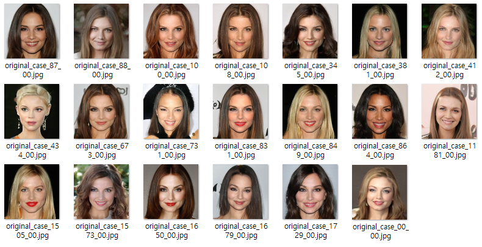

## 목차

* [1. 최종 Oh-LoRA 👱‍♀️ (오로라) 생성 정보](#1-최종-oh-lora--오로라-생성-정보)
  * [1-1. 추가 설명](#1-1-추가-설명)
* [2. 최종 선정 latent vector 로 생성한 이미지](#2-최종-선정-latent-vector-로-생성한-이미지)

## 1. 최종 Oh-LoRA 👱‍♀️ (오로라) 생성 정보

* 요약
  * 이미지 생성 테스트에 합격한 latent vector (z) 중, **해당 latent vector 로 생성된 50장의 이미지를 사람의 눈으로 판독** 하여 Oh-LoRA 👱‍♀️ (오로라) 생성 용도로 사용할 **최종 latent vector 를 선정**
* 선정 기준 
  * 2003년생 대학생이라는 설정에 적합한 **젊은 여성** 이미지인지
  * [핵심 속성 값](../../../2025_04_08_OhLoRA/stylegan_and_segmentation/README.md#2-핵심-속성-값) 인 ```eyes``` ```mouth``` ```pose``` 가 **진짜로** 제대로 반영되고 있는지
    * 핵심 속성 값이 변하면서 **배경, 전체적인 얼굴 형태 등이 지나치게 많이 변하지** 는 않는지 
  * **불쾌한 골짜기** 현상이 충분히 적을 것인지

| 단계                                                                                 | latent vector 개수 | 관련 정보                                                                                                                                                                                  |
|------------------------------------------------------------------------------------|------------------|----------------------------------------------------------------------------------------------------------------------------------------------------------------------------------------|
| 총 테스트 대상 latent vector (z)                                                         | 1,730 개          | [csv file](https://github.com/WannaBeSuperteur/AI_Projects/tree/82b187de5d9c71f1275800b2a4da6e888049765a/2025_05_02_OhLoRA_v2/stylegan/stylegan_vectorfind_v6/image_generation_report) |
| [이미지 생성 테스트](svm_train_report/img_generation_test_result.md) 합격한 latent vector (z) | 80 개 (4.6 %)     |                                                                                                                                                                                        |
| 최종 선정 latent vector (z)                                                            | **20 개 (1.2 %)** | [csv file](ohlora_z_vectors.csv)                                                                                                                                                       |

### 1-1. 추가 설명

1개의 latent vector (z) 를 테스트하는 데 **3초** 가 걸린다고 했을 때,

* 이미지 생성 테스트에 합격하는 벡터는 **약 65초 (1분 5초)** 에 1개 등장
* 최종 Oh-LoRA 👱‍♀️ (오로라) 이미지 생성에 사용할 만한 벡터 (최종 선정 latent vector) 는 **약 260초 (4분 20초)** 에 1개 등장

## 2. 최종 선정 latent vector 로 생성한 이미지

* **OhLoRA-v2** 의 **최종 Oh-LoRA 👱‍♀️ (오로라)** 이미지에 해당
* 모든 이미지는 **해당 latent vector (z) 의 원본** 으로 생성한 것으로, **핵심 속성 값을 변화시키는 벡터를 가감하지 않은 z 벡터** 로 생성함

