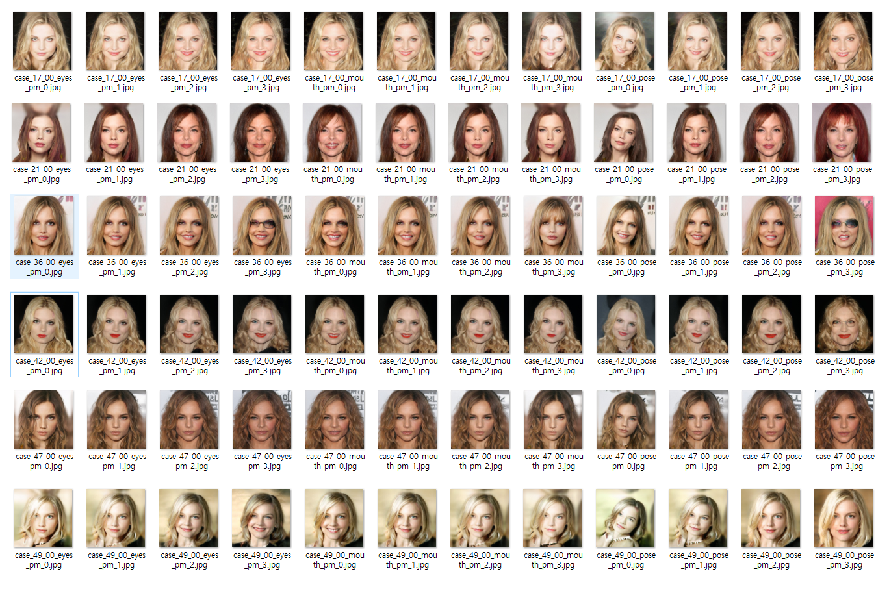
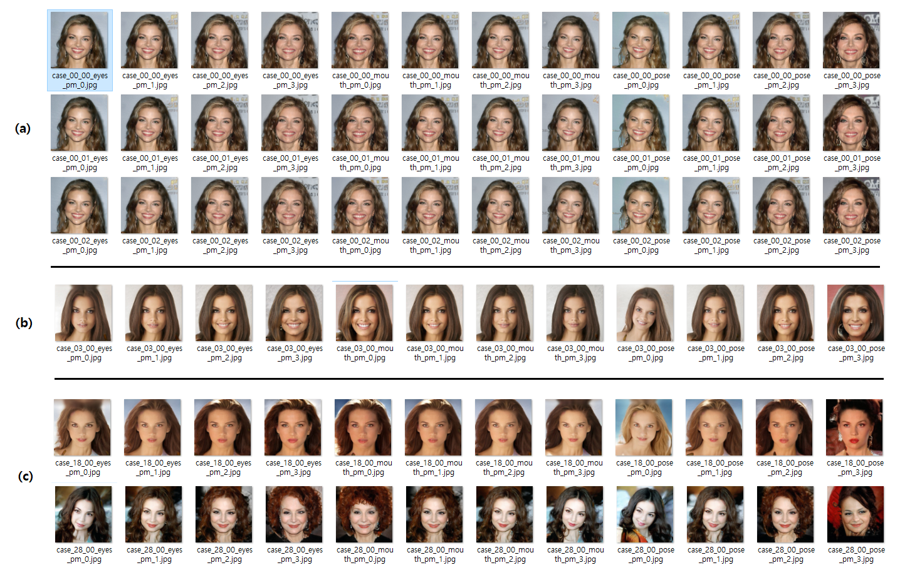

## 2025.05.07 09:40

* total synthesized samples = **25,000**
* use each property score top **5,000 (= 20.0%)** & bottom **5,000 (= 20.0%)** for SVM training

```
training SVM for eyes ...

=== Support Vector Machine 0 for eyes ===
accuracy          : 0.8420
recall    (large) : 0.8610
precision (large) : 0.8295
F1 score  (large) : 0.8449
recall    (small) : 0.8230
precision (small) : 0.8555
F1 score  (small) : 0.8389

training SVM for mouth ...

=== Support Vector Machine 0 for mouth ===
accuracy          : 0.8165
recall    (large) : 0.8150
precision (large) : 0.8175
F1 score  (large) : 0.8162
recall    (small) : 0.8180
precision (small) : 0.8156
F1 score  (small) : 0.8168

training SVM for pose ...

=== Support Vector Machine 0 for pose ===
accuracy          : 0.8265
recall    (large) : 0.8110
precision (large) : 0.8369
F1 score  (large) : 0.8238
recall    (small) : 0.8420
precision (small) : 0.8167
F1 score  (small) : 0.8291
```

**Generated Images**

* 한 행의 12장 중 왼쪽 4장은 ```eyes```, 가운데 4장은 ```mouth```, 오른쪽 4장은 ```pose``` 속성을 변동시킴
* 아래와 같이 **어느 정도 의도대로 잘 나오는** 조합이 **6 / 50 개 (12 %)**



## 2025.05.07 07:00

* total synthesized samples = **600,000**
* use each property score top **2,500 (= 0.42%)** & bottom **2,500 (= 0.42%)** for SVM training

```
training SVM for eyes ...

=== Support Vector Machine 0 for eyes ===
accuracy          : 0.9130
recall    (large) : 0.9200
precision (large) : 0.9073
F1 score  (large) : 0.9136
recall    (small) : 0.9060
precision (small) : 0.9189
F1 score  (small) : 0.9124

=== Support Vector Machine 1 for eyes ===
accuracy          : 0.9200
recall    (large) : 0.9240
precision (large) : 0.9167
F1 score  (large) : 0.9203
recall    (small) : 0.9160
precision (small) : 0.9234
F1 score  (small) : 0.9197

=== Support Vector Machine 2 for eyes ===
accuracy          : 0.9120
recall    (large) : 0.9140
precision (large) : 0.9104
F1 score  (large) : 0.9122
recall    (small) : 0.9100
precision (small) : 0.9137
F1 score  (small) : 0.9118

training SVM for mouth ...

=== Support Vector Machine 0 for mouth ===
accuracy          : 0.8850
recall    (large) : 0.9000
precision (large) : 0.8738
F1 score  (large) : 0.8867
recall    (small) : 0.8700
precision (small) : 0.8969
F1 score  (small) : 0.8832

=== Support Vector Machine 1 for mouth ===
accuracy          : 0.8890
recall    (large) : 0.8800
precision (large) : 0.8961
F1 score  (large) : 0.8880
recall    (small) : 0.8980
precision (small) : 0.8821
F1 score  (small) : 0.8900

=== Support Vector Machine 2 for mouth ===
accuracy          : 0.8650
recall    (large) : 0.8580
precision (large) : 0.8702
F1 score  (large) : 0.8640
recall    (small) : 0.8720
precision (small) : 0.8600
F1 score  (small) : 0.8659

training SVM for pose ...

=== Support Vector Machine 0 for pose ===
accuracy          : 0.9920
recall    (large) : 0.9900
precision (large) : 0.9940
F1 score  (large) : 0.9920
recall    (small) : 0.9940
precision (small) : 0.9900
F1 score  (small) : 0.9920

=== Support Vector Machine 1 for pose ===
accuracy          : 0.9960
recall    (large) : 1.0000
precision (large) : 0.9921
F1 score  (large) : 0.9960
recall    (small) : 0.9920
precision (small) : 1.0000
F1 score  (small) : 0.9960

=== Support Vector Machine 2 for pose ===
accuracy          : 0.9950
recall    (large) : 0.9960
precision (large) : 0.9940
F1 score  (large) : 0.9950
recall    (small) : 0.9940
precision (small) : 0.9960
F1 score  (small) : 0.9950
```

**Generated Images**

* 한 행의 12장 중 왼쪽 4장은 ```eyes```, 가운데 4장은 ```mouth```, 오른쪽 4장은 ```pose``` 속성을 변동시킴

| 항목  | 설명                                                                                                    |
|-----|-------------------------------------------------------------------------------------------------------|
| (a) | 여러 개의 normal vector 간 생성되는 이미지 차이는 거의 없음                                                              |
| (b) | 이 생성 결과는 핵심 속성 값을 의도대로 반영하는 편임                                                                        |
| (c) | 이들 생성 결과는 **핵심 속성 값을 변동시켰을 때, 그 외의 속성도 같이 변동** 되는 편임<br>- 특히, 평균 정확도 99% 이상인 **pose (고개 돌림)** 역시 마찬가지 |



## 2025.05.06 22:38

* total synthesized samples = **120,000**
* use each property score top **500 (= 0.42%)** & bottom **500 (= 0.42%)** for SVM training

```
training SVM for eyes ...
accuracy          : 0.8750
recall    (large) : 0.8500
precision (large) : 0.8947
F1 score  (large) : 0.8718
recall    (small) : 0.9000
precision (small) : 0.8571
F1 score  (small) : 0.8780

accuracy          : 0.8400
recall    (large) : 0.8400
precision (large) : 0.8400
F1 score  (large) : 0.8400
recall    (small) : 0.8400
precision (small) : 0.8400
F1 score  (small) : 0.8400

training SVM for pose ...
accuracy          : 0.9650
recall    (large) : 0.9600
precision (large) : 0.9697
F1 score  (large) : 0.9648
recall    (small) : 0.9700
precision (small) : 0.9604
F1 score  (small) : 0.9652
```

## 2025.05.06 18:27

* total synthesized samples = **60,000**
* use each property score top **300 (= 0.50%)** & bottom **300 (= 0.50%)** for SVM training

```
training SVM for eyes ...
accuracy          : 0.8083
recall    (large) : 0.8167
precision (large) : 0.8033
F1 score  (large) : 0.8099
recall    (small) : 0.8000
precision (small) : 0.8136
F1 score  (small) : 0.8067

training SVM for mouth ...
accuracy          : 0.8083
recall    (large) : 0.8333
precision (large) : 0.7937
F1 score  (large) : 0.8130
recall    (small) : 0.7833
precision (small) : 0.8246
F1 score  (small) : 0.8034

training SVM for pose ...
accuracy          : 0.9667
recall    (large) : 0.9833
precision (large) : 0.9516
F1 score  (large) : 0.9672
recall    (small) : 0.9500
precision (small) : 0.9828
F1 score  (small) : 0.9661
```

## 2025.05.06 17:45

* total synthesized samples = **12,000**
* use each property score top **100 (= 0.83%)** & bottom **100 (= 0.83%)** for SVM training

```
training SVM for eyes ...
accuracy          : 0.8000
recall    (large) : 0.7500
precision (large) : 0.8333
F1 score  (large) : 0.7895
recall    (small) : 0.8500
precision (small) : 0.7727
F1 score  (small) : 0.8095

training SVM for mouth ...
accuracy          : 0.6750
recall    (large) : 0.7500
precision (large) : 0.6522
F1 score  (large) : 0.6977
recall    (small) : 0.6000
precision (small) : 0.7059
F1 score  (small) : 0.6486

training SVM for pose ...
accuracy          : 0.8750
recall    (large) : 0.9000
precision (large) : 0.8571
F1 score  (large) : 0.8780
recall    (small) : 0.8500
precision (small) : 0.8947
F1 score  (small) : 0.8718
```