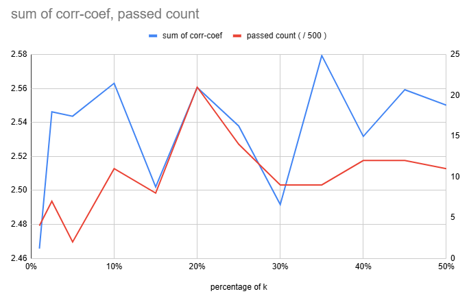
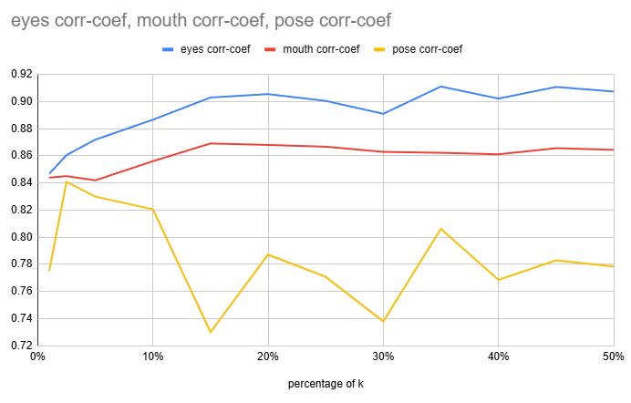

## 목차

* [1. Final Report](#1-final-report)
  * [1-1. 추가 확인 필요 사항](#1-1-추가-확인-필요-사항) 
* [2. Grouping](#2-grouping)
* [3. Image Generation Test Result](#3-image-generation-test-result)

## 1. Final Report

* 결론
  * **StyleGAN-VectorFind-v7 (intermediate w vector 기준)** 은 **StyleGAN-VectorFind-v6 (latent z vector 기준)** 보다 성능이 **훨씬 좋음**

* 실험 설정
  * random intermediate w vector 를 **아래 결과처럼 100 개가 아닌, 이보다 훨씬 많은 개수** 로 하여 테스트
  * [grouping](#2-grouping) (8 groups) 는 **모든 case 에 대해 항상 적용**

* passed 기준 **(모두 만족)**
  * 각 속성 값 별, **의도한 값 vs. 실제 생성된 이미지에 대해 Property Score CNN 으로 도출한 값** 의 corr-coef (상관계수) 가 다음을 만족 
  * ```eyes``` : 상관계수의 절댓값이 **0.92 이상** ([v6](../../stylegan_vectorfind_v6/svm_train_report/img_generation_test_result.md) : 0.75 이상)
  * ```mouth``` : 상관계수의 절댓값이 **0.88 이상** ([v6](../../stylegan_vectorfind_v6/svm_train_report/img_generation_test_result.md) : 0.77 이상)
  * ```pose``` : 상관계수의 절댓값이 **0.92 이상** ([v6](../../stylegan_vectorfind_v6/svm_train_report/img_generation_test_result.md) : 0.80 이상)

| n<br>(total samples) | k<br>(top / bottom samples) | latent vectors<br>(random z) | passed cases | Final Oh-LoRA 적합 case | ```eyes``` mean corr-coef | ```mouth``` mean corr-coef | ```pose``` mean corr-coef | details<br>(csv) |
|----------------------|-----------------------------|------------------------------|--------------|-----------------------|---------------------------|----------------------------|---------------------------|------------------|
|                      |                             |                              |              |                       |                           |                            |                           |                  |

### 1-1. 추가 확인 필요 사항

* Property Score ```eyes``` ```mouth``` ```pose``` 에 대해, **의도한 값을 잘 반영하여** Oh-LoRA 👱‍♀️ (오로라) 얼굴 이미지를 생성할수록 **(= 아래 상관계수의 절댓값이 클수록), 속성 값 조정 시 다른 속성에 대한 영향이 작은 듯하다?**
  * 즉, 해당 각 Property Score 별 의도한 값을 바꿔서 생성할 때, **다른 속성 (예: 얼굴형, 머리 색 등) 이 잘 바뀌지 않음**
  * **StyleGAN-VectorFind-v7 의 위 기준** 에 따라 passed 처리된 case 의 경우, 위와 같이 Property Score 의도한 값을 바꿔도 다른 속성이 [**StyleGAN-VectorFind-v6** 에서의 passed case 들](../../stylegan_vectorfind_v6/svm_train_report/img_generation_test_result.md) 에 비해 잘 바뀌지 않음

* Sample 개수가 너무 많아서 **Property Score 를 변경하는 벡터를 SVM이 너무 정확히 학습** 하면 오히려 부자연스러워진다?
  * 의도한 핵심 속성 값 변경 시, 핵심 속성 값에 해당하는 영역 외의 픽셀 (배경 등) 은 **부자연스러울 정도로 거의 변하지 않음**
  * [핵심 속성 값 도출용 CNN](../../../../2025_04_08_OhLoRA/stylegan_and_segmentation/README.md#3-3-cnn-model-나머지-핵심-속성-값-7개) 이 핵심 속성 값 도출을 위해 학습하는 영역은 **각 CNN 별 지정된, 전체 이미지의 일부분** 임
  * Sample 개수 n = 300K, k = 60K 정도가 되면 발생하는 것으로 추정

## 2. Grouping

* 이미지를 random latent code (z) 로부터 생성할 때,
  * 해당 이미지의 **머리 색, 머리 길이, 배경 색 평균** 의 핵심 속성 값을 Property Score CNN 으로 예측
  * 해당 핵심 속성 값을 기준으로 이미지를 각 그룹으로 분류
* 각 그룹별로,
  * t-SNE 실시 및 SVM 학습
  * **눈을 뜬 정도, 입을 벌린 정도, 고개 돌림** 각각에 대한 n vector 계산
* inference 시,
  * 생성된 이미지가 어느 그룹에 속하는지 Property Score CNN 으로 판단
  * 해당 그룹에 맞는 **눈을 뜬 정도, 입을 벌린 정도, 고개 돌림** n vector 를 이용하여 핵심 속성 값이 변동된 이미지 생성

## 3. Image Generation Test Result

* **결론**
  * **StyleGAN-VectorFind-v7 의 성능이 StyleGAN-VectorFind-v6 보다 훨씬 좋음**
    * SVM accuracy & mean corr-coef 모두.
  * Sample 개수가 충분히 많으면, Sample 개수를 더 늘려도 **corr-coef 는 거의 증가하지 않음**

* 실험 설정
  * 모든 실험에서 **[sklearnex](https://medium.com/intel-analytics-software/from-hours-to-minutes-600x-faster-svm-647f904c31ae)** 및 **[grouping](#2-grouping) (8 groups)** 둘 다 적용
  * 모든 실험에서 ```SVC(kernel='linear', ...)``` 대신 **```LinearSVC(...)``` 를 적용**

* 결과 표 해석
  * mean corr-coef
    * 각 corr-coef (상관계수) 는 **각 case 별 50 장의 생성된 이미지** 에 대해, **의도한 Property Scores vs. 실제 CNN 에 의해 도출된 Property Scores** 의 상관계수
      * **중요: Intended Property Scores** 는 **StyleGAN-VectorFind-v6** 과는 다르게 설정됨
    * 각 실험 별 100 cases (random z latent vectors)
  * 비교 (🔺 표시된 부분)
    * **StyleGAN-VectorFind-v6** 의 동일 결과와의 비교

| Sample Count             |                                 | Performance<br>(SVM accuracy)                                                                        |                                                                                                      |                                                                                                          | mean corr-coef<br>(상관계수)                                                                             |                                                                                                          |                                                                                                          |
|--------------------------|---------------------------------|------------------------------------------------------------------------------------------------------|------------------------------------------------------------------------------------------------------|----------------------------------------------------------------------------------------------------------|------------------------------------------------------------------------------------------------------|----------------------------------------------------------------------------------------------------------|----------------------------------------------------------------------------------------------------------|
| **n<br>(total samples)** | **k<br>(top / bottom samples)** | **```eyes``` accuracy<br>(0 ~ 1)**                                                                   | **```mouth``` accuracy<br>(0 ~ 1)**                                                                  | **```pose``` accuracy<br>(0 ~ 1)**                                                                       | **```eyes``` mean corr-coef**                                                                        | **```mouth``` mean corr-coef**                                                                           | **```pose``` mean corr-coef**                                                                            |
| 4.0K                     | 800 / 800<br>**(20% each)**     | 0.9565<br>[(🔺 0.3430)](../../stylegan_vectorfind_v6/svm_train_report/img_generation_test_result.md) | 0.9317<br>[(🔺 0.2223)](../../stylegan_vectorfind_v6/svm_train_report/img_generation_test_result.md) | 0.9224<br>[(🔺 0.1568)](../../stylegan_vectorfind_v6/svm_train_report/img_generation_test_result.md)     | 0.8808<br>[(🔺 0.1460)](../../stylegan_vectorfind_v6/svm_train_report/img_generation_test_result.md) | 0.8522<br>[(🔺 0.2255)](../../stylegan_vectorfind_v6/svm_train_report/img_generation_test_result.md)     | **0.8433**<br>[(🔺 0.2823)](../../stylegan_vectorfind_v6/svm_train_report/img_generation_test_result.md) |
| 10.0K                    | 2.0K / 2.0K<br>**(20% each)**   | 0.9330                                                                                               | 0.9653                                                                                               | 0.9467                                                                                                   | 0.8891                                                                                               | 0.8375                                                                                                   | 0.8036                                                                                                   |
| 20.0K                    | 4.0K / 4.0K<br>**(20% each)**   | 0.9613                                                                                               | 0.9757                                                                                               | 0.9377                                                                                                   | 0.9024                                                                                               | 0.8568                                                                                                   | 0.7899                                                                                                   |
| 50.0K                    | 10.0K / 10.0K<br>**(20% each)** | 0.9581<br>[(🔺 0.1929)](../../stylegan_vectorfind_v6/svm_train_report/img_generation_test_result.md) | 0.9863<br>[(🔺 0.2146)](../../stylegan_vectorfind_v6/svm_train_report/img_generation_test_result.md) | 0.9546<br>[(🔺 0.1881)](../../stylegan_vectorfind_v6/svm_train_report/img_generation_test_result.md)     | 0.8992<br>[(🔺 0.1203)](../../stylegan_vectorfind_v6/svm_train_report/img_generation_test_result.md) | 0.8626<br>[(🔺 0.1766)](../../stylegan_vectorfind_v6/svm_train_report/img_generation_test_result.md)     | 0.8071<br>[(🔺 0.1749)](../../stylegan_vectorfind_v6/svm_train_report/img_generation_test_result.md)     |
| 100.0K                   | 15.0K / 15.0K<br>**(15% each)** | 0.9602<br>[(🔺 0.1447)](../../stylegan_vectorfind_v6/svm_train_report/img_generation_test_result.md) | 0.9910<br>[(🔺 0.1735)](../../stylegan_vectorfind_v6/svm_train_report/img_generation_test_result.md) | **0.9717**<br>[(🔺 0.1575)](../../stylegan_vectorfind_v6/svm_train_report/img_generation_test_result.md) | 0.8877<br>[(🔺 0.1664)](../../stylegan_vectorfind_v6/svm_train_report/img_generation_test_result.md) | **0.8695**<br>[(🔺 0.1589)](../../stylegan_vectorfind_v6/svm_train_report/img_generation_test_result.md) | 0.7653<br>[(🔺 0.1858)](../../stylegan_vectorfind_v6/svm_train_report/img_generation_test_result.md)     |
| 300.0K                   | 60.0K / 60.0K<br>**(20% each)** | **0.9708**                                                                                           | **0.9924**                                                                                           | 0.9598                                                                                                   | **0.9153**                                                                                           | 0.8679                                                                                                   | 0.7716                                                                                                   |

* 100 cases 대신 **"500 cases"** (random z latent vectors) 로 실험 시 결과

| n<br>(total samples) | k<br>(top / bottom samples)     | ```eyes``` mean corr-coef | ```mouth``` mean corr-coef | ```pose``` mean corr-coef | sum of mean corr-coef | [passed](#1-final-report) cases |
|----------------------|---------------------------------|---------------------------|----------------------------|---------------------------|-----------------------|---------------------------------|
| 300.0K               | 60.0K / 60.0K<br>**(20% each)** | 0.9055                    | **0.8761**                 | 0.7823                    | 2.5639                | 11 / 500<br>(2.2 %)             |
| 80.0K                | 800 / 800<br>**(1% each)**      | 0.8467                    | 0.8439                     | 0.7751                    | 2.4657                | 4 / 500<br>(0.8 %)              |
| 80.0K                | 2.0K / 2.0K<br>**(2.5% each)**  | 0.8605                    | 0.8450                     | **0.8408**                | 2.5463                | 7 / 500<br>(1.4 %)              |
| 80.0K                | 4.0K / 4.0K<br>**(5% each)**    | 0.8719                    | 0.8419                     | 0.8299                    | 2.5437                | 2 / 500<br>(0.4 %)              |
| 80.0K                | 8.0K / 8.0K<br>**(10% each)**   | 0.8866                    | 0.8560                     | 0.8205                    | 2.5631                | 11 / 500<br>(2.2 %)             |
| 80.0K                | 12.0K / 12.0K<br>**(15% each)** | 0.9030                    | 0.8691                     | 0.7299                    | 2.5020                | 8 / 500<br>(1.6 %)              |
| 80.0K                | 16.0K / 16.0K<br>**(20% each)** | 0.9055                    | 0.8680                     | 0.7871                    | 2.5606                | **21 / 500<br>(4.2 %)**         |
| 80.0K                | 20.0K / 20.0K<br>**(25% each)** | 0.9005                    | 0.8667                     | 0.7707                    | 2.5379                | 14 / 500<br>(2.8 %)             |
| 80.0K                | 24.0K / 24.0K<br>**(30% each)** | 0.8910                    | 0.8629                     | 0.7378                    | 2.4917                | 9 / 500<br>(1.8 %)              |
| 80.0K                | 28.0K / 28.0K<br>**(35% each)** | **0.9111**                | 0.8622                     | 0.8061                    | **2.5794**            | 9 / 500<br>(1.8 %)              |
| 80.0K                | 32.0K / 32.0K<br>**(40% each)** | 0.9022                    | 0.8611                     | 0.7685                    | 2.5318                | 12 / 500<br>(2.4 %)             |
| 80.0K                | 36.0K / 36.0K<br>**(45% each)** | 0.9108                    | 0.8656                     | 0.7829                    | 2.5593                | 12 / 500<br>(2.4 %)             |
| 80.0K                | 40.0K / 40.0K<br>**(50% each)** | 0.9074                    | 0.8644                     | 0.7784                    | 2.5502                | 11 / 500<br>(2.2 %)             |

----

**[ k percentage 에 따른 corr-coef 합산 & passed 개수 ]**

* [passed](#1-final-report) 개수를 볼 때, 약 20% 부근의 percentage 가 최적에 근접하는 것으로 보임



**[ k percentage 에 따른 corr-coef 추이 ]**

* ```eyes``` ```mouth``` 의 경우,
  * k percentage 20% 이하에서는, k percentage 가 **클수록 corr-coef 가 높아짐**
  * k percentage 20% 이상에서는, k percentage 가 **커져도 corr-coef 가 큰 변화 없음**
* ```pose``` 의 경우
  * k percentage 가 클수록 **감소 추세** 

