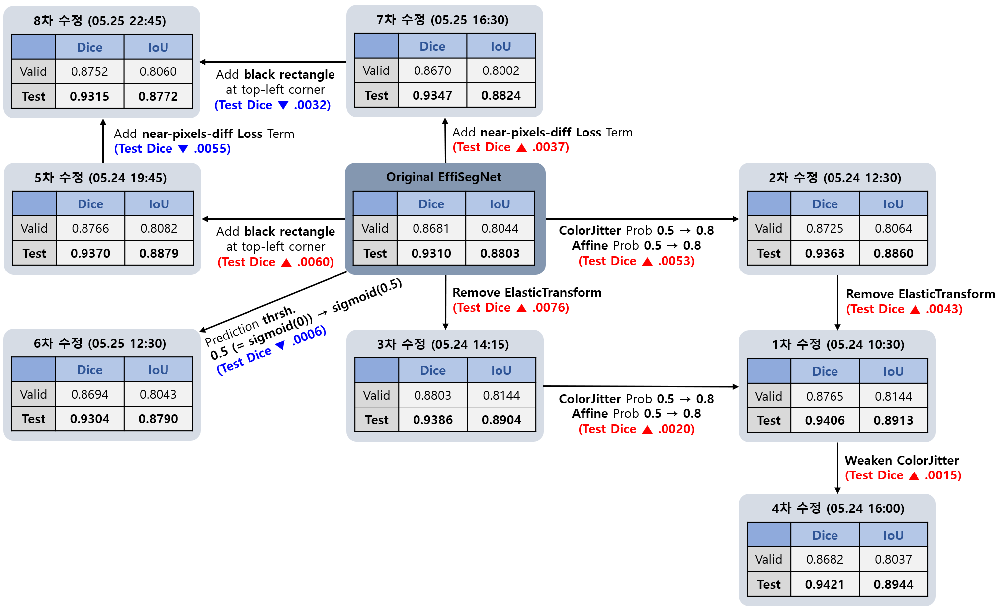
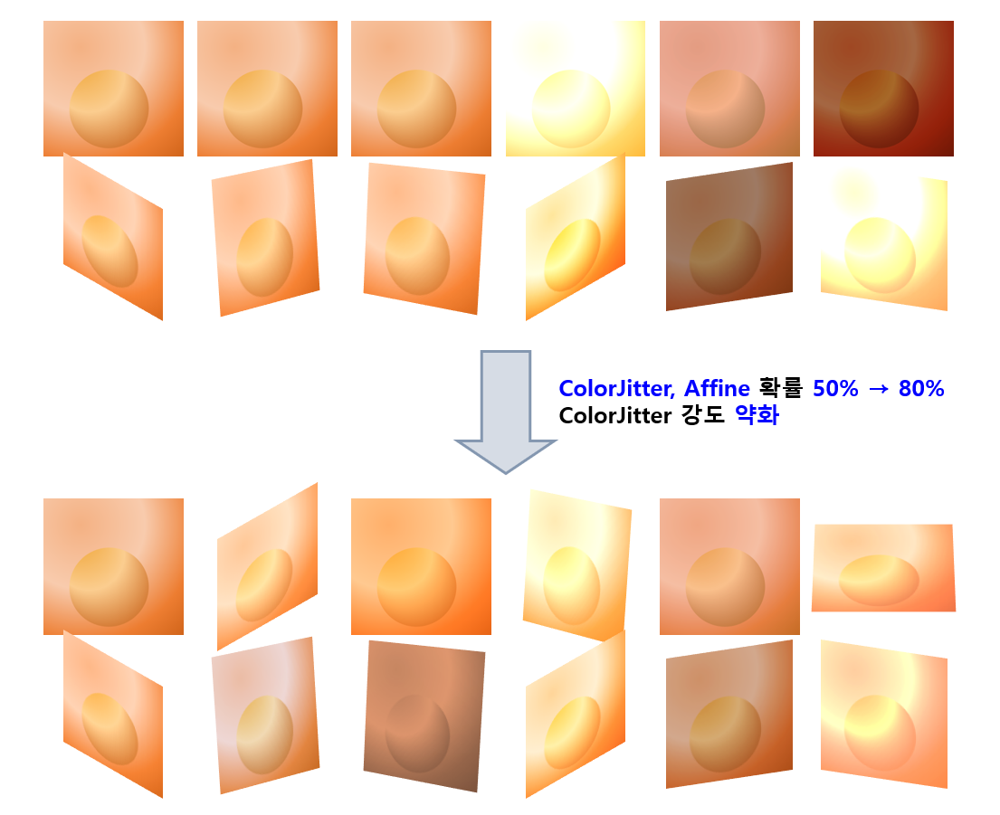
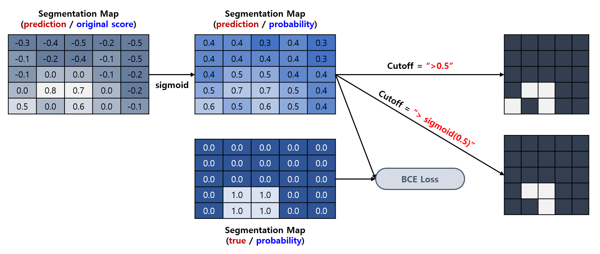
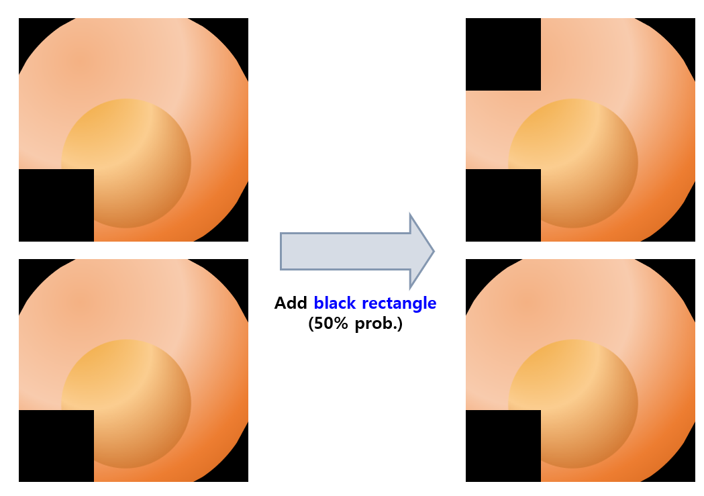
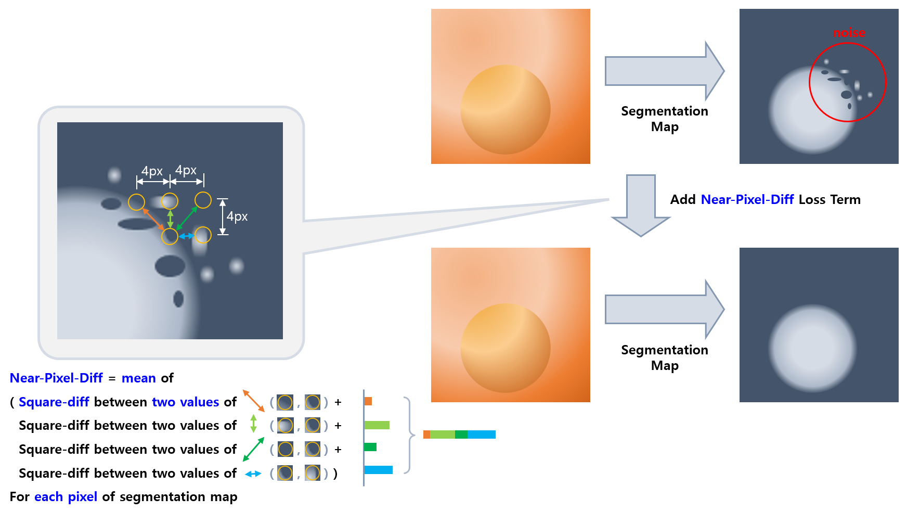

* EffiSegNet Improved Implementation
  * EffiSegNet Base Implementation is from [Official PyTorch Implementation](https://github.com/ivezakis/effisegnet/tree/main)

## 목차

* [1. TEST RESULT](#1-test-result)
* [2. 변경점 상세](#2-변경점-상세)
  * [2-1. 📈 ColorJitter & Affine Prob 상향](#2-1--colorjitter--affine-prob-상향) 
  * [2-2. ✂ Remove ElasticTransform](#2-2--remove-elastictransform)
  * [2-3. 🌬 Weaken ColorJitter](#2-3--weaken-colorjitter)
  * [2-4. 📐 Inference Prediction Threshold 조정](#2-4--inference-prediction-threshold-조정)
  * [2-5. ⬛ Black Rectangle 추가](#2-5--black-rectangle-추가)
  * [2-6. 🧭 Near-Pixel-Diff Loss Term 추가](#2-6--near-pixel-diff-loss-term-추가)

## 1. TEST RESULT

* dataset : **Kvasir-SEG**
* with **EffiSegNet-B4 (Pre-trained) & 50 epochs** option (instead of 300 epochs option of original paper)
* [Test Result Details](https://github.com/WannaBeSuperteur/AI_Projects/issues/13)



* 각 모델 별 변경점 및 성능

| 모델                  | 변경점   | Test Dice             | Test IoU              | Test Recall           | Test Precision        |
|---------------------|-------|-----------------------|-----------------------|-----------------------|-----------------------|
| Original EffiSegNet |       | 0.9310                | 0.8803                | 0.9363                | 0.9538                |
| 1차 수정 (05.24)       | 📈✂   | 0.9406 (▲ 0.0096)     | 0.8913 (▲ 0.0110)     | 0.9259 (▼ 0.0104)     | **0.9626 (▲ 0.0088)** |
| 2차 수정 (05.24)       | 📈    | 0.9363 (▲ 0.0053)     | 0.8860 (▲ 0.0057)     | 0.9295 (▼ 0.0068)     | 0.9587 (▲ 0.0049)     |
| 3차 수정 (05.24)       | ✂     | 0.9386 (▲ 0.0076)     | 0.8904 (▲ 0.0101)     | 0.9389 (▲ 0.0026)     | 0.9559 (▲ 0.0021)     |
| 4차 수정 (05.24)       | 📈✂🌬 | **0.9421 (▲ 0.0111)** | **0.8944 (▲ 0.0141)** | 0.9385 (▲ 0.0022)     | 0.9590 (▲ 0.0052)     |
| 5차 수정 (05.24)       | ⬛     | 0.9370 (▲ 0.0060)     | 0.8879 (▲ 0.0076)     | 0.9378 (▲ 0.0015)     | 0.9568 (▲ 0.0030)     |
| 6차 수정 (05.25)       | 📐    | 0.9304 (▼ 0.0006)     | 0.8790 (▼ 0.0013)     | 0.9295 (▼ 0.0068)     | 0.9594 (▲ 0.0056)     |
| 7차 수정 (05.25)       | 🧭    | 0.9347 (▲ 0.0037)     | 0.8824 (▲ 0.0021)     | **0.9528 (▲ 0.0165)** | 0.9409 (▼ 0.0129)     |
| 8차 수정 (05.25)       | ⬛🧭   | 0.9315 (▲ 0.0005)     | 0.8772 (▼ 0.0031)     | 0.9501 (▲ 0.0138)     | 0.9366 (▼ 0.0172)     |

* 변경점 이모지

| 이모지 | 변경점                                                       |
|-----|-----------------------------------------------------------|
| 📈  | ColorJitter Prob. 0.5 → 0.8<br>Affine Prob. 0.5 → 0.8     |
| ✂   | ElasticTransform Augmentation 제거                          |
| 🌬  | ColorJitter Augmentation 강도 약화                            |
| ⬛   | 이미지의 좌측 상단에 검은색 직사각형 추가                                   |
| 📐  | Inference 시, Prediction Threshold 0.5 → sigmoid(0.5) 로 조정 |
| 🧭  | Near-Pixel-Diff Loss Term 추가                              |

## 2. 변경점 상세

### 2-1. 📈 ColorJitter & Affine Prob 상향



* ColorJitter, Affine Augmentation 은 **정해진 "연속적인 변형 강도" 범위 내에서 다양한 경우의 수로 변형이 가능한 Augmentation 임**
  * Horizontal / Vertical Flip 처럼 **경우의 수가 "이산적으로" 정해진 것이 아님**
* 따라서, 해당 Augmentation 은 **50% 확률로 적용 시 이미지의 다양성이 떨어지고, 80% ~ 90% 정도로 적용 확률을 높여야** Augmentation 으로 다양한 이미지가 생성됨
* [참고](https://github.com/WannaBeSuperteur/AI-study/blob/main/Image%20Processing/Basics_Image_Augmentation_Methods.md#2-torchvision-%EC%9D%84-%EC%9D%B4%EC%9A%A9%ED%95%9C-augmentation)

### 2-2. ✂ Remove ElasticTransform

* [demo](https://huggingface.co/spaces/qubvel-hf/albumentations-demo) 에서 테스트 결과, 해당 Transformation 을 **논문 코드의 옵션에 따른 arguments 를 이용하여** 적용 시 이미지가 미 적용 시 이미지와 **거의 차이 없음**
* 따라서 Augmentation 시간만 늘리는 **불필요한 Augmentation 으로 판단**

### 2-3. 🌬 Weaken ColorJitter

* ColorJitter 의 강도를 약화시켜서 **기존 학습 데이터의 색상/채도/밝기와 큰 차이가 없는 색상/채도/밝기의 이미지를 생성** 하도록 함
* 상세 내용

| Augmentation 대상  | 기존                     | 조정                     | 비교                                    |
|------------------|------------------------|------------------------|---------------------------------------|
| ```brightness``` | 원래 밝기의 **0.6 - 1.6 배** | 원래 밝기의 **0.8 - 1.4 배** | top cutoff -0.2<br>bottom cutoff +0.2 |
| ```contrast```   | factor 값 = **0.2**     | factor 값 = **0.15**    | factor 값 25% 감소                       |
| ```saturation``` | factor 값 = **0.1**     | factor 값 = **0.075**   | factor 값 25% 감소                       |

### 2-4. 📐 Inference Prediction Threshold 조정



* sigmoid 함수 적용 전의 각 픽셀 별 score 값에 대한 segmentation threshold 를 0.0 → 0.5 로 **상향 조정**
  * sigmoid 적용 후 기준 threshold 는 **0.5 → sigmoid(0.5) = 0.622** 로 상향 조정됨
* 예상대로 recall 감소, precision 증가함

| Test Recall       | Test Precision    |
|-------------------|-------------------|
| 0.9295 (▼ 0.0068) | 0.9594 (▲ 0.0056) |

### 2-5. ⬛ Black Rectangle 추가



* **본 데이터셋 (Kvasir-SEG) 특화** Augmentation
* 적용 배경
  * 본 데이터셋의 경우, 상당수의 이미지가 좌측 하단에 검은 직사각형이 있음
  * 이로 인해 **종양에 해당하는 영역을 정확히 탐지하는 데 지장** 이 생길 수 있음
  * 따라서, **학습 데이터에 의도적으로 비슷한 크기의 검은 직사각형을 추가** 하여, **검은 직사각형으로 인해 학습에 지장이 생길 때도 종양 영역을 정확히 탐지** 하도록 모델 훈련
* 상세 적용 사항
  * Augmentation transform 적용 이전의 **원본 이미지** 에 대해, 
  * **50%** 확률로,
  * 이미지의 **좌측 상단** 에 **가로, 세로 길이의 각각 30% 에 해당하는 크기** 의 검은 직사각형 추가

### 2-6. 🧭 Near-Pixel-Diff Loss Term 추가



* 적용 배경
  * Segmentation 결과로 생성된 Segmentation score map 에서 위와 같이 **종양의 경계선 부분에 noise 가 발생**
  * 이로 인해 모델 예측의 정확도가 다소 떨어짐
  * 이를 해결하기 위해, **가로/세로/대각선으로 일정 거리만큼 떨어진 픽셀의 Segmentation score 의 차이의 제곱** 을 Loss Term 으로 추가
* 상세 적용 사항
  * Loss 계산 방법
    * 위 그림과 같이, **각 픽셀 별 가로/세로/대각선으로 4 픽셀 떨어진 픽셀과의 Segmentation score 값 차이의 제곱** 의 합의 평균을 이용  
  * 기존 Loss
    * 1.0 * ```Dice Loss``` + 1.0 * ```Cross-Entropy Loss```
  * 변경 Loss
    * 1.0 * ```Dice Loss``` + 1.0 * ```Cross-Entropy Loss``` **+ 0.01 * ```Near-Pixel-Diff Loss```**