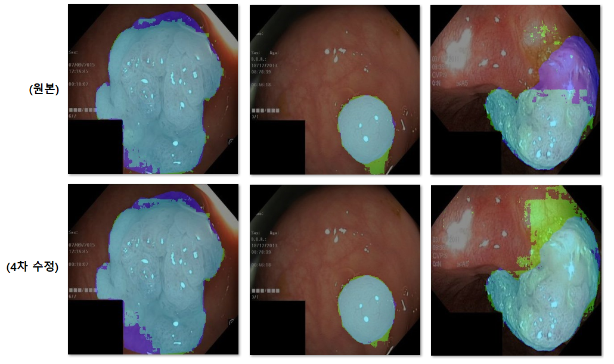
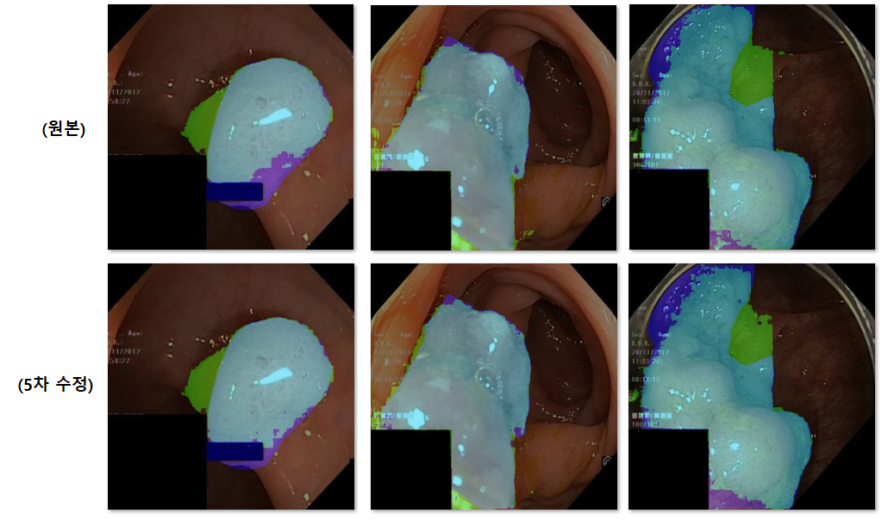
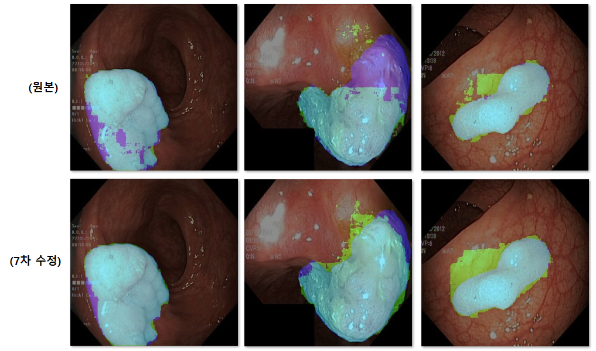
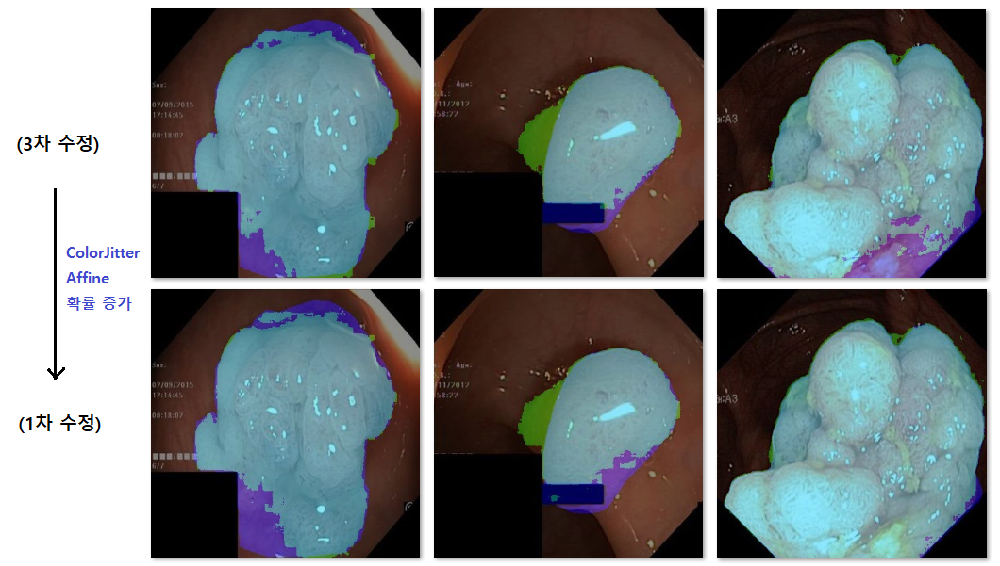
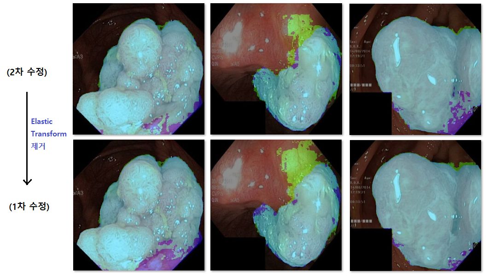
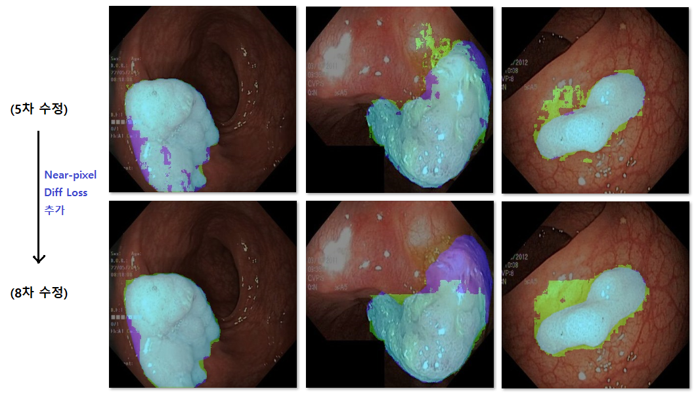

## 목차

* [1. 개요](#1-개요)
* [2. 실제 inference 결과 비교 (Original vs.)](#2-실제-inference-결과-비교-original-vs)
  * [2-1. Original vs. 4차 수정](#2-1-original-vs-4차-수정)
  * [2-2. Original vs. 5차 수정](#2-2-original-vs-5차-수정)
  * [2-3. Original vs. 7차 수정](#2-3-original-vs-7차-수정)
* [3. 실제 inference 결과 비교 (각 요소 변경)](#3-실제-inference-결과-비교-각-요소-변경)
  * [3-1. ColorJitter & Affine 확률 조정 시](#3-1-colorjitter--affine-확률-조정-시)
  * [3-2. ElasticTransform 제거 시](#3-2-elastictransform-제거-시)
  * [3-3. Near-pixels-diff Loss Term 추가 시](#3-3-near-pixels-diff-loss-term-추가-시)

## 1. 개요

* EffiSegNet 각 수정 버전 별 성능 비교

* 실험 결과 이미지 표시

| 색   | 의미                | EffiSegNet 이 예측한 용종 영역? | 실제 용종 영역? |
|-----|-------------------|-------------------------|-----------|
| 연두색 | False Positive 영역 | ✅                       | ❌         |
| 하늘색 | True Positive 영역  | ✅                       | ✅         |
| 파란색 | False Negative 영역 | ❌                       | ✅         |

## 2. 실제 inference 결과 비교 (Original vs.)

| 구분                 | 결과 비교                                 |
|--------------------|---------------------------------------|
| Original vs. 4차 수정 | 정확도 큰 변화 없음                           |
| Original vs. 5차 수정 | 원본 이미지의 직사각형 부분 주변에 대한 정확도 **소폭 증가**  |
| Original vs. 7차 수정 | EffiSegNet 예측값의 'noise'가 **유의미하게 감소** |

### 2-1. Original vs. 4차 수정

* 핵심 변경 사항
  * **ColorJitter & Affine 확률 증가 & ElasticTransform 제거 & ColorJitter 약화**
* 결과
  * 정확도의 큰 변화는 없음

### 2-2. Original vs. 5차 수정

* 핵심 변경 사항
  * Augmentation 이전에 **이미지 좌측 상단에 [Black Rectangle 추가](effisegnet_improved/README.md#2-5--black-rectangle-추가)**
* 결과
  * 의도한 대로, 원본 이미지에 검은 직사각형, 파란 직사각형이 있는 경우 **해당 부분 주변에 대한 정확도가 소폭 증가** 한 것으로 보임
  * 그러나 큰 변화는 아닌 것으로 보임

### 2-3. Original vs. 7차 수정

* 핵심 변경 사항
  * 이웃한 픽셀 간 예측값의 차이를 Loss 로 반영하는 [Near-Pixels-Diff Loss](effisegnet_improved/README.md#2-6--near-pixel-diff-loss-term-추가) 추가
* 결과
  * 의도한 대로, 원본 이미지에 비해 **EffiSegNet 예측 결과의 'noise'가 감소하는 편**
  * 단, 일부 이미지의 경우 예측 결과에서 새로운 'noise'가 발생한 경우가 있음

## 3. 실제 inference 결과 비교 (각 요소 변경)

| 구분                              | 비교 대상           | 결과 비교                                                |
|---------------------------------|-----------------|------------------------------------------------------|
| ColorJitter & Affine 확률 조정 시    | 1차 수정 vs. 3차 수정 | 정확도의 큰 차이가 없음                                        |
| ElasticTransform 제거 시           | 1차 수정 vs. 2차 수정 | 정확도의 큰 차이가 없음                                        |
| Near-pixels-diff Loss Term 추가 시 | 5차 수정 vs. 8차 수정 | EffiSegNet 예측 결과에서 'noise'가 줄어듦 (단, 이로 인해 정확도 감소 가능) |

### 3-1. ColorJitter & Affine 확률 조정 시

* 정확도의 큰 차이가 없음

### 3-2. ElasticTransform 제거 시

* 정확도의 큰 차이가 없음

### 3-3. Near-pixels-diff Loss Term 추가 시

* [원본 EffiSegNet vs. 7차 수정](#2-3-original-vs-7차-수정) 과 같이, **의도한 대로 EffiSegNet 예측 결과에서 'noise'가 줄어듦**
* 단, **'noise'가 줄어들면서 정확도 역시 감소하는 사례 (아래 그림의 왼쪽에서 2번째 줄)** 도 있음

