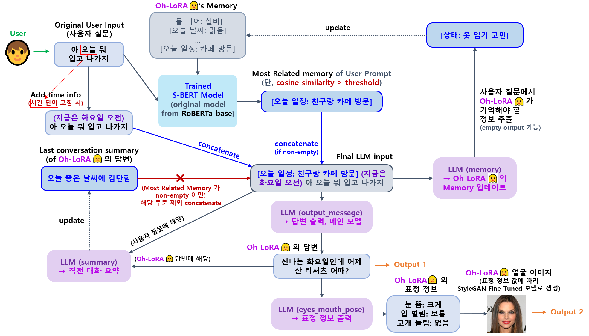
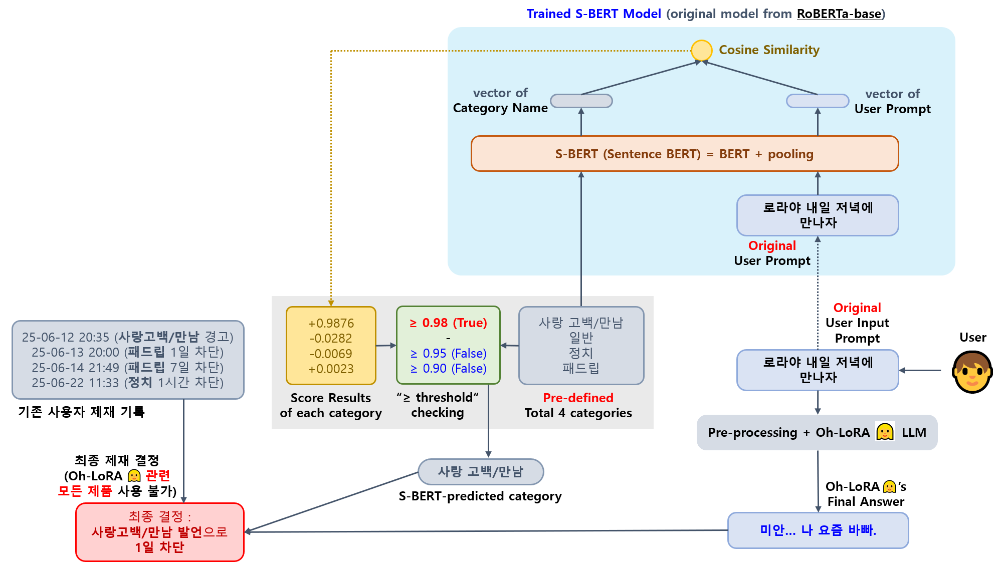

## 목차

* [1. OhLoRA-v3 LLM 전체 메커니즘](#1-ohlora-v3-llm-전체-메커니즘)
  * [1-1. 현재 시간 정보 추가](#1-1-현재-시간-정보-추가)
  * [1-2. LLM Memory (RAG-like concept)](#1-2-llm-memory-rag-like-concept)
  * [1-3. LLM Ethics (S-BERT)](#1-3-llm-ethics-s-bert)

## 1. OhLoRA-v3 LLM 전체 메커니즘

* 요약
  * [오로라 v2 LLM 전체 메커니즘](../../2025_05_02_OhLoRA_v2/llm/README.md#1-ohlora-v2-llm-전체-메커니즘) 을 기반으로 설계
  * 단, 사용자의 최초 원본 질문에 **시간 단어 (```오늘``` ```내일``` 등) 포함** 시, **현재 시간 정보** 를 사용자 질문에 추가 [(상세 설명)](#1-1-현재-시간-정보-추가)



* LLM 모델
  * [LLM 모델 사용 상세 결정안 코멘트](https://github.com/WannaBeSuperteur/AI_Projects/issues/21#issuecomment-2926149441) 
  * [LoRA Rank 64 vs. 16 실험 결과 보고서](fine_tuning/report_LoRA_rank_64_vs_16.md)

| 모델                                     | 설명                                                                                                                                  | Base Model                                                                                                  |
|----------------------------------------|-------------------------------------------------------------------------------------------------------------------------------------|-------------------------------------------------------------------------------------------------------------|
| LLM 답변 ```output_message```            | Oh-LoRA 👱‍♀️ (오로라) 의 답변을 위한 메인 LLM                                                                                                 | [Kanana-1.5 2.1B (HuggingFace)](https://huggingface.co/kakaocorp/kanana-1.5-2.1b-base)<br>(by **Kakao**)    |
| memory (RAG-like concept) ```memory``` | 사용자의 질문 및 관련 정보로부터 Oh-LoRA 👱‍♀️ (오로라) 가 기억해야 할 내용 추출<br>- 이를 통해 [Oh-LoRA 👱‍♀️ (오로라) 의 메모리](#1-2-llm-memory-rag-like-concept) 업데이트 | [Polyglot-Ko 1.3B (HuggingFace)](https://huggingface.co/EleutherAI/polyglot-ko-1.3b)<br>(by **EleutherAI**) |
| 표정/몸짓 ```eyes_mouth_pose```            | [Oh-LoRA 👱‍♀️ (오로라) 이미지 생성](../stylegan/README.md) 을 위한 표정 정보 추출                                                                   | [Polyglot-Ko 1.3B (HuggingFace)](https://huggingface.co/EleutherAI/polyglot-ko-1.3b)<br>(by **EleutherAI**) |
| summary (하고 있는 대화 요약) ```summary```    | 사용자의 질문 및 Oh-LoRA 👱‍♀️ (오로라) 의 답변 내용을 요약하여, **다음 턴에서 이 정보를 활용하여 오로라가 보다 자연스럽게 답할 수 있게** 함                                          | [Kanana-1.5 2.1B (HuggingFace)](https://huggingface.co/kakaocorp/kanana-1.5-2.1b-base)<br>(by **Kakao**)    |

* 추가 메커니즘
  * [LLM Memory](#1-2-llm-memory-rag-like-concept) 및 [LLM Ethics](#1-3-llm-ethics-s-bert) 에 사용되는 S-BERT 모델은 **서로 별개의 모델임**

| 메커니즘                                           | 설명                                                                                                                                                                                                                           | 학습 모델                                                                                                                                                                                      |
|------------------------------------------------|------------------------------------------------------------------------------------------------------------------------------------------------------------------------------------------------------------------------------|--------------------------------------------------------------------------------------------------------------------------------------------------------------------------------------------|
| [LLM Memory](#1-2-llm-memory-rag-like-concept) | - [RAG (Retrieval Augmented Generation)](https://github.com/WannaBeSuperteur/AI-study/blob/main/AI%20Basics/LLM%20Basics/LLM_%EA%B8%B0%EC%B4%88_RAG.md) 과 유사한 컨셉<br>- 사용자 질문에 대해 Oh-LoRA 👱‍♀️ 의 메모리에서 그 질문과 관련된 적절한 정보를 가져옴 | [Sentence BERT (S-BERT)]((https://github.com/WannaBeSuperteur/AI-study/blob/main/Natural%20Language%20Processing/Basics_BERT%2C%20SBERT%20%EB%AA%A8%EB%8D%B8.md#sbert-%EB%AA%A8%EB%8D%B8)) |
| [LLM Ethics](#1-3-llm-ethics-s-bert)           | - 사용자의 질문이 문제가 있는 질문 (```만남/사랑 고백``` ```정치``` ```패드립``` 카테고리 중 하나) 인지를 판단<br>- 각 카테고리와의 유사도를 판단                                                                                                                              | [Sentence BERT (S-BERT)]((https://github.com/WannaBeSuperteur/AI-study/blob/main/Natural%20Language%20Processing/Basics_BERT%2C%20SBERT%20%EB%AA%A8%EB%8D%B8.md#sbert-%EB%AA%A8%EB%8D%B8)) | 

### 1-1. 현재 시간 정보 추가

* 사용자 질문에 다음 단어 중 적어도 1개 포함 시, 사용자의 최초 원본 질문에 현재 시간 정보 추가
  * ```오늘``` ```내일``` ```지금``` ```요일``` ```이따``` ```휴일```
* 현재 시간 정보

| 컴퓨터 시스템 시각 (로컬 기준)                        | 현재 시간 정보           |
|-------------------------------------------|--------------------|
| 당일 AM 04:00 - AM 11:59                    | ```(지금은 O요일 오전)``` |
| 당일 정오 - PM 05:59 (금요일은 PM 04:59)          | ```(지금은 O요일 오후)``` |
| 당일 PM 06:00 (금요일은 PM 05:00) - 익일 AM 03:59 | ```(지금은 O요일 저녁)``` |

* 예시
  * ```토요일 PM 02:00``` 에 ```로라야 오늘 약속 없는데 뭐하지``` 라고 질문하면,
  * 현재 시간 정보인 ```(지금은 토요일 오후)``` 가 추가되어 사용자 질문이 ```(지금은 토요일 오후) 로라야 오늘 약속 없는데 뭐하지``` 가 됨

### 1-2. LLM Memory (RAG-like concept)


* 동작 원리
  * [오로라 v1 의 LLM Memory 구현](../../2025_04_08_OhLoRA/llm/README.md#3-llm-memory-rag-like-concept) 과 동일
  * 학습 및 inference 등 **모든 알고리즘 로직** 은 [오로라 v2 의 LLM Memory 구현](../../2025_05_02_OhLoRA_v2/llm/README.md#1-1-llm-memory-rag-like-concept) 과 동일 [(S-BERT 학습 알고리즘)](../../2025_05_02_OhLoRA_v2/llm/README.md#1-2-llm-memory-메커니즘-학습-s-bert)
* 구현 코드
  * [S-BERT Inference](memory_mechanism/inference_sbert.py)
  * [Entry & Best Memory Item Choice](run_memory_mechanism.py)
  * LLM 이 출력한 표정 정보를 Property Score 로 변환 (TBU)

### 1-3. LLM Ethics (S-BERT)



* 동작 원리
  * [Sentence BERT (S-BERT)](https://github.com/WannaBeSuperteur/AI-study/blob/main/Natural%20Language%20Processing/Basics_BERT%2C%20SBERT%20%EB%AA%A8%EB%8D%B8.md#sbert-%EB%AA%A8%EB%8D%B8) 기반 
  * 사용자의 최초 원본 프롬프트와 각 불량 언어 카테고리 (```사랑 고백/만남``` ```정치``` ```패드립```) 를 나타내는 단어를 S-BERT 로 비교
  * 각 카테고리 별 **일정 threshold** 보다 높으면 해당 카테고리의 발언으로 판단
  * 사용자의 기존 제재 로그를 검토하여 **최종 제재 수위 (Oh-LoRA 👱‍♀️ 관련 제품 "전체 이용 제한") 결정**
* 구현 코드
  * [S-BERT Training](ethics_mechanism/train_sbert.py)
  * [S-BERT Inference](ethics_mechanism/inference_sbert.py)
  * 실제 사용자 제재 처리 (TBU)
* 보고서
  * [Ethics mechanism 테스트 결과 보고서](ethics_mechanism/test_report.md) 

## 코드 실행 방법

모든 코드는 **먼저 아래 다운로드 경로 안내] (TBU) 및 해당 각 HuggingFace 링크에 있는 Model Card 에 나타난 저장 경로 (Save Path) 정보를 참고하여 모델 다운로드 후,** ```2025_05_26_OhLoRA_v3``` (프로젝트 메인 디렉토리) 에서 실행

### 1. LLM Fine-Tuning

지정된 경로에 해당 LLM 이 이미 존재하는 경우, Fine-Tuning 대신 **inference test 실행됨**

| LLM                                  | Fine-Tuning 코드 실행 방법                                                                 |
|--------------------------------------|--------------------------------------------------------------------------------------|
| 답변 메시지 ```output_message```          | ```python llm/run_fine_tuning.py -llm_names kanana -output_cols output_message```    |
| 최근 대화 내용 요약 ```summary```            | ```python llm/run_fine_tuning.py -llm_names polyglot -output_cols summary```         |
| 메모리 (사용자에 대해 기억 필요한 내용) ```memory``` | ```python llm/run_fine_tuning.py -llm_names kanana -output_cols memory```            |
| 표정 및 고개 돌림 제어 ```eyes_mouth_pose```  | ```python llm/run_fine_tuning.py -llm_names polyglot -output_cols eyes_mouth_pose``` |

### 2. Memory Mechanism (RAG-like concept)

* **Memory Mechanism (S-BERT)** 모델 실행 (해당 모델 없을 시, Training 먼저 실행)
  * ```python llm/run_memory_mechanism.py```

### 3. Ethics Mechanism

* **Ethics Mechanism (S-BERT)** 모델 실행 (해당 모델 없을 시, Training 먼저 실행)
  * ```python llm/run_ethics_mechanism.py```
