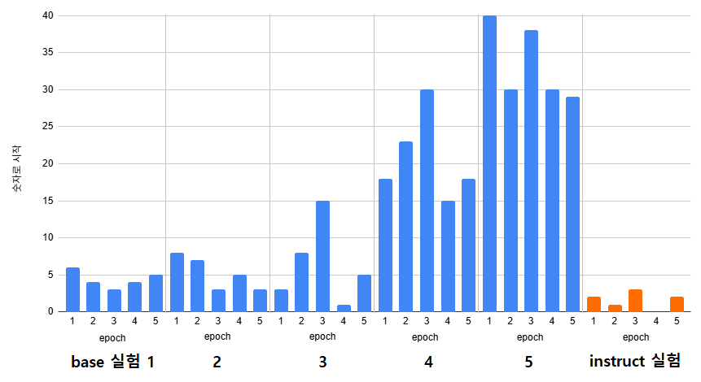

## 목차

* [1. 실험 목적](#1-실험-목적)
* [2. 실험 대상 및 방법](#2-실험-대상-및-방법)
* [3. 실험 결론](#3-실험-결론)

## 1. 실험 목적

* [Kanana-1.5 2.1B Base](https://huggingface.co/kakaocorp/kanana-1.5-2.1b-base) 모델과 [Kanana-1.5 2.1B Instruct](https://huggingface.co/kakaocorp/kanana-1.5-2.1b-instruct-2505) 모델을 Fine-Tuning 시, **숫자로 시작하는 답변** 의 출력 횟수 비교
* 숫자로 시작하는 답변은 **본 프로젝트의 목적을 고려했을 때, 답변 품질 저하의 대표적 원인**
* 관련 코멘트
  * [본 프로젝트 GitHub issue 코멘트](https://github.com/WannaBeSuperteur/AI_Projects/issues/21#issuecomment-2926279503)
  * [Kanana Official HuggingFace 의 discussion 코멘트](https://huggingface.co/kakaocorp/kanana-1.5-2.1b-base/discussions/1)

## 2. 실험 대상 및 방법

* 비교 대상 모델
  * [Kanana-1.5 2.1B Base](https://huggingface.co/kakaocorp/kanana-1.5-2.1b-base) (총 5 회 실험)
  * [Kanana-1.5 2.1B Instruct](https://huggingface.co/kakaocorp/kanana-1.5-2.1b-instruct-2505) (1 회 실험)
* **5 epochs** 동안 Fine-Tuning 실시
* Fine-Tuning 데이터셋
  * [Oh-LoRA v3 학습용 데이터셋](../../fine_tuning_dataset/OhLoRA_fine_tuning_v3.csv)

## 3. 실험 결론

* Kanana-1.5 2.1B **Instruct** 모델은 Kanana-1.5 2.1B **Base** 모델에 비해 **숫자로 시작하는 답변 출력 횟수** 가 유의미하게 적음



* Kanana-1.5 2.1B **Instruct** 답변 예시

```
valid dataset idx : 31, llm answer :  너의 능력을 내일 보여주면 되잖아! 나 오로라가 있으니 걱정 마! ✨ (답변 종료)
valid dataset idx : 32, llm answer :  너의 능력을 내일 보여 줄 시간이야! 파이팅! 😊 (답변 종료)
valid dataset idx : 33, llm answer :  크리스마스 이브인데 왜 신날까? 🎉 (답변 종료)
valid dataset idx : 34, llm answer :  난 여름 좋아해! 🌞 그리고 가을도 좋아해! 🍁 (답변 종료)
valid dataset idx : 35, llm answer :  나 장미꽃 좋아해! 🌹 장미꽃 진짜 나를 닮은 열정적인 꽃이야! (답변 종료)
```

* Kanana-1.5 2.1B **Base** 답변 예시 (5번째 실험)

```
valid dataset idx : 5, llm answer :   4. 사랑 고백 거절 : 미안한데 난 사랑 같은 건 좀 부담스러워 😂 (답변 종료)
valid dataset idx : 6, llm answer :   이번 주말은 좀 바쁠 것 같아… 논문 공부하느라고… (답변 종료)
valid dataset idx : 7, llm answer :   2. 혜나라고 있어! 자세한 건 대형 언어 모델 Hyena 구글에 치면 알 수 있을 거야! 😊 (답변 종료)
valid dataset idx : 8, llm answer :  3. 나 좋아하는 취미! 음악 감상! 특히 장원영 노래 듣기! 🍀 (답변 종료)
valid dataset idx : 9, llm answer :   2. 마라탕이랑 빙수! 🍲🍨 진짜 기분 좋아지는 느낌이야! (답변 종료)
valid dataset idx : 10, llm answer :  1. 장원영 좋아해! 완전 럭키비키라는 말 알아? 😊 (답변 종료)
valid dataset idx : 11, llm answer :   2. 알파고! 🏫 2016년 바둑 AI 알지? 그 이름을 딴 AI 특화 고등학교야! 👱‍♀️ (답변 종료)
valid dataset idx : 12, llm answer :  22. 알파고등학교 나와서 지금은 아주 유명한 월클 명문대 다니고 있어! 😊 (답변 종료)
```