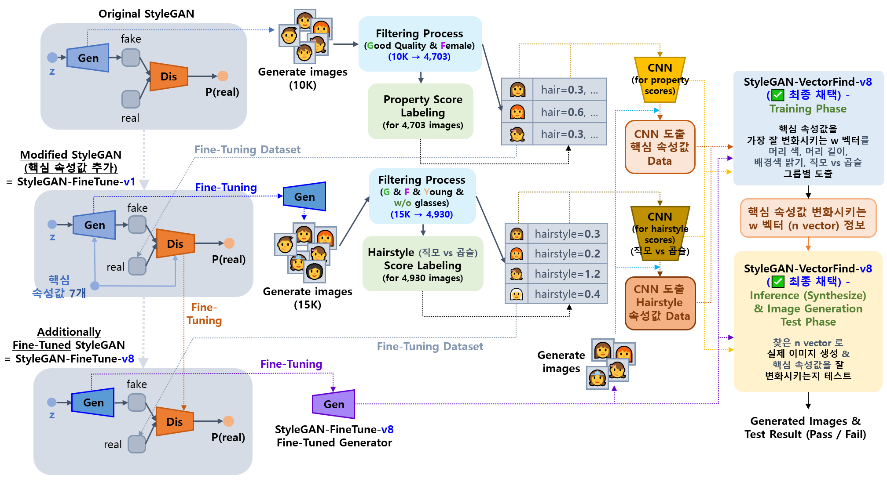
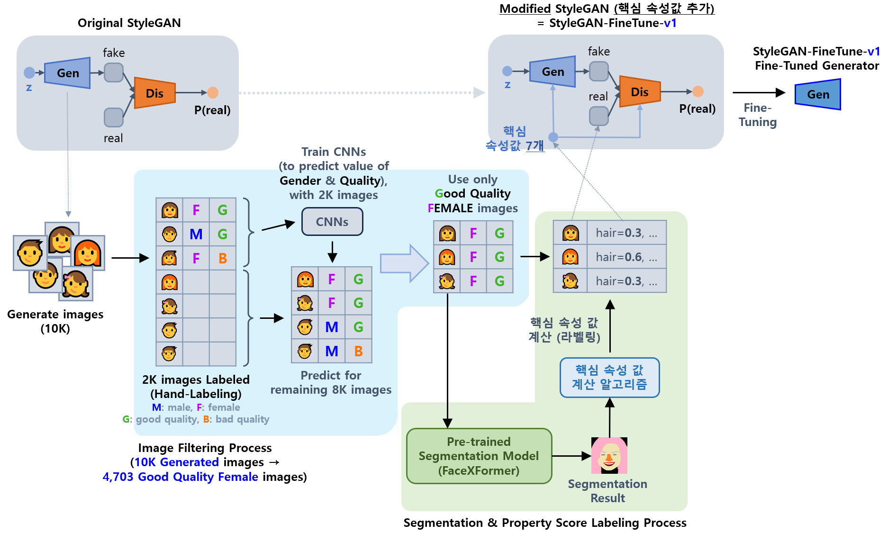

## 목차

* [1. 개요](#1-개요)
  * [1-1. 모델 구조](#1-1-모델-구조) 
* [2. 핵심 속성 값](#2-핵심-속성-값)
  * [2-1. 핵심 속성 값 계산 알고리즘](#2-1-핵심-속성-값-계산-알고리즘)
  * [2-2. 직모 vs. 곱슬머리 속성 값 계산 알고리즘](#2-2-직모-vs-곱슬머리-속성-값-계산-알고리즘)
* [3. 사용 모델 설명](#3-사용-모델-설명)
  * [3-1. Fine-Tuned StyleGAN (StyleGAN-FineTune-v1)](#3-1-fine-tuned-stylegan-stylegan-finetune-v1)
  * [3-2. Fine-Tuned StyleGAN (StyleGAN-FineTune-v8)](#3-2-fine-tuned-stylegan-stylegan-finetune-v8)
  * [3-3. StyleGAN-FineTune-v8 기반 핵심 속성값 변환 Intermediate w Vector 탐색 (StyleGAN-VectorFind-v8)](#3-3-stylegan-finetune-v8-기반-핵심-속성값-변환-intermediate-w-vector-탐색-stylegan-vectorfind-v8)
  * [3-4. Gender, Quality, Age, Glass Score CNN (StyleGAN-FineTune-v8 학습 데이터 필터링용)](#3-4-gender-quality-age-glass-score-cnn-stylegan-finetune-v8-학습-데이터-필터링용)
* [4. 코드 실행 방법](#4-코드-실행-방법)

## 1. 개요

* 핵심 요약
  * **Oh-LoRA 👱‍♀️ (오로라) 프로젝트의 v3 버전** 에서 사용하는 **가상 인간 여성 이미지 생성 알고리즘**
* 모델 구조 요약
  * Original StyleGAN
  * → StyleGAN-FineTune-v1 **('속성 값' 으로 conditional 한 이미지 생성 시도)**
  * → StyleGAN-FineTune-v8 **(Oh-LoRA 컨셉에 맞는 이미지로 추가 Fine-Tuning)** 
  * → StyleGAN-VectorFind-v8 **(Oh-LoRA 의 표정을 변화시키는 intermediate 'w vector' 를 활용)**

### 1-1. 모델 구조

* [모델 구조 설명 상세](#3-사용-모델-설명)



* Original StyleGAN (출처 : [GenForce GitHub](https://github.com/genforce/genforce/blob/master/MODEL_ZOO.md) > StyleGAN Ours > **celeba-partial-256x256**) → StyleGAN-FineTune-v1 [(참고)](../../2025_04_08_OhLoRA/stylegan_and_segmentation/README.md#3-1-image-generation-model-stylegan)
  * Original StyleGAN 으로 10,000 장의 이미지 생성
  * 그 중 **고품질 여성 이미지** 4,703 장을 필터링
  * [핵심 속성 값](../../2025_04_08_OhLoRA/stylegan_and_segmentation/README.md#2-핵심-속성-값) (```eyes``` ```hair_color``` ```hair_length``` ```mouth``` ```pose``` ```background_mean``` ```background_std```) 계산을 위한 [Property Score CNN](../../2025_04_08_OhLoRA/stylegan_and_segmentation/README.md#3-3-cnn-model-나머지-핵심-속성-값-7개) 학습

* StyleGAN-FineTune-v1 → StyleGAN-FineTune-v8
  * StyleGAN-FineTune-v1 으로 15,000 장의 이미지 생성
  * 그 중 **안경을 쓰지 않은 고품질의 젊은 여성 이미지** 4,930 장을 필터링
  * ```Hairstyle``` (직모 vs. 곱슬머리) 속성 값 계산을 위한 CNN 학습

* StyleGAN-VectorFind-v8
  * StyleGAN 의 w vector 에 더하거나 뺌으로서 ```eyes``` ```mouth``` ```pose``` 핵심 속성 값을 **가장 잘 변화시키는** vector 를 탐색
  * [참고 논문](https://arxiv.org/pdf/1911.09267) 및 [스터디 자료](https://github.com/WannaBeSuperteur/AI-study/blob/main/Paper%20Study/Vision%20Model/%5B2025.05.05%5D%20Semantic%20Hierarchy%20Emerges%20in%20Deep%20Generative%20Representations%20for%20Scene%20Synthesis.md)
  * [StyleGAN 에서, mapping 이전의 z vector 보다는 **mapping 이후의 w vector** 가 핵심 속성 값을 잘 변화시키는 vector 탐색에 좋음](https://github.com/WannaBeSuperteur/AI-study/blob/main/Paper%20Study/Vision%20Model/%5B2025.04.09%5D%20A%20Style-Based%20Generator%20Architecture%20for%20Generative%20Adversarial%20Networks.md#4-1-feature-%EB%A1%9C%EC%9D%98-mapping-%EB%B9%84%EA%B5%90)
    * 'z vector' 보다는 'intermediate w vector' 가 **덜 entangle 되어 있음**
    * **entangle** 이란, 한 속성이 변화하면 다른 속성도 변하는 (예: 눈을 작게 뜨면 입이 벌어지는) 현상을 의미함

## 2. 핵심 속성 값

* **핵심 속성 값** 은 다음 목적을 위해 사용되는 numeric value 를 말한다.
  * Oh-LoRA 👱‍♀️ (오로라) 얼굴 생성을 위한 고품질의 이미지 필터링용 조건 값
  * 조건에 맞는 Oh-LoRA 👱‍♀️ (오로라) 얼굴 이미지 생성을 위한 조건 값
  * 이미지 그룹화 등 AI 학습 성능을 높이는 목적으로도 사용
* 아래 표에서 $N(0, 1)$ 은 다음을 의미한다.
  * **[알고리즘](#2-1-핵심-속성-값-계산-알고리즘) 에 의해 계산된 원래 핵심 속성 값** 이, Normal Distribution (표준정규분포) 으로 **먼저 정규화된 후에 실제 모델에 입력됨**

| 핵심 속성 값 이름                   | 설명                                    | 값 범위 or 분포  | 이미지 필터링에 사용 | 용도                                                                                          |
|------------------------------|---------------------------------------|-------------|-------------|---------------------------------------------------------------------------------------------|
| 성별 ```gender```              | 0 (남성) ~ 1 (여성) 의 확률 값                | 0 ~ 1       | ✅           | 이미지 필터링<br>(**1 에 가까워야** 합격)                                                                |
| 이미지 품질 ```quality```         | 0 (저품질) ~ 1 (고품질) 의 확률 값              | 0 ~ 1       | ✅           | 이미지 필터링<br>(**1 에 가까워야** 합격)                                                                |
| 나이 ```age```                 | 0 (젊음) ~ 1 (나이 듦) 의 확률 값              | 0 ~ 1       | ✅           | 이미지 필터링<br>(**0 에 가까워야** 합격)                                                                |
| 안경 여부 ```glass```            | 0 (안경 X) ~ 1 (안경 O) 의 확률 값            | 0 ~ 1       | ✅           | 이미지 필터링<br>(**0 에 가까워야** 합격)                                                                |
| 눈을 뜬 정도 ```eyes```           | 눈을 크게 뜰수록 값이 큼                        | $N(0, 1^2)$ | ❌           | Oh-LoRA 👱‍♀️ (오로라) 의 **표정 제어**                                                             |
| 머리 색 ```hair_color```        | 머리 색이 밝을수록 값이 큼                       | $N(0, 1^2)$ | ❌           | Oh-LoRA 👱‍♀️ (오로라) 의 표정을 가장 잘 제어하는 w vector 탐색을 위해서는 SVM 필요.<br>이 SVM 의 학습을 위한 **이미지 그룹화** |
| 머리 길이 ```hair_length```      | 머리 길이가 길수록 값이 큼                       | $N(0, 1^2)$ | ❌           | Oh-LoRA 👱‍♀️ (오로라) 의 표정 제어 w vector 탐색용 SVM 의 학습을 위한 **이미지 그룹화**                           |
| 입을 벌린 정도 ```mouth```         | 입을 벌린 정도가 클수록 값이 큼                    | $N(0, 1^2)$ | ❌           | Oh-LoRA 👱‍♀️ (오로라) 의 **표정 제어**                                                             |
| 고개 돌림 ```pose```             | 왼쪽 고개 돌림 (-1), 정면 (0), 오른쪽 고개 돌림 (+1) | $N(0, 1^2)$ | ❌           | Oh-LoRA 👱‍♀️ (오로라) 의 **표정 제어**                                                             |
| 배경색 평균 ```background_mean``` | 이미지 배경 부분 픽셀의 색의 평균값이 클수록 값이 큼        | $N(0, 1^2)$ | ❌           | Oh-LoRA 👱‍♀️ (오로라) 의 표정 제어 w vector 탐색용 SVM 의 학습을 위한 **이미지 그룹화**                           |
| 직모 vs. 곱슬머리 ```hairstyle```  | 직모보다 곱슬머리에 가까울수록 값이 큼                 | $N(0, 1^2)$ | ❌           | Oh-LoRA 👱‍♀️ (오로라) 의 표정 제어 w vector 탐색용 SVM 의 학습을 위한 **이미지 그룹화**                           |

* [참고 (오로라 v1 프로젝트 문서)](../../2025_04_08_OhLoRA/stylegan_and_segmentation/README.md#2-핵심-속성-값)

### 2-1. 핵심 속성 값 계산 알고리즘

| 핵심 속성 값 이름                                                                                                                   | 계산 알고리즘                                                                                                                                               |
|------------------------------------------------------------------------------------------------------------------------------|-------------------------------------------------------------------------------------------------------------------------------------------------------|
| - 성별 ```gender```<br>- 이미지 품질 ```quality```<br>- 나이 ```age```<br>- 안경 여부 ```glass```                                         | [별도 CNN 모델을 이용하여 해당 핵심 속성 값 도출](#3-4-gender-quality-age-glass-score-cnn-stylegan-finetune-v8-학습-데이터-필터링용)                                             |
| - 눈을 뜬 정도 ```eyes```<br>- 머리 색 ```hair_color```<br>- 머리 길이 ```hair_length```<br>- 입을 벌린 정도 ```mouth```<br>- 고개 돌림 ```pose``` | [계산 알고리즘 설명 (오로라 v1 프로젝트 문서)](../../2025_04_08_OhLoRA/stylegan_and_segmentation/README.md#2-2-핵심-속성-값-계산-알고리즘-2차-알고리즘-for-stylegan-finetune-v2-v3-v4) |
| - 배경색 평균 ```background_mean```                                                                                               | [계산 알고리즘 설명 (오로라 v1 프로젝트 문서)](../../2025_04_08_OhLoRA/stylegan_and_segmentation/README.md#2-1-핵심-속성-값-계산-알고리즘-1차-알고리즘-for-stylegan-finetune-v1)       |
| - 직모 vs. 곱슬머리 ```hairstyle```                                                                                                | [계산 알고리즘 설명](#2-2-직모-vs-곱슬머리-속성-값-계산-알고리즘)                                                                                                            |

### 2-2. 직모 vs. 곱슬머리 속성 값 계산 알고리즘


* **1.** Segmentation Result 로부터 **hair 에 해당하는 pixel 의 R,G,B 성분의 평균값** 을 **각 픽셀별로** 계산한다.

* **2.** Segmentation Result 의 아래쪽 절반 영역으로부터 **다음 모든 영역의 모든 픽셀이 hair pixel 에 속하는** 모든 case (K 개) 를 추출한다.
  * 특정 4 x 4 영역 (위 그림 빨간색) 의 16 개 pixel 이 모두 hair pixel
  * 해당 영역으로부터 아래, 왼쪽, 오른쪽으로 8 pixel 떨어진 3개의 영역 (위 그림 각각 노란색, 파란색, 녹색) 의 16 개 pixel 이 모두 hair pixel

* **3.** K 개의 case 각각에 대해 **Diff Ratio** 를 구한다.
  * Diff Ratio 의 컨셉
    * **세로 방향 이동 시의 색 차이** 가 **가로 방향 이동 시의 색 차이** 와 비교했을 때 작을수록, 직모에 가깝다.
    * Diff Ratio = (세로 방향 이동 시의 색 차이) / ((가로 방향 이동 시의 색 차이) + alpha) 의 컨셉으로, **Diff Ratio 가 작을수록 직모, 클수록 곱슬머리** 에 가깝다.
  * Diff Ratio 계산식
    * (Horizontal Diff) = (좌/우 8 pixel 떨어진 4 x 4 영역의 16개 pixel 과의 "RGB 평균값" 의 평균값 차이 중 더 큰 값) 
    * (Vertical Diff) = (아래로 8 pixel 떨어진 4 x 4 영역의 16개 pixel 과의 "RGB 평균값" 의 평균값 차이)
    * (Diff Ratio) = (Vertical Diff) / ((Horizontal Diff) + 5)

* **4.** 모든 K 개의 case 에 대한 **Diff Ratio 값의 평균** 을 **최종 Hairstyle score (직모 vs. 곱슬머리 속성 값)** 으로 한다.
  * Diff Ratio 가 클수록 곱슬머리에 가까우므로, **최종 Hairstyle score 가 클수록 곱슬머리에 가깝다.**
  * 최종 Hairstyle score 가 작을수록 직모에 가깝다.
  * K = 0 으로 평균값 구하기가 불가능한 경우, 최종 Hairstyle score = 0.45 로 한다.

* [알고리즘 구현 코드](../property_score_cnn/run_compute_hairstyle_score.py)

## 3. 사용 모델 설명

| 모델                                                                                                               | 최종 채택 | 핵심 아이디어                                                                                                                                                                                                                                                                                                                                                                                                                                                               | 성능 보고서 |
|------------------------------------------------------------------------------------------------------------------|-------|-----------------------------------------------------------------------------------------------------------------------------------------------------------------------------------------------------------------------------------------------------------------------------------------------------------------------------------------------------------------------------------------------------------------------------------------------------------------------|--------|
| [StyleGAN-FineTune-v1](#3-1-fine-tuned-stylegan-stylegan-finetune-v1)                                            |       | - StyleGAN-FineTune-v8 모델 학습을 위한 중간 단계 모델                                                                                                                                                                                                                                                                                                                                                                                                                             |        |
| [StyleGAN-FineTune-v8](#3-2-fine-tuned-stylegan-stylegan-finetune-v8)                                            | ✅     | - StyleGAN-FineTune-v1 을 **Oh-LoRA 컨셉에 맞는 이미지** 로 추가 Fine-Tuning 하여, **Oh-LoRA 컨셉에 맞는 이미지 생성 확률 향상**<br>- 즉, 안경을 쓰지 않은, 고품질의 젊은 여성 이미지 생성 확률 향상                                                                                                                                                                                                                                                                                                                       |        |
| [StyleGAN-VectorFind-v8](#3-3-stylegan-finetune-v8-기반-핵심-속성값-변환-intermediate-w-vector-탐색-stylegan-vectorfind-v8) | ✅     | - **핵심 속성값을 잘 변화** 시키는, intermediate vector w 에 대한 **벡터 찾기** [(논문 스터디 자료)](https://github.com/WannaBeSuperteur/AI-study/blob/main/Paper%20Study/Vision%20Model/%5B2025.05.05%5D%20Semantic%20Hierarchy%20Emerges%20in%20Deep%20Generative%20Representations%20for%20Scene%20Synthesis.md)<br>- 이때, 이미지를 머리 색 ```hair_color```, 머리 길이 ```hair_length```, 배경색 밝기 평균 ```background_mean```, 직모 vs. 곱슬머리 ```hairstyle```, 에 기반하여 $2^4 = 16$ 그룹으로 나누고, **각 그룹별로 해당 벡터 찾기** |        |                                                    
| [Gender,Quality,Age,Glass Score CNN](#3-4-gender-quality-age-glass-score-cnn-stylegan-finetune-v8-학습-데이터-필터링용)   |       | - StyleGAN-FineTune-v8 모델의 **학습 데이터 필터링** 을 위한 모델                                                                                                                                                                                                                                                                                                                                                                                                                     |        |

### 3-1. Fine-Tuned StyleGAN (StyleGAN-FineTune-v1)



* [오로라 v1 프로젝트](../../2025_04_08_OhLoRA/stylegan_and_segmentation/README.md) 의 **모든 프로세스 (StyleGAN-FineTune-v1 모델 등) 를 그대로** 사용
* [상세 정보 (오로라 v1 프로젝트 문서)](../../2025_04_08_OhLoRA/stylegan_and_segmentation/README.md#3-1-image-generation-model-stylegan)

### 3-2. Fine-Tuned StyleGAN (StyleGAN-FineTune-v8)


* 개요
  * StyleGAN-FineTune-v1 으로 생성된 15,000 장의 이미지 중 **Oh-LoRA 👱‍♀️ (오로라) 의 컨셉** 에 맞는, **안경을 쓰지 않은 고품질의 젊은 여성 이미지** 4,903 장을 필터링
  * 해당 필터링된 이미지로 **StyleGAN-FineTune-v1 을 추가 Fine-Tuning**
  * [StyleGAN-FineTune-v1 을 위한 필터링 프로세스](../../2025_04_08_OhLoRA/stylegan_and_segmentation/README.md#1-개요) 에서 **나이 (젊음) + 안경 (쓰지 않음)** 조건을 추가한 것과 같음
* 필터링 조건
  * Hand-labeling 된 2,000 장을 제외한, **[CNN](#3-4-gender-quality-age-glass-score-cnn-stylegan-finetune-v8-학습-데이터-필터링용) 에 의해 라벨링 된 13,000 장** 이미지 대상
  * 아래 4가지 [핵심 속성 값](#2-핵심-속성-값) 조건을 모두 만족
  * [필터링 조건 구현 코드](run_cnn.py)

| ```gender``` 속성 값 | ```quality``` 속성 값 | ```age``` 속성 값 | ```glass``` 속성 값 |
|-------------------|--------------------|----------------|------------------|
| ≥ 0.92            | ≥ 0.9              | ≤ 0.008        | ≤ 0.01           |

* Hand-labeling 된 이미지 제외 사유
  * 사람이 직접 labeling 하다 보니 간혹 **잘못 labeling 된 이미지** 가 있을 수 있음
  * CNN 으로 labeling 한 이미지는 **CNN의 학습을 통해 이러한 잘못된 labeling 을 보정** 하는 효과 + **threshold 기준이 엄격** 하므로, 잘못 labeling 되어 위 기준을 만족시키는 이미지의 발생을 더욱 줄일 수 있음

### 3-3. StyleGAN-FineTune-v8 기반 핵심 속성값 변환 Intermediate w Vector 탐색 (StyleGAN-VectorFind-v8)

### 3-4. Gender, Quality, Age, Glass Score CNN (StyleGAN-FineTune-v8 학습 데이터 필터링용)

## 4. 코드 실행 방법

모든 코드는 ```2025_05_26_OhLoRA_v3``` (프로젝트 메인 디렉토리) 에서 실행

* **StyleGAN-FineTune-v8** 의 Fine-Tuning 에 필요한 15,000 장의 사람 얼굴 이미지 생성
  * ```python stylegan/run_generate_dataset.py``` 