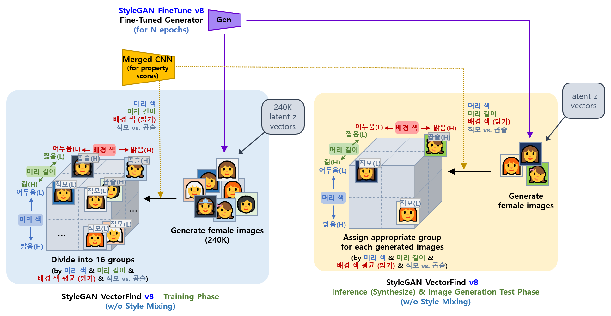

## 목차

* [1. Final Report](#1-final-report)
* [2. Grouping](#2-grouping)
* [3. Image Generation Test Result](#3-image-generation-test-result)

## 1. Final Report

* 실험 설정
  * [grouping](#2-grouping) (16 groups) 는 **모든 case 에 대해 항상 적용**

* passed 기준 **(모두 만족)**
  * 각 속성 값 별, **의도한 값 vs. 실제 생성된 이미지에 대해 Property Score CNN 으로 도출한 값** 의 corr-coef (상관계수) 가 다음을 만족 
  * ```eyes``` : 상관계수의 절댓값이 **0.92 이상** ([v7](../../../2025_05_02_OhLoRA_v2/stylegan/stylegan_vectorfind_v7/svm_train_report/img_generation_test_result.md) : 0.92 이상)
  * ```mouth``` : 상관계수의 절댓값이 **0.88 이상** ([v7](../../../2025_05_02_OhLoRA_v2/stylegan/stylegan_vectorfind_v7/svm_train_report/img_generation_test_result.md) : 0.88 이상)
  * ```pose``` : 상관계수의 절댓값이 **0.88 이상** ([v7](../../../2025_05_02_OhLoRA_v2/stylegan/stylegan_vectorfind_v7/svm_train_report/img_generation_test_result.md) : 0.92 이상)

| n<br>(total samples) | k<br>(top / bottom samples)     | latent vectors<br>(random z) | passed cases | Final Oh-LoRA 적합 case | ```eyes``` mean corr-coef | ```mouth``` mean corr-coef | ```pose``` mean corr-coef | details<br>(csv)                                           |
|----------------------|---------------------------------|------------------------------|--------------|-----------------------|---------------------------|----------------------------|---------------------------|------------------------------------------------------------|
| 240.0K               | 48.0K / 48.0K<br>**(20% each)** | 2,000                        | 49 (2.4 %)   | 19 (1.0 %)            | 0.8744                    | 0.8465                     | 0.8735                    | [test_result.csv](image_generation_report/test_result.csv) |

## 2. Grouping

* 이미지를 random latent code (z) 로부터 생성할 때,
  * 해당 이미지의 **머리 색, 머리 길이, 배경 색 평균** 의 핵심 속성 값을 Property Score CNN 으로 예측
  * 해당 핵심 속성 값을 기준으로 이미지를 각 그룹으로 분류
* 각 그룹별로,
  * t-SNE 실시 및 SVM 학습
  * **눈을 뜬 정도, 입을 벌린 정도, 고개 돌림** 각각에 대한 n vector 계산
* inference 시,
  * 생성된 이미지가 어느 그룹에 속하는지 Property Score CNN 으로 판단
  * 해당 그룹에 맞는 **눈을 뜬 정도, 입을 벌린 정도, 고개 돌림** n vector 를 이용하여 핵심 속성 값이 변동된 이미지 생성



## 3. Image Generation Test Result

* **결론**
  * SVM 학습을 위해 생성하는 후보 이미지의 개수 (= random latent code z 의 개수), 즉 **Sample Count (N)** 이 커질수록 **성능 (mean corr-coef 기준)** 이 좋다.

* 실험 설정
  * 모든 실험에서 **[sklearnex](https://medium.com/intel-analytics-software/from-hours-to-minutes-600x-faster-svm-647f904c31ae)** 및 **[grouping](#2-grouping) (16 groups)** 둘 다 적용
  * 모든 실험에서 ```SVC(kernel='linear', ...)``` 대신 **```LinearSVC(...)``` 를 적용**

* 결과 표 해석
  * mean corr-coef
    * 각 corr-coef (상관계수) 는 **각 case 별 50 장의 생성된 이미지** 에 대해, **의도한 Property Scores vs. 실제 CNN 에 의해 도출된 Property Scores** 의 상관계수
    * 각 실험 별 100 cases (random z latent vectors)

| Sample Count             |                                 | Performance<br>(SVM accuracy)      |                                     |                                    | mean corr-coef<br>(상관계수)      |                                |                               |            |
|--------------------------|---------------------------------|------------------------------------|-------------------------------------|------------------------------------|-------------------------------|--------------------------------|-------------------------------|------------|
| **n<br>(total samples)** | **k<br>(top / bottom samples)** | **```eyes``` accuracy<br>(0 ~ 1)** | **```mouth``` accuracy<br>(0 ~ 1)** | **```pose``` accuracy<br>(0 ~ 1)** | **```eyes``` mean corr-coef** | **```mouth``` mean corr-coef** | **```pose``` mean corr-coef** | **total**  |
| 4.0K                     | 800 / 800<br>**(20% each)**     | 0.9102                             | 0.8922                              | 0.9551                             | 0.8455                        | 0.8122                         | 0.8742                        | 2.5319     |
| 8.0K                     | 1.6K / 1.6K<br>**(20% each)**   | 0.9336                             | 0.9383                              | 0.9645                             | 0.8662                        | 0.8205                         | 0.8803                        | 2.5670     |
| 20.0K                    | 4.0K / 4.0K<br>**(20% each)**   | 0.9542                             | 0.9765                              | 0.9765                             | 0.8560                        | 0.8221                         | 0.8891                        | 2.5672     |
| 40.0K                    | 8.0K / 8.0K<br>**(20% each)**   | 0.9492                             | 0.9857                              | 0.9872                             | 0.8680                        | 0.8362                         | **0.8911**                    | 2.5953     |
| 80.0K                    | 16.0K / 16.0K<br>**(20% each)** | 0.9615                             | 0.9900                              | 0.9867                             | 0.8663                        | 0.8309                         | 0.8737                        | 2.5709     |
| 160.0K                   | 32.0K / 32.0K<br>**(20% each)** | 0.9634                             | 0.9932                              | 0.9896                             | **0.8881**                    | **0.8483**                     | 0.8815                        | **2.6179** |
| 160.0K                   | 24.0K / 24.0K<br>**(15% each)** | **0.9730**                         | **0.9937**                          | **0.9918**                         | 0.8809                        | 0.8421                         | 0.8812                        | 2.6042     |