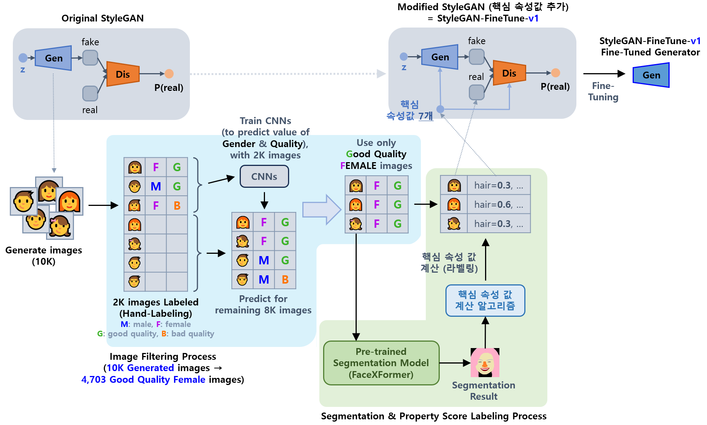
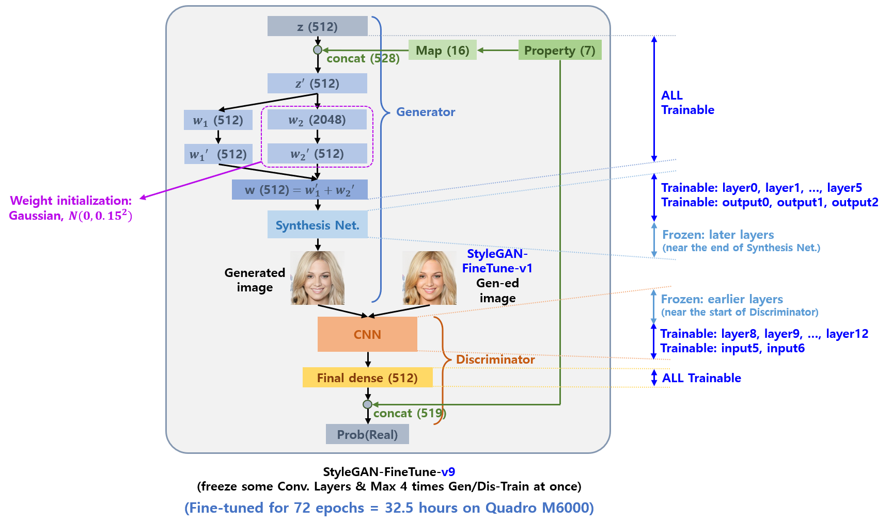
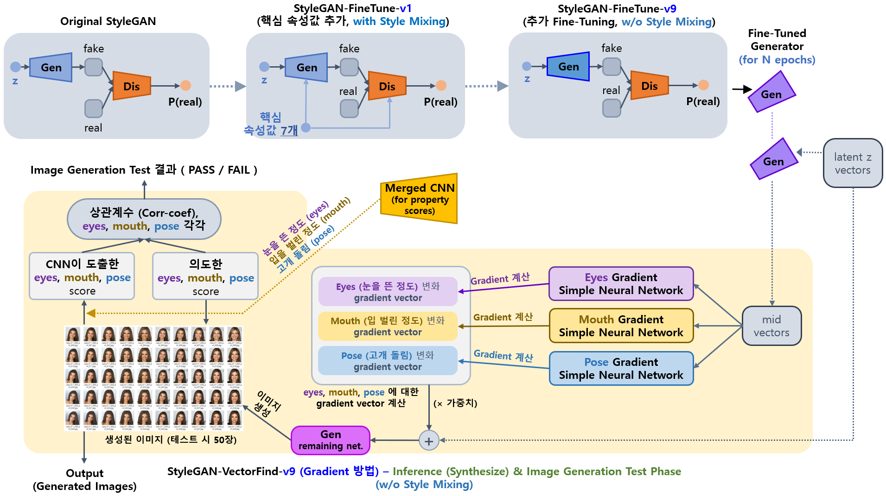
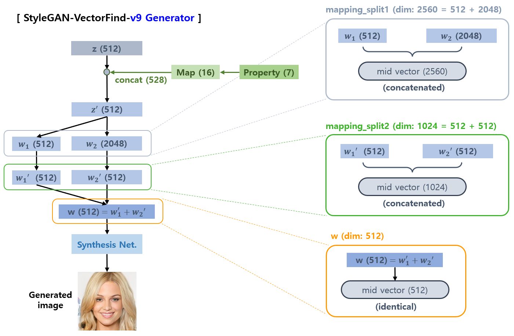

## 목차

* [1. 개요](#1-개요)
  * [1-1. 모델 구조](#1-1-모델-구조) 
* [2. 핵심 속성 값](#2-핵심-속성-값)
* [3. 사용 모델 설명](#3-사용-모델-설명)
  * [3-1. Fine-Tuned StyleGAN (StyleGAN-FineTune-v1)](#3-1-fine-tuned-stylegan-stylegan-finetune-v1)
  * [3-2. Fine-Tuned StyleGAN (StyleGAN-FineTune-v9)](#3-2-fine-tuned-stylegan-stylegan-finetune-v9)
  * [3-3. StyleGAN-VectorFind-v9 (SVM 방법)](#3-3-stylegan-vectorfind-v9-svm-방법)
  * [3-4. StyleGAN-VectorFind-v9 (Gradient 방법)](#3-4-stylegan-vectorfind-v9-gradient-방법)
  * [3-5. Gender, Quality, Age, Glass Score CNN (StyleGAN-FineTune-v8 학습 데이터 필터링용)](#3-5-gender-quality-age-glass-score-cnn-stylegan-finetune-v8-학습-데이터-필터링용)
* [4. intermediate vector 추출 위치](#4-intermediate-vector-추출-위치)
* [5. 코드 실행 방법](#5-코드-실행-방법)

## 1. 개요

* 핵심 요약
  * **Oh-LoRA 👱‍♀️ (오로라) 프로젝트의 v3 버전** 에서 사용하는 **가상 인간 여성 이미지 생성 알고리즘**
* 모델 구조 요약
  * Original StyleGAN
  * → StyleGAN-FineTune-v1 **('속성 값' 으로 conditional 한 이미지 생성 시도)**
  * → StyleGAN-FineTune-v9 **(Oh-LoRA 컨셉에 맞는 이미지로 추가 Fine-Tuning)** 
  * → StyleGAN-VectorFind-v9 **(Oh-LoRA 의 표정을 변화시키는 intermediate vector 를 활용)**

### 1-1. 모델 구조

* 전체적으로 [Oh-LoRA v3 (with StyleGAN-VectorFind-v8)](../../2025_05_26_OhLoRA_v3/stylegan/README.md#1-1-모델-구조) 과 유사
* 단, **StyleGAN-FineTune-v8** 대신 **StyleGAN-FineTune-v9** 적용

## 2. 핵심 속성 값

* [Oh-LoRA v3 의 해당 부분](../../2025_05_26_OhLoRA_v3/stylegan/README.md#2-핵심-속성-값) 참고.
* [핵심 속성 값 계산 알고리즘 (Oh-LoRA v3 프로젝트 문서)](../../2025_05_26_OhLoRA_v3/stylegan/README.md#2-1-핵심-속성-값-계산-알고리즘)

## 3. 사용 모델 설명

| 모델                                                                                                                | 최종 채택 | 핵심 아이디어                                                                                                                                                                                                                                                                                                                                                                                                                                                                                                                                                                                                                                                                                                                           | 성능 보고서                                            |
|-------------------------------------------------------------------------------------------------------------------|-------|-----------------------------------------------------------------------------------------------------------------------------------------------------------------------------------------------------------------------------------------------------------------------------------------------------------------------------------------------------------------------------------------------------------------------------------------------------------------------------------------------------------------------------------------------------------------------------------------------------------------------------------------------------------------------------------------------------------------------------------|---------------------------------------------------|
| [StyleGAN-FineTune-v1](#3-1-fine-tuned-stylegan-stylegan-finetune-v1)                                             |       | - StyleGAN-FineTune-v8 모델 학습을 위한 중간 단계 모델                                                                                                                                                                                                                                                                                                                                                                                                                                                                                                                                                                                                                                                                                         |                                                   |
| [StyleGAN-FineTune-v9](#3-2-fine-tuned-stylegan-stylegan-finetune-v9)                                             | ✅     | - StyleGAN-FineTune-v1 을 **Oh-LoRA 컨셉에 맞는 이미지** 로 추가 Fine-Tuning 하여, **Oh-LoRA 컨셉에 맞는 이미지 생성 확률 향상**<br>- 즉, 안경을 쓰지 않은, 고품질의 젊은 여성 이미지 생성 확률 향상                                                                                                                                                                                                                                                                                                                                                                                                                                                                                                                                                                                   | [학습 결과 보고서](stylegan_finetune_v9/train_report.md) |
| [StyleGAN-VectorFind-v9 (SVM 방법)](#3-3-stylegan-vectorfind-v9-svm-방법)                                             |       | - **핵심 속성값을 잘 변화** 시키는, intermediate vector 에 대한 **벡터 찾기** [(논문 스터디 자료)](https://github.com/WannaBeSuperteur/AI-study/blob/main/Paper%20Study/Vision%20Model/%5B2025.05.05%5D%20Semantic%20Hierarchy%20Emerges%20in%20Deep%20Generative%20Representations%20for%20Scene%20Synthesis.md)<br>- 이때, 이미지를 머리 색 ```hair_color```, 머리 길이 ```hair_length```, 배경색 밝기 평균 ```background_mean```, 직모 vs. 곱슬머리 ```hairstyle```, 에 기반하여 $2^4 = 16$ 그룹으로 나누고, **각 그룹별로 해당 벡터 찾기**<br>- intermediate vector 의 Generator 상의 위치가 [3가지](#4-intermediate-vector-추출-위치) 인 것을 제외하면, [StyleGAN-VectorFind-v8](../../2025_05_26_OhLoRA_v3/stylegan/README.md#3-3-stylegan-finetune-v8-기반-핵심-속성값-변환-intermediate-w-vector-탐색-stylegan-vectorfind-v8) 과 동일 |
| [StyleGAN-VectorFind-v9 (Gradient 방법)](#3-4-stylegan-vectorfind-v9-gradient-방법)                                   |       | - **핵심 속성값을 잘 변화** 시키는, intermediate vector 에 대한 **벡터 찾기** [(논문 스터디 자료)](https://github.com/WannaBeSuperteur/AI-study/blob/main/Paper%20Study/Vision%20Model/%5B2025.05.05%5D%20Semantic%20Hierarchy%20Emerges%20in%20Deep%20Generative%20Representations%20for%20Scene%20Synthesis.md)<br>- 이때, intermediate vector 를 입력, ```eyes``` ```mouth``` ```pose``` 핵심 속성 값을 출력으로 하는 **간단한 딥러닝 모델 (Neural Network)** 을 학습, 그 모델을 이용하여 얻은 **Gradient 를 해당 벡터로 간주**                                                                                                                                                                                                                                                                        |
| [Gender, Quality, Age, Glass Score CNN](#3-5-gender-quality-age-glass-score-cnn-stylegan-finetune-v8-학습-데이터-필터링용) |       | - StyleGAN-FineTune-v8 및 v9 모델의 **학습 데이터 필터링** (4개의 [핵심 속성 값](../../2025_05_26_OhLoRA_v3/stylegan/README.md#2-핵심-속성-값) 이용) 을 위한 모델                                                                                                                                                                                                                                                                                                                                                                                                                                                                                                                                                                                                |                                                   |

### 3-1. Fine-Tuned StyleGAN (StyleGAN-FineTune-v1)



* [오로라 v1 프로젝트](../../2025_04_08_OhLoRA/stylegan_and_segmentation/README.md) 의 **모든 프로세스 (StyleGAN-FineTune-v1 모델 등) 를 그대로** 사용
* [상세 정보 (오로라 v1 프로젝트 문서)](../../2025_04_08_OhLoRA/stylegan_and_segmentation/README.md#3-1-image-generation-model-stylegan)

### 3-2. Fine-Tuned StyleGAN (StyleGAN-FineTune-v9)



* 기본 설계
  * [StyleGAN-FineTune-v1](../../2025_04_08_OhLoRA/stylegan_and_segmentation/README.md#3-1-image-generation-model-stylegan) 기반
  * z → w mapping 중 **분기 후 병합되는 부분** 추가 

* 상세 설계
  * 학습 설계 
    * 위 그림의 오른쪽과 같이, **Generator 의 Synthesis Network 의 후반부 & Discriminator 의 전반부 Layer 들을 Freeze** 처리
    * 1회의 GAN 학습 step 에서, **Generator 와 Discriminator 를 Loss 에 따라 각각 최대 4회 연속 학습** 하도록 설정
  * 신경망 레이어 설계
    * 위 그림에서 ```w1 (512)```, ```w1' (512)``` 로 표시한 2개의 레이어에는 **기존 StyleGAN-FineTune-v1 의 가중치 주입**
    * 위 그림에서 **새로 만들어지는 (가중치가 주입되지 않은) 레이어** 인 ```w2 (2048)```, ```w2' (512)``` 로 표시한 레이어는 [Gaussian Weight Initialization](https://github.com/WannaBeSuperteur/AI-study/blob/main/AI%20Basics/Deep%20Learning%20Basics/%EB%94%A5%EB%9F%AC%EB%8B%9D_%EA%B8%B0%EC%B4%88_Weight_initialization.md#3-%EA%B0%80%EC%9A%B0%EC%8B%9C%EC%95%88-%EB%B6%84%ED%8F%AC-%EC%B4%88%EA%B8%B0%ED%99%94-gaussian-initialization) $N(0, 0.15^2)$ 적용
      * $N(0, 1^2)$ 로 초기화하면 **초반 생성되는 이미지가 사람 얼굴의 형태와 큰 차이가 남**

* 학습 설정 및 결과
  * 72 epochs (32.5 hours)
  * [학습 결과 보고서](stylegan_finetune_v9/train_report.md)

### 3-3. StyleGAN-VectorFind-v9 (SVM 방법)

### 3-4. StyleGAN-VectorFind-v9 (Gradient 방법)

**0. 전체 요약 그림**

**1. 학습 단계**

* ```eyes``` ```mouth``` ```pose``` 의 3개 핵심 속성 값에 대해, 
  * **intermediate (= mid) vector** 를 입력, **핵심 속성 값** 을 출력으로 하는 간단한 신경망 (총 3개) 학습 

**2. 추론 및 이미지 생성 테스트 단계**



* ```eyes``` ```mouth``` ```pose``` 의 3개 핵심 속성 값에 대해, 
  * StyleGAN-FineTune-v9 Generator 를 이용하여 **intermediate vector** 계산 및 추출 
  * 해당 **intermediate vector** 를 입력으로 하여, 위에서 학습한 신경망에 대해 **Gradient 계산**
  * **계산한 Gradient 를 핵심 속성 값을 변화시키는 벡터** 로 사용
* 최종 이미지 생성
  * **(latent z vector) + (가중치) $\times$ (위에서 계산한 Gradient)** 를 계산
  * 해당 계산된 벡터를 StyleGAN-FineTune-v9 Generator 의 **해당 intermediate vector 를 추출한 부분 이후의 나머지 부분** 에 입력 → 최종 이미지 생성
  * 위 그림에서는 Generator 의 그 나머지 부분을 **remaining net.** 이라고 함

### 3-5. Gender, Quality, Age, Glass Score CNN (StyleGAN-FineTune-v8 학습 데이터 필터링용)

* [Oh-LoRA v3 프로젝트 문서의 해당 부분](../../2025_05_26_OhLoRA_v3/stylegan/README.md#3-4-gender-quality-age-glass-score-cnn-stylegan-finetune-v8-학습-데이터-필터링용) 참고.

## 4. intermediate vector 추출 위치

StyleGAN-VectorFind-v9 에서 **mid vector (= intermediate vector)** 를 추출하는 위치는 다음과 같이 구분한다.

| 위치                   | 설명                                                                                                                                                                                               | 벡터 차원                 |
|----------------------|--------------------------------------------------------------------------------------------------------------------------------------------------------------------------------------------------|-----------------------|
| ```w```              | [StyleGAN-VectorFind-v8](../../2025_05_26_OhLoRA_v3/stylegan/README.md#3-3-stylegan-finetune-v8-기반-핵심-속성값-변환-intermediate-w-vector-탐색-stylegan-vectorfind-v8) 과 동일하게, **StyleGAN 의 w 에 해당하는 벡터** | **512**               |
| ```mapping_split1``` | ```z'``` 를 split 한 두 부분인 **```w1``` 과 ```w2``` 를 concatenate 한 벡터**                                                                                                                              | **2560** = 512 + 2048 |
| ```mapping_split2``` | ```w1```, ```w2``` 를 각각 mapping 시킨 **```w1'``` 과 ```w2'``` 를 concatenate 한 벡터**                                                                                                                  | **1024** = 512 + 512  |



## 5. 코드 실행 방법

모든 코드는 ```2025_06_07_OhLoRA_v3_1``` (프로젝트 메인 디렉토리) 에서 실행

* **StyleGAN-FineTune-v9** 학습
  * ```python stylegan/run_stylegan_finetune_v9.py```
