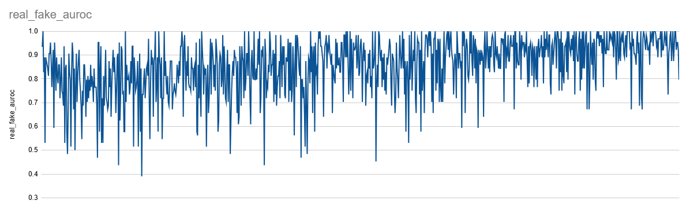
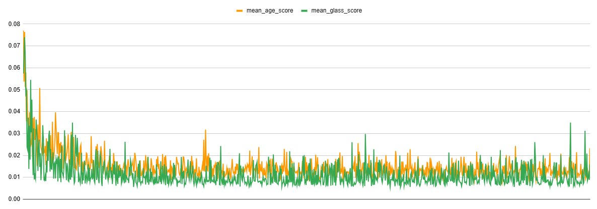
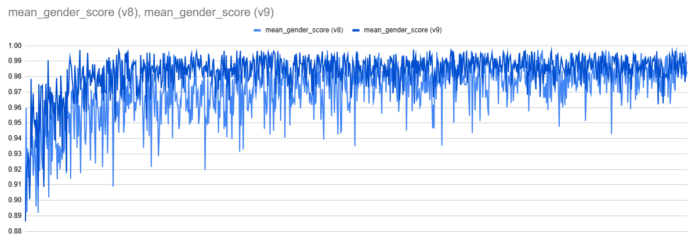
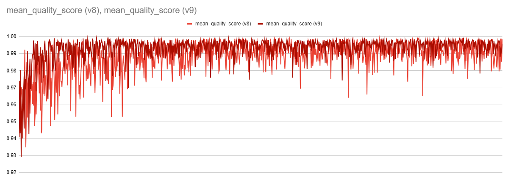
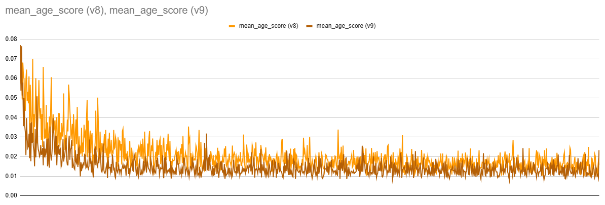
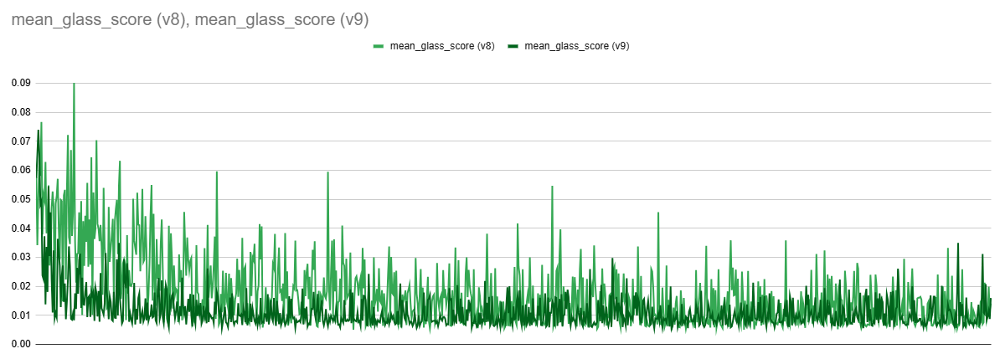

## 목차

* [1. StyleGAN-FineTune-v8 학습 결과](#1-stylegan-finetune-v8-학습-결과)
* [2. 실험 결과 그래프](#2-실험-결과-그래프)
  * [2-1. GAN 학습 관련](#2-1-gan-학습-관련)
  * [2-2. 핵심 속성 값 관련 (이미지 생성 테스트 결과)](#2-2-핵심-속성-값-관련-이미지-생성-테스트-결과)

## 1. StyleGAN-FineTune-v8 학습 결과

* 실험 기본 정보
  * 2025.06.08 12:30 ~ 06.09 21:00 KST (32.5 hours) 동안 진행
  * total 72 epochs
* 요약
  * StyleGAN-FineTune-v9 가 **안정적으로, 의도 (= Oh-LoRA 의 "여성 대학생" 컨셉) 에 맞게** 학습 됨
* 학습 이미지 생성 테스트 결과 
  * 학습이 진행됨에 따라, ```gender``` ```quality``` ```age``` ```glass``` 의 핵심 속성 값이 모두 의도한 바에 가까워짐

## 2. 실험 결과 그래프

* 모든 그래프의 가로축은 **학습이 진행됨에 따른 시간의 흐름 (가장 왼쪽 = 0 epoch, 가장 오른쪽 = last epoch)** 을 나타냄

### 2-1. GAN 학습 관련

* Generator Loss & Discriminator Loss


* Discriminator 의 Real / Fake image 에 대한 [AUROC (ROC-AUC) score](https://github.com/WannaBeSuperteur/AI-study/blob/main/AI%20Basics/Data%20Science%20Basics/%EB%8D%B0%EC%9D%B4%ED%84%B0_%EC%82%AC%EC%9D%B4%EC%96%B8%EC%8A%A4_%EA%B8%B0%EC%B4%88_Metrics.md#3-2-area-under-roc-curve-roc-auc)



### 2-2. 핵심 속성 값 관련 (이미지 생성 테스트 결과)

* 매 50 batch 마다 테스트 실시 (1 epoch 당 13 회)
* 매 회 테스트 실시 시,
  * random latent z vector 들을 이용하여 100 장의 이미지를 생성 후,
  * ```gender``` ```quality``` ```age``` ```glass``` score 를 계산하는 CNN 의 결과값을 기록
* ```gender``` ```quality``` score 추이
  * 학습이 진행됨에 따라 **Oh-LoRA 👱‍♀️ (오로라) 컨셉에 맞는 값 (1.0) 에 가까워짐**


* ```age``` ```glass``` score 추이
  * 학습이 진행됨에 따라 **Oh-LoRA 👱‍♀️ (오로라) 컨셉에 맞는 값 (0.0) 에 가까워짐**



### 2-3. 핵심 속성 값 관련 (StyleGAN-FineTune-v8 과 추이 비교)

참고 : [StyleGAN-FineTune-v8 학습 결과 리포트](../../../2025_05_26_OhLoRA_v3/stylegan/stylegan_finetune_v8/train_report.md)

* 전반적 경향성
  * ```gender``` ```quality``` ```age``` ```glass``` **4개의 핵심 속성 값 모두 StyleGAN-FineTune-v9 학습 시** 의 경우가 StyleGAN-FineTune-v8 학습 시보다 의도한 바에 **더 가깝게 수렴함**

* ```gender``` score 추이



* ```quality``` score 추이



* ```age``` score 추이



* ```glass``` score 추이


