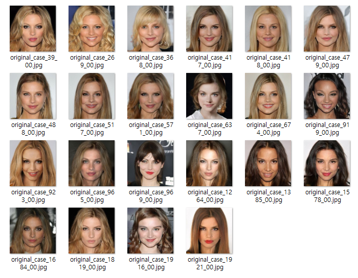

## 목차

* [1. 최종 Oh-LoRA 👱‍♀️ (오로라) 생성 정보](#1-최종-oh-lora--오로라-생성-정보)
  * [1-1. 최종 선정 latent vector 의 번호 (index)](#1-1-최종-선정-latent-vector-의-번호-index)
* [2. 최종 선정 latent vector 로 생성한 이미지](#2-최종-선정-latent-vector-로-생성한-이미지)

## 1. 최종 Oh-LoRA 👱‍♀️ (오로라) 생성 정보

* 요약
  * 이미지 생성 테스트에 합격한 latent vector (z) 중, **해당 latent vector 로 생성된 50장의 이미지를 사람의 눈으로 판독** 하여 Oh-LoRA 👱‍♀️ (오로라) 생성 용도로 사용할 **최종 latent vector 를 선정**
* 선정 기준 
  * 2003년생 대학생이라는 설정에 적합한 **젊은 여성** 이미지인지
  * [핵심 속성 값](../../../2025_04_08_OhLoRA/stylegan_and_segmentation/README.md#2-핵심-속성-값) 인 ```eyes``` ```mouth``` ```pose``` 가 **진짜로** 제대로 반영되고 있는지
    * 핵심 속성 값이 변하면서 **배경, 전체적인 얼굴 형태 등이 지나치게 많이 변하지** 는 않는지 
  * **불쾌한 골짜기** 현상이 충분히 적을 것인지

| 단계                                                             | cutoff<br>(상관계수 절댓값 기준, 모두 만족해야 함)                             | latent vector 개수 | 관련 정보                                                                                                                      |
|----------------------------------------------------------------|----------------------------------------------------------------|------------------|----------------------------------------------------------------------------------------------------------------------------|
| 총 테스트 대상 latent vector (z)                                     |                                                                | 2,000 개          | [csv file](image_generation_report/test_result_mapping_split1_160K%20(final,%20mixed).csv)                                 |
| [이미지 생성 테스트](image_generation_report.md) 합격한 latent vector (z) | ```eyes``` : 0.92+<br>```mouth``` : 0.88+<br>```pose```: 0.88+ | 43 개 (2.2 %)     | [csv file](image_generation_report/test_result_mapping_split1_160K%20(final,%20mixed).csv) → ```passed``` column = ```O``` |
| 최종 선정 latent vector (z)                                        |                                                                | **22 개 (1.1 %)** | [csv (vector info)](ohlora_mapping_split1_group_names%20(mixed).csv), [csv (vector)](ohlora_z_vectors%20(mixed).csv)       |

### 1-1. 최종 선정 latent vector 의 번호 (index)

| cutoff<br>(상관계수 절댓값 기준, 모두 만족해야 함)                             | 최종 선정 latent vector 개수      | 최종 선정 latent vector index (case No.)                                                                                                                                                                                              |
|----------------------------------------------------------------|-----------------------------|-----------------------------------------------------------------------------------------------------------------------------------------------------------------------------------------------------------------------------------|
| ```eyes``` : 0.92+<br>```mouth``` : 0.88+<br>```pose```: 0.88+ | **22 개** / 43 개<br>(51.2 %) | ```39``` ```269``` ```368``` ```417``` ```418``` ```479``` ```488``` ```517``` ```571``` ```637``` ```674``` ```919``` ```923``` ```965``` ```969``` ```1264``` ```1385``` ```1578``` ```1684``` ```1819``` ```1916``` ```1921``` |

## 2. 최종 선정 latent vector 로 생성한 이미지

* **OhLoRA-v3.1** 의 **최종 Oh-LoRA 👱‍♀️ (오로라)** 이미지에 해당
* 모든 이미지는 **해당 latent vector (z) 의 원본** 으로 생성한 것으로, **핵심 속성 값을 변화시키는 벡터를 가감하지 않은 z 벡터** 로 생성함


