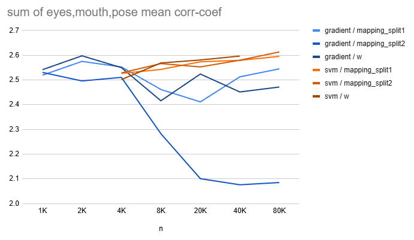
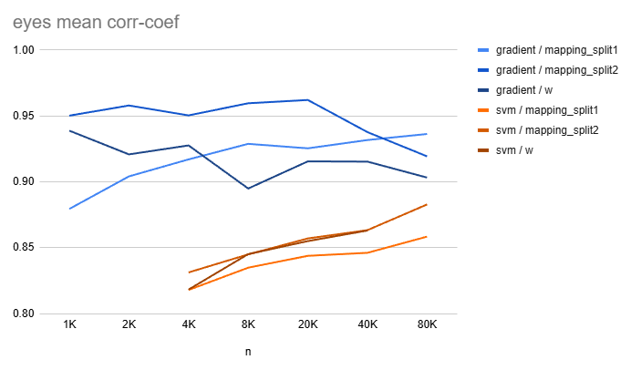
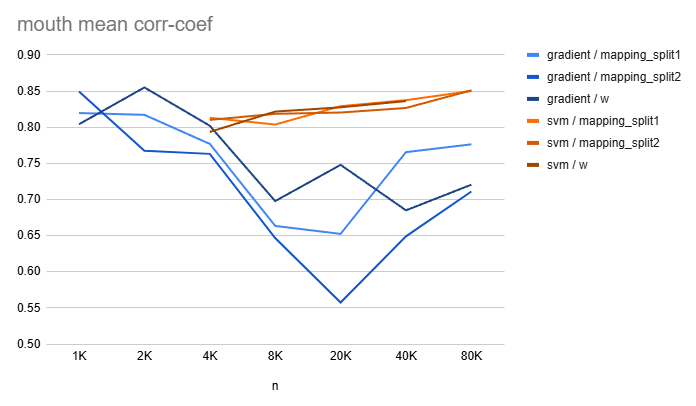
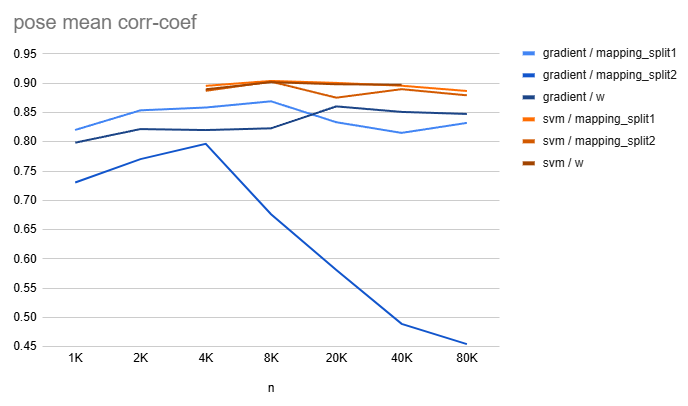

## 목차

* [1. Final Report](#1-final-report)
  * [1-1. 최종 이미지 생성 테스트 option 1: ```mixed```](#1-1-최종-이미지-생성-테스트-option-1-mixed)
  * [1-2. 최종 이미지 생성 테스트 option 2: ```svm_ms2```](#1-2-최종-이미지-생성-테스트-option-2-svm_ms2)
  * [1-3. 최종 이미지 생성 테스트 결과](#1-3-최종-이미지-생성-테스트-결과)
* [2. Image Generation Test Result](#2-image-generation-test-result)
  * [2-1. 각 핵심 속성 값 별 상세 결과](#2-1-각-핵심-속성-값-별-상세-결과)

## 1. Final Report

* 실험 설정
  * ```SVM``` 및 ```Gradient``` 방법론으로 실험 실시

| 방법론            | 핵심 아이디어                                                                                                                                                                                                                                                                                                                                                                                                                                                                                                                                              | 상세 정보 |
|----------------|------------------------------------------------------------------------------------------------------------------------------------------------------------------------------------------------------------------------------------------------------------------------------------------------------------------------------------------------------------------------------------------------------------------------------------------------------------------------------------------------------------------------------------------------------|-------|
| ```SVM```      | - [StyleGAN-VectorFind-v8](../../../2025_05_26_OhLoRA_v3/stylegan/README.md#3-3-stylegan-finetune-v8-기반-핵심-속성값-변환-intermediate-w-vector-탐색-stylegan-vectorfind-v8) 과 같이, [SVM (Support Vector Machine)](https://github.com/WannaBeSuperteur/AI-study/blob/main/AI%20Basics/Machine%20Learning%20Models/%EB%A8%B8%EC%8B%A0%EB%9F%AC%EB%8B%9D_%EB%AA%A8%EB%8D%B8_SVM.md) 으로 핵심 속성 값 변화 벡터 도출<br>- [grouping](../../../2025_05_26_OhLoRA_v3/stylegan/stylegan_vectorfind_v8/image_generation_report.md#2-grouping) (16 groups) 은 **모든 case 에 대해 항상 적용** |       |
| ```Gradient``` | - 간단한 딥러닝 모델의 Gradient 를 핵심 속성 값 변화 벡터로 사용                                                                                                                                                                                                                                                                                                                                                                                                                                                                                                           |       |

* 최종 이미지 테스트 방법 선정
  * [option 1: ```mixed```](#1-1-최종-이미지-생성-테스트-option-1-mixed)
  * [option 2: ```svm_ms2```](#1-2-최종-이미지-생성-테스트-option-2-svm_ms2)

### 1-1. 최종 이미지 생성 테스트 option 1: ```mixed```

| 속성 값        | 사용한 방법         | intermediate vector 추출 레이어 |
|-------------|----------------|----------------------------|
| ```eyes```  | ```Gradient``` | ```mapping_split1``` (공통)  |
| ```mouth``` | ```SVM```      | ```mapping_split1``` (공통)  |
| ```pose```  | ```SVM```      | ```mapping_split1``` (공통)  |

* 각 속성 값 별 방법 (```SVM``` or ```Gradient```) 사용 근거
  * [이미지 생성 테스트 결과](#2-image-generation-test-result) 에서 각 속성 값 별 성능 (mean corr-coef) 이 더 우수한 방법 선택
* 관련 문서
  * [최종 선정 Oh-LoRA 얼굴 이미지 정보](final_OhLoRA_info_mixed.md)
  * [본 문서의 이미지 생성 테스트 vs. ```mixed``` 옵션으로 생성 시 성능 비교](performance_compare_mixed.md)
* intermediate vector 로 ```mapping_split1``` 선정 이유
  * 생성 이미지 개수 (= latent code z 의 개수) 에 따라 **성능이 증가하는 경향성** 이 가장 큼
  * **dims = 2560** 으로 **입력 데이터의 정보량** 이 가장 많음

### 1-2. 최종 이미지 생성 테스트 option 2: ```svm_ms2```

| 속성 값        | 사용한 방법    | intermediate vector 추출 레이어 |
|-------------|-----------|----------------------------|
| ```eyes```  | ```SVM``` | ```mapping_split2``` (공통)  |
| ```mouth``` | ```SVM``` | ```mapping_split2``` (공통)  |
| ```pose```  | ```SVM``` | ```mapping_split2``` (공통)  |

* 방법 & intermediate vector 추출 레이어 선정 근거
  * 핵심 아이디어 
    * [이미지 생성 테스트 결과](#2-image-generation-test-result) 에서 [StyleGAN-VectorFind-v8](../../../2025_05_26_OhLoRA_v3/stylegan/README.md#3-3-stylegan-finetune-v8-기반-핵심-속성값-변환-intermediate-w-vector-탐색-stylegan-vectorfind-v8) 에서 사용한 ```SVM & w``` 조합을 제외한 가장 좋은 (방법 & intermediate vector 추출 레이어) 조합 선정
  * 선택한 조합 : ```SVM & mapping_split2```
    * 해당 조합은 **n = 80K** 일 때 **"모든 속성 값에 대한 mean corr-coef 의 합산"이 가장 큰** 조합임

### 1-3. 최종 이미지 생성 테스트 결과

* passed 기준 **(모두 만족)**
  * 각 속성 값 별, **의도한 값 vs. 실제 생성된 이미지에 대해 Property Score CNN 으로 도출한 값** 의 corr-coef (상관계수) 가 다음을 만족 
  * ```eyes``` : 상관계수의 절댓값이 **0.92 이상** ([v7](../../../2025_05_02_OhLoRA_v2/stylegan/stylegan_vectorfind_v7/svm_train_report/img_generation_test_result.md) : 0.92 이상)
  * ```mouth``` : 상관계수의 절댓값이 **0.88 이상** ([v7](../../../2025_05_02_OhLoRA_v2/stylegan/stylegan_vectorfind_v7/svm_train_report/img_generation_test_result.md) : 0.88 이상)
  * ```pose``` : 상관계수의 절댓값이 **0.88 이상** ([v7](../../../2025_05_02_OhLoRA_v2/stylegan/stylegan_vectorfind_v7/svm_train_report/img_generation_test_result.md) : 0.92 이상)

* 최종 이미지 생성 결과

**[ option 1 : ```mixed``` ]** [(상세 정보)](#1-1-최종-이미지-생성-테스트-option-1-mixed)

| n<br>(total samples) | k<br>(top / bottom samples)      | latent vectors<br>(random z) | passed cases | Final Oh-LoRA 적합 case | ```eyes``` mean corr-coef                                                                                                       | ```mouth``` mean corr-coef                                                                                                      | ```pose``` mean corr-coef                                                                                                       | details<br>(csv)                                                                           |
|----------------------|----------------------------------|------------------------------|--------------|-----------------------|---------------------------------------------------------------------------------------------------------------------------------|---------------------------------------------------------------------------------------------------------------------------------|---------------------------------------------------------------------------------------------------------------------------------|--------------------------------------------------------------------------------------------|
| 160.0K               | 32.0K / 32.0K <br>**(20% each)** | 2,000                        | 43 (2.2 %)   | 22 (1.1 %)            | 0.9198<br>[(▲ 0.0454)](../../../2025_05_26_OhLoRA_v3/stylegan/stylegan_vectorfind_v8/image_generation_report.md#1-final-report) | 0.8159<br>[(▼ 0.0306)](../../../2025_05_26_OhLoRA_v3/stylegan/stylegan_vectorfind_v8/image_generation_report.md#1-final-report) | 0.8372<br>[(▼ 0.0363)](../../../2025_05_26_OhLoRA_v3/stylegan/stylegan_vectorfind_v8/image_generation_report.md#1-final-report) | [csv file](image_generation_report/test_result_mapping_split1_160K%20(final,%20mixed).csv) |

**[ option 2 : ```svm_ms2``` ]** [(상세 정보)](#1-2-최종-이미지-생성-테스트-option-2-svm_ms2)

| n<br>(total samples) | k<br>(top / bottom samples) | latent vectors<br>(random z) | passed cases | Final Oh-LoRA 적합 case | ```eyes``` mean corr-coef | ```mouth``` mean corr-coef | ```pose``` mean corr-coef | details<br>(csv) |
|----------------------|-----------------------------|------------------------------|--------------|-----------------------|---------------------------|----------------------------|---------------------------|------------------|
|                      | / <br>**(% each)**          |                              | ( %)         | ( %)                  |                           |                            |                           |                  |

## 2. Image Generation Test Result

* **결론**
  * ```eyes``` 속성값은 ```Gradient``` 방법론, 나머지 ```mouth``` ```pose``` 속성값은 ```SVM``` 방법론의 성능이 우수하다. 
  * ```Gradient``` 방법론에 한해서, 모델 학습을 위해 생성하는 후보 이미지의 개수 (= random latent code z 의 개수), 즉 **Sample Count (N)** 이 커질수록 **성능 (mean corr-coef 기준)** 이 좋다.

* 실험 설정
  * ```SVM``` 방법론의 경우, 모든 실험에서 **[sklearnex](https://medium.com/intel-analytics-software/from-hours-to-minutes-600x-faster-svm-647f904c31ae)** 및 **[grouping](../../../2025_05_26_OhLoRA_v3/stylegan/stylegan_vectorfind_v8/image_generation_report.md#2-grouping) (16 groups)** 둘 다 적용
  * ```SVM``` 방법론의 경우, 모든 실험에서 ```SVC(kernel='linear', ...)``` 대신 **```LinearSVC(...)``` 를 적용**

* 그래프 해석
  * mean corr-coef
    * 각 corr-coef (상관계수) 는 **각 case 별 50 장의 생성된 이미지** 에 대해, **의도한 Property Scores vs. 실제 CNN 에 의해 도출된 Property Scores** 의 상관계수
    * 각 실험 별 100 cases (random z latent vectors)
  * 범례
    * 범례는 ```{방법론 이름} / {intermediate vector 추출 방법 이름}``` 형식
    * intermediate vector 추출 방법은 해당 문서 (TBU) 참고

* **3개 핵심 속성 값 (```eyes``` ```mouth``` ```pose```) 의 mean corr-coef 합계**



### 2-1. 각 핵심 속성 값 별 상세 결과

* 전체 요약
  * ```Gradient``` 방법론에서 일부 경우에서 **Gradient 추출용 딥러닝 모델의 학습 데이터가 늘어남에 따라 성능이 감소하는 이유는 불명**
  * 해당 딥러닝 모델 자체의 [MSE Error](https://github.com/WannaBeSuperteur/AI-study/blob/main/AI%20Basics/Deep%20Learning%20Basics/%EB%94%A5%EB%9F%AC%EB%8B%9D_%EA%B8%B0%EC%B4%88_Loss_function.md#2-1-mean-squared-error-mse) 는 **학습 데이터가 늘어남에 따라 감소하는 추세** 이므로, **딥러닝 학습은 문제 없음** 

| 핵심 속성 값     | 우수한 방법론        | intermediate vector 추출 레이어 별 성능 차이    | ```SVM``` 방법론 결과 특징             | ```Gradient``` 방법론 결과 특징                                                                                                                   |
|-------------|----------------|---------------------------------------|---------------------------------|--------------------------------------------------------------------------------------------------------------------------------------------|
| ```eyes```  | ```Gradient``` | ```SVM```, ```Gradient``` 모두 유의미하지 않음 | 생성 이미지 개수 (n) 이 **증가할수록 성능 향상** | 생성 이미지 개수 (n) 에 따른 성능 변화 거의 없음                                                                                                             |
| ```mouth``` | ```SVM```      | ```SVM```, ```Gradient``` 모두 유의미하지 않음 | 생성 이미지 개수 (n) 이 **증가할수록 성능 향상** | 생성 이미지 개수 (n) 이 **증가할수록 성능 소폭 하향 추정**                                                                                                      |
| ```pose```  | ```SVM```      | ```SVM```, ```Gradient``` 모두 유의미하지 않음 | 생성 이미지 개수 (n) 에 따른 성능 변화 거의 없음  | - ```mapping_split2``` 레이어에서 intermediate vector 추출 시, 생성 이미지 개수 (n) 이 **증가할수록 성능 하향**<br>- 나머지 레이어에서 추출 시, 생성 이미지 개수 (n) 에 따른 성능 변화 거의 없음 |

* ```eyes``` 핵심 속성 값의 mean corr-coef 



* ```mouth``` 핵심 속성 값의 mean corr-coef



* ```pose``` 핵심 속성 값의 mean corr-coef



* csv 파일

| intermediate vector 추출 레이어 | ```SVM``` 방법론                                              | ```Gradient``` 방법론                                              |
|----------------------------|------------------------------------------------------------|-----------------------------------------------------------------|
| ```mapping_split1```       | [csv file](test_result/test_result_svm_mapping_split1.csv) | [csv file](test_result/test_result_gradient_mapping_split1.csv) |
| ```mapping_split2```       | [csv file](test_result/test_result_svm_mapping_split2.csv) | [csv file](test_result/test_result_gradient_mapping_split2.csv) |
| ```w```                    | [csv file](test_result/test_result_svm_w.csv)              | [csv file](test_result/test_result_gradient_w.csv)              |

