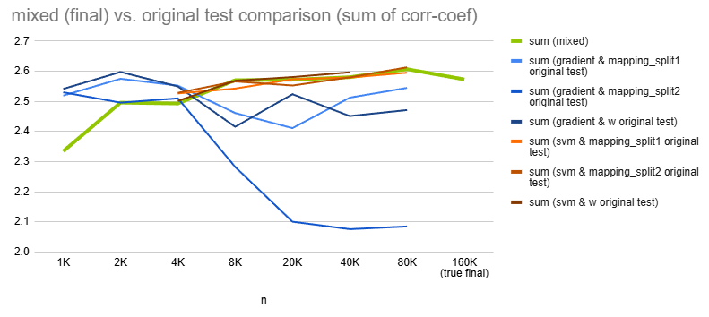
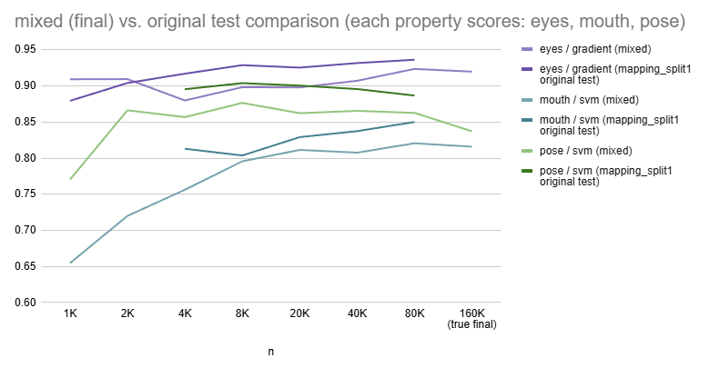

## 1. 개요

* Oh-LoRA 이미지 생성 테스트 결과에 의해 채택된 [최종 Oh-LoRA 이미지 생성 옵션](final_OhLoRA_info_mixed.md#1-최종-oh-lora--오로라-생성-정보) 중 ```mixed``` 옵션의 성능을 평가한다.
* ```mixed``` 옵션 설정

| 속성 값        | 사용한 방법         | intermediate vector 추출 레이어 |
|-------------|----------------|----------------------------|
| ```eyes```  | ```Gradient``` | ```mapping_split1``` (공통)  |
| ```mouth``` | ```SVM```      | ```mapping_split1``` (공통)  |
| ```pose```  | ```SVM```      | ```mapping_split1``` (공통)  |

## 2. ```mixed``` 옵션 vs. 이미지 생성 테스트 결과 비교

* 개요
  * ```mixed``` 옵션에는 각 속성 값 (```eyes``` ```mouth``` ```pose```) 별 **사용한 방법 (```SVM``` or ```Gradient```)** 이 다르다.
  * 각 속성 값에 대해, **3개의 모든 속성 값에 대해** 해당 방법을 적용했을 때의 [이미지 생성 테스트 결과 (이하 original test 결과)](image_generation_report.md#2-image-generation-test-result) (단, intermediate vector 추출 레이어는 동일하게 ```mapping_split1```) 와 비교한 성능을 평가한다.

* 실험 결론
  * 모든 핵심 속성 값에 대해, 성능, 즉 mean corr-coef 값은 **original test 결과에 비해 다소 떨어진다.** 
  * 모든 핵심 속성 값에 대해, 총 생성 이미지 개수 (n) 의 증가에 따른 mean corr-coef 값 변화 추이는 **original test 결과와 유사** 하다.
  * 전체 핵심 속성 값의 mean corr-coef 합산의 경우 **original test 결과 중 최고 수준 결과를 유의미하게 넘어서지 못한다.**

* 전체 핵심 속성 값의 mean corr-coef 합산



* 각 핵심 속성 값의 mean corr-coef
  * original test 결과보다 mean corr-coef 가 낮은 이유는 **SVM & Gradient 방법 혼합 사용** 에 따라 각 핵심 속성 값을 나타내는 벡터 간 **상호작용이 달라졌기 때문** 으로 추정


