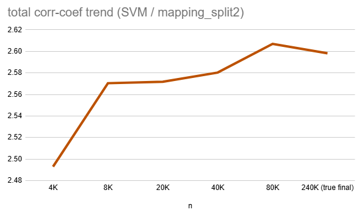
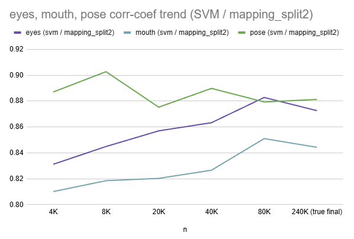

## 1. 개요

* Oh-LoRA 이미지 생성 테스트 결과에 의해 채택된 [최종 Oh-LoRA 이미지 생성 옵션](image_generation_report.md#1-final-report) 중 ```svm_ms2``` 옵션의 성능을 평가한다.
* ```svm_ms2``` 옵션 설정

| 속성 값        | 사용한 방법    | intermediate vector 추출 레이어 |
|-------------|-----------|----------------------------|
| ```eyes```  | ```SVM``` | ```mapping_split2``` (공통)  |
| ```mouth``` | ```SVM``` | ```mapping_split2``` (공통)  |
| ```pose```  | ```SVM``` | ```mapping_split2``` (공통)  |

## 2. ```svm_ms2``` 옵션 성능 측정

* 개요
  * ```svm_ms2``` 옵션은 다음과 같다.
    * ```SVM``` 방법을 이용하여,
    * ```mapping_split2``` 레이어에서 intermediate vector 를 추출한다.
  * 기존 [이미지 생성 테스트 결과 (이하 original test 결과)](image_generation_report.md#2-image-generation-test-result) 와 '결합'하여 해당 옵션의 성능을 평가한다.

* 전체 핵심 속성 값의 mean corr-coef 합산



* 각 핵심 속성 값의 mean corr-coef


