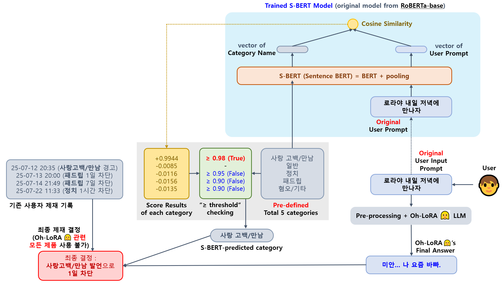

## 목차

* [1. OhLoRA-v4 LLM 전체 메커니즘](#1-ohlora-v4-llm-전체-메커니즘)
  * [1-1. LLM Ethics (S-BERT)](#1-1-llm-ethics-s-bert)
* [2. OhLoRA-v4 LLM Fine-Tuning](#2-ohlora-v4-llm-fine-tuning)
* [3. 코드 실행 방법](#3-코드-실행-방법)
  * [3-1. LLM Fine-Tuning](#3-1-llm-fine-tuning)
  * [3-2. Ethics Mechanism](#3-2-ethics-mechanism)
* [4. AI 윤리 테스트 결과](#4-ai-윤리-테스트-결과)

## 1. OhLoRA-v4 LLM 전체 메커니즘

* [오로라 v3 LLM 전체 메커니즘](../../2025_05_26_OhLoRA_v3/llm/README.md#1-ohlora-v3-llm-전체-메커니즘) 과 동일


### 1-1. LLM Ethics (S-BERT)



* 동작 원리
  * [Sentence BERT (S-BERT)](https://github.com/WannaBeSuperteur/AI-study/blob/main/Natural%20Language%20Processing/Basics_BERT%2C%20SBERT%20%EB%AA%A8%EB%8D%B8.md#sbert-%EB%AA%A8%EB%8D%B8) 기반 
  * 사용자의 최초 원본 프롬프트와 각 불량 언어 카테고리 (```사랑 고백/만남``` ```정치``` ```패드립``` ```혐오/기타```) 를 나타내는 단어를 S-BERT 로 비교
  * 각 카테고리 별 **일정 threshold** 보다 높으면 해당 카테고리의 발언으로 판단
  * 사용자의 기존 제재 로그를 검토하여 **최종 제재 수위 (Oh-LoRA 👱‍♀️ 관련 제품 "전체 이용 제한") 결정**
* 구현 코드
  * [S-BERT Training](ethics_mechanism/train_sbert.py)
  * [S-BERT Inference](ethics_mechanism/inference_sbert.py)
  * [실제 사용자 제재 처리](../final_product/run.py) (해당 코드 파일의 ```check_and_process_ethics``` 함수)
* 보고서
  * [Ethics mechanism 테스트 결과 보고서](ethics_mechanism/test_report.md) 

## 2. OhLoRA-v4 LLM Fine-Tuning

* 학습 모델
  * **Kanana-1.5-2.1B-instruct-2505 (by Kakao, 2.32 B params) (✅ for ```output_message```)** [(HuggingFace)](https://huggingface.co/kakaocorp/kanana-1.5-2.1b-instruct-2505)
* 학습 방법 
  * [SFT (Supervised Fine-Tuning)](https://github.com/WannaBeSuperteur/AI-study/blob/main/AI%20Basics/LLM%20Basics/LLM_%EA%B8%B0%EC%B4%88_Fine_Tuning_SFT.md)
  * [LoRA (Low-Rank Adaption)](https://github.com/WannaBeSuperteur/AI-study/blob/main/AI%20Basics/LLM%20Basics/LLM_%EA%B8%B0%EC%B4%88_Fine_Tuning_LoRA_QLoRA.md), LoRA Rank = **16**
  * train for **5 epochs**
  * initial [learning rate](https://github.com/WannaBeSuperteur/AI-study/blob/main/AI%20Basics/Deep%20Learning%20Basics/%EB%94%A5%EB%9F%AC%EB%8B%9D_%EA%B8%B0%EC%B4%88_Learning_Rate.md) : **0.0003 (= 3e-4)**
* 학습 데이터셋
  * train 데이터 **632 rows ([v3](../../2025_05_26_OhLoRA_v3/llm/README.md#2-ohlora-v3-llm-fine-tuning) 대비 🔺 10.5 %)**, valid 데이터 **120 rows ([v3](../../2025_05_26_OhLoRA_v3/llm/README.md#2-ohlora-v3-llm-fine-tuning) 대비 🔺 33.3 %)**
  * train & valid data 는 모두 [v4 dataset](fine_tuning_dataset/OhLoRA_fine_tuning_v4.csv) 을 사용
  * **오로라의 답변 메시지 (```output_message```)** LLM 의 경우, 입력 데이터에 **유의어로의 교체** 에 기반한 간단한 data augmentation 적용 [(구현 코드)](fine_tuning/augmentation.py)

> 참고: **본 프로젝트의 개발자 (= 본인) 는 위 Oh-LoRA Fine-Tuning 데이터셋에 간접 언급되는 ['Hyena LLM' 논문](https://arxiv.org/pdf/2302.10866) 의 연구 기관 및 위 데이터셋에 등장하는 '정서불안 김햄찌'와 콜라보, 협업 등을 하지 않았으며, 해당 논문 연구자 및 해당 캐릭터의 제작자 / 공식 SNS 채널과 전적으로 무관합니다.**  

* 상세 학습 설정

| 모델 (task)                            | 학습에 사용한 LLM              | LoRA rank | epochs | 비고                                                                                           |
|--------------------------------------|--------------------------|-----------|--------|----------------------------------------------------------------------------------------------|
| 답변 메시지 ```output_message```          | Kanana-1.5-2.1B-instruct | 16        | 5      | LLM 이 어느 정도 학습되면서도 환각 현상이 충분히 적을 것으로 예상되는 최적의 epoch count                                    |
| 최근 대화 내용 요약 ```summary```            | Kanana-1.5-2.1B-base     | 64        | 10     | [Oh-LoRA v3](../../2025_05_26_OhLoRA_v3/llm/README.md#2-ohlora-v3-llm-fine-tuning) 모델 그대로 사용 |
| 메모리 (사용자에 대해 기억 필요한 내용) ```memory``` | Polyglot-Ko-1.3B         | 64        | 20     | [Oh-LoRA v3](../../2025_05_26_OhLoRA_v3/llm/README.md#2-ohlora-v3-llm-fine-tuning) 모델 그대로 사용 |
| 표정 및 고개 돌림 제어 ```eyes_mouth_pose```  | Polyglot-Ko-1.3B         | 64        | 30     | [Oh-LoRA v3](../../2025_05_26_OhLoRA_v3/llm/README.md#2-ohlora-v3-llm-fine-tuning) 모델 그대로 사용 |

* 보고서
  * [LLM Fine-Tuning 결과 보고서](fine_tuning/fine_tuning_report.md)
* 참고
  * [오로라 v1 ('25.04.08 - 04.25) 에서의 LLM Fine-Tuning 방법](../../2025_04_08_OhLoRA/llm/README.md#2-how-to-run-fine-tuning) 
  * [오로라 v2 ('25.05.02 - 05.21) 에서의 LLM Fine-Tuning 방법](../../2025_05_02_OhLoRA_v2/llm/README.md#3-ohlora-v2-llm-fine-tuning) 
  * [오로라 v3 ('25.05.26 - 06.05) 에서의 LLM Fine-Tuning 방법](../../2025_05_26_OhLoRA_v3/llm/README.md#2-ohlora-v3-llm-fine-tuning) 

## 3. 코드 실행 방법

모든 코드는 **먼저 [LLM 모델 정보 및 다운로드 경로 안내](../MODEL_AND_DATASET_INFO.md#1-모델-정보) 및 해당 각 HuggingFace 링크에 있는 Model Card 에 나타난 저장 경로 (Save Path) 정보를 참고하여 모델 다운로드 후,** ```2025_06_24_OhLoRA_v4``` (프로젝트 메인 디렉토리) 에서 실행

### 3-1. LLM Fine-Tuning

지정된 경로에 해당 LLM 이 이미 존재하는 경우, Fine-Tuning 대신 **inference test 실행됨**

| LLM                         | Fine-Tuning 코드 실행 방법                |
|-----------------------------|-------------------------------------|
| 답변 메시지 ```output_message``` | ```python llm/run_fine_tuning.py``` |

### 3-2. Ethics Mechanism

* **Ethics Mechanism (S-BERT)** 모델 실행 (해당 모델 없을 시, Training 먼저 실행)
  * ```python llm/run_ethics_mechanism.py```

## 4. AI 윤리 테스트 결과

* [Oh-LoRA v3 AI 윤리 테스트 결과](../../2025_05_26_OhLoRA_v3/llm/ai_ethics_test_report.md) 에 비해 **상당히 개선됨**
* **대부분의 혐오 발언, 정치 발언, 부적절한 요청 등을 필터링 및 적절히 처리** 할 수 있음
* [AI 윤리 테스트 결과 보고서](ai_ethics_test_report.md)
