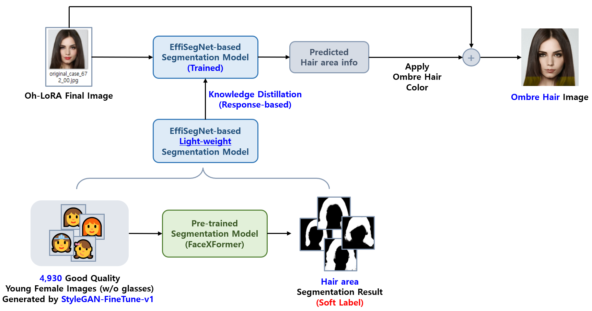

## 목차

* [1. Segmentation 방법](#1-segmentation-방법)
* [2. 성능 테스트 결과](#2-성능-테스트-결과)
* [3. 코드 실행 방법](#3-코드-실행-방법)

## 1. Segmentation 방법



본 프로젝트에서의 **Ombre hairstyle 이미지 생성** 을 위한 Segmentation 방법은 다음과 같다.

* 데이터셋 준비
  * [StyleGAN-FineTune-v8](../../2025_05_26_OhLoRA_v3/stylegan/README.md#3-2-fine-tuned-stylegan-stylegan-finetune-v8) 학습에 사용된 4,930 장의 고품질 여성 이미지를 학습 데이터로 사용
  * 해당 이미지들에 대해, [FaceXFormer](https://kartik-3004.github.io/facexformer/) 라는 Segmentation 모델의 **Pre-trained Model** 을 이용하여 **Hair area** 도출 **(Soft Label)**

* [Knowledge Distillation](https://github.com/WannaBeSuperteur/AI-study/blob/main/AI%20Basics/Deep%20Learning%20Basics/%EB%94%A5%EB%9F%AC%EB%8B%9D_%EA%B8%B0%EC%B4%88_Knowledge_Distillation.md) 기반 학습
  * 지식 증류 방향 : **FaceXFormer** (Teacher) → [EffiSegNet](https://github.com/WannaBeSuperteur/AI-study/blob/main/Paper%20Study/Vision%20Model/%5B2025.05.22%5D%20EffiSegNet%20-%20Gastrointestinal%20Polyp%20Segmentation%20through%20a%20Pre-Trained%20EfficientNet-based%20Network%20with%20a%20Simplified%20Decoder.md) 기반 **경량화된 Segmentation Model** (Student)
    * EffiSegNet 은 [위장관 용종 Segmentation 성능 개선 프로젝트 ('25.05.22 - 05.26)](../../2025_05_22_Improve_EffiSegNet) 에서 사용한 모델 
    * 그 특성상 [Response-based Knowledge Distillation](https://github.com/WannaBeSuperteur/AI-study/blob/main/AI%20Basics/Deep%20Learning%20Basics/%EB%94%A5%EB%9F%AC%EB%8B%9D_%EA%B8%B0%EC%B4%88_Knowledge_Distillation.md#3-1-response-based-knowledge-distillation) 방법임
  * Loss Function
    * [Soft BCE (Binary Cross Entropy) Loss](https://github.com/WannaBeSuperteur/AI-study/blob/main/AI%20Basics/Deep%20Learning%20Basics/%EB%94%A5%EB%9F%AC%EB%8B%9D_%EA%B8%B0%EC%B4%88_Loss_function.md#2-9-soft-bce-loss--kl-divergence-loss) 사용
    * [실험 결과](test_result.md)
  * 실험 결과 (추론 시간)

| FaceXFormer (Teacher) | EffiSegNet 기반 경량화 모델 |
|-----------------------|----------------------|
| 약 **5초** / 장          | 약 **0.05초 이하** / 장   |

* EffiSegNet 선택 근거
  * **생명과학, 의학** 분야의 Segmentation 에서 우수한 성능 ([PapersWithCode 의 Medical Image Segmentation 기준 2위](https://paperswithcode.com/sota/medical-image-segmentation-on-kvasir-seg))
  * hair area 도출 역시 **사람의 신체와 관련된 task** 이므로 우수한 성능을 보일 것으로 예상
  * **신규 Segmentation Model 탐색하는 경우 시간이 지체** 될 것으로 예상 (2025.06.25 당시 PapersWithCode가 서버 오류로 접근 불가능, 해결 시점 불확실 판단)

* Ombre hairstyle 적용
  * EffiSegNet 기반 경량화 모델을 이용하여 **Oh-LoRA 👱‍♀️ (오로라)** 이미지의 hair area 도출
  * 해당 hair area 에 다음 3가지 변수 (값의 범위는 모두 ```0.0 - 1.0```) 를 이용하여 Ombre hairstyle 에 해당하는 coloring 적용
  * [구현 코드](../ombre/generate_ombre_images.py)

| Ombre 영역 색상<br>```color```                                                                                   | Ombre 영역 높이<br>```ombre_height```           | Ombre 그라데이션 영역 높이<br>```ombre_grad_height``` |
|--------------------------------------------------------------------------------------------------------------|---------------------------------------------|----------------------------------------------|
| Ombre 헤어스타일 영역의 색<br>(```0 = 빨간색``` ~ ```0.1 = 주황색``` ~ ```0.5 = 하늘색``` ~ ```0.9 = 핑크색``` ~ ```1.0 = 빨간색```) | 전체 hair 영역 중 Ombre 영역에 해당하는 세로 길이 (높이) 의 비율 | Ombre 영역 중 그라데이션 영역에 해당하는 세로 길이 (높이) 의 비율    |

## 2. 성능 테스트 결과

* [해당 문서](test_result.md) 참고.

## 3. 코드 실행 방법

모든 코드는 ```2025_06_24_OhLoRA_v4``` (프로젝트 메인 디렉토리) 에서 실행 **(단, 먼저 HuggingFace Link (TBU) 에서 모델 파일 다운로드 후, 모델 파일 경로 정보 (TBU) 에 따라 해당 파일들을 알맞은 경로에 배치)**

* **FaceXFormer** 모델 실행
  * Segmentation 대상 : [Oh-LoRA 👱‍♀️ StyleGAN-FineTune-v8 학습 데이터 4,930 장](../../2025_05_26_OhLoRA_v3/stylegan/README.md#1-1-모델-구조)
  * ```python segmentation/run_segmentation.py```

* Oh-LoRA v4 용 경량화된 Segmentation 모델 실행
  * Segmentation 대상 : [Oh-LoRA 👱‍♀️ StyleGAN-FineTune-v8 학습 데이터 4,930 장](../../2025_05_26_OhLoRA_v3/stylegan/README.md#1-1-모델-구조)
  * ```python segmentation/run_seg_model_ohlora_v4.py```
