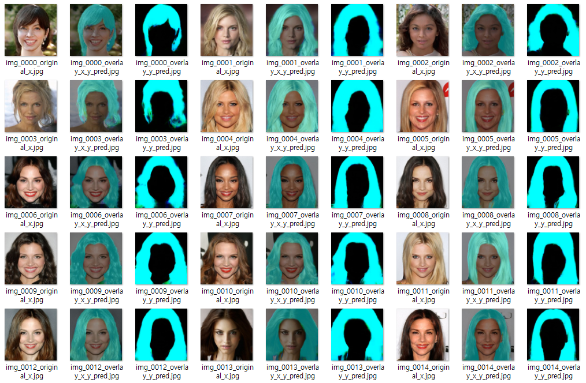
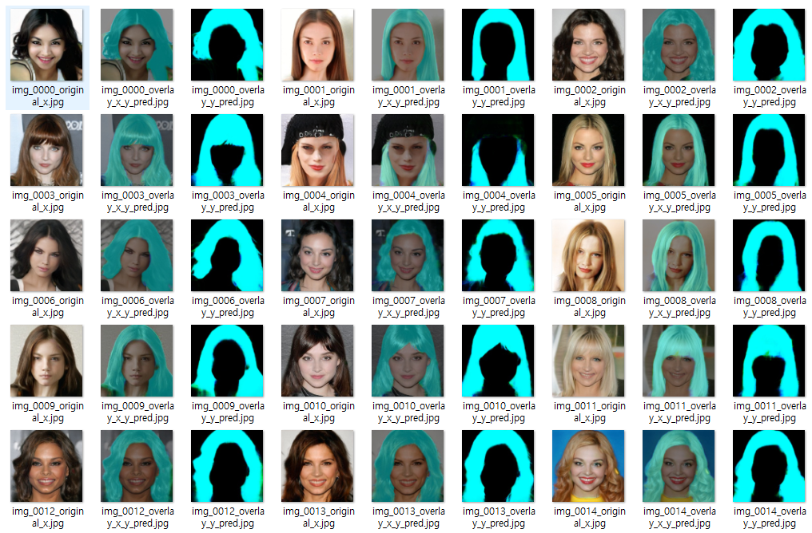
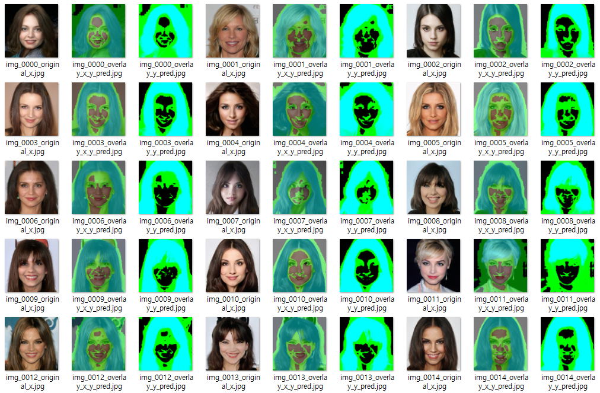

## 목차

## 1. 개요

* FaceXFormer 를 Knowledge Distillation 을 통해 경량화한, **Oh-LoRA v4 얼굴 생성용** Segmentation 모델 ([EffiSegNet](https://github.com/WannaBeSuperteur/AI-study/blob/main/Paper%20Study/Vision%20Model/%5B2025.05.22%5D%20EffiSegNet%20-%20Gastrointestinal%20Polyp%20Segmentation%20through%20a%20Pre-Trained%20EfficientNet-based%20Network%20with%20a%20Simplified%20Decoder.md) 기반) 의 **각 Loss Function 별** 성능을 평가한다.
  * FaceXFormer 는 [위장관 용종 탐지 Segmentation 모델 성능 향상 프로젝트 ('25.05.22 - 05.26)](https://github.com/WannaBeSuperteur/AI_Projects/tree/main/2025_05_22_Improve_EffiSegNet) 에서 사용한 모델
* FaceXFormer 경량화 필요 이유
  * 얼굴을 **최대한 실시간에 가깝게 빠르게** 생성해야 함
  * 추론 시간 변화: FaceXFormer 원본 모델 **(약 5초 소요)** → EffiSegNet 기반 경량화 모델 **(평균 0.05초 이하 소요)**

## 2. 테스트 결과 요약

* 결론
  * Soft BCE Loss 가 성능이 가장 좋음
  * KL Divergence Loss 는 다른 Loss Function 에 비해 성능이 매우 떨어짐

* 실험 결과 테이블

| Loss Function                                                                                                                                                                                                           | MSE Error    | IoU Score  | DICE Score | Recall     | Precision  |
|-------------------------------------------------------------------------------------------------------------------------------------------------------------------------------------------------------------------------|--------------|------------|------------|------------|------------|
| [MSE Loss](https://github.com/WannaBeSuperteur/AI-study/blob/main/AI%20Basics/Deep%20Learning%20Basics/%EB%94%A5%EB%9F%AC%EB%8B%9D_%EA%B8%B0%EC%B4%88_Loss_function.md#2-1-mean-squared-error-mse)                      | 0.000794     | 0.9680     | **0.9838** | 0.9833     | **0.9842** |
| [Soft BCE Loss](https://github.com/WannaBeSuperteur/AI-study/blob/main/AI%20Basics/Deep%20Learning%20Basics/%EB%94%A5%EB%9F%AC%EB%8B%9D_%EA%B8%B0%EC%B4%88_Loss_function.md#2-9-soft-bce-loss--kl-divergence-loss)      | **0.000738** | **0.9681** | **0.9838** | 0.9836     | 0.9840     |
| [KL Divergence Loss](https://github.com/WannaBeSuperteur/AI-study/blob/main/AI%20Basics/Deep%20Learning%20Basics/%EB%94%A5%EB%9F%AC%EB%8B%9D_%EA%B8%B0%EC%B4%88_Loss_function.md#2-9-soft-bce-loss--kl-divergence-loss) | 0.076325     | 0.5673     | 0.7239     | **1.0000** | 0.5673     |

* test result 원본 ([원본 파일](seg_model_ohlora_v4/test_result.txt))

```
[ MSE Loss ]
test result: {'mse': 0.0007941806102695763, 'iou': 0.9680325474754102, 'dice': 0.9837566443880221, 'recall': 0.9833235182546447, 'precision': 0.984190152249105}

[ Soft BCE Loss ]
test result: {'mse': 0.0007382125255928524, 'iou': 0.9681202375888053, 'dice': 0.9838019233772772, 'recall': 0.9836380247775052, 'precision': 0.9839658766053306}

[ KL Divergence Loss ]
test result: {'mse': 0.0763248957799366, 'iou': 0.5672963002993653, 'dice': 0.7239171051332253, 'recall': 0.9999999999999991, 'precision': 0.5672963002993653}
```

## 3. 테스트 결과 상세

* 범례

| 색깔       | 의미             | Teacher Model (FaceXFormer) 에 의한 hair 영역 | Student Model (EffiSegNet 기반 경량화 모델) 에 의한 hair 영역 |
|----------|----------------|------------------------------------------|---------------------------------------------------|
| Green    | False Positive | ❌                                        | ✅                                                 |
| Sky Blue | True Positive  | ✅                                        | ✅                                                 |
| Blue     | False Negative | ✅                                        | ❌                                                 |

* MSE Loss 결과



* Soft BCE Loss 결과 **(Best Performance, ✅ 최종 채택)**



* KL Divergence Loss **(Worst Performance)**
  * False Positive 픽셀 다수
  * Recall 은 높지만 Precision, DICE 를 비롯한 다른 성능지표가 모두 낮음 

