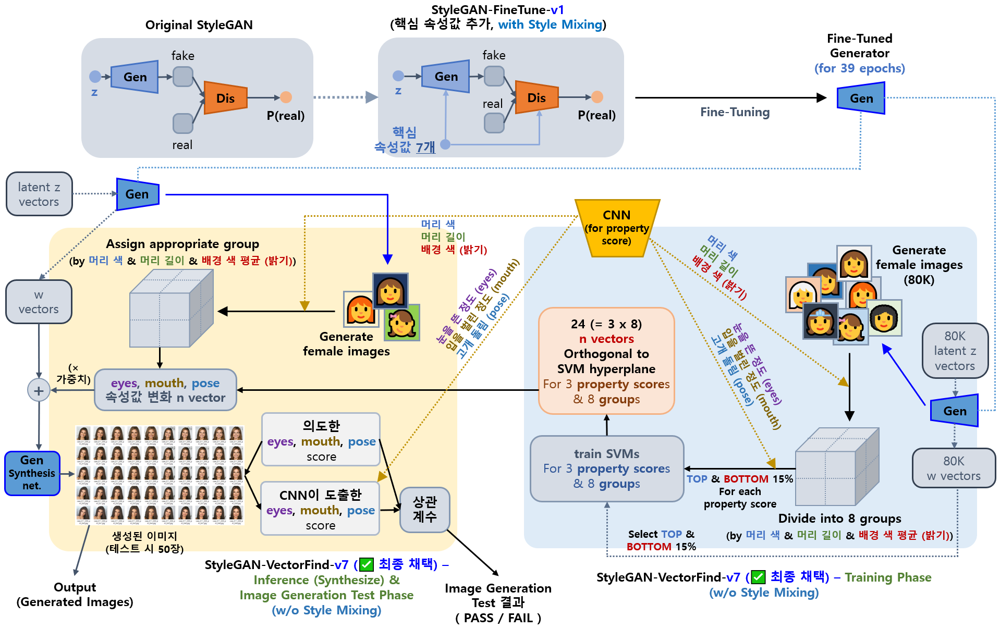

## 목차

* [1. 프로젝트 개요](#1-프로젝트-개요)
  * [1-1. 핵심 기능 소개](#1-1-핵심-기능-소개) 
  * [1-2. Oh-LoRA 👱‍♀️✨ (오로라) 소개](#1-2-oh-lora--오로라-소개)
  * [1-3. 실행 스크린샷](#1-3-실행-스크린샷)
  * [1-4. Oh-LoRA 얼굴 변화 애니메이션](#1-4-oh-lora-얼굴-변화-애니메이션)
* [2. 기술 분야 및 사용 기술](#2-기술-분야-및-사용-기술)
  * [2-1. 사용한 Python 라이브러리 및 시스템 환경](#2-1-사용한-python-라이브러리-및-시스템-환경)
* [3. 프로젝트 일정](#3-프로젝트-일정)
* [4. 프로젝트 상세 설명](#4-프로젝트-상세-설명)
  * [4-1. AI 질의응답](#4-1-ai-질의응답)
  * [4-2. AI 퀴즈](#4-2-ai-퀴즈)
  * [4-3. 멀티턴 실전 면접](#4-3-멀티턴-실전-면접)
* [5. 프로젝트 진행 중 이슈 및 해결 방법](#5-프로젝트-진행-중-이슈-및-해결-방법)
* [6. 사용자 가이드](#6-사용자-가이드)

## 1. 프로젝트 개요

**1. 핵심 아이디어**

* **LLM Fine-Tuning & StyleGAN** 을 이용한 가상인간 여성 [Oh-LoRA (오로라)](../2025_04_08_OhLoRA) 을 이용한 **ML (Machine Learning) Tutor**
* [Oh-LoRA 👱‍♀️ v4 ('25.06.24 - 06.30)](../2025_06_24_OhLoRA_v4) 에 적용한 **S-BERT 를 이용한 사용자 경고, 차단 메커니즘** 동일하게 적용
* 실제 사용자용 프로그램에서는 **Oh-LoRA 👱‍♀️ (오로라) 얼굴 생성** 이 **모든 기능** 에 적용됨

----

<details><summary>Oh-LoRA 👱‍♀️ (오로라) 얼굴 생성 방법 [ 펼치기 / 접기 ]</summary>

* 다음과 같이 **StyleGAN-VectorFind-v7** 및 **StyleGAN-VectorFind-v8** 을 이용하여 **Oh-LoRA 👱‍♀️ (오로라)** 얼굴 이미지 생성
  * [StyleGAN-VectorFind-v7](../2025_05_02_OhLoRA_v2/stylegan/README.md#3-3-stylegan-finetune-v1-기반-핵심-속성값-변환-intermediate-w-vector-탐색-stylegan-vectorfind-v7)
  * [StyleGAN-VectorFind-v8](../2025_05_26_OhLoRA_v3/stylegan/README.md#3-3-stylegan-finetune-v8-기반-핵심-속성값-변환-intermediate-w-vector-탐색-stylegan-vectorfind-v8)
* **StyleGAN-VectorFind-v7** 구조 개념도



* **StyleGAN-VectorFind-v8** 구조 개념도


* 실제 생성되는 얼굴
  * [Oh-LoRA v2 (StyleGAN-VectorFind-v7) 얼굴 27 종](../2025_05_02_OhLoRA_v2/stylegan/stylegan_vectorfind_v7/final_OhLoRA_info.md) 
  * [Oh-LoRA v3 (StyleGAN-VectorFind-v8) 얼굴 19 종](../2025_05_26_OhLoRA_v3/stylegan/stylegan_vectorfind_v8/final_OhLoRA_info.md) 

</details>

----

### 1-1. 핵심 기능 소개

**1. AI 질의응답**

* **LLM Fine-Tuning** 적용
* 기존 Oh-LoRA 👱‍♀️ (오로라) 의 [Oh-LoRA v3](../2025_05_26_OhLoRA_v3) 버전과 말투 유사
* Multi-turn 대화 미 지원

**2. AI 퀴즈**

* [S-BERT (Sentence BERT)](https://github.com/WannaBeSuperteur/AI-study/blob/main/Natural%20Language%20Processing/Basics_BERT%2C%20SBERT%20%EB%AA%A8%EB%8D%B8.md#sbert-%EB%AA%A8%EB%8D%B8) 를 이용한 퀴즈 채점 기능
  * 퀴즈 방식
    * 사용자에게 **질문** 이 주어짐
    * **사용자 답변** 채점 : Trained S-BERT 를 이용하여, 그 **질문** 에 대한 **"사용자의 답변"** - **"대표 모범 답안 (답변에 필요한 내용을 모두 포함한)"** 간 유사도 score 도출
    * Fine-Tuning 된 LLM 으로 **해설** 생성
  * 데이터셋 
    * 학습 데이터셋은 ```[질문, 대표 모범 답안, 가능한 답안 (정답, 오답 모두 포함), 해설] → [의도한 유사도 score]``` 으로 구성
    * 해설을 위한 LLM Fine-Tuning 은 ```(질문 + 사용자의 답변 + 대표 모범 답안) → (해설)``` 구조의 데이터셋으로 실시 
* 사용자가 틀릴 것으로 예상되는 문제 위주로 제공
  * 학습 데이터셋의 **각 질문 별 키워드 리스트** 에 근거한 **일반 알고리즘 (Not AI)** 으로 계산한 유사도에 근거

**3. 멀티턴 실전 면접**

* **LLM Fine-Tuning** 적용
  * 기존 Oh-LoRA 👱‍♀️ (오로라) 의 [Oh-LoRA v3](../2025_05_26_OhLoRA_v3) 버전과 말투 유사
* **꼬리 질문** 등을 위해 Multi-turn 대화 필요
  * Multi-turn 을 위한 ```직전 대화 요약``` LLM 별도 Fine-Tuning

### 1-2. Oh-LoRA 👱‍♀️✨ (오로라) 소개

* 성별 및 나이
  * 👱‍♀️ 여성
  * 2025년 기준 22 세 (2003년 10월 11일 생)
* MBTI
  * ENTJ 
* 학교
  * 🏫 알파고등학교 (2019.03 - 2022.02)
  * 🏰 샘올대학교 인공지능학과 (2022.03 - ) 3학년 재학 중
* 특수 능력
  * 오로라의 빛✨ 으로 우리 모두의 인생을 밝게 비춰 주는 마법 능력
  * 사람이 아닌 AI 가상 인간만이 가질 수 있음
* 기타 잡다한 TMI
  * 오로라 Fine-Tuning 에 사용한 데이터셋 (직접 제작) 을 보면 알 수 있어요!
  * Fine-Tuning 데이터셋 : [Oh-LoRA v4 Fine-Tuning Dataset](llm/fine_tuning_dataset/OhLoRA_fine_tuning_v4.csv)
    * 참고: **본 프로젝트의 개발자 (= 본인) 는 위 데이터셋에 간접 언급되는 ['Hyena LLM' 논문](https://arxiv.org/pdf/2302.10866) 의 연구 기관 및 위 데이터셋에 등장하는 '정서불안 김햄찌'와 콜라보, 협업 등을 하지 않았으며, 해당 논문 연구자 및 해당 캐릭터의 제작자 / 공식 SNS 채널과 전적으로 무관합니다.**

<details><summary>(스포일러) 오로라👱‍♀️ 가 2003년 10월 11일 생인 이유 [ 펼치기 / 접기 ] </summary>

오로라를 개발한 [개발자 (wannabesuperteur)](https://github.com/WannaBeSuperteur) 가 개발할 때 Python 3.10.11 을 사용했기 때문이다.

</details>

### 1-3. 실행 스크린샷

TBU

### 1-4. Oh-LoRA 얼굴 변화 애니메이션

* [해당 문서](../2025_06_24_OhLoRA_v4/ohlora_animation.md) 참고.
* **총 20 MB 정도의 GIF 이미지 (10장) 가 있으므로 데이터 사용 시 주의**

## 2. 기술 분야 및 사용 기술

* 기술 분야
  * LLM (Large Language Model)
* 사용 기술

| 기술 분야           | 사용 기술                                                                                                                                                                                    | 설명                                                            |
|-----------------|------------------------------------------------------------------------------------------------------------------------------------------------------------------------------------------|---------------------------------------------------------------|
| LLM             | [SFT (Supervised Fine-Tuning)](https://github.com/WannaBeSuperteur/AI-study/blob/main/AI%20Basics/LLM%20Basics/LLM_%EA%B8%B0%EC%B4%88_Fine_Tuning_SFT.md)                                | 가상 인간이 적절한 말투로 사용자와 대화 **(질의응답, 퀴즈 해설, 멀티턴 면접)** 할 수 있게 하는 기술 |
| LLM             | [LoRA (Low-Rank Adaption)](https://github.com/WannaBeSuperteur/AI-study/blob/main/AI%20Basics/LLM%20Basics/LLM_%EA%B8%B0%EC%B4%88_Fine_Tuning_LoRA_QLoRA.md)                             | 가상 인간의 LLM 을 효율적으로 Fine-Tuning 하는 기술                          |
| LLM             | [S-BERT (Sentence BERT)](https://github.com/WannaBeSuperteur/AI-study/blob/main/Natural%20Language%20Processing/Basics_BERT%2C%20SBERT%20%EB%AA%A8%EB%8D%B8.md#sbert-%EB%AA%A8%EB%8D%B8) | 퀴즈의 사용자 답변을 **대표 모범 답안** 과 비교하여 **유사도 계산** → 사용자 답변 채점        |
| LLM             | [S-BERT (Sentence BERT)](https://github.com/WannaBeSuperteur/AI-study/blob/main/Natural%20Language%20Processing/Basics_BERT%2C%20SBERT%20%EB%AA%A8%EB%8D%B8.md#sbert-%EB%AA%A8%EB%8D%B8) | 가상 인간이 사용자의 질문이 **부적절한 언어를 사용했는지** 판단                         |

### 2-1. 사용한 Python 라이브러리 및 시스템 환경

* Python
  * Python : **Python 3.10.11**
  * Dev Tool : PyCharm 2024.1 Community Edition
* Python Libraries
  * 주요 파이썬 라이브러리 (TBU)
  * 실험 환경의 전체 파이썬 라이브러리 목록 (TBU)
* OS & CPU & GPU
  * OS : **Windows 10**
  * CPU : Intel(R) Xeon(R) CPU E5-2690 0 @ 2.90GHz
  * GPU : 2 x **Quadro M6000** (12 GB each)
  * **CUDA 12.4** (NVIDIA-SMI 551.61)
* 시스템 환경 상세 정보 (TBU)

## 3. 프로젝트 일정

* 전체 일정 : **2025.07.02 수 - 07.17 목 (16 days)**
* 상태 : ⬜ (TODO), 💨 (ING), ✅ (DONE), ❎ (DONE BUT **NOT MERGED**), ❌ (FAILED)

**1. 프로젝트 전체 관리**

| 구분       | 계획 내용                            | 일정           | branch                 | issue | 상태 |
|----------|----------------------------------|--------------|------------------------|-------|----|
| 📃 문서화   | 프로젝트 개요 및 최초 일정 작성               | 07.02 수 (1d) |                        |       | ✅  |
| 🔍 최종 검토 | 최종 사용자 실행용 코드 작성 **(기본 뼈대)**     | 07.10 목 (1d) | ```P008-009-ForUser``` |       | ⬜  |
| 🔍 최종 검토 | 최종 사용자 실행용 코드 작성 **(AI 질의응답)**   | 07.10 목 (1d) | ```P008-009-ForUser``` |       | ⬜  |
| 🔍 최종 검토 | 최종 사용자 실행용 코드 작성 **(AI 퀴즈)**     | 07.10 목 (1d) | ```P008-009-ForUser``` |       | ⬜  |
| 🔍 최종 검토 | 최종 사용자 실행용 코드 작성 **(멀티턴 실전 면접)** | 07.10 목 (1d) | ```P008-009-ForUser``` |       | ⬜  |
| 🔍 최종 검토 | 최종 QA (버그 유무 검사)                 | 07.11 금 (1d) |                        |       | ⬜  |
| 📃 문서화   | 데이터셋 및 모델 HuggingFace 에 등록       | 07.11 금 (1d) |                        |       | ⬜  |
| 📃 문서화   | 프로젝트 문서 정리 및 마무리                 | 07.11 금 (1d) |                        |       | ⬜  |

**2. AI 질의응답 기능**

| 구분         | 계획 내용                                               | 일정                     | branch                    | issue | 상태 |
|------------|-----------------------------------------------------|------------------------|---------------------------|-------|----|
| 📝 데이터셋 작성 | LLM Supervised Fine-Tuning 학습 데이터 작성 **(질의응답 LLM)** | 07.02 수 - 07.04 금 (3d) | ```P008-001-train-LLM1``` |       | ⬜  |
| 🧪 모델 학습   | LLM Supervised Fine-Tuning 학습 **(질의응답 LLM)**        | 07.04 금 (1d)           | ```P008-001-train-LLM1``` |       | ⬜  |
| 📃 문서화     | "AI 질의응답" 개발 내용 문서화                                 | 07.04 금 (1d)           |                           |       | ⬜  |

**3. AI 퀴즈 기능**

| 구분         | 계획 내용                                | 일정                     | branch                      | issue | 상태 |
|------------|--------------------------------------|------------------------|-----------------------------|-------|----|
| 📝 데이터셋 작성 | AI 퀴즈 학습 데이터 작성                      | 07.05 토 - 07.06 일 (2d) | ```P008-002-quiz-dataset``` |       | ⬜  |
| 🧪 모델 학습   | 사용자 답변 채점용 S-BERT 모델 학습              | 07.06 일 (1d)           | ```P008-003-train-SBERT2``` |       | ⬜  |
| 🧪 모델 학습   | 답안 해설용 LLM Supervised Fine-Tuning 학습 | 07.08 화 (1d)           | ```P008-004-train-LLM2```   |       | ⬜  |
| ⚙ 기능 구현    | 틀릴 가능성이 높은 퀴즈 출제 구현                  | 07.08 화 (1d)           | ```P008-005-fit-quiz```     |       | ⬜  |
| 📃 문서화     | "AI 퀴즈" 개발 내용 문서화                    | 07.08 화 (1d)           |                             |       | ⬜  |

**4. 멀티턴 실전 면접 기능**

| 구분         | 계획 내용                                                               | 일정                     | branch                           | issue | 상태 |
|------------|---------------------------------------------------------------------|------------------------|----------------------------------|-------|----|
| 📝 데이터셋 작성 | LLM Supervised Fine-Tuning 학습 데이터 작성 **(면접관 발화 생성 & 직전 대화 요약 LLM)** | 07.08 화 - 07.09 수 (2d) | ```P008-006-interview-dataset``` |       | ⬜  |
| 🧪 모델 학습   | LLM Supervised Fine-Tuning 학습 **(면접관 발화 생성 LLM)**                   | 07.09 수 (1d)           | ```P008-007-train-LLM3-1```      |       | ⬜  |
| 🧪 모델 학습   | LLM Supervised Fine-Tuning 학습 **(직전 대화 요약 LLM)**                    | 07.09 수 (1d)           | ```P008-008-train-LLM3-2```      |       | ⬜  |
| 📃 문서화     | "멀티턴 실전 면접" 개발 내용 문서화                                               | 07.09 수 (1d)           |                                  |       | ⬜  |

## 4. 프로젝트 상세 설명

| 핵심 기능     | 사용 기술                 | 구성 모델                                    |
|-----------|-----------------------|------------------------------------------|
| AI 질의응답   | LLM **(Single-turn)** | - 질의응답 모델 (LLM) 1개                       |
| AI 퀴즈     | LLM, S-BERT           | - 사용자 답변 채점 S-BERT 모델 1개<br>- 해설용 LLM 1개 |
| 멀티턴 실전 면접 | LLM **(Multi-turn)**  | - 면접관 발화 생성 LLM 1개<br>- 직전 대화 요약 LLM 1개  |

### 4-1. AI 질의응답

TBU

### 4-2. AI 퀴즈

TBU

### 4-3. 멀티턴 실전 면접

TBU

## 5. 프로젝트 진행 중 이슈 및 해결 방법

TBU

## 6. 사용자 가이드

* 모델 및 데이터셋 정보는 (TBU) 참고.
* 사용자 가이드는 (TBU) 참고.

