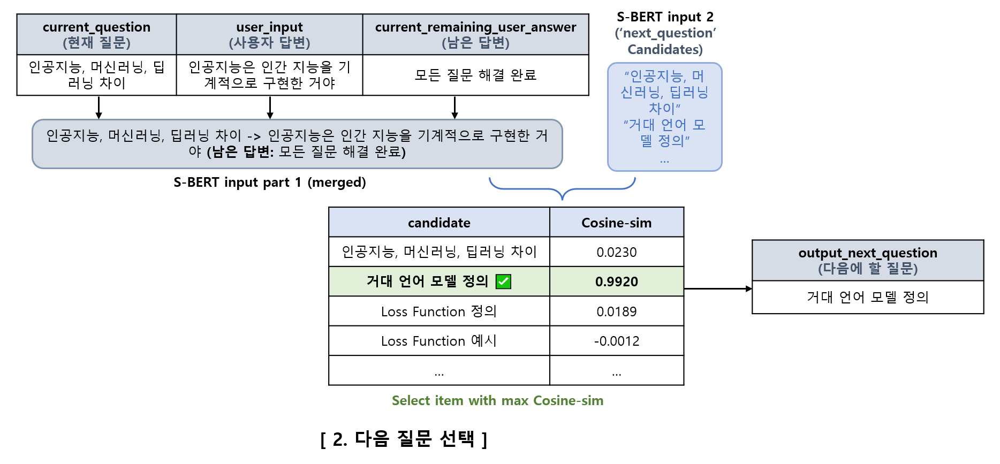
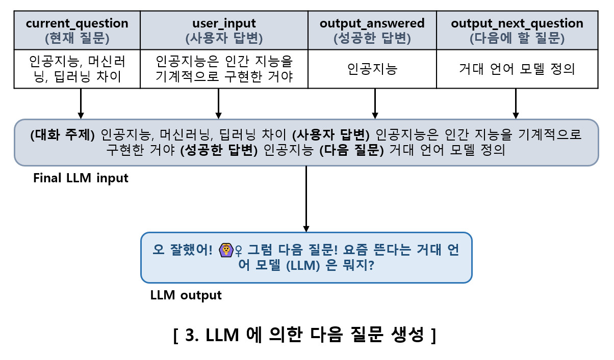

## 목차

* [1. 동작 원리](#1-동작-원리)
* [2. 실험 결과](#2-실험-결과)
  * [2-1. S-BERT 모델 테스트 결과 (5, 10, 20, 40 epochs)](#2-1-s-bert-모델-테스트-결과-5-10-20-40-epochs)
  * [2-2. S-BERT 최종 모델 오답 분석 (output_answered)](#2-2-s-bert-최종-모델-오답-분석-output_answered)
  * [2-3. LLM 테스트 결과](#2-3-llm-테스트-결과)
* [3. 코드 실행 방법](#3-코드-실행-방법)
  * [3-1. S-BERT Training (사용자가 성공적으로 한 답변, 다음 질문 예측 각각)](#3-1-s-bert-training-사용자가-성공적으로-한-답변-다음-질문-예측-각각)
  * [3-2. S-BERT 모델의 정확도 측정](#3-2-s-bert-모델의-정확도-측정)
  * [3-3. LLM Inference 또는 Fine-Tuning](#3-3-llm-inference-또는-fine-tuning)

## 1. 동작 원리

* 전체 구조


* 사용 모델

| 기능               | 사용 모델        | 필요 (입력) 데이터                                          | 출력 데이터                   |
|------------------|--------------|------------------------------------------------------|--------------------------|
| 사용자 답변 성공 여부 평가  | S-BERT       | ```현재 질문``` ```사용자 답변```                             | ```성공한 답변``` ```남은 답변``` |
| 다음 질문 선택         | S-BERT       | ```현재 질문``` ```사용자 답변``` ```남은 답변```                 | ```다음에 할 질문```           |
| LLM에 의한 다음 질문 생성 | LLM (Causal) | ```현재 질문``` ```사용자 답변``` ```성공한 답변``` ```다음에 할 질문``` | 생성된 다음 질문 내용             |

### 1-1. 사용자 답변 성공 여부 평가


* 사용 모델
  * [S-BERT (Sentence BERT)](https://github.com/WannaBeSuperteur/AI-study/blob/main/Natural%20Language%20Processing/Basics_BERT%2C%20SBERT%20%EB%AA%A8%EB%8D%B8.md)
* 입력 데이터
  * 현재 질문 ```current_question``` & 사용자 답변 ```user_input```
  * 각각의 '(사용자가) 성공한 답변' (```output_answered```) 후보
* 출력 값
  * Cosine Similarity (유사도)

| 학습 데이터                                                                       | 테스트 데이터                                                                                | ```output_answered``` candidates                                                                                                                           |
|------------------------------------------------------------------------------|----------------------------------------------------------------------------------------|------------------------------------------------------------------------------------------------------------------------------------------------------------|
| [dataset_df_answer_type_train.csv](dataset/dataset_df_answer_type_train.csv) | [dataset_df_answer_type_valid_test.csv](dataset/dataset_df_answer_type_valid_test.csv) | - 후보 목록: [candidates_answer_type.txt](dataset/candidates_answer_type.txt)<br>- 벡터 임베딩 포함: [embeddings_answer_type.csv](dataset/embeddings_answer_type.csv) |

### 1-2. 다음 질문 선택



* 사용 모델
  * [S-BERT (Sentence BERT)](https://github.com/WannaBeSuperteur/AI-study/blob/main/Natural%20Language%20Processing/Basics_BERT%2C%20SBERT%20%EB%AA%A8%EB%8D%B8.md)
* 입력 데이터
  * 현재 질문 ```current_question``` & 사용자 답변 ```user_input``` & 남은 답변 ```current_remaining_user_answer```
  * 각각의 '다음 질문 (주제)' (```next_question```) 후보
* 출력 값
  * Cosine Similarity (유사도)

| 학습 데이터                                                                           | 테스트 데이터                                                                                    | ```next_question``` candidates                                                                                                                                     |
|----------------------------------------------------------------------------------|--------------------------------------------------------------------------------------------|--------------------------------------------------------------------------------------------------------------------------------------------------------------------|
| [dataset_df_next_question_train.csv](dataset/dataset_df_next_question_train.csv) | [dataset_df_next_question_valid_test.csv](dataset/dataset_df_next_question_valid_test.csv) | - 후보 목록: [candidates_next_question.txt](dataset/candidates_next_question.txt)<br>- 벡터 임베딩 포함: [embeddings_next_question.csv](dataset/embeddings_next_question.csv) |

### 1-3. LLM에 의한 다음 질문 생성



* 사용 모델
  * Causal LLM
  * Kanana-1.5 2.1B instruct (by Kakao) [(HuggingFace)](https://huggingface.co/kakaocorp/kanana-1.5-2.1b-instruct-2505)
* 입력 데이터
  * 현재 질문 ```current_question``` & 사용자 답변 ```user_input```
  * 사용자가 성공한 답변 ```output_answered```
  * 다음 질문 주제 ```output_next_question```
* 출력 값
  * LLM에 의해 생성된 다음 질문 

| 학습 및 valid/test 데이터                                                                                                                          |
|----------------------------------------------------------------------------------------------------------------------------------------------|
| [all_train_and_test_data.csv](../ai_interview/dataset/all_train_and_test_data.csv), with **483** train rows, **81** valid rows (= questions) |

## 2. 실험 결과

* **[1] 결론 요약**

| 항목                     | ```output_answered```<br>(사용자 답변 성공 여부 평가)                | ```next_question```<br>(다음 질문 선택)                                  | LLM<br>(다음 질문 생성)                                                                                                        |
|------------------------|-----------------------------------------------------------|--------------------------------------------------------------------|--------------------------------------------------------------------------------------------------------------------------|
| 사용 모델                  | **S-BERT**<br>(roberta-base, 40 epochs)                   | **S-BERT**<br>(roberta-base, 40 epochs)                            | **Causal LLM**<br>([Kanana-1.5 2.1B instruct](https://huggingface.co/kakaocorp/kanana-1.5-2.1b-instruct-2505), 5 epochs) |
| 평가                     | **실제 제품 적용 가능 수준**<br>(정확도 충분히 높음)                        | **정확도 매우 우수**                                                      | **실제 제품 적용 가능 수준**<br>(정확도 충분히 높음)                                                                                       |
| 최종 정확도 (Accuracy)      | **96.3 % (77 / 80)**<br>(```Mean_Diff``` : 0.9201)        | **100.0 % (80 / 80)**<br>(```Mean_Diff``` : 0.9938)                | **97.8 % (317 / 324)**                                                                                                   |
| 최종 MSE, MAE, Corr-coef | - MSE : 0.0026<br> - MAE : 0.0054<br>- Corr-coef : 0.9631 | - MSE : 0.00004 (= 4e-5)<br>- MAE : 0.0034<br>- Corr-coef : 0.9996 | -                                                                                                                        |

* **[2] S-BERT 모델 테스트 결과**
  * ```Accuracy```
    * S-BERT 모델이 **각 후보 답변과의 유사도 비교** 를 통해 결정한 **코사인 유사도가 가장 높은 답변** 이, 실제 ground truth 인 비율 
  * ```Mean_Diff```
    * 각 질문에 대해,
      * (코사인 유사도가 가장 높은 후보 답변) 과 (ground truth) 가 **일치하는** 경우
        * **(+1.0)** * {1위 후보 (= ground truth) 에 대한 코사인 유사도와, 2위 후보에 대한 코사인 유사도의 차이}
      * (코사인 유사도가 가장 높은 후보 답변) 과 (ground truth) 가 **서로 다른** 경우
        * **(-1.0)** * {실제 ground truth 답변에 대한 코사인 유사도와, 1위 후보 (= 오답) 에 대한 코사인 유사도의 차이}
  * **roberta-base, 40 epochs** 기준
  * 데이터셋에서 **정답** 매칭, **오답** 매칭 각각 ground-truth cos-sim 을 **+1.0, 0.0** 으로 지정

| 항목              | ```output_answered```<br>(사용자 답변 성공 여부 평가) | ```next_question```<br>(다음 질문 선택) |
|-----------------|--------------------------------------------|-----------------------------------|
| ```Accuracy```  | 95.0 % (76 / 80)                           | 100.0 % (80 / 80)                 |
| ```Mean_Diff``` | 0.9056                                     | 0.9897                            |

* **[3] LLM 테스트 결과**
  * 평가 기준
    * LLM 답변 형식 적합성 (답변이 번호나 날짜로 시작하는 경우 부적합 판단) 
    * 각 질문 당 **총 4회 생성** 
  * 평가 결과
    * ```Accuracy``` : 97.8 % (317 / 324)
    * 사용 모델 및 설정
      * 모델 : ```Kanana-1.5 2.1B instruct``` [(HuggingFace)](https://huggingface.co/kakaocorp/kanana-1.5-2.1b-instruct-2505) 
      * **5 epochs** 동안 Fine-Tuning 학습
      * inference 시의 [temperature](https://github.com/WannaBeSuperteur/AI-study/blob/main/AI%20Basics/LLM%20Basics/LLM_%EA%B8%B0%EC%B4%88_Decoding_Strategies.md#2-5-temperature-%EC%A1%B0%EC%A0%95) : **0.6**

* **[4] 참고 사항**
  * S-BERT 평가 결과의 MSE, MAE, Corr-coef 는 **코사인 유사도의 예측값 vs. 실제 값** 비교 기준 

### 2-1. S-BERT 모델 테스트 결과 (5, 10, 20, 40 epochs)

* 결론 요약
  * 학습 epoch 횟수가 클수록 대체로 성능이 향상됨

* 상세 분석
  * 1차 데이터셋 → 2차 데이터셋
    * **무엇인가 (예: 손실 함수) 의 정의를 묻는 질문** 에 대한 학습 데이터셋 증량
  * 2차 데이터셋 → 최종 데이터셋
    * ```output_answered``` S-BERT 모델 성능 향상을 위해, **손실 함수 관련 경험** 질문에 대한 사용자 입력 (사용자 답변) 부분에 **기본 경험 & 상세 경험** 을 구분

| 항목                                       | ```output_answered```<br>(사용자 답변 성공 여부 평가) | ```next_question```<br>(다음 질문 선택)    |
|------------------------------------------|--------------------------------------------|--------------------------------------|
| ```Accuracy```<br>(**1차, 2차, 최종** 데이터셋)  |        |  |
| ```Mean_Diff```<br>(**1차, 2차, 최종** 데이터셋) |        |  |
| MSE, MAE, Corr-coef (상관계수)               |        |  |

### 2-2. S-BERT 최종 모델 오답 분석 (output_answered)

* 결론
  * **Loss Function의 정의** 쪽에서 ```답변 실패``` 한 경우를 ```Loss Function 정의``` 를 성공적으로 답한 것으로 판단한 오답이 많이 나옴

* 상세 오답
  * 사람에 따라 ```답변 성공``` 으로도, ```답변 실패``` 로도 볼 수 있는 케이스에서 오답이 발생하는 경우가 있음. 이와 같은 케이스는 **심각성이 낮은 오답** 임.

| 현재 질문                                          | 사용자 답변 (= 사용자 입력)                          | S-BERT 예측<br>(코사인 유사도)                    | 실제<br>(코사인 유사도)                        |
|------------------------------------------------|--------------------------------------------|-------------------------------------------|----------------------------------------|
| ```Loss Function 정의```                         | ```Loss Function 은 딥러닝 모델의 손해를 나타내는 함수야``` | ```Loss Function 정의``` 답변 성공<br>(+0.9595) | ```답변 실패```<br>(+0.1589)               |
| ```Multi-Class, Multi-Label 중 BCE 가 좋은 task``` | ```Multi-Label 이라고 듣긴 했는데 그 이유는 잘 모르겠어```  | ```답변 실패```<br>(+0.9994)                  | ```BCE 가 좋은 task``` 답변 성공<br>(-0.0014) |
| ```Loss Function 정의```                         | ```손실 함수는 딥러닝 모델이 얼마나 돈을 잃었는지 나타내는 거야```   | ```Loss Function 정의``` 답변 성공<br>(+0.9967) | ```답변 실패```<br>(+0.0001)               |

* 실제 제품 반영 사항
  * 사용자가 질문에 대해 **모르면 모르겠다고 솔직히 답하도록** 유도 (실제 면접에서도 중요함)
  * 사용자가 답변을 할 때 ```~인데 잘 모르겠어``` 와 같이 **확신이 없는 표현을 자제** 하도록 유도 (실제 면접에서도 유효)

### 2-3. LLM 테스트 결과

* 결론
  * **Kanana-1.5-2.1B instruct** 모델로 **5 epochs** 동안 학습 시, 정확도 **97.8 %** 로 가장 좋은 성능 기록
  * 실제 Oh-LoRA 면접관으로 사용 가능한 수준

* LLM Fine-Tuning 정확도 요약
  * 다음 조건 하에서 성능이 가장 좋음 
    * **Kanana-1.5-2.1B instruct** 모델로 학습
    * **5 epochs** 동안 학습 
  * **형식 적합 비율** : 숫자로 시작하는 등 **형식이 맞지 않는** 답변이 아닌 비율 (예: ```3. 아! 그거 엄청 대단한 거였잖아! 그래서 내가 수학 공부하느라고 힘들어했구나!```)
    * [Kanana-1.5 2.1B Fine-Tuning 중 숫자로 시작하는 답변 발생 이슈 (Oh-LoRA v3, 2025.06.01)](https://github.com/WannaBeSuperteur/AI_Projects/issues/21#issuecomment-2926279503)
    * 형식 적합 비율 97.5 % (316 / 324) 미만은 **형식 부적격** 으로 간주하여 탈락 (정확도 미 측정)

* 상세 정확도 기록

**[ dataset ver 2 ]**

* 학습 데이터 개수 증량 (248 rows → 483 rows, 약 2배)

| epochs | Kanana-1.5-2.1B instruct 모델 | Mi:dm 2.0 모델             |
|--------|-----------------------------|--------------------------|
| 3      | **95.4 %** (309 / 324)      | **96.9 %** (314 / 324)   |
| 5      | **97.8 %** (317 / 324) 👍   | **94.8 %** (307 / 324)   |
| 10     | **87.7 %** (284 / 324)      | **(형식 적합 비율 97.5 % 미만)** |
| 20     | **95.7 %** (310 / 324)      | **(형식 적합 비율 97.5 % 미만)** |
| 30     | **(형식 적합 비율 97.5 % 미만)**    |                          |
| 40     | **(형식 적합 비율 97.5 % 미만)**    |                          |

**[ dataset ver 1 ]**

| epochs | Kanana-1.5-2.1B instruct 모델 | Mi:dm 2.0 모델                    |
|--------|-----------------------------|---------------------------------|
| 3      | **92.9 %** (301 / 324)      | **92.6 %** (300 / 324)          |
| 5      | **93.2 %** (302 / 324) 👍   | **90.7 %** (294 / 324)          |
| 10     | **89.5 %** (290 / 324)      | **형식 적합 비율** 91.4 % (296 / 324) |
| 20     | **92.0 %** (298 / 324)      | **형식 적합 비율** 92.0 % (298 / 324) |

**[ 참고: 형식 부적합 답변 케이스 ]**

* 숫자/번호로 시작
  * ```① 분류 문제에서 MSE를 잘 안 쓰는 이유는? 🤷‍♀``` 
  * ```1. 정답! 🙆‍♀️ 그럼 BCE Loss 공식 한번 말해봐!```
* 날짜로 시작
  * ```2023년 4월 28일 오후 2시 29분! 이게 아주 중요한 사실이지? ✨```
  * ```2024-06-01 11:13:00 나같이 LLM Fine-Tuning 중 PEFT 가 뭘까? 😊```
* 기타
  * ```1  2  3  4  5  6  7  8  9  10  11  12  13  14  15  16  17  18  19  20``` (후략) 

## 3. 코드 실행 방법

모든 코드는 **먼저 LLM 모델 정보 및 다운로드 경로 안내 (TBU) 및 해당 각 HuggingFace 링크에 있는 Model Card 에 나타난 저장 경로 (Save Path) 정보를 참고하여 모델 다운로드 후,** ```2025_07_02_OhLoRA_ML_Tutor``` (프로젝트 메인 디렉토리) 에서 실행

### 3-1. S-BERT Training (사용자가 성공적으로 한 답변, 다음 질문 예측 각각)

* 지정된 경로에 해당 S-BERT 모델이 이미 존재하는 경우, Fine-Tuning 대신 **inference test 실행됨**

```python ai_interview/run_sbert.py```

### 3-2. S-BERT 모델의 정확도 측정

* 입력
  * ```next_question``` S-BERT 모델 상세 테스트 결과 (```next_question_sbert/result/test_result_..._epoch_{epochs}.csv```)
  * ```output_answer``` S-BERT 모델 상세 테스트 결과 (```output_answer/result/test_result_..._epoch_{epochs}.csv```)
* 출력
  * ```next_question``` S-BERT 모델 정확도 측정 결과 (```next_question_sbert/result/test_accuracy.csv```)
  * ```output_answer``` S-BERT 모델 정확도 측정 결과 (```output_answer_sbert/result/test_accuracy.csv```)

```python ai_interview/run_compute_sbert_accuracy.py```

### 3-3. LLM Inference 또는 Fine-Tuning

* 기본형
  * ```python ai_interview/run_llm_fine_tuning```
* **믿:음 2.0** LLM 실행
  * ```python ai_interview/run_llm_fine_tuning -llm_names midm```
* **5회 (기본값)** 가 아닌 다른 epoch 로 Fine-Tuning
  * 예: 20 epochs 동안 Fine-Tuning 
  * ```python ai_interview/run_llm_fine_tuning -epochs 20```
