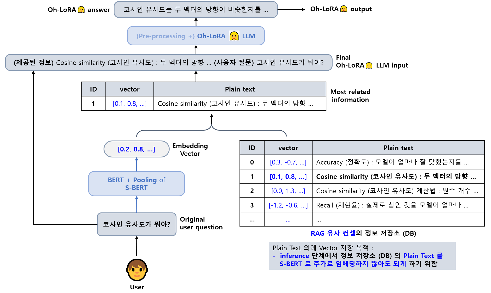
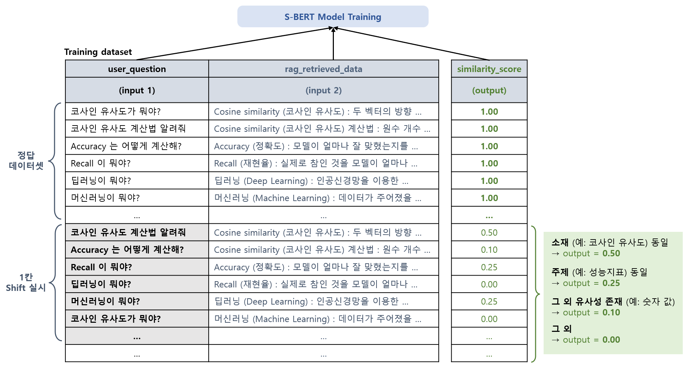

## 목차

* [1. 개요](#1-개요)
* [2. LLM Fine-Tuning](#2-llm-fine-tuning)
* [3. S-BERT (for RAG concept)](#3-s-bert-for-rag-concept)
* [4. 코드 실행 방법](#4-코드-실행-방법)
  * [4-1. LLM Fine-Tuning](#4-1-llm-fine-tuning)
  * [4-2. RAG Concept S-BERT Fine-Tuning](#4-2-rag-concept-s-bert-fine-tuning)

## 1. 개요

**Oh-LoRA 👱‍♀️ (오로라) ML Tutor** 의 기능 중 **머신러닝 분야 Q&A** 파트 구현 내용 정리

| 구분                       | 설명                                                                      | 데이터셋                                                                                         | 구현 코드                     |
|--------------------------|-------------------------------------------------------------------------|----------------------------------------------------------------------------------------------|---------------------------|
| LLM Fine-Tuning          | - RAG 을 통해 DB에서 정보 추출<br>- 이 정보를 결합한 final input 을 LLM 에 입력 후 LLM 답변 반환 | [데이터셋](fine_tuning_dataset/SFT_final.csv)                                                    | [구현 코드 디렉토리](fine_tuning) |
| S-BERT (for RAG concept) | - 사용자 질문 (user question) 과 DB 에 저장된 정보의 유사도 계산 (RAG 목적)                 | [학습 데이터셋](rag_sbert/dataset/train_final.csv)<br>[테스트 데이터셋](rag_sbert/dataset/test_final.csv) | [구현 코드 디렉토리](rag_sbert)   |

* [종합 성능 리포트](comprehensive_report.md)

## 2. LLM Fine-Tuning

* LLM 전체 구조



* 작동 방식
  * **1.** 사용자 질문을 S-BERT 모델의 BERT + Pooling Layer 에 입력
  * **2.** 사용자 질문을 임베딩한 vector 도출
  * **3.** 사용자 질문을 임베딩한 vector 와 **RAG concept DB 에 저장된 각 vector 중 유사도가 가장 높은 vector** 를 추출
  * **4.** 해당 **유사도가 가장 높은 vector** 에 대응되는 Plain Text 를 **사용자 질문과 concatenate**
  * **5.** 최종적으로 Oh-LoRA 👱‍♀️ (오로라) LLM 에 전달
  * **6.** Oh-LoRA 👱‍♀️ (오로라) LLM 이 생성한 답변을 **최종적으로 사용자에게 표시**
* RAG 유사 컨셉 DB
  * [RAG 유사 컨셉 DB](rag_sbert/db/rag_data_text.csv)

## 3. S-BERT (for RAG concept)

* 아래와 같이 학습 데이터를 구성하여 RAG 컨셉을 위한 [S-BERT (Sentence BERT)](https://github.com/WannaBeSuperteur/AI-study/blob/main/Natural%20Language%20Processing/Basics_BERT%2C%20SBERT%20%EB%AA%A8%EB%8D%B8.md#sbert-%EB%AA%A8%EB%8D%B8) 모델 학습
* [학습 데이터 원본](rag_sbert/dataset/train_final.csv)



## 4. 코드 실행 방법

모든 코드는 **먼저 LLM 모델 정보 및 다운로드 경로 안내 (TBU) 및 해당 각 HuggingFace 링크에 있는 Model Card 에 나타난 저장 경로 (Save Path) 정보를 참고하여 모델 다운로드 후,** ```2025_06_24_OhLoRA_v4``` (프로젝트 메인 디렉토리) 에서 실행

### 4-1. LLM Fine-Tuning

지정된 경로에 해당 LLM 이 이미 존재하는 경우, Fine-Tuning 대신 **inference test 실행됨**

```python ai_qna/run_fine_tuning.py```

### 4-2. RAG Concept S-BERT Fine-Tuning

지정된 경로에 해당 S-BERT 모델이 이미 존재하는 경우, Fine-Tuning 대신 **inference test 실행됨**

```python ai_qna/run_rag_concept.py```