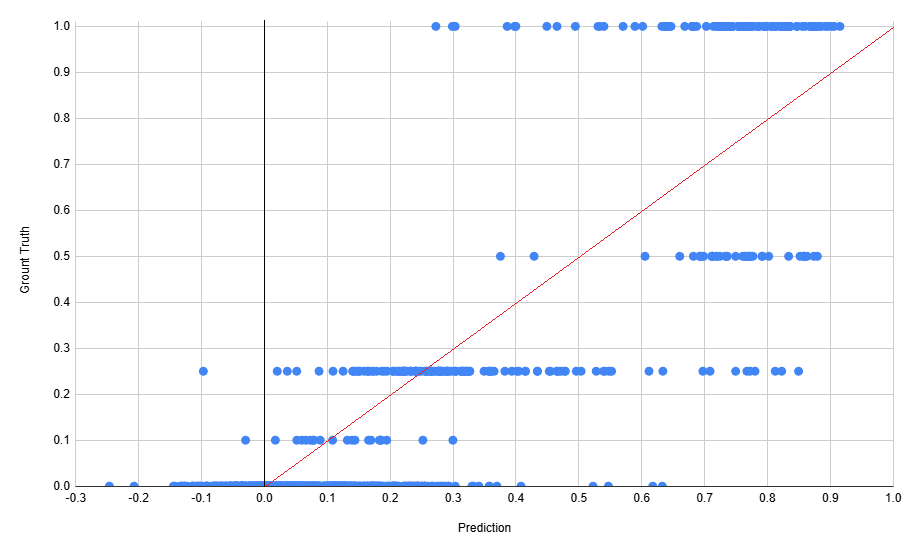

## 목차

* [1. 개요](#1-개요)
* [2. RAG 구현 용 S-BERT 모델 성능](#2-rag-구현-용-s-bert-모델-성능)
* [3. Fine-Tuned LLM 성능](#3-fine-tuned-llm-성능)

## 1. 개요

* **RAG 컨셉 기반 머신러닝 Q&A** 구현을 위한 모델 (Fine-Tuned LLM & S-BERT) 성능 평가
* 결과 요약

| 모델              | 성능 평가 결과                                                                                                           | 결론<br>(제품 출시 시 고려 사항)                                                                    |
|-----------------|--------------------------------------------------------------------------------------------------------------------|------------------------------------------------------------------------------------------|
| RAG 구현 용 S-BERT | 사용자 질문과 DB에 저장된 정보의 **matching 적절성 (cosine similarity)** 기준,<br>**MSE = 0.0274, MAE = 0.1992, Corr-coef = 0.8681** | - 경우에 따라 DB 정보 매칭이 잘못될 수 있음을 안내<br>- DB에서 매칭 점수가 높은 (단, cos-sim +0.5 이상) 답변을 **3개까지 표시** |
| Fine-Tuned LLM  | 115개 질문, 460개 답변 (각 질문 별 답변 4개 생성) 중 **명백한 오답 5개**<br>정확도 **98.48 % (= 453 / 460)**                                | - DB 에서 매칭되는 정보가 없는 경우 답변에 오류가 있음을 안내                                                    |

## 2. RAG 구현 용 S-BERT 모델 성능

* 평가 방법
  * 사용자 질문과 DB에 저장된 정보의 **matching 적절성 (cosine similarity, -1.0 ~ +1.0 범위)**
  * 데이터셋 : [사용자 질문 ```user_question``` 및 DB 저장 정보 ```rag_retrieved_data```](rag_sbert/dataset/test_final.csv)
  * 성능지표 평가 결과

| MSE (Mean Squared Error) | MAE (Mean Absolute Error) | Corr-coef |
|--------------------------|---------------------------|-----------|
| 0.0274                   | 0.1992                    | 0.8681    |



## 3. Fine-Tuned LLM 성능

* 평가 방법
  * 115개 질문, 460개 답변 (각 질문 별 답변 4개 생성) 중 **명백한 오답이 아닌 답변의 비율 (= 정확도)** 
    * 제공된 정보가 ```알맞은 정보를 찾을 수 없음``` 이 아닌 경우, **구체성 부족** 도 오답으로 간주
  * [LLM Fine-Tuning dataset](fine_tuning_dataset/SFT_final.csv) 의 ```data_type``` = ```valid``` 인 데이터
    * Test dataset 은 별도 준비하지 않음

* LLM Fine-Tuning 설정

| LoRA rank | LoRA alpha | LoRA dropout | epochs | init. learning rate |
|-----------|------------|--------------|--------|---------------------|
| 64        | 16         | 0.05         | 15     | 3e-4 (= 0.0003)     |

* 평가 결과
  * 정확도 **98.48 % (= 453 / 460)**
    * 알맞은 정보가 DB 에 있는 경우 : **99.76 % (= 419 / 420)**
    * 알맞은 정보가 DB 에 없는 경우 (```알맞은 정보를 찾을 수 없음```) : **85.00 % (= 34 / 40)**
  * 오답 분석 [(테스트 결과 로그)](fine_tuning/logs/kananai_sft_final_inference_log_0.6.txt)

| 제공된 정보                                                       | 사용자 질문                            | LLM 답변                                                                                       | 비고                                                                                                                                                                                                                                                                                                |
|--------------------------------------------------------------|-----------------------------------|----------------------------------------------------------------------------------------------|---------------------------------------------------------------------------------------------------------------------------------------------------------------------------------------------------------------------------------------------------------------------------------------------------|
| ```Log Scaling : 주어진 데이터 x를 log(x) 또는 log(1+x) 값으로 변환하는 것``` | ```로그 스케일링도 정규화 같은데 뭐야?```        | ```맞아! Log Scaling 도 정규화처럼 주어진 데이터를 어떤 함수로 변환하는 거야! 😊```                                    | 구체적인 설명 부족                                                                                                                                                                                                                                                                                        |
| ```알맞은 정보를 찾을 수 없음```                                        | ```tSNE 가 뭐야?```                  | ```tSNE는 차원 축소를 위해 만들어진 딥러닝 알고리즘이야! 😊```                                                    | [t-SNE](https://github.com/WannaBeSuperteur/AI-study/blob/main/AI%20Basics/Data%20Science%20Basics/%EB%8D%B0%EC%9D%B4%ED%84%B0_%EC%82%AC%EC%9D%B4%EC%96%B8%EC%8A%A4_%EA%B8%B0%EC%B4%88_PCA_vs_tSNE.md#2-1-t-sne-%EC%95%8C%EA%B3%A0%EB%A6%AC%EC%A6%98-%EC%9A%94%EC%95%BD) 는 차원 축소 방법은 맞지만, 딥러닝은 아님 |
| ```알맞은 정보를 찾을 수 없음```                                        | ```가중치 초기화 중에서 Xavier 가 뭐야```     | ```Xavier 는 가중치 초기화 방법 중에 하나로, 입력 데이터의 평균이 0이고 표준편차가 1인 정규분포로부터 가중치를 처음에 가져다 쓰는 거야!```       | [Xavier initialization](https://github.com/WannaBeSuperteur/AI-study/blob/main/AI%20Basics/Deep%20Learning%20Basics/%EB%94%A5%EB%9F%AC%EB%8B%9D_%EA%B8%B0%EC%B4%88_Weight_initialization.md#4-xavier-initialization) 은 가중치의 크기를 input & output node 가 클수록 줄이는 방식                                  |
| ```알맞은 정보를 찾을 수 없음```                                        | ```가중치 초기화 중에서 Xavier 가 뭐야```     | ```Xavier 는 가중치 초기화 방법 중에 하나인데, 입력 데이터의 평균이 0이고 표준편차가 1인 정규분포로부터 가중치를 처음에 생성하는 식으로 하는 거야!``` | 상동                                                                                                                                                                                                                                                                                                |
| ```알맞은 정보를 찾을 수 없음```                                        | ```LLM 파인튜닝 중에서 LoRA 가 뭐야?```     | ```LoRA 는 단순히 법률 용어인데? Law + Role 이라고 해서 법률 역할? 그런 건데… 자세히 알려줄까? 😊```                       | 엉뚱한 설명                                                                                                                                                                                                                                                                                            |
| ```알맞은 정보를 찾을 수 없음```                                        | ```LLM 파인튜닝 중에서 LoRA 가 뭐야?```     | ```LoRA 는 단순히 법률 용어인데? Law + Role 이 합쳐진 거야! 😊```                                            | 상동                                                                                                                                                                                                                                                                                                |
| ```알맞은 정보를 찾을 수 없음```                                        | ```LLM 성능 평가에 자주 쓰이는 벤치마크 데이터셋``` | ```성능 평가에 자주 쓰이는 벤치마크 데이터셋으로는 SuperGLUE, MMLB, StoryCloze 등이 있지?```                          | ```MMLB``` 라는 LLM 성능 평가 데이터셋은 존재하지 않거나 알려지지 않음                                                                                                                                                                                                                                                    |
