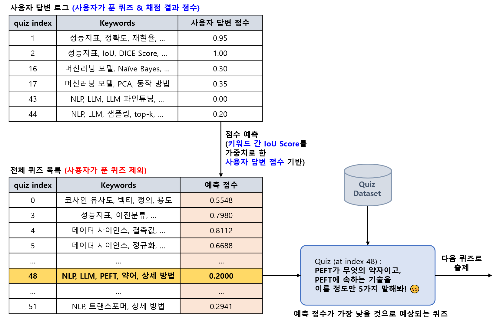
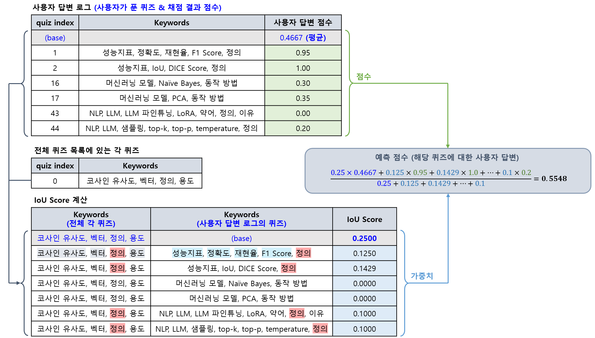

## 목차

* [1. LLM Fine-Tuning (해설용)](#1-llm-fine-tuning-해설용)
* [2. S-BERT Training (사용자 답변 채점용)](#2-s-bert-training-사용자-답변-채점용)
* [3. 틀릴 가능성이 높은 퀴즈 출제](#3-틀릴-가능성이-높은-퀴즈-출제)
* [4. 코드 실행 방법](#4-코드-실행-방법)
  * [4-1. LLM Fine-Tuning (해설용)](#4-1-llm-fine-tuning-해설용)
  * [4-2. S-BERT Training (사용자 답변 채점용)](#4-2-s-bert-training-사용자-답변-채점용)
  * [4-3. 틀릴 가능성이 높은 퀴즈 출제](#4-3-틀릴-가능성이-높은-퀴즈-출제)

## 1. LLM Fine-Tuning (해설용)


* **퀴즈 내용 + 사용자 답변 + 모범 답안** 을 조합하여 Oh-LoRA 👱‍♀️ (오로라) LLM 에 입력
* Oh-LoRA 👱‍♀️ (오로라) LLM 은 사용자 답변에 대해 **적절한 해설 제공**

**사용 모델 정보**

* **Kanana-1.5-2.1B Instruct** (2025.05) [(HuggingFace)](https://huggingface.co/kakaocorp/kanana-1.5-2.1b-instruct-2505)
* **10 epochs** 동안 Fine-Tuning 실시
* [상세 리포트](llm_fine_tuning/llm_comprehensive_report.md)

## 2. S-BERT Training (사용자 답변 채점용)

* 퀴즈에 대한 **"사용자 답변"과 "모범 답안"의 유사도** 를 최종 점수로 함
* 최종 점수는 **-1.0 - +1.0** 범위
* [상세 리포트](comprehensive_report.md#2-s-bert-모델-성능-사용자-답변-채점용)

## 3. 틀릴 가능성이 높은 퀴즈 출제

**1. 전체 메커니즘**

* 전체 퀴즈 중 **사용자가 풀지 않은 퀴즈** 에 대해, **키워드 간 IoU Score 를 가중치로 한 사용자 답변 점수** 에 기반하여 **해당 퀴즈를 사용자가 풀었을 때의 점수** 를 예측 
* **사용자 예측 점수가 가장 낮은** 퀴즈 출제



**2. 사용자 점수 예측 메커니즘**

* 핵심 알고리즘
  * 사용자가 풀지 않은 각 퀴즈에 대해,
    * 해당 퀴즈에 대한 키워드를 사용자가 푼 각각의 퀴즈의 키워드와 비교 **(IoU Score 계산)**
    * 해당 IoU Score 를 가중치로 하여, **사용자가 푼 각각의 퀴즈의 점수 평균** 을 계산 → **해당 점수를 "보정한 값"을 사용자 예측 점수** 로 함

* 보정 방법
  * 사용자의 답변 (퀴즈 풀이) 로그에 다음과 같은 **가상의 퀴즈를 1개 추가**
    * 사용자 답변에 대한 점수 = **전체 퀴즈 풀이 점수의 단순 산술 평균**
    * IoU Score = **0.25**
  * 보정 이유
    * 사용자 답변 (퀴즈 풀이) 로그에서 **IoU 가 0.1 정도로 낮은 특정 1~2개의 퀴즈** 만 IoU Score > 0 일 때, 해당 1~2개의 퀴즈에 대해 **예측 점수가 크게 달라지는** 것을 방지
    * 사용자 답변 로그에서 **관련된 퀴즈 기록이 부족** 한 경우, 사용자의 **전체적인 머신러닝 역량 (= 전체 퀴즈 점수 산술 평균)** 을 반영



## 4. 코드 실행 방법

모든 코드는 **먼저 LLM 모델 정보 및 다운로드 경로 안내 (TBU) 및 해당 각 HuggingFace 링크에 있는 Model Card 에 나타난 저장 경로 (Save Path) 정보를 참고하여 모델 다운로드 후,** ```2025_07_02_OhLoRA_ML_Tutor``` (프로젝트 메인 디렉토리) 에서 실행

### 4-1. LLM Fine-Tuning (해설용)

지정된 경로에 해당 LLM 이 이미 존재하는 경우, Fine-Tuning 대신 **inference test 실행됨**

* ```python ai_quiz/run_llm_fine_tuning.py``` (for [Kanana-1.5 2.1B Instruct](https://huggingface.co/kakaocorp/kanana-1.5-2.1b-instruct-2505))
* ```python ai_quiz/run_llm_fine_tuning.py -llm_name midm``` (for [Mi:dm 2.0 Mini](https://huggingface.co/K-intelligence/Midm-2.0-Mini-Instruct))

### 4-2. S-BERT Training (사용자 답변 채점용)

지정된 경로에 해당 S-BERT 모델이 이미 존재하는 경우, Fine-Tuning 대신 **inference test 실행됨**

```python ai_quiz/run_sbert.py```

### 4-3. 틀릴 가능성이 높은 퀴즈 출제

[Quiz Selection 알고리즘 (IoU Score 기반 가중치에 따른 사용자 점수 예측 결과)](#3-틀릴-가능성이-높은-퀴즈-출제) 에 따라, **사용자 예측 점수가 가장 낮은** 퀴즈 출제

```python ai_quiz/run_select_quiz.py```