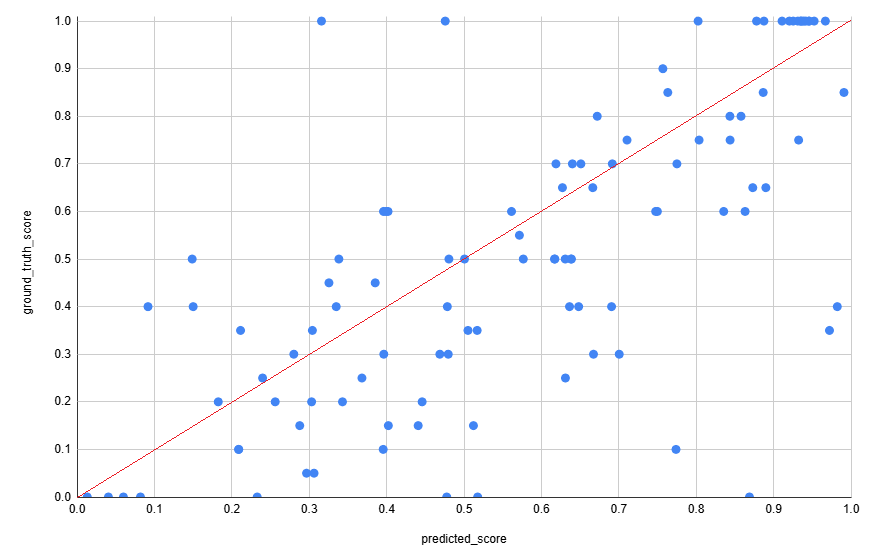
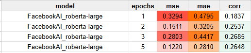
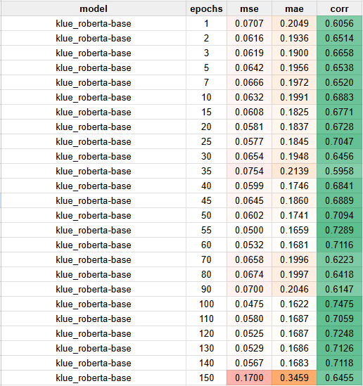
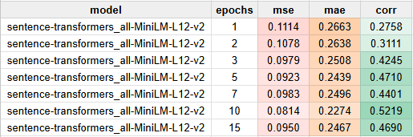
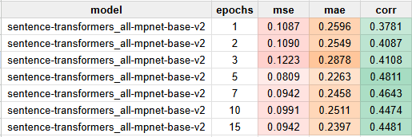

## 목차

* [1. 개요](#1-개요)
* [2. S-BERT 모델 성능 (사용자 답변 채점용)](#2-s-bert-모델-성능-사용자-답변-채점용)
  * [2-1. 최종 실험 결과](#2-1-최종-실험-결과)
  * [2-2. 최종 실험 결과 상세](#2-2-최종-실험-결과-상세)
  * [2-3. 실험 옵션 (모델 종류, epochs) 별 결과](#2-3-실험-옵션-모델-종류-epochs-별-결과)
* [3. LLM Fine-Tuning 성능 (해설용)](#3-llm-fine-tuning-성능-해설용)

## 1. 개요

* **머신러닝 퀴즈 채점 및 해설** 구현을 위한 모델 (Fine-Tuned LLM & S-BERT) 성능 평가
* 결과 요약

## 2. S-BERT 모델 성능 (사용자 답변 채점용)

* 결론
  * 최종적으로 **roBERTa-base 모델 & 100 epochs** 채택 [(채택 근거)](#2-2-실험-옵션-모델-종류-epochs-별-결과)
  * 학습된 모델의 예측은, 실제 의도했던 점수 (= 모범 답안과의 S-BERT 기준 코사인 유사도) 와 **어느 정도 오차가 있음**
* 최종 제품 고려 사항
  * 정답 여부에 관계없이 **길게 답변하면 모범 답안과의 유사도가 높아서 점수를 높게 주는 경향** 이 있으므로, 사용자에게 **아는 것만 솔직하게 답하도록** 안내 필요
  * 퀴즈 점수는 **단순 참고용** 정도임을 명시

### 2-1. 최종 실험 결과

* 실험 옵션
  * **roBERTa-base** 모델 사용 [(HuggingFace)](https://huggingface.co/klue/roberta-base)
  * with **100 epochs**
* 데이터셋
  * [최종 학습 데이터셋 (324 rows)](dataset/train_final.csv)
  * [최종 테스트 데이터셋 (104 rows)](dataset/valid_test_final.csv)
  * 퀴즈 질문 총 52 개
* 평가 방법
  * 사용자 답변 ```user_answer``` 과 모범 답안 ```good_answer``` 을 주고, **그 유사도를 점수 (-1.0 ~ +1.0) 화**
  * 성능지표 평가 결과

| MSE (Mean Squared Error) | MAE (Mean Absolute Error) | Corr-coef |
|--------------------------|---------------------------|-----------|
| 0.0553                   | 0.1698                    | 0.7166    |

### 2-2. 최종 실험 결과 상세

* Prediction - Ground Truth 분포
  * [상세 데이터](sbert/result/test_result.csv)



* 주요 오답 데이터 **(오차 0.5 이상)**
  * 비율 : **7 개 / 전체 104 개 (= 6.73 %)**
  * 특징
    * 사용자 답변은 '아주 긴 오답'이지만, 모델은 이를 정답에 가깝다고 예측
    * 사용자 답변은 '간결한 정답'이지만, 모델은 이를 오답에 가깝다고 예측

| 사용자 답변<br>```user_answer```                                                                                                                                                                                                                                                                                                                                                                                                                         | 모범 답안<br>```good_answer```                                                                                                                                                                                                                                                                                                                                                                                                                                     | S-BERT 예측 결과 | 실제 점수 | 오차         |
|-----------------------------------------------------------------------------------------------------------------------------------------------------------------------------------------------------------------------------------------------------------------------------------------------------------------------------------------------------------------------------------------------------------------------------------------------------|----------------------------------------------------------------------------------------------------------------------------------------------------------------------------------------------------------------------------------------------------------------------------------------------------------------------------------------------------------------------------------------------------------------------------------------------------------------|--------------|-------|------------|
| ```확률은 확률분포에서 특정 값이 관측될 가능성, 우도는 어떤 관측값이 주어질 때 그 관측값이 어떤 확률분포로부터 발생했을 가능성이다.```                                                                                                                                                                                                                                                                                                                                                                     | ```Probability (확률) 는 어떤 확률분포가 주어졌을 때 그 확률분포에서 특정 관측값이 발생할 가능성을 말하고, Likelihood (우도) 는 반대로 어떤 관측값이 주어졌을 때, 그 관측값이 특정한 확률분포 에서 발생했을 가능성을 말한다.```                                                                                                                                                                                                                                                                                                                | +0.4758      | 1.0   | **0.5242** |
| ```Voting 은 Soft Voting 과 Hard Voting 으로 나뉜다. Voting 은 Soft Voting 과 Hard Voting 으로 나뉜다. Voting 은 Soft Voting 과 Hard Voting 으로 나뉜다. Voting 은 Soft Voting 과 Hard Voting 으로 나뉜다. Voting 은 Soft Voting 과 Hard Voting 으로 나뉜다. Voting 은 Soft Voting 과 Hard Voting 으로 나뉜다. Voting 은 Soft Voting 과 Hard Voting 으로 나뉜다. Voting 은 Soft Voting 과 Hard Voting 으로 나뉜다. Voting 은 Soft Voting 과 Hard Voting 으로 나뉜다. Voting 은 Soft Voting 과 Hard Voting 으로 나뉜다.``` | ```앙상블 (Ensemble) 의 구체적인 방법은 Voting (보팅), Bagging (배깅), Boosting (부스팅), Stacking (스태킹) 이 있다. Voting 은 여러 모델이 예측한 결과를 통합하는 것으로, 단순 다수결 판단인 Hard Voting 과 모델 예측값의 평균을 이용하는 Soft Voting 이 있다. Bagging 은 원본 데이터셋으로부터 랜덤 샘플링한 여러 개의 데이터셋으로 여러 개의 모델을 학습하고, 해당 모델의 결과를 종합하는 것이다. Boosting 은 Bagging 과 유사하지만, 직전 모델이 오답을 한 데이터에 더 큰 가중치를 두어서 모델을 순차적으로 학습하는 것이다. Stacking 은 개별 모델의 예측값과 실제 데이터 값을 각각 입력값과 출력값으로 하는 메타 모델을 학습하고, 해당 메타 모델의 출력값을 최종 예측값으로 사용하는 방법이다.``` | +0.7739      | 0.1   | **0.6739** |
| ```하이퍼파라미터는 딥러닝 모델의 신경망의 파라미터를 의미한다. 하이퍼파라미터 최적화는 이 딥러닝 모델의 파라미터를 각종 최적화 기술 (Optimizer, Regularization, Dropout, 기타등등) 을 이용하여 최적의 상태로 학습시켜서 Loss Function 의 값을 최대한 줄이는 것이다.```                                                                                                                                                                                                                                                                      | ```하이퍼파라미터 (Hyper-parameter) 는 모델이 학습해야 할 파라미터가 아닌, 모델의 학습에 있어서의 설정값을 의미한다. (딥러닝의 learning rate 등) 하이퍼파라미터 최적화는 모델이 특정 데이터셋을 가장 잘 학습할 수 있도록 최적의 하이퍼파라미터를 찾는 것이다. 그 방법으로는 Grid Search (하이퍼파라미터를 지정된 범위 내에서 바둑판 형태로 찾는 것), Random Search (지정된 범위 내에서 랜덤하게 값을 정하는 것), Bayesian Optimization (지금까지의 통계에 근거하여 확률적으로 최적일 것으로 예상되는 하이퍼파라미터를 찾는 것) 가 있다.```                                                                                                            | +0.8688      | 0.0   | **0.8688** |
| ```그냥 롤러코스터처럼 학습률을 움직이는 것이 재미있기 때문이다. 딥러닝 모델도 학습에 재미를 느껴야지 원활한 학습이 가능하기 때문이다.```                                                                                                                                                                                                                                                                                                                                                                    | ```Cosine Annealing 스케줄러는 코사인 함수 곡선처럼 Learning Rate 를 조정하는 스케줄러이다. 학습률을 높이는 구간이 있는 이유는 local minima 에서 탈출할 기회를 주기 위해서이다.```                                                                                                                                                                                                                                                                                                                                    | +0.5176      | 0.0   | **0.5176** |
| ```Batch Normalization (배치 정규화) 은 딥러닝의 특정 레이어에서, batch 내에 있는 데이터에 대해, 해당 레이어에서의 신경망 내에서의 위치가 동일한 feature 값끼리 평균과 표준편차를 구해서 정규화하는 것이다.```                                                                                                                                                                                                                                                                                                            | ```Batch Normalization (배치 정규화) 은 딥러닝의 특정 레이어에서, 1개의 batch 내의 데이터에 대해, 해당 레이어에서의 신경망 내에서의 위치가 동일한 feature 값끼리 평균과 표준편차를 구해서 정규화하는 것이고, Layer Normalization 은 특정 레이어에서 각 sample 에 해당하는 모든 feature 값에 대해, 동일한 sample 에 해당하는 feature 값끼리 평균과 표준편차를 구해서 정규화하는 것이다. 즉 차이점은 Batch Normalization 은 레이어에서의 신경망 내에서의 위치를 기준으로, Layer Normalization 은 속해 있는 sample 을 기준으로 그룹화하여 평균과 표준편차를 계산한다.```                                                                       | +0.9823      | 0.4   | **0.5823** |
| ```Xavier 와 He 는 특정 레이어와 관련된 node 의 개수의 합이 많을수록 해당 레이어를 초기화할 때 파라미터의 평균적인 절댓값 크기가 작아지도록 초기화하는 것이다. 이때 Xavier 는 입력+출력 노드 개수의 합, He 는 입력 노드 개수만을 고려한다.```                                                                                                                                                                                                                                                                                             | ```Xavier initialization 은 Glorot initialization 이라고도 하며, 특정 레이어의 input node + output node 의 개수의 합이 많을수록 해당 레이어의 평균적인 절댓값 크기를 줄이는 것이다. He initialization 은 Kaiming initialization 이라고도 하며, 특정 레이어의 input node 개수가 많을수록 평균 절댓값 크기를 줄이는 것이다. 즉, 차이점은 input node 와 output node 개수를 모두 고려하는지, input node 개수만을 고려하는지이다.```                                                                                                                                          | +0.3158      | 1.0   | **0.6842** |
| ```Encoder Self-Attention, Decoder Self-Attention, Encoder-Decoder Self-Attention 이 있다. Encoder Self-Attention 은 입력되는 문장 (LLM 의 프롬프트) 에서 각 단어의 관계를 (자기 자신 포함) 고려하는 로직이다. Decoder Self Attention은 출력 시퀀스의 각 단어에 대해 입력 시퀀스의 각 단어와의 관계를 고려한다.```                                                                                                                                                                                                       | ```트랜스포머 모델의 Attention 방법에는 Encoder Self-Attention, Masked Decoder Self-Attention, Encoder-Decoder Attention 이 있다. 먼저 Encoder Self-Attention 은 입력되는 문장 (LLM 의 프롬프트) 에서 각 단어의 관계를 (자기 자신 포함), Masked Decoder Self Attention 은 출력되는 답변 문장에서 각 단어의 관계를 (특정 단어에 대해 해당 단어 이전의 단어만을 고려), Encoder-Decoder Attention은 출력 시퀀스의 각 단어에 대해 입력 시퀀스의 각 단어와의 관계를 고려하는 Attention 메커니즘이다.```                                                                                    | +0.9722      | 0.35  | **0.6222** |

### 2-3. 실험 옵션 (모델 종류, epochs) 별 결과

* notations

| ```epochs```     | ```mse```          | ```mae```           | ```corr``` |
|------------------|--------------------|---------------------|------------|
| number of epochs | Mean Squared error | Mean Absolute error | Corr-coef  |
 

* ```FacebookAI/roberta-large``` 모델



* ```klue/roberta-base``` 모델 **(✅ 최종 채택 with ```epochs = 100```)**



* ```sentence-transformers/all-MiniLM-L12-v2```



* ```sentence-transformers/all-mpnet-base-v2```



## 3. LLM Fine-Tuning 성능 (해설용)

* TBU
