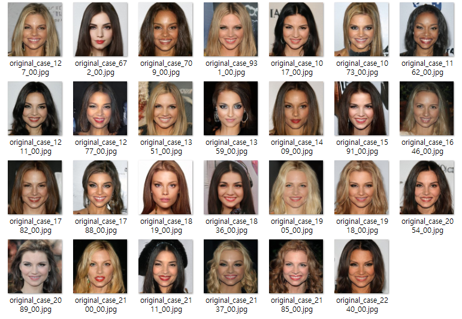
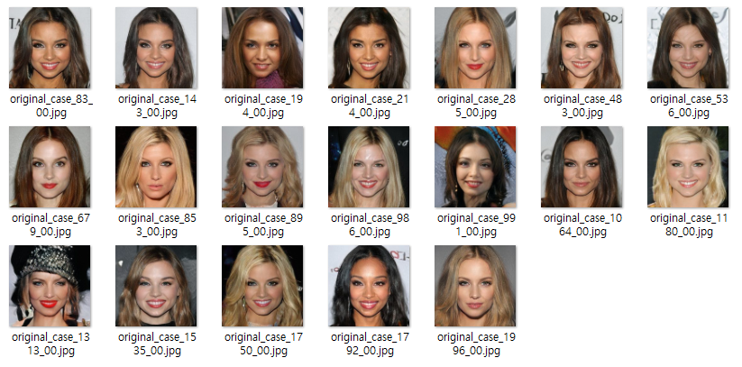

## 목차

* [1. 시스템 환경](#1-시스템-환경)
  * [1-1. 주요 Python 라이브러리](#1-1-주요-python-라이브러리)
  * [1-2. 시스템에 설치된 전체 Python 라이브러리](#1-2-시스템에-설치된-전체-python-라이브러리)
* [2. 사용자 가이드](#2-사용자-가이드)
  * [2-1. Python 환경 설정](#2-1-python-환경-설정)
  * [2-2. 모델 다운로드 및 준비](#2-2-모델-다운로드-및-준비)
  * [2-3. run.py 실행](#2-3-runpy-실행)
  * [2-4. 기본 사용법](#2-4-기본-사용법)

## 1. 시스템 환경

* OS & GPU
  * OS : Windows 10
  * GPU : 2 x Quadro M6000 (12 GB each)
* CUDA
  * CUDA 12.4 (NVIDIA-SMI 551.61)
  * ```nvcc -V``` 명령어 실행 시 다음과 같이 표시

```
nvcc: NVIDIA (R) Cuda compiler driver
Copyright (c) 2005-2024 NVIDIA Corporation
Built on Tue_Feb_27_16:28:36_Pacific_Standard_Time_2024
Cuda compilation tools, release 12.4, V12.4.99
Build cuda_12.4.r12.4/compiler.33961263_0
```

* Python
  * Python : Python 3.10.11
  * Dev Tool : PyCharm 2024.1 Community Edition

### 1-1. 주요 Python 라이브러리

```
accelerate==1.0.1
beautifulsoup4==4.13.3
bs4==0.0.2
datasets==3.5.0
graphviz==0.20.3
huggingface-hub==0.30.2
imageio==2.35.1
imgaug==0.4.0
intel-extension-for-transformers==1.4.2
kaleido==0.2.1
matplotlib==3.7.5
monai==1.4.0
numpy==1.26.4
opencv-python==4.6.0.66
opencv-python-headless==4.11.0.86
openpyxl==3.1.5
pandas==2.0.3
peft==0.13.2
safetensors==0.4.3
scikit-image==0.21.0
scikit-learn==1.3.2
scipy==1.10.1
sentence-transformers==4.1.0
sentencepiece==0.2.0
timm==1.0.15
tokenizers==0.21.1
torch==2.6.0+cu124
torchaudio==2.6.0+cu124
torchinfo==1.8.0
torchview==0.2.6
torchvision==0.21.0+cu124
tqdm==4.67.1
transformers==4.51.3
trl==0.15.2
ttach==0.0.3
```

### 1-2. 시스템에 설치된 전체 Python 라이브러리

* 본 프로젝트 개발 환경에 설치된 전체 Python 라이브러리의 목록입니다.

<details><summary>전체 Python 라이브러리 목록 [ 펼치기 / 접기 ]</summary>

```
absl-py==2.1.0
accelerate==1.0.1
aiohappyeyeballs==2.4.4
aiohttp==3.10.11
aiosignal==1.3.1
albumentations==1.3.1
alembic==1.16.4
antlr4-python3-runtime==4.9.3
astunparse==1.6.3
async-timeout==5.0.1
attrs==25.3.0
auto_gptq==0.7.1
beautifulsoup4==4.13.3
bitsandbytes==0.45.3
bs4==0.0.2
cachetools==5.3.3
certifi==2024.2.2
charset-normalizer==3.3.2
colorama==0.4.6
coloredlogs==15.0.1
colorlog==6.9.0
contourpy==1.1.1
cut-cross-entropy==25.1.1
cycler==0.12.1
Cython==3.0.12
daal==2025.5.0
datasets==3.5.0
Deprecated==1.2.18
diffusers==0.32.2
dill==0.3.8
docstring_parser==0.16
et_xmlfile==2.0.0
eval_type_backport==0.2.2
filelock==3.13.4
flatbuffers==1.12
fonttools==4.51.0
frozenlist==1.5.0
fsspec==2024.3.1
gast==0.4.0
gekko==1.2.1
google-auth==2.28.1
google-auth-oauthlib==0.4.6
google-pasta==0.2.0
graphviz==0.20.3
greenlet==3.2.3
grpcio==1.62.0
h5py==3.10.0
hf_transfer==0.1.9
huggingface-hub==0.30.2
humanfriendly==10.0
hydra-core==1.3.2
idna==3.6
imageio==2.35.1
imgaug==0.4.0
importlib-metadata==7.0.1
importlib_resources==6.4.0
intel-extension-for-transformers==1.4.2
Jinja2==3.1.3
joblib==1.4.2
kaleido==0.2.1
keras==2.8.0
Keras-Preprocessing==1.1.2
kiwisolver==1.4.5
lazy_loader==0.4
libclang==16.0.6
lightning==2.1.2
lightning-utilities==0.14.3
Mako==1.3.10
Markdown==3.5.2
markdown-it-py==3.0.0
MarkupSafe==2.1.5
matplotlib==3.7.5
mdurl==0.1.2
monai==1.4.0
mpmath==1.3.0
multidict==6.1.0
multiprocess==0.70.16
narwhals==1.33.0
networkx==3.1
neural_compressor==3.3
numpy==1.26.4
oauthlib==3.2.2
omegaconf==2.3.0
opencv-python==4.6.0.66
opencv-python-headless==4.11.0.86
openpyxl==3.1.5
opt-einsum==3.3.0
optimum==1.23.3
optuna==4.4.0
packaging==23.2
pandas==2.0.3
peft==0.13.2
pillow==10.2.0
plotly==6.0.1
prettytable==3.11.0
propcache==0.2.0
protobuf==3.19.6
psutil==7.0.0
py-cpuinfo==9.0.0
pyarrow==17.0.0
pyasn1==0.5.1
pyasn1-modules==0.3.0
pycocotools==2.0.8
pydot==2.0.0
Pygments==2.19.1
pyparsing==3.1.2
pyreadline3==3.5.4
python-dateutil==2.9.0.post0
python-version==0.0.2
pytorch-lightning==2.5.1.post0
pytz==2024.1
PyWavelets==1.4.1
PyYAML==6.0.1
qudida==0.0.4
regex==2023.12.25
requests==2.32.3
requests-oauthlib==1.3.1
rich==13.9.4
rouge==1.0.1
rsa==4.9
safetensors==0.4.3
schema==0.7.7
scikit-image==0.21.0
scikit-learn==1.3.2
scikit-learn-intelex==2025.5.0
scipy==1.10.1
sentence-transformers==4.1.0
sentencepiece==0.2.0
shapely==2.0.7
shtab==1.7.1
six==1.16.0
soupsieve==2.6
SQLAlchemy==2.0.42
sympy==1.13.1
tbb==2022.1.0
tcmlib==1.3.0
tensorboard==2.8.0
tensorboard-data-server==0.6.1
tensorboard-plugin-wit==1.8.1
tensorflow-estimator==2.9.0
tensorflow-gpu==2.8.0
tensorflow-io-gcs-filesystem==0.31.0
termcolor==2.4.0
tf-estimator-nightly==2.8.0.dev2021122109
tfutil==0.8.1
threadpoolctl==3.5.0
tifffile==2023.7.10
timm==1.0.15
tokenizers==0.21.1
tomli==2.2.1
torch==2.6.0+cu124
torchaudio==2.6.0+cu124
torchinfo==1.8.0
torchmetrics==1.7.1
torchview==0.2.6
torchvision==0.21.0+cu124
tqdm==4.67.1
transformers==4.51.3
triton-windows==3.2.0.post17
trl==0.15.2
ttach==0.0.3
typeguard==4.4.0
typing_extensions==4.14.1
tyro==0.9.17
tzdata==2025.2
unsloth==2025.3.19
unsloth_zoo==2025.3.17
urllib3==2.2.1
wcwidth==0.2.13
Werkzeug==3.0.1
wrapt==1.16.0
xformers==0.0.29.post3
xxhash==3.5.0
yarl==1.15.2
zipp==3.17.0
```

</details>

## 2. 사용자 가이드

### 2-1. Python 환경 설정

* System Requirements
  * **8 GB** 이상 메모리의 **GPU 1 대 (NVIDIA GPU)**
* Mandatory
  * Python 3.10.11 을 설치합니다.
  * ```pip install -r requirements.txt``` 명령어를 통해 [주요 라이브러리](#1-1-주요-python-라이브러리) 를 설치합니다.
* Optional
  * 주요 라이브러리 설치 후에도 Python 라이브러리 이슈로 실행이 안 될 시, [전체 라이브러리 목록](#1-2-시스템에-설치된-전체-python-라이브러리) 을 참고하여 라이브러리를 추가 설치합니다.

### 2-2. 모델 다운로드 및 준비

* **1.** [해당 문서](MODEL_AND_DATASET_INFO.md) 를 참고하여, HuggingFace 에서 **필요한 모델을 다운로드하여 지정된 경로에 추가** 합니다.
* **2.** [해당 문서](../LLM_DOWNLOAD_PATH.md#2-5-oh-lora-ml-tutor--20250702---0925-) 를 참고하여 원본 LLM 모델을 다운로드합니다.

### 2-3. run.py 실행

이제 모든 준비가 끝났습니다. **프로젝트 메인 디렉토리인 ```2025_07_02_OhLoRA_ML_Tutor``` 디렉토리에서** ```run.py``` 파일을 실행합니다.

* 기본 사항
  * ```{기능}``` 은 ```qna``` (머신러닝 분야 질의응답), ```quiz``` (머신러닝 분야 퀴즈), ```interview``` (머신러닝 분야 인터뷰) 중 하나입니다.
  * ```{번호}``` 는 아래 **Oh-LoRA 의 얼굴 번호** 를 참고하여 원하는 얼굴의 번호를 입력합니다.

* 실행 방법 **(StyleGAN-VectorFind-v7)**
  * ```python final_product/run.py -vf_ver v7 -function_type {기능}```
    * 아래 Oh-LoRA 👱‍♀️ 의 **StyleGAN-VectorFind-v7** 버전 얼굴 27 가지 중 랜덤 선택
  * ```python final_product/run.py -vf_ver v7 -ohlora_no {번호} -function_type {기능}```
    * 아래 Oh-LoRA 👱‍♀️ 의 **StyleGAN-VectorFind-v7** 버전 얼굴 27 가지 중 원하는 얼굴 번호 지정하여, 해당 얼굴로 실행

* 실행 방법 **(StyleGAN-VectorFind-v8)**
  * ```python final_product/run.py -function_type {기능}```
    * 아래 Oh-LoRA 👱‍♀️ 의 **StyleGAN-VectorFind-v8** 버전 얼굴 19 가지 중 랜덤 선택
  * ```python final_product/run.py -ohlora_no {번호} -function_type {기능}```
    * 아래 Oh-LoRA 👱‍♀️ 의 **StyleGAN-VectorFind-v8** 버전 얼굴 19 가지 중 원하는 얼굴 번호 지정하여, 해당 얼굴로 실행

* 예시

| 예시 명령어                                                                         | 설명                                                                                                          |
|--------------------------------------------------------------------------------|-------------------------------------------------------------------------------------------------------------|
| ```python final_product/run.py -vf_ver v7 -ohlora_no 127 -function_type qna``` | - 아래 **v7 버전** 그림 중 ```original_case_127_00.jpg``` 에 해당하는 얼굴로 Oh-LoRA 👱‍♀️ 가 실행됨<br>- 기능: **머신러닝 분야 질의응답** |
| ```python final_product/run.py -ohlora_no 83 -function_type interview```       | - 아래 **v8 버전** 그림 중 ```original_case_83_00.jpg``` 에 해당하는 얼굴로 Oh-LoRA 👱‍♀️ 가 실행됨<br>- 기능: **머신러닝 분야 인터뷰**   |

**Oh-LoRA 의 얼굴 번호**

| 버전                                                                                                                                                         | Oh-LoRA 👱‍♀️ 의 얼굴                |
|------------------------------------------------------------------------------------------------------------------------------------------------------------|-----------------------------------|
| [StyleGAN-VectorFind-v7](../2025_05_02_OhLoRA_v2/stylegan/README.md#3-3-stylegan-finetune-v1-기반-핵심-속성값-변환-intermediate-w-vector-탐색-stylegan-vectorfind-v7) |  |
| [StyleGAN-VectorFind-v8](../2025_05_26_OhLoRA_v3/stylegan/README.md#3-3-stylegan-finetune-v8-기반-핵심-속성값-변환-intermediate-w-vector-탐색-stylegan-vectorfind-v8) |  |

### 2-4. 기본 사용법

**1. 머신러닝 분야 질문/답변 ```qna```**

```
오로라에게 머신러닝 질문하기 (Ctrl+C to finish) : (사용자 프롬프트 입력. Ctrl+C 단축키 누르면 종료)
👱‍♀️ 오로라 :  (오로라의 답변)
...
```

* 예시

```
오로라에게 머신러닝 질문하기 (Ctrl+C to finish) : 로라야 F1 Score가 뭔지 알려줘
👱‍♀️ 오로라 :  F1 Score는 Recall 과 Precision 의 조화 평균값이야! 😊 
```

* 💡 사용 팁
  * **머신러닝 및 데이터 사이언스 기초 & 딥러닝 기초** 수준의 질문에 대한 답변이 가능합니다.
  * 그 외 (LLM 심화 등) 의 내용을 질문할 시 [환각 현상](https://github.com/WannaBeSuperteur/AI-study/blob/main/AI%20Basics/LLM%20Basics/LLM_%EA%B8%B0%EC%B4%88_%ED%99%98%EA%B0%81_%ED%98%84%EC%83%81.md) 이 발생할 수 있습니다.

**2. 머신러닝 분야 퀴즈 ```quiz```**

```
[ QUIZ 🙋‍♀️ ]
(퀴즈 내용)

오로라의 퀴즈에 답하기 (Ctrl+C to finish) : (퀴즈 답변 입력. Ctrl+C 단축키 누르면 종료)
👱‍♀️ 오로라 :  (생성된 퀴즈 해설)
👱‍♀️ 오로라의 채점 결과 : (0점 ~ 100점 사이의 점수)
👍 모범 답안 : (DB에 저장된, 상세한 모범 답안)

[ QUIZ 🙋‍♀️ ]
(다음 퀴즈 내용)
...
```

* 예시

```
[ QUIZ 🙋‍♀️ ]
머신러닝에서 사용하는 성능지표 (Metric) 중 Accuracy, Recall, Precision, F1 Score 에 대해 말해봐! 😊

오로라의 퀴즈에 답하기 (Ctrl+C to finish) : Accuracy는 정확도로 모델이 옳게 분류한 비율이야. Recall은 (True Positive) / (True Positive + False Negative) 로, Precision은 (True Positive) / (True Positive + False Positive) 로 계산
하지. 마지막으로 F1 Score는 이 Recall과 Precision의 조화 평균이야.
👱‍♀️ 오로라 :  우와 완벽해! 대박! 👍👍👍 
👱‍♀️ 오로라의 채점 결과 : 85 점
👍 모범 답안 : Accuracy (정확도) 는 전체 예측 중 정답을 한 것의 개수로, (True Positive + True Negative) / (전체 데이터 개수) 로 나타낸다. Recall (재현율) 은 실제로 참인 데이터 중 모델이 참으로 예측한 데이터 개수의 비율로, (True 
Positive) / (True Positive + False Negative) 로 계산한다. Precision (정밀도) 는 모델이 참으로 예측한 데이터 중 실제 참인 데이터 개수의 비율로, (True Positive) / (True Positive + False Positive) 이다. 마지막으로 F1 Score 는 Precision 과 Recall 의 조화 평균이다.

[ QUIZ 🙋‍♀️ ]
SVM (Support Vector Machine) 의 핵심 아이디어를 나한테 한번 설명해 봐! 😊 그리고 언제 사용하는 거지? 🤔
```

* 💡 사용 팁
  * 퀴즈 답변은 **자세하게 할수록 점수가 높습니다. 알고 있는 것을 모두 말해 주세요.** 
  * 퀴즈 채점 점수는 **단순 참고용** 입니다. [(참고)](ai_quiz/comprehensive_report.md#1-개요)

**3. 머신러닝 분야 인터뷰 ```interview```**

```
👱‍♀️ 오로라 :  (면접 질문)

오로라의 면접 질문에 답하기 (Ctrl+C to finish) : (답변 입력. Ctrl+C 단축키 누르면 종료)
...
```

* 예시

```
👱‍♀️ 오로라 :  안녕! 나는 머신러닝 면접관 오로라야! 반가워! 😊

오로라의 면접 질문에 답하기 (Ctrl+C to finish) : 안녕 로라야 반가워 
👱‍♀️ 오로라 :  나랑 함께 너의 실력의 빈틈을 채워볼래? 😊 

오로라의 면접 질문에 답하기 (Ctrl+C to finish) : 그러자! 질문해 봐! 내가 다 답해 줄 테니까 
👱‍♀️ 오로라 :  인공지능이랑 머신러닝, 딥러닝이 구체적으로 어떤 차이가 있지?
```

**4. Oh-LoRA 👱‍♀️ (오로라) 의 생성된 얼굴 확인**

* 위 **3가지 모든 기능** 에 대해, 실시간으로 오로라의 얼굴이 생성되며 창에 표시됩니다.
* 자세한 것은 [실행 스크린샷](README.md#1-3-실행-스크린샷) 을 참고해 주세요.
