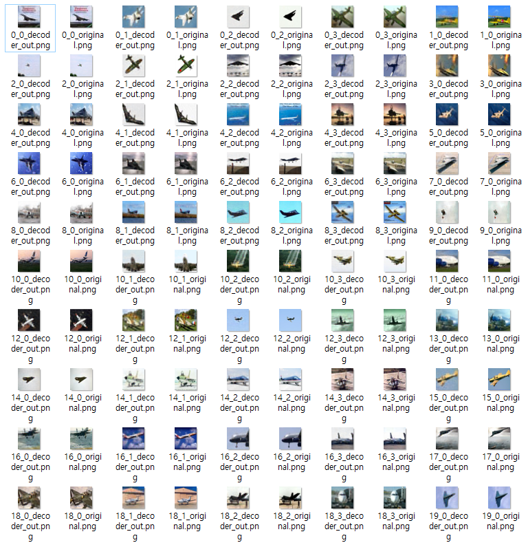
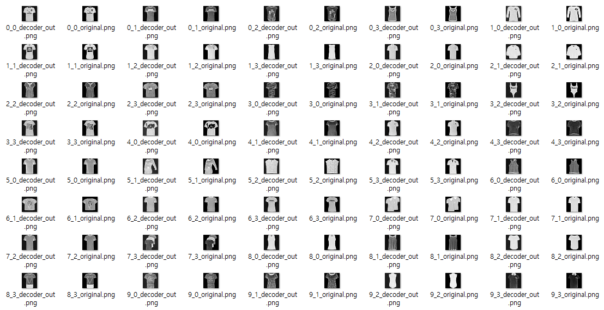
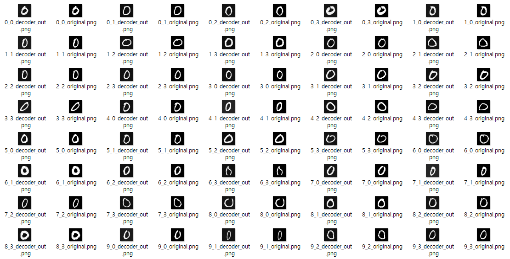

# Hidden Representation 추출을 위한 Auto-Encoder 구현

## 목차

* [1. 개요](#1-개요)
* [2. 테스트 결과](#2-테스트-결과)
  * [2-1. Reconstruction 테스트](#2-1-reconstruction-테스트)
  * [2-2. Representation 테스트](#2-2-representation-테스트)

## 1. 개요

* Hidden Representation 추출을 위한 Auto-Encoder 구현
* 해당 Auto-Encoder 에 의해 Encoding 된 값을, **AI 모델 하이퍼파라미터 최적화 전략 학습용 AI의 입력 데이터로 사용** 예정

## 2. 테스트 결과

| 테스트                | 테스트 내용                                               | 테스트 목적                         |
|--------------------|------------------------------------------------------|--------------------------------|
| Reconstruction 테스트 | Auto-Encoder 가 원래 이미지를 잘 Reconstruction 하는지 평가       | Auto-Encoder 성능 평가             |
| Representation 테스트 | Auto-Encoder 의 Encoding 이 가까울수록 **실제로 이미지가 유사한지** 평가 | Auto-Encoder 의 encoding 정확도 평가 |

* 대상 데이터셋
  * 각 데이터셋 (```cifar_10```, ```fashion_mnist```, ```mnist```) 의 테스트 데이터셋 중 일부

### 2-1. Reconstruction 테스트

* 테스트 결과
  * 3개 데이터셋 모두 **Auto-Encoder 가 원래 이미지를 잘 Reconstruction** 하는 것으로 나타남

| 데이터셋                | 테스트 결과                              |
|---------------------|-------------------------------------|
| ```cifar_10```      |  |
| ```fashion_mnist``` |  |
| ```mnist```         |  |

### 2-2. Representation 테스트

