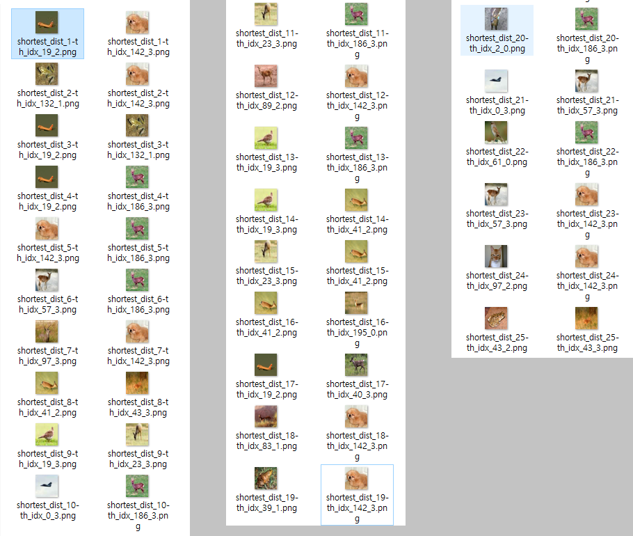
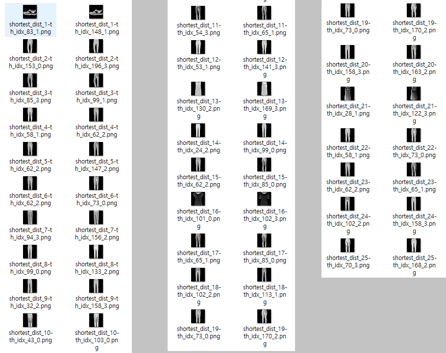
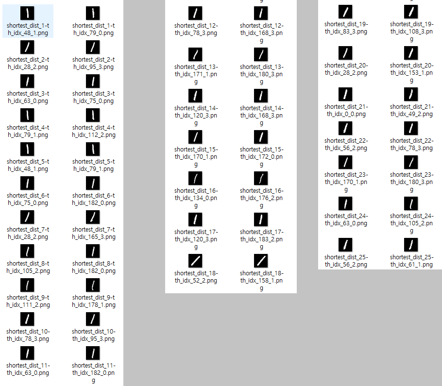

# Hidden Representation 추출을 위한 Auto-Encoder 구현

## 목차

* [1. 개요](#1-개요)
* [2. 테스트 결과](#2-테스트-결과)
  * [2-1. Reconstruction 테스트](#2-1-reconstruction-테스트)
  * [2-2. Representation 테스트](#2-2-representation-테스트)

## 1. 개요

* Hidden Representation 추출을 위한 Auto-Encoder 구현
* 해당 Auto-Encoder 에 의해 Encoding 된 값을, **AI 모델 하이퍼파라미터 최적화 전략 학습용 AI의 입력 데이터로 사용** 예정

## 2. 테스트 결과

| 테스트                | 테스트 내용                                               | 테스트 목적                         |
|--------------------|------------------------------------------------------|--------------------------------|
| Reconstruction 테스트 | Auto-Encoder 가 원래 이미지를 잘 Reconstruction 하는지 평가       | Auto-Encoder 성능 평가             |
| Representation 테스트 | Auto-Encoder 의 Encoding 이 가까울수록 **실제로 이미지가 유사한지** 평가 | Auto-Encoder 의 encoding 정확도 평가 |

* 대상 데이터셋
  * 각 데이터셋 (```cifar_10```, ```fashion_mnist```, ```mnist```) 의 테스트 데이터셋 중 일부

### 2-1. Reconstruction 테스트

* 테스트 결과
  * 3개 데이터셋 모두 **Auto-Encoder 가 원래 이미지를 잘 Reconstruction** 하는 것으로 나타남

| 데이터셋                | 테스트 결과                              |
|---------------------|-------------------------------------|
| ```cifar_10```      |  |
| ```fashion_mnist``` |  |
| ```mnist```         |  |

### 2-2. Representation 테스트

* 실험 결론

| 측정 대상                                                                       | 실험 결론                                                                                                            |
|-----------------------------------------------------------------------------|------------------------------------------------------------------------------------------------------------------|
| label 이 서로 같은 pair 는 label 이 서로 다른 pair 에 비해 **Encoding 의 Distance 가 짧은가?** | - ```fashion_mnist```, ```mnist``` 의 경우 그러함<br>- 그러나, ```cifar_10``` 의 경우 label 이 서로 같은 pair 든 다른 pair 든 큰 차이 없음 |
| Encoding 의 Distance 가 가장 짧은 pair 들 간 이미지는 **육안으로 보기에 실제로 서로 비슷한가? (정성적)**   | - ```cifar_10```, ```fashion_mnist```, ```mnist``` 의 3가지 데이터셋 모두 그러함<br>- 단, ```cifar_10``` 의 경우 조금 애매한 부분이 있음   |

* 각 데이터셋 별 **label 이 동일한** pair, **label이 서로 다른** pair 에 대해 **Encoding 의 Euclidean Distance (Encoding Dist.)** 계산

| 데이터셋                | Encoding Dist. 평균<br>(동일 label) | Encoding Dist. 평균<br>(서로 다른 label) | Encoding Dist. 평균<br>(동일 label) | Encoding Dist. 평균<br>(서로 다른 label) |
|---------------------|---------------------------------|------------------------------------|---------------------------------|------------------------------------|
| ```cifar_10```      | 159.05                          | 163.14 (▲ 4.09)                    | 27.49                           | 25.36                              |
| ```fashion_mnist``` | 82.17                           | 97.31 (▲ 15.14)                    | 15.71                           | 12.75                              |
| ```mnist```         | 95.06                           | 106.50 (▲ 11.44)                   | 14.33                           | 7.96                               |

* 각 데이터셋 별 Encoding Dist. 가 가장 짧은 pair 비교
  * 같은 row 의 2개의 이미지가 **Encoding Dist. 가 가장 짧은 pair** 를 나타냄

| 데이터셋                | 테스트 결과                              |
|---------------------|-------------------------------------|
| ```cifar_10```      |  |
| ```fashion_mnist``` |  |
| ```mnist```         |  |
