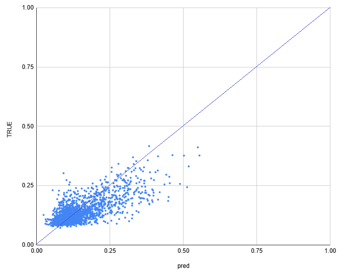
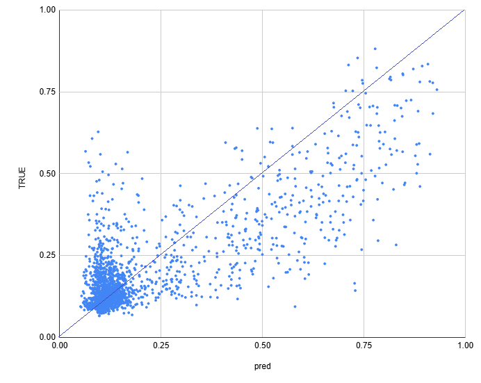
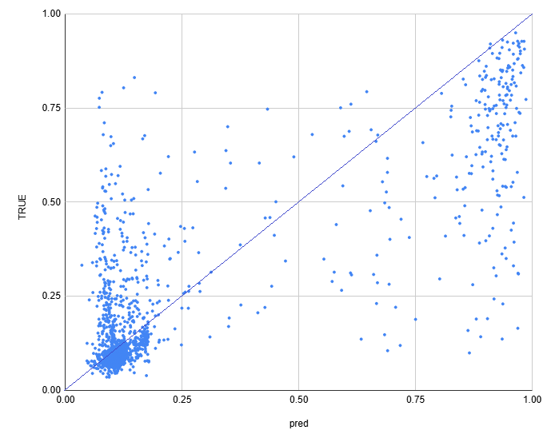

# 하이퍼파라미터 탐색 최적화 모델

## 목차

* [1. 모델 개요](#1-모델-개요)
* [2. 모델 전체 구조](#2-모델-전체-구조)
* [3. 학습 데이터 구성](#3-학습-데이터-구성)
* [4. 최적의 threshold cutoff 탐색](#4-최적의-threshold-cutoff-탐색)
  * [4-1. 각 데이터셋 별 pred, true 분포 상세 그래프](#4-1-각-데이터셋-별-pred-true-분포-상세-그래프)

## 1. 모델 개요

* 인간과의 하이퍼파라미터 탐색 대결을 위해, 각 데이터셋 (Cifar-10, Fashion-MNIST, MNIST) 별 **최적의 하이퍼파라미터를 탐색하기 위한 딥러닝 모델** 을 학습한다.

| 입력 데이터                    | 출력 데이터                |
|---------------------------|-----------------------|
| 학습 데이터 관련 정보 + 하이퍼파라미터 정보 | 성능지표 (Macro F1 Score) |

* [입력 데이터 및 출력 데이터 관련 상세 정보](../hpo_training_data/README.md#3-hyper-param-최적화-모델-학습-데이터셋-제작-방법)

## 2. 모델 전체 구조


## 3. 학습 데이터 구성

* 각 이미지 데이터셋 (CIFAR-10, Fashion-MNIST, MNIST) 별 **5,000 rows 의 tabular dataset**
* 각 데이터셋을 **학습 + 검증 데이터 90%, 테스트 데이터 10% 로 분리**
* 상세 데이터셋 위치

| 이미지 데이터셋      | 하이퍼파라미터 탐색 최적화 (HPO) 모델 학습 데이터셋                                                                            |
|---------------|------------------------------------------------------------------------------------------------------------|
| CIFAR-10      | [해당 디렉토리](../hpo_training_data/test/cifar_10) 의 ```hpo_model_train_dataset_df``` 가 포함된 csv 파일 (총 10개)      |
| Fashion-MNIST | [해당 디렉토리](../hpo_training_data/test/fashion_mnist) 의 ```hpo_model_train_dataset_df``` 가 포함된 csv 파일 (총 10개) |
| MNIST         | [해당 디렉토리](../hpo_training_data/test/mnist) 의 ```hpo_model_train_dataset_df``` 가 포함된 csv 파일 (총 10개)         |

## 4. 최적의 threshold cutoff 탐색

* Tabular 데이터셋이므로, **output column (Macro F1 Score) 과 상관계수가 낮은 column을 제거** 했을 때 **모델 학습이 최적화** 될 수 있다.
* 이를 위한 최적의 **상관계수의 최솟값 threshold cutoff** 를 탐색한다.
* 탐색 결과

| cifar_10                                  | fashion_mnist                             | mnist                                     |
|-------------------------------------------|-------------------------------------------|-------------------------------------------|
| **cutoff = 0.08**<br>(corr-coef = +0.731) | **cutoff = 0.28**<br>(corr-coef = +0.801) | **cutoff = 0.34**<br>(corr-coef = +0.814) |

* 최종 학습 결과 [(상세 학습 로그)](final_train_log.txt)

| cifar_10                                  | fashion_mnist                             | mnist                                     |
|-------------------------------------------|-------------------------------------------|-------------------------------------------|
| **cutoff = 0.08**<br>(corr-coef = +0.732) | **cutoff = 0.28**<br>(corr-coef = +0.801) | **cutoff = 0.34**<br>(corr-coef = +0.813) |

* [상세 정보](hpo_model_cutoff_test_result.md)

### 4-1. 각 데이터셋 별 pred, true 분포 상세 그래프

| 데이터셋          | 상세 그래프 (분포도)                         |
|---------------|--------------------------------------|
| CIFAR-10      |  |
| Fashion MNIST |  |
| MNIST         |  |

| 데이터셋          | pred, true 개수 히스토그램                  | pred, true 순위 별 값                    |
|---------------|--------------------------------------|--------------------------------------|
| CIFAR-10      |  |  |
| Fashion MNIST |  |  |
| MNIST         |  |  |