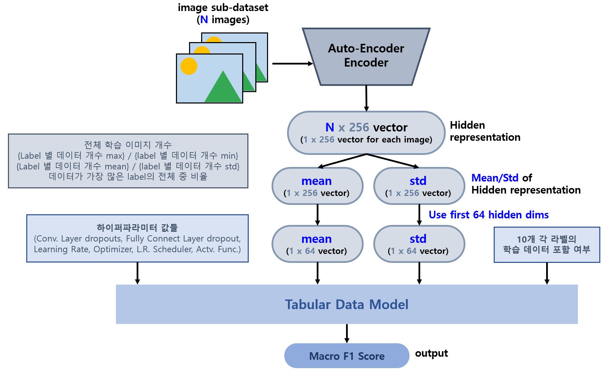

# 하이퍼파라미터 탐색 최적화 모델

## 목차

* [1. 모델 개요](#1-모델-개요)
* [2. 모델 전체 구조](#2-모델-전체-구조)
* [3. 학습 데이터 구성](#3-학습-데이터-구성)
* [4. 최적의 threshold cutoff 탐색](#4-최적의-threshold-cutoff-탐색)

## 1. 모델 개요

* 인간과의 하이퍼파라미터 탐색 대결을 위해, 각 데이터셋 (Cifar-10, Fashion-MNIST, MNIST) 별 **최적의 하이퍼파라미터를 탐색하기 위한 딥러닝 모델** 을 학습한다.

| 입력 데이터                    | 출력 데이터                |
|---------------------------|-----------------------|
| 학습 데이터 관련 정보 + 하이퍼파라미터 정보 | 성능지표 (Macro F1 Score) |

* [입력 데이터 및 출력 데이터 관련 상세 정보](../hpo_training_data/README.md#3-hyper-param-최적화-모델-학습-데이터셋-제작-방법)

## 2. 모델 전체 구조

## 3. 학습 데이터 구성

## 4. 최적의 threshold cutoff 탐색

* Tabular 데이터셋이므로, **output column (Macro F1 Score) 과 상관계수가 낮은 column을 제거** 했을 때 **모델 학습이 최적화** 될 수 있다.
* 이를 위한 최적의 **상관계수의 최솟값 threshold cutoff** 를 탐색한다.
* 탐색 결과

| cifar_10 | fashion_mnist | mnist |
|----------|---------------|-------|
| 0.20     | 0.175         | 0.35  |

* [상세 정보](hpo_model_cutoff_test_result.md)
