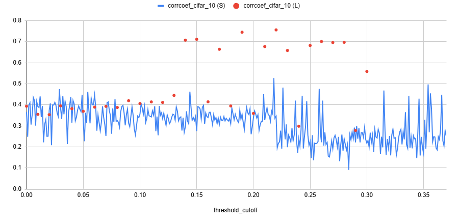
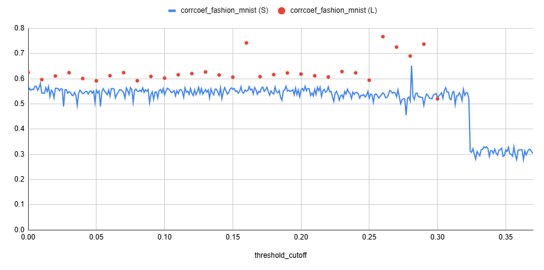
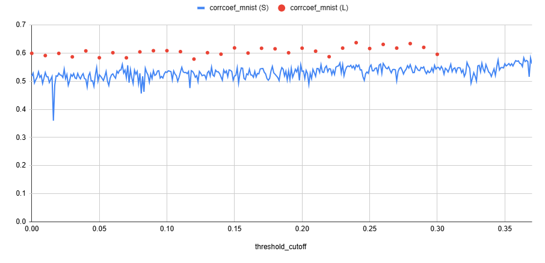
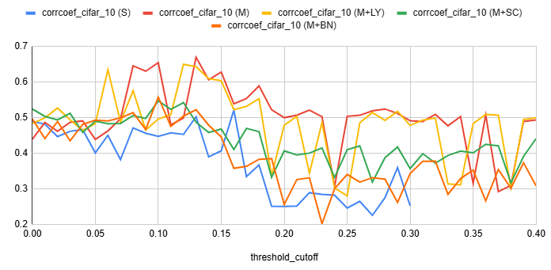
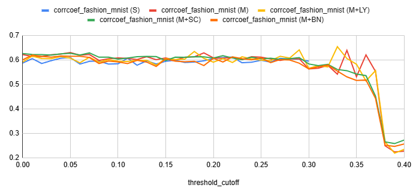
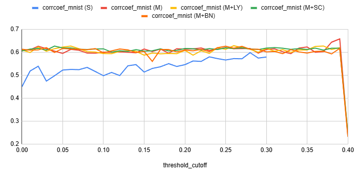
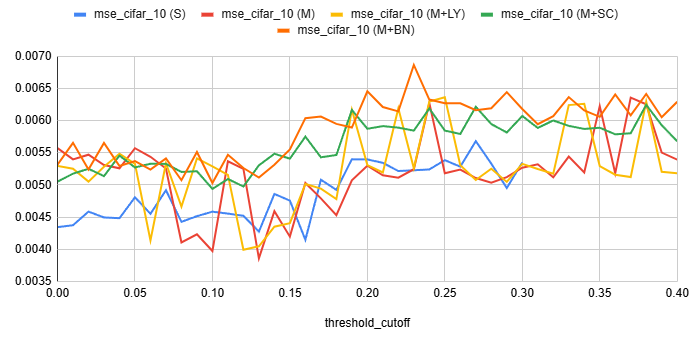
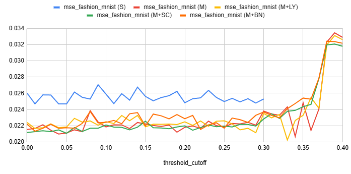
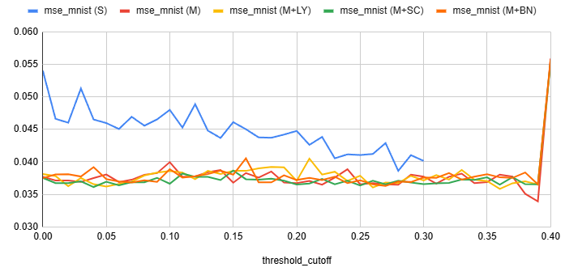

# HPO model cutoff 테스트 결과

## 목차

* [1. 테스트 목적](#1-테스트-목적)
* [2. Option 설명](#2-option-설명)
* [3. 테스트 결과](#3-테스트-결과)
  * [3-1. Option 1 테스트 결과](#3-1-option-1-테스트-결과)
  * [3-2. Option 2 테스트 결과](#3-2-option-2-테스트-결과)
  * [3-3. Option 3 테스트 결과](#3-3-option-3-테스트-결과)
* [4. 테스트 결과에 따른 결정](#4-테스트-결과에-따른-결정)
  * [4-1. Option 1 테스트 결과](#4-1-option-1-테스트-결과)
  * [4-2. Option 2 테스트 결과](#4-2-option-2-테스트-결과)
  * [4-3. Option 3 테스트 결과](#4-3-option-3-테스트-결과)

## 1. 테스트 목적

* Hyper-parameter 최적화 모델의 학습 데이터는 Tabular Dataset 이다.
* 이 데이터셋의 input feature 중 **target feature (Macro F1-score) 와의 상관계수의 절댓값이 일정 값 (= cutoff) 이상** 인 feature만 모델 학습에 사용한다.
* 이 **cutoff 값에 따른 HPO 모델의 성능 추이를 관측** 하고, 이를 통해 각 데이터셋 별 **최선의 cutoff 값을 찾는다.**

## 2. Option 설명

* ```MNIST```, ```Fashion-MNIST```, ```CIFAR-10``` 데이터셋을 학습하는 **CNN 모델 (Hyper-param 최적화 대상)** 에 대한 설정
  * 최소 epoch, 최대 epoch, early stopping patience
  * sub-dataset 최대/최소 이미지 개수 
* **해당 CNN 모델의 최적 Hyper-param 탐색 모델** 에 대한 설정
  * dropout 범위 (하이퍼파라미터) 
  * learning rate 범위 (하이퍼파라미터)
  * 선택 가능한 scheduler 종류 (하이퍼파라미터)
  * 학습 데이터셋 경로 및 Macro F1 Score (target 값) 와의 corr-coef threshold cutoff test 결과 파일 경로

**1. Option 별 학습 데이터셋 및 하이퍼파라미터 설정**

* early stopping patience 와 관계없이 **최소 epoch 까지 무조건 진행, 최대 epoch 도달 시 무조건 종료**

| Option   | 최소 ~ 최대 epoch | early stopping patience | sub-dataset 최대 이미지 개수 | sub-dataset 최소 이미지 개수<br>(class 별) | dropout 범위<br>(하이퍼파라미터)                          | learning rate 범위 (하이퍼파라미터) | 선택 가능한 scheduler 종류<br>(하이퍼파라미터)                                               |
|----------|---------------|-------------------------|-----------------------|------------------------------------|--------------------------------------------------|----------------------------|--------------------------------------------------------------------------------|
| Option 1 | 0 ~ 70        | 10                      | 1500                  | train: 125<br>test: 25             | conv: ```0.0 - 0.3```<br>fc: ```0.0 - 0.6```     | ```2e-5 - 6e-3```          | ```exp(0.9)``` ```exp(0.95)``` ```exp(0.98)``` ```cosine```                    |
| Option 2 | 0 ~ 15        | 10                      | 1500                  | train: 125<br>test: 25             | **conv: ```0.0 - 0.9```<br>fc: ```0.0 - 0.9```** | **```1e-6 - 6e-3```**      | **```exp(0.8)```** ```exp(0.9)``` ```exp(0.95)``` ```exp(0.98)``` ```cosine``` |
| Option 3 | **5 ~ 120**   | **3**                   | **2000**              | train: **50**<br>test: **10**      | conv: ```0.0 - 0.9```<br>fc: ```0.0 - 0.9```     | ```1e-6 - 6e-3```          | ```exp(0.8)``` ```exp(0.9)``` ```exp(0.95)``` ```exp(0.98)``` ```cosine```     |

**2. Option 별 학습 데이터셋 및 Macro F1 Score (target 값) 와의 corr-coef threshold cutoff test 결과 파일 경로**

* 학습 데이터셋 경로에서 ```{base_dir}``` 은 각 데이터셋 (CIFAR-10, Fashion-MNIST, MNIST) 별 ```hpo_training_data/test/{dataset_name}``` 를 가리킴
* 학습+테스트 데이터 개수 (학습 데이터셋) 표시 방법
  * ```{cifar_10 데이터 개수} / {fashion_mnist 데이터 개수} / {mnist 데이터 개수}```

| Option   | 학습 데이터셋 경로                                           | threshold cutoff test 결과 파일 경로                                                                                                                                                                                                                                                                                                                                                                                                                                                                                                                                                                                                                                                                                                                                                                                                                                                                       |
|----------|------------------------------------------------------|------------------------------------------------------------------------------------------------------------------------------------------------------------------------------------------------------------------------------------------------------------------------------------------------------------------------------------------------------------------------------------------------------------------------------------------------------------------------------------------------------------------------------------------------------------------------------------------------------------------------------------------------------------------------------------------------------------------------------------------------------------------------------------------------------------------------------------------------------------------------------------------------------|
| Option 1 | ```{base_dir}/hpo_model_train_dataset_df_*.csv```    | - [```hpo_model_test_result_per_corr_threshold_cutoff.csv```](hpo_model_test_result_per_corr_threshold_cutoff.csv) (threshold 0.0 - 0.3)<br>- [```hpo_model_test_result_per_corr_threshold_cutoff_2.csv```](hpo_model_test_result_per_corr_threshold_cutoff.csv) (threshold 0.3 - 0.6)                                                                                                                                                                                                                                                                                                                                                                                                                                                                                                                                                                                                               |
| Option 2 | ```{base_dir}/hpo_model_train_dataset_df_new.csv```  | - [```hpo_model_test_result_per_corr_threshold_cutoff_new.csv```](hpo_model_test_result_per_corr_threshold_cutoff_new.csv) (**(S)**, 데이터 개수: 1576 / 2400 / 2400)<br>- [```hpo_model_test_result_per_corr_threshold_cutoff_new_2.csv```](hpo_model_test_result_per_corr_threshold_cutoff_new_2.csv) (**(L)**, 데이터 개수: 3000 / 4800 / 4800)                                                                                                                                                                                                                                                                                                                                                                                                                                                                                                                                                             |
| Option 3 | ```{base_dir}/hpo_model_train_dataset_df_new2.csv``` | - [```hpo_model_test_result_per_corr_threshold_cutoff_new2.csv```](hpo_model_test_result_per_corr_threshold_cutoff_new2.csv) (데이터 개수: 3600 / 3600 / 3600)<br>- [```hpo_model_test_result_per_corr_threshold_cutoff_new2_2.csv```](hpo_model_test_result_per_corr_threshold_cutoff_new2_2.csv) (데이터 개수: 6600 / 6600 / 6600)<br>- [```hpo_model_test_result_per_corr_threshold_cutoff_new2_3.csv```](hpo_model_test_result_per_corr_threshold_cutoff_new2_3.csv) (데이터 개수: 6600 / 6600 / 6600 + **HPO 모델 레이어 개수 증가**)<br>- [```hpo_model_test_result_per_corr_threshold_cutoff_new2_4.csv```](hpo_model_test_result_per_corr_threshold_cutoff_new2_4.csv) (데이터 개수: 6600 / 6600 / 6600 + **scheduler 적용**)<br>- [```hpo_model_test_result_per_corr_threshold_cutoff_new2_5.csv```](hpo_model_test_result_per_corr_threshold_cutoff_new2_5.csv) (데이터 개수: 6600 / 6600 / 6600 + **Batch Normalization 적용**) |

## 3. 테스트 결과

* 테스트 결과 요약

### 3-1. Option 1 테스트 결과

각 데이터셋 별로 **직사각형으로 표시한 cutoff threshold 구간 (가로축)** 에서 Error 가 가장 작음

* MSE (Mean-Squared Error)


* MAE (Mean Absolute Error)


* feature 개수 (target feature 와의 corr-coef 가 해당 cutoff 값 이상인)


### 3-2. Option 2 테스트 결과

* 범례
  * 데이터 개수는 **CIFAR-10, Fashion-MNIST, MNIST** 각각 **train+test 데이터 개수** 를 의미
  * 데이터 개수는 **최적 하이퍼파라미터 탐색 모델** 의 학습/테스트 데이터 개수를 의미

| (S)                                | (L)                                |
|------------------------------------|------------------------------------|
| 데이터 개수 각각 **1576 / 2400 / 2400** 개 | 데이터 개수 각각 **3000 / 4800 / 4800** 개 |

* 테스트 결과
  * 최적 하이퍼파라미터 탐색 모델 성능을 **predicted / GT Macro F1 Score 간 corr-coef** 로 측정
  * 모든 데이터셋에 대해서, **데이터 개수가 많은 (L) 경우가 적은 (S) 경우보다 성능이 좋음**

| 데이터셋          | 테스트 결과                               |
|---------------|--------------------------------------|
| CIFAR-10      |  |
| Fashion-MNIST |  |
| MNIST         |  |

### 3-3. Option 3 테스트 결과

* Option 3 비교 대상

| Case 이름 | threshould cutoff test 결과 파일 경로                                                                                                | 학습+테스트 데이터 개수<br>(CIFAR-10) | 학습+테스트 데이터 개수<br>(Fashion-MNIST) | 학습+테스트 데이터 개수<br>(MNIST) | HPO 학습 모델 레이어 개수 | LR scheduler 적용<br>(exp, gamma=0.95) | Batch Normalization |
|---------|--------------------------------------------------------------------------------------------------------------------------------|-----------------------------|----------------------------------|--------------------------|------------------|--------------------------------------|---------------------|
| S       | [```hpo_model_test_result_per_corr_threshold_cutoff_new2.csv```](hpo_model_test_result_per_corr_threshold_cutoff_new2.csv)     | 3,600                       | 3,600                            | 3,600                    | FC 3개            | 미 적용                                 | 미 적용                |
| M       | [```hpo_model_test_result_per_corr_threshold_cutoff_new2_2.csv```](hpo_model_test_result_per_corr_threshold_cutoff_new2_2.csv) | 6,600                       | 6,600                            | 6,600                    | FC 3개            | 미 적용                                 | 미 적용                |
| M+LY    | [```hpo_model_test_result_per_corr_threshold_cutoff_new2_3.csv```](hpo_model_test_result_per_corr_threshold_cutoff_new2_3.csv) | 6,600                       | 6,600                            | 6,600                    | **FC 4개**        | 미 적용                                 | 미 적용                |
| M+SC    | [```hpo_model_test_result_per_corr_threshold_cutoff_new2_4.csv```](hpo_model_test_result_per_corr_threshold_cutoff_new2_4.csv) | 6,600                       | 6,600                            | 6,600                    | FC 3개            | **적용**                               | 미 적용                |
| M+BN    | [```hpo_model_test_result_per_corr_threshold_cutoff_new2_5.csv```](hpo_model_test_result_per_corr_threshold_cutoff_new2_5.csv) | 6,600                       | 6,600                            | 6,600                    | FC 3개            | 미 적용                                 | **적용**              |

* Option 3 테스트 결과 **(Pred - Ground Truth Macro F1 Score 간 상관계수)**
  * 종합적으로, **M, M+LY, M+SC** 가 전반적으로 우수한 결과를 보임

| 데이터셋          | 상관계수 (corr-coef) 테스트 결과              | 우수한 케이스    |
|---------------|--------------------------------------|------------|
| CIFAR-10      |  | M, M+LY    |
| Fashion MNIST |  | M+SC, M    |
| MNIST         |  | M+LY, M+SC |

* Option 3 테스트 결과 **(Mean Squared Error = HPO 모델 Loss인 동시에 평가지표)**
  * 종합적으로, **M, M+SC** 가 전반적으로 우수한 결과를 보임

| 데이터셋          | MSE 테스트 결과                           | 우수한 케이스 |
|---------------|--------------------------------------|---------|
| CIFAR-10      |  | M       |
| Fashion MNIST |  | M+SC, M |
| MNIST         |  | M+SC, M |

* 의문 사항
  * Layer 개수 증가, Scheduler 적용, Batch Normalization 적용이 큰 성능 향상을 일으키지 못하는데, 그 이유가 무엇일까? 

## 4. 테스트 결과에 따른 결정

### 4-1. Option 1 테스트 결과

* 각 데이터셋 별로 다음과 같은 threshold cutoff 를 이용하여 모델 학습

| cifar_10 | fashion_mnist | mnist |
|----------|---------------|-------|
| 0.20     | 0.175         | 0.35  |

### 4-2. Option 2 테스트 결과

* Option 3으로 테스트 재 실시

### 4-3. Option 3 테스트 결과

* 비슷한 데이터셋 규모에서 Option 2 의 **pred-true Macro F1 Score 간 corr-coef** 가 일부 케이스에 대해 더 좋게 나왔음
* 그러나 다음과 같은 이유로 Option 2 로 되돌아가지 않음
  * max epochs 15, early stopping patience 10 은 **실전 딥러닝 학습 설정과 다소 거리가 있음**
  * 일부 케이스가 아닌 전체적으로 보면, Option 3 도 전반적으로 Option 2 에 밀리지 않는 **pred-true Macro F1 Score 간 corr-coef** 값을 보임
* 따라서, Option 3 을 데이터 개수를 늘려서 재 실시
