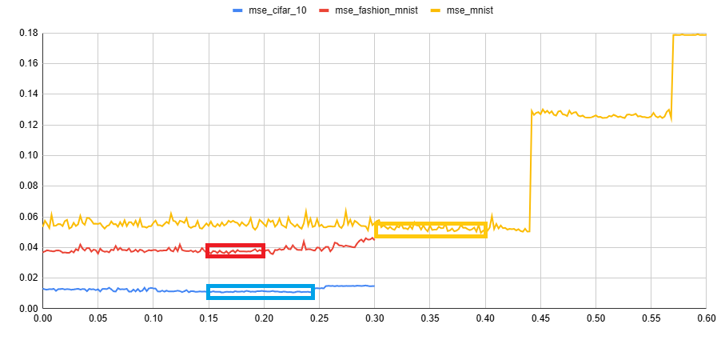
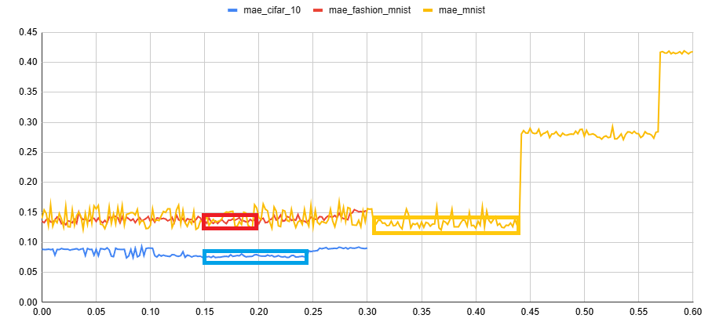
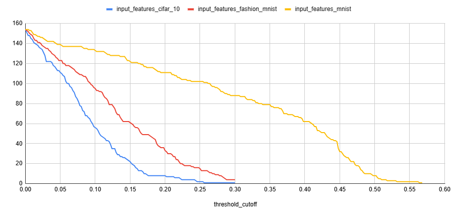

# HPO model cutoff 테스트 결과

## 목차

* [1. 테스트 목적](#1-테스트-목적)
* [2. Option 설명](#2-option-설명)
* [3. 테스트 결과](#3-테스트-결과)
  * [3-1. Option 1 테스트 결과](#3-1-option-1-테스트-결과)
  * [3-2. Option 2 테스트 결과](#3-2-option-2-테스트-결과)
  * [3-3. Option 3 테스트 결과](#3-3-option-3-테스트-결과)
* [4. 테스트 결과에 따른 결정](#4-테스트-결과에-따른-결정)
  * [4-1. Option 1 테스트 결과](#4-1-option-1-테스트-결과)
  * [4-2. Option 2 테스트 결과](#4-2-option-2-테스트-결과)
  * [4-3. Option 3 테스트 결과](#4-3-option-3-테스트-결과)

## 1. 테스트 목적

* Hyper-parameter 최적화 모델의 학습 데이터는 Tabular Dataset 이다.
* 이 데이터셋의 input feature 중 **target feature (Macro F1-score) 와의 상관계수의 절댓값이 일정 값 (= cutoff) 이상** 인 feature만 모델 학습에 사용한다.
* 이 **cutoff 값에 따른 HPO 모델의 성능 추이를 관측** 하고, 이를 통해 각 데이터셋 별 **최선의 cutoff 값을 찾는다.**

## 2. Option 설명

* ```MNIST```, ```Fashion-MNIST```, ```CIFAR-10``` 데이터셋을 학습하는 **CNN 모델 (Hyper-param 최적화 대상)** 에 대한 설정
  * 최소 epoch, 최대 epoch, early stopping patience
  * sub-dataset 최대/최소 이미지 개수 
* **해당 CNN 모델의 최적 Hyper-param 탐색 모델** 에 대한 설정
  * dropout 범위 (하이퍼파라미터) 
  * learning rate 범위 (하이퍼파라미터)
  * 선택 가능한 scheduler 종류 (하이퍼파라미터)
  * 학습 데이터셋 경로 및 Macro F1 Score (target 값) 와의 corr-coef threshold cutoff test 결과 파일 경로

**1. Option 별 학습 데이터셋 및 하이퍼파라미터 설정**

* early stopping patience 와 관계없이 **최소 epoch 까지 무조건 진행, 최대 epoch 도달 시 무조건 종료**

| Option   | 최소 ~ 최대 epoch | early stopping patience | sub-dataset 최대 이미지 개수 | sub-dataset 최소 이미지 개수<br>(class 별) | dropout 범위<br>(하이퍼파라미터)                          | learning rate 범위 (하이퍼파라미터) | 선택 가능한 scheduler 종류<br>(하이퍼파라미터)                                               |
|----------|---------------|-------------------------|-----------------------|------------------------------------|--------------------------------------------------|----------------------------|--------------------------------------------------------------------------------|
| Option 1 | 0 ~ 70        | 10                      | 1500                  | train: 125<br>test: 25             | conv: ```0.0 - 0.3```<br>fc: ```0.0 - 0.6```     | ```2e-5 - 6e-3```          | ```exp(0.9)``` ```exp(0.95)``` ```exp(0.98)``` ```cosine```                    |
| Option 2 | 0 ~ 15        | 10                      | 1500                  | train: 125<br>test: 25             | **conv: ```0.0 - 0.9```<br>fc: ```0.0 - 0.9```** | **```1e-6 - 6e-3```**      | **```exp(0.8)```** ```exp(0.9)``` ```exp(0.95)``` ```exp(0.98)``` ```cosine``` |
| Option 3 | **5 ~ 120**   | **3**                   | **2000**              | train: **50**<br>test: **10**      | conv: ```0.0 - 0.9```<br>fc: ```0.0 - 0.9```     | ```1e-6 - 6e-3```          | ```exp(0.8)``` ```exp(0.9)``` ```exp(0.95)``` ```exp(0.98)``` ```cosine```     |

**2. Option 별 학습 데이터셋 및 Macro F1 Score (target 값) 와의 corr-coef threshold cutoff test 결과 파일 경로**

* 학습 데이터셋 경로에서 ```{base_dir}``` 은 각 데이터셋 (CIFAR-10, Fashion-MNIST, MNIST) 별 ```hpo_training_data/test/{dataset_name}``` 를 가리킴
* 학습+테스트 데이터 개수 (학습 데이터셋) 표시 방법
  * ```{cifar_10 데이터 개수} / {fashion_mnist 데이터 개수} / {mnist 데이터 개수}```

| Option   | 학습 데이터셋 경로                                                                      | threshold cutoff test 결과 파일 경로                                                                                                                                                                                                                                                                                            |
|----------|---------------------------------------------------------------------------------|---------------------------------------------------------------------------------------------------------------------------------------------------------------------------------------------------------------------------------------------------------------------------------------------------------------------------|
| Option 1 | ```{base_dir}/hpo_model_train_dataset_df_*.csv```                               | - [```hpo_model_test_result_per_corr_threshold_cutoff.csv```](hpo_model_test_result_per_corr_threshold_cutoff.csv) (threshold 0.0 - 0.3)<br>- [```hpo_model_test_result_per_corr_threshold_cutoff_2.csv```](hpo_model_test_result_per_corr_threshold_cutoff.csv) (threshold 0.3 - 0.6)                                    |
| Option 2 | ```{base_dir}/hpo_model_train_dataset_df_new.csv```  | - [```hpo_model_test_result_per_corr_threshold_cutoff_new.csv```](hpo_model_test_result_per_corr_threshold_cutoff_new.csv) (데이터 개수: 1576 / 2400 / 2400)<br>- [```hpo_model_test_result_per_corr_threshold_cutoff_new_2.csv```](hpo_model_test_result_per_corr_threshold_cutoff_new_2.csv) (데이터 개수: 3000 / 4800 / 4800)    |
| Option 3 | ```{base_dir}/hpo_model_train_dataset_df_new2.csv``` | - [```hpo_model_test_result_per_corr_threshold_cutoff_new.csv```](hpo_model_test_result_per_corr_threshold_cutoff_new2.csv) (데이터 개수: 3600 / 3600 / 3600)<br>- [```hpo_model_test_result_per_corr_threshold_cutoff_new2_2.csv```](hpo_model_test_result_per_corr_threshold_cutoff_new2_2.csv) (데이터 개수: 6600 / 6600 / 6600) |

## 3. 테스트 결과

* 테스트 결과 요약

### 3-1. Option 1 테스트 결과

각 데이터셋 별로 **직사각형으로 표시한 cutoff threshold 구간 (가로축)** 에서 Error 가 가장 작음

* MSE (Mean-Squared Error)



* MAE (Mean Absolute Error)



* feature 개수 (target feature 와의 corr-coef 가 해당 cutoff 값 이상인)



### 3-2. Option 2 테스트 결과

### 3-3. Option 3 테스트 결과

## 4. 테스트 결과에 따른 결정

### 4-1. Option 1 테스트 결과

* 각 데이터셋 별로 다음과 같은 threshold cutoff 를 이용하여 모델 학습

| cifar_10 | fashion_mnist | mnist |
|----------|---------------|-------|
| 0.20     | 0.175         | 0.35  |

### 4-2. Option 2 테스트 결과

* Option 3으로 테스트 재 실시

### 4-3. Option 3 테스트 결과
