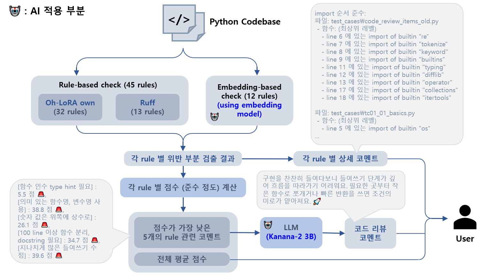

## 목차

* [1. 개요](#1-개요)
* [2. 전체 구조](#2-전체-구조)
* [3. 상세 프로세스](#3-상세-프로세스)
  * [3-1. 코드 리뷰](#3-1-코드-리뷰)
  * [3-2. 사용자 코멘트 도출](#3-2-사용자-코멘트-도출)
  * [3-3. 코드 리뷰 코멘트 생성](#3-3-코드-리뷰-코멘트-생성)

## 1. 개요

* Oh-LoRA Code Assistant 의 전체 코드 리뷰 프로세스

## 2. 전체 구조

| 프로세스         | 입력                        | 출력                                                             | 처리 과정                                                                                                       |
|--------------|---------------------------|----------------------------------------------------------------|-------------------------------------------------------------------------------------------------------------|
| 코드 리뷰        | Python 코드베이스              | 각 rule 별 위반 부분 검출 결과                                           | - Rule-based check (45개 규칙, 13개의 `ruff` 규칙 포함) - 🤖 임베딩 기반 check (12개 규칙)                                |
| 사용자 코멘트 도출   | 각 rule 별 위반 부분 검출 결과      | - 각 rule 별 상세 코멘트 - 점수가 가장 낮은 5개의 rule 관련 코멘트 - 전체 평균 점수 | - 검출 결과로부터 상세 코멘트 생성 - 각 rule 별 **준수 정도를 나타내는 점수** 를 일정한 수식에 의해 계산 - 전체 평균 점수는 **각 rule 별 점수의 산술 평균** |
| 코드 리뷰 코멘트 생성 | 점수가 가장 낮은 5개의 rule 관련 코멘트 | 코드 리뷰 코멘트                                                      | 🤖 LLM은 `kanana-2-3b-instruct` 모델 사용                                                                        |

## 3. 상세 프로세스

### 3-1. 코드 리뷰

### 3-2. 사용자 코멘트 도출

### 3-3. 코드 리뷰 코멘트 생성

